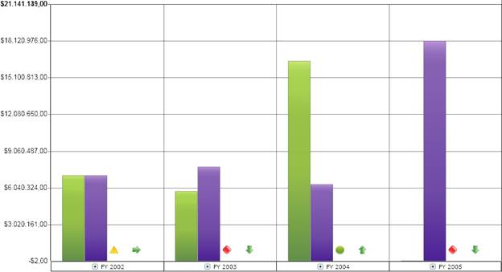
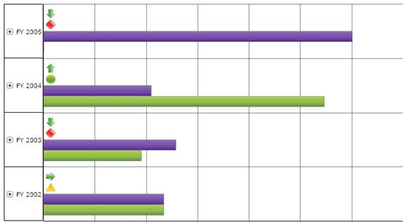

::: {style="DISPLAY: none"}
{#d2h_url_template}{#d2h_package_url style="WIDTH: 0px; DISPLAY: none; HEIGHT: 0px"}
:::

::::: {#nsbanner .d2h_main_nsbanner style="BORDER-BOTTOM: #999999 1px solid; POSITION: relative; PADDING-BOTTOM: 0px; BACKGROUND-COLOR: transparent; PADDING-LEFT: 0px; PADDING-RIGHT: 0px; DISPLAY: none; BORDER-TOP: #999999 1px solid; PADDING-TOP: 0px; LEFT: 0px"}
:::: {#TitleRow .d2h_main_titlerow style="PADDING-BOTTOM: 4px; BACKGROUND-COLOR: transparent; PADDING-LEFT: 22px; WIDTH: 100%; PADDING-RIGHT: 10px; DISPLAY: none; PADDING-TOP: 4px"}
::: {#ienav .d2h_main_ienav style="DISPLAY: none"}
{#D2HPrevious .D2HPreviousEnabled}  {#D2HNext .D2HNextEnabled}
:::
::::
:::::

::::::: {#nstext .d2h_main_nstext style="PADDING-BOTTOM: 10px; BACKGROUND-COLOR: transparent; PADDING-LEFT: 22px; PADDING-RIGHT: 10px; HEIGHT: 100%; OVERFLOW: auto; PADDING-TOP: 5px" hasuserbackground="true" valign="bottom"}
::: {#d2h_breadcrumbs .d2h_breadcrumbs}
[Essential Studio User Guide Documentation](ms-xhelp:///?Id=12457748-09e3-4d74-a240-8e049cedf030){.d2h_breadcrumbsNormal}[ \> ]{.d2h_breadcrumbsLinkSeparator}[Business Intelligence Edition](ms-xhelp:///?Id=fdf33dd8-62b2-47b9-ad7b-fc50e590bca5){.d2h_breadcrumbsNormal}[ \> ]{.d2h_breadcrumbsLinkSeparator}[Essential BI Silverlight](ms-xhelp:///?Id=c006b39c-6aa2-4637-b7de-3e7b6cb3f9f9){.d2h_breadcrumbsNormal}[ \> ]{.d2h_breadcrumbsLinkSeparator}[Essential BI Chart]{.d2h_breadcrumbsContentsOnly}[ \> ]{.d2h_breadcrumbsLinkSeparator}[Concepts and Features](ms-xhelp:///?Id=372b5b83-fed0-46d4-831c-b84fe8c18abb){.d2h_breadcrumbsNormal}
:::

## KPI Support {#kpi-support style="tab-stops: 0pt"}

**Key Performance Indicators** (KPIs)---also called scorecards---are typically used to assist decision makers in measuring the performance of a business over time. Essential BI Chart for Silverlight supports both column charts and bar charts, which can be used to display KPIs.

**[]{style="FONT-FAMILY: 'Trebuchet MS','sans-serif'; COLOR: #15428b; FONT-SIZE: 9pt"}** 

Use Case Scenarios

KPIs are most widely used for analyzing the performance of key business operations over a particular period of time; such metrics could be used for sales or marketing as well as stock exchange dashboards**.**

[]{style="FONT-FAMILY: 'Trebuchet MS','sans-serif'; COLOR: #15428b; FONT-SIZE: 9pt"} 

Specifying KPI for Charts in an Application

The following steps explain how to create an OLAPChart control with a simple KPI report. Refer to the code below for an illustration of how to implement these steps.

The following steps assume that you know how to create an application that contains an OLAP Chart for Silverlight. If you are not familiar with how to do so, please refer to the "[[Getting Started]{.UGHyperlink}](ms-xhelp:///?Id=ecc923f3-5552-498e-b06c-296a873aba68)" section.

Adding an OlapChart control to an application

First, create an instance of an OlapChart control in the application, as seen in the following code.

[]{style="FONT-FAMILY: 'Trebuchet MS','sans-serif'; COLOR: #15428b; FONT-SIZE: 9pt"} 

+-------------------------------------------------------------------------------------------------------------------------------------------------------------------------------------------------------------------------------------------------------------------------------------------------------------------------------------------------+
| **[\[XAML\]]{style="FONT-FAMILY: 'Courier New'"}**                                                                                                                                                                                                                                                                                              |
|                                                                                                                                                                                                                                                                                                                                                 |
| [\<]{style="FONT-FAMILY: 'Courier New'; COLOR: blue"}[sfchart]{style="FONT-FAMILY: 'Courier New'; COLOR: #a31515"}[:]{style="FONT-FAMILY: 'Courier New'; COLOR: blue"}[OlapChart]{style="FONT-FAMILY: 'Courier New'; COLOR: #a31515"}[  ]{style="FONT-FAMILY: 'Courier New'; COLOR: red"}[/\>]{style="FONT-FAMILY: 'Courier New'; COLOR: blue"} |
|                                                                                                                                                                                                                                                                                                                                                 |
| []{style="FONT-FAMILY: 'Courier New'"}                                                                                                                                                                                                                                                                                                          |
+-------------------------------------------------------------------------------------------------------------------------------------------------------------------------------------------------------------------------------------------------------------------------------------------------------------------------------------------------+

[]{style="FONT-FAMILY: 'Arial','sans-serif'"} 

+--------------------------------------------------------------------------------------------------------------------------------------------------------------------------------------+
| **[\[C#\]]{style="FONT-FAMILY: 'Courier New'"}**                                                                                                                                     |
|                                                                                                                                                                                      |
| [OlapChart]{style="FONT-FAMILY: 'Courier New'; COLOR: #2b91af"}[ olapChart1 = [new]{style="COLOR: blue"} [OlapChart]{style="COLOR: #2b91af"}();]{style="FONT-FAMILY: 'Courier New'"} |
|                                                                                                                                                                                      |
|                                                                                                                                                                                      |
+--------------------------------------------------------------------------------------------------------------------------------------------------------------------------------------+

[]{style="FONT-FAMILY: 'Arial','sans-serif'"} 

+------------------------------------------------------------------------------------------------------------------------------------------------------------------------------------------------------------------------------------------------------------------------------------------------------------------------------------------------------------------------------+
| **[\[VB\]]{style="FONT-FAMILY: 'Courier New'"}**[]{style="FONT-FAMILY: 'Courier New'; COLOR: blue"}                                                                                                                                                                                                                                                                          |
|                                                                                                                                                                                                                                                                                                                                                                              |
| [Dim]{style="FONT-FAMILY: 'Courier New'; COLOR: blue"}[ olapChart1 [As]{style="COLOR: blue"} ]{style="FONT-FAMILY: 'Courier New'"}[OlapChart]{style="FONT-FAMILY: 'Courier New'; COLOR: #2b91af"}[ = [New]{style="COLOR: blue"} ]{style="FONT-FAMILY: 'Courier New'"}[OlapChart]{style="FONT-FAMILY: 'Courier New'; COLOR: #2b91af"}[()]{style="FONT-FAMILY: 'Courier New'"} |
|                                                                                                                                                                                                                                                                                                                                                                              |
| []{style="FONT-FAMILY: 'Courier New'"}                                                                                                                                                                                                                                                                                                                                       |
+------------------------------------------------------------------------------------------------------------------------------------------------------------------------------------------------------------------------------------------------------------------------------------------------------------------------------------------------------------------------------+

 

Creating a report with KPI support

 

1.   To create a report with KPIs, You need to first define KpiElements.

2.   Then, add KpiElements to an axis in the report.

 

***[]{style="LAYOUT-GRID-MODE: line; FONT-FAMILY: 'Trebuchet MS','sans-serif'; COLOR: #15428b; FONT-SIZE: 9pt"}*** 

::: {style="BORDER-BOTTOM: windowtext 1pt solid; BORDER-LEFT: medium none; PADDING-BOTTOM: 1pt; MARGIN-TOP: 9pt; PADDING-LEFT: 0pt; PADDING-RIGHT: 0pt; MARGIN-BOTTOM: 9pt; BORDER-TOP: windowtext 1pt solid; BORDER-RIGHT: medium none; PADDING-TOP: 1pt"}
{border="0"}Note: If an OlapReport already contains MeasureElements, then KpiElements must be added to the same axis.
:::

[]{style="FONT-FAMILY: 'Myriad Pro','sans-serif'"} 

+--------------------------------------------------------------------------------------------------------------------------------------------------------------------------------------------------------------------------------------------------------------------------------------------------------------------------------------------------+
| **[\[C#\]]{style="FONT-FAMILY: 'Courier New'"}**[]{style="FONT-FAMILY: 'Courier New'"}                                                                                                                                                                                                                                                           |
|                                                                                                                                                                                                                                                                                                                                                  |
| [        [private]{style="COLOR: blue"} [OlapReport]{style="COLOR: #2b91af"} KPIReport()\                                                                                                                                                                                                                                                        |
|         {\                                                                                                                                                                                                                                                                                                                                       |
|             [OlapReport]{style="COLOR: #2b91af"} olapReport = [new]{style="COLOR: blue"} [OlapReport]{style="COLOR: #2b91af"}();\                                                                                                                                                                                                                |
|             olapReport.CurrentCubeName = [\"Adventure Works\"]{style="COLOR: #a31515"};\                                                                                                                                                                                                                                                         |
|  \                                                                                                                                                                                                                                                                                                                                               |
|             [//// Getting KPI elements]{style="COLOR: green"}\                                                                                                                                                                                                                                                                                   |
|             [KpiElements]{style="COLOR: #2b91af"} kpiElement = [new]{style="COLOR: blue"} [KpiElements]{style="COLOR: #2b91af"}();\                                                                                                                                                                                                              |
|  \                                                                                                                                                                                                                                                                                                                                               |
|             [//// Customizing KPI element properties]{style="COLOR: green"}\                                                                                                                                                                                                                                                                     |
|             kpiElement.Elements.Add([new]{style="COLOR: blue"} [KpiElement]{style="COLOR: #2b91af"} { Name = [\"Internet Revenue\"]{style="COLOR: #a31515"}, ShowKPIGoal = [true]{style="COLOR: blue"}, ShowKPIStatus = [true]{style="COLOR: blue"}, ShowKPIValue = [true]{style="COLOR: blue"}, ShowKPITrend = [true]{style="COLOR: blue"} });\ |
|  \                                                                                                                                                                                                                                                                                                                                               |
|             [//// Specifying the row name for the dimension element]{style="COLOR: green"}\                                                                                                                                                                                                                                                      |
|             [DimensionElement]{style="COLOR: #2b91af"} dimensionElementRow = [new]{style="COLOR: blue"} [DimensionElement]{style="COLOR: #2b91af"}();\                                                                                                                                                                                           |
|             dimensionElementRow.Name = [\"Date\"]{style="COLOR: #a31515"};\                                                                                                                                                                                                                                                                      |
|             dimensionElementRow.AddLevel([\"Fiscal\"]{style="COLOR: #a31515"}, [\"Fiscal Year\"]{style="COLOR: #a31515"});\                                                                                                                                                                                                                      |
|  \                                                                                                                                                                                                                                                                                                                                               |
|             [//// Adding categorical elements]{style="COLOR: green"}\                                                                                                                                                                                                                                                                            |
|             olapReport.CategoricalElements.Add(kpiElement);\                                                                                                                                                                                                                                                                                     |
|  \                                                                                                                                                                                                                                                                                                                                               |
|             [//// Adding Series elements]{style="COLOR: green"}\                                                                                                                                                                                                                                                                                 |
|             olapReport.SeriesElements.Add(dimensionElementRow);\                                                                                                                                                                                                                                                                                 |
|  \                                                                                                                                                                                                                                                                                                                                               |
|             [return]{style="COLOR: blue"} olapReport;\                                                                                                                                                                                                                                                                                           |
|         } ]{style="FONT-FAMILY: 'Courier New'"}                                                                                                                                                                                                                                                                                                  |
|                                                                                                                                                                                                                                                                                                                                                  |
| []{style="FONT-FAMILY: 'Courier New'"}                                                                                                                                                                                                                                                                                                           |
+--------------------------------------------------------------------------------------------------------------------------------------------------------------------------------------------------------------------------------------------------------------------------------------------------------------------------------------------------+

[]{style="FONT-FAMILY: 'Arial','sans-serif'"} 

+-----------------------------------------------------------------------------------------------------------------------------------------------------------------------------------------------------------------------------------------------------------------------------------------------------------------------------------------------------------------------+
| **[\[VB\]]{style="FONT-FAMILY: 'Courier New'"}**[]{style="FONT-FAMILY: 'Courier New'; COLOR: blue"}                                                                                                                                                                                                                                                                   |
|                                                                                                                                                                                                                                                                                                                                                                       |
| [            [Private]{style="COLOR: blue"} [Function]{style="COLOR: blue"} KPIReport() [As]{style="COLOR: blue"} OlapReport]{style="FONT-FAMILY: 'Courier New'"}                                                                                                                                                                                                     |
|                                                                                                                                                                                                                                                                                                                                                                       |
| [                  [Dim]{style="COLOR: blue"} olapReport [As]{style="COLOR: blue"} OlapReport = [New]{style="COLOR: blue"} OlapReport()]{style="FONT-FAMILY: 'Courier New'"}                                                                                                                                                                                          |
|                                                                                                                                                                                                                                                                                                                                                                       |
| [                  olapReport.CurrentCubeName = \"Adventure Works\"]{style="FONT-FAMILY: 'Courier New'"}                                                                                                                                                                                                                                                              |
|                                                                                                                                                                                                                                                                                                                                                                       |
| []{style="FONT-FAMILY: 'Courier New'"}                                                                                                                                                                                                                                                                                                                                |
|                                                                                                                                                                                                                                                                                                                                                                       |
| [                  [\' Getting KPI elements]{style="COLOR: green"}]{style="FONT-FAMILY: 'Courier New'"}                                                                                                                                                                                                                                                               |
|                                                                                                                                                                                                                                                                                                                                                                       |
| [                  [Dim]{style="COLOR: blue"} kpiElement [As]{style="COLOR: blue"} KpiElements = [New]{style="COLOR: blue"} KpiElements()]{style="FONT-FAMILY: 'Courier New'"}                                                                                                                                                                                        |
|                                                                                                                                                                                                                                                                                                                                                                       |
| []{style="FONT-FAMILY: 'Courier New'"}                                                                                                                                                                                                                                                                                                                                |
|                                                                                                                                                                                                                                                                                                                                                                       |
| [                  [\' Customizing KPI element properties]{style="COLOR: green"}]{style="FONT-FAMILY: 'Courier New'"}                                                                                                                                                                                                                                                 |
|                                                                                                                                                                                                                                                                                                                                                                       |
| [                  kpiElement.Elements.Add([New]{style="COLOR: blue"} KpiElement [With]{style="COLOR: blue"} {.Name = \"Internet Revenue\", .ShowKPIGoal = [True]{style="COLOR: blue"}, .ShowKPIStatus = [True]{style="COLOR: blue"}, .ShowKPIValue = [True]{style="COLOR: blue"}, .ShowKPITrend = [True]{style="COLOR: blue"}})]{style="FONT-FAMILY: 'Courier New'"} |
|                                                                                                                                                                                                                                                                                                                                                                       |
| []{style="FONT-FAMILY: 'Courier New'"}                                                                                                                                                                                                                                                                                                                                |
|                                                                                                                                                                                                                                                                                                                                                                       |
| [                  [\' Specifying the row name for the dimension element]{style="COLOR: green"}]{style="FONT-FAMILY: 'Courier New'"}                                                                                                                                                                                                                                  |
|                                                                                                                                                                                                                                                                                                                                                                       |
| [                  [Dim]{style="COLOR: blue"} dimensionElementRow [As]{style="COLOR: blue"} DimensionElement = [New]{style="COLOR: blue"} DimensionElement()]{style="FONT-FAMILY: 'Courier New'"}                                                                                                                                                                     |
|                                                                                                                                                                                                                                                                                                                                                                       |
| [                  dimensionElementRow.Name = \"Date\"]{style="FONT-FAMILY: 'Courier New'"}                                                                                                                                                                                                                                                                           |
|                                                                                                                                                                                                                                                                                                                                                                       |
| [                  dimensionElementRow.AddLevel(\"Fiscal\", \"Fiscal Year\")]{style="FONT-FAMILY: 'Courier New'"}                                                                                                                                                                                                                                                     |
|                                                                                                                                                                                                                                                                                                                                                                       |
| []{style="FONT-FAMILY: 'Courier New'"}                                                                                                                                                                                                                                                                                                                                |
|                                                                                                                                                                                                                                                                                                                                                                       |
| [                  [\' Adding categorical elements]{style="COLOR: green"}]{style="FONT-FAMILY: 'Courier New'"}                                                                                                                                                                                                                                                        |
|                                                                                                                                                                                                                                                                                                                                                                       |
| [                  olapReport.CategoricalElements.Add(kpiElement)]{style="FONT-FAMILY: 'Courier New'"}                                                                                                                                                                                                                                                                |
|                                                                                                                                                                                                                                                                                                                                                                       |
| []{style="FONT-FAMILY: 'Courier New'"}                                                                                                                                                                                                                                                                                                                                |
|                                                                                                                                                                                                                                                                                                                                                                       |
| [                  [\' Adding Series elements]{style="COLOR: green"}]{style="FONT-FAMILY: 'Courier New'"}                                                                                                                                                                                                                                                             |
|                                                                                                                                                                                                                                                                                                                                                                       |
| [                  olapReport.SeriesElements.Add(dimensionElementRow)]{style="FONT-FAMILY: 'Courier New'"}                                                                                                                                                                                                                                                            |
|                                                                                                                                                                                                                                                                                                                                                                       |
| []{style="FONT-FAMILY: 'Courier New'"}                                                                                                                                                                                                                                                                                                                                |
|                                                                                                                                                                                                                                                                                                                                                                       |
| [                  [Return]{style="COLOR: blue"} olapReport]{style="FONT-FAMILY: 'Courier New'"}                                                                                                                                                                                                                                                                      |
|                                                                                                                                                                                                                                                                                                                                                                       |
| [            [End]{style="COLOR: blue"} [Function]{style="COLOR: blue"}]{style="FONT-FAMILY: 'Courier New'"}                                                                                                                                                                                                                                                          |
|                                                                                                                                                                                                                                                                                                                                                                       |
|                                                                                                                                                                                                                                                                                                                                                                       |
+-----------------------------------------------------------------------------------------------------------------------------------------------------------------------------------------------------------------------------------------------------------------------------------------------------------------------------------------------------------------------+

[]{style="FONT-FAMILY: 'Arial','sans-serif'"} 

[]{#AddingreporttoOlapDataManager}[]{#_3)_Adding_the}Adding a report to OlapDataManager

1.   Bind the OLAP report that was created in the above steps with OlapDataManager by using the SetCurrentReport method.

2.   Set the manager to OlapChart's data manager.

3.   Specify the chart type. Specifying the chart type as Column will result in a column KPI. If the chart type is Bar, this will result in a Bar KPI. In the following code, in the third line, we have set the chart type as Column by setting the OlapChartType property of olapChart.

[]{style="FONT-FAMILY: 'Trebuchet MS','sans-serif'; COLOR: #15428b; FONT-SIZE: 9pt"} 

::: {style="BORDER-BOTTOM: windowtext 1pt solid; BORDER-LEFT: medium none; PADDING-BOTTOM: 1pt; MARGIN-TOP: 9pt; PADDING-LEFT: 0pt; PADDING-RIGHT: 0pt; MARGIN-BOTTOM: 9pt; BORDER-TOP: windowtext 1pt solid; BORDER-RIGHT: medium none; PADDING-TOP: 1pt"}
{border="0"}Note: The default KPI type is Column. Also, you cannot set any other chart types other than Column or Bar.
:::

***[]{style="LAYOUT-GRID-MODE: line; FONT-FAMILY: 'Arial','sans-serif'; FONT-SIZE: 9pt"}*** 

+----------------------------------------------------------------------------------------------------------------------+
| **[\[C#\]]{style="FONT-FAMILY: 'Courier New'"}**                                                                     |
|                                                                                                                      |
| [            [this]{style="COLOR: blue"}.olapDataManager.SetCurrentReport(KPIReport());\                             |
|             [this]{style="COLOR: blue"}.olapChart1.OlapDataManager = olapDataManager;\                               |
|             [this]{style="COLOR: blue"}.olapChart1.OlapChartType = [OlapChartTypes]{style="COLOR: #2b91af"}.Column;\ |
|             [this]{style="COLOR: blue"}.olapChart1.DataBind();]{style="FONT-FAMILY: 'Courier New'"}                  |
|                                                                                                                      |
|                                                                                                                      |
+----------------------------------------------------------------------------------------------------------------------+

[]{style="FONT-FAMILY: 'Arial','sans-serif'"} 

+------------------------------------------------------------------------------------------------------------------------------+
| **[\[VB\]]{style="FONT-FAMILY: 'Courier New'"}**[]{style="FONT-FAMILY: 'Courier New'; COLOR: blue"}                          |
|                                                                                                                              |
| [            [Me]{style="COLOR: blue"}.olapDataManager.SetCurrentReport(KPIReport())]{style="FONT-FAMILY: 'Courier New'"}    |
|                                                                                                                              |
| [            [Me]{style="COLOR: blue"}.olapChart1.OlapDataManager = olapDataManager]{style="FONT-FAMILY: 'Courier New'"}     |
|                                                                                                                              |
| [            [Me]{style="COLOR: blue"}.olapChart1.OlapChartType = OlapChartTypes.Column]{style="FONT-FAMILY: 'Courier New'"} |
|                                                                                                                              |
| [            M[e]{style="COLOR: blue"}.olapChart1.DataBind()]{style="FONT-FAMILY: 'Courier New'"}                            |
|                                                                                                                              |
|                                                                                                                              |
+------------------------------------------------------------------------------------------------------------------------------+

**[]{style="FONT-FAMILY: 'Trebuchet MS','sans-serif'; COLOR: #15428b; FONT-SIZE: 9pt"}** 

Setting a column KPI chart

To select a Column KPI, you need to set the OlapChartType to Column, as described in the previous section, ["]{.UGHyperlink}[[Adding a report to OlapDataManager]{.UGHyperlink}]()[."]{.UGHyperlink}

[]{style="FONT-FAMILY: 'Trebuchet MS','sans-serif'; COLOR: #15428b; FONT-SIZE: 9pt"} 

::: {style="BORDER-BOTTOM: windowtext 1pt solid; BORDER-LEFT: medium none; PADDING-BOTTOM: 1pt; MARGIN-TOP: 9pt; PADDING-LEFT: 0pt; PADDING-RIGHT: 0pt; MARGIN-BOTTOM: 9pt; BORDER-TOP: windowtext 1pt solid; BORDER-RIGHT: medium none; PADDING-TOP: 1pt"}
     {border="0"} Note: Column KPI is the default type.
:::

***[]{style="LAYOUT-GRID-MODE: line; FONT-FAMILY: 'Trebuchet MS','sans-serif'; COLOR: #15428b; FONT-SIZE: 9pt"}*** 

The following image illustrates a simple column KPI chart.

[]{style="FONT-FAMILY: 'Trebuchet MS','sans-serif'; COLOR: #15428b; FONT-SIZE: 9pt"} 

{border="0"}

 

Figure 55: OLAP Chart with Column KPIs

[]{style="FONT-FAMILY: 'Arial','sans-serif'"} 

Setting a bar KPI chart

To select a bar KPI, you need to set the OlapChartType to Bar, as described in the section "[[Adding a report to OlapDataManager]{.UGHyperlink}]()[" ]{.UGHyperlink}

The following image illustrates a simple bar KPI chart.

{border="0"}

 

Figure 56: OLAP Chart with Bar KPIs

[]{style="FONT-FAMILY: 'Arial','sans-serif'"} 

[]{style="FONT-FAMILY: 'Arial','sans-serif'"} 

Sample Link

OLAP Report Sample

To access the local OLAP Report sample, navigate to OLAP Base -\> Namespace in OLAP Base -\> Syncfusion.Olap.Reports -\> Steps in creating the report -\> Sample Reports for OLAP data.

Chart Appearance Sample

To access the local Chart Appearance sample:

1.   Open the Syncfusion Dashboard.

2.   Click **Business Intelligence**.

3.   Click the **Silverlight** drop-down list, and then select **Explore Samples**.

4.   Navigate to Syncfusion.OlapChart.Silverlight.Samples -\> Syncfusion.OlapChart.Silverlight.Samples -\> Samples -\> KPI -\> KPIReports.

[]{#related-topics}
:::::::
