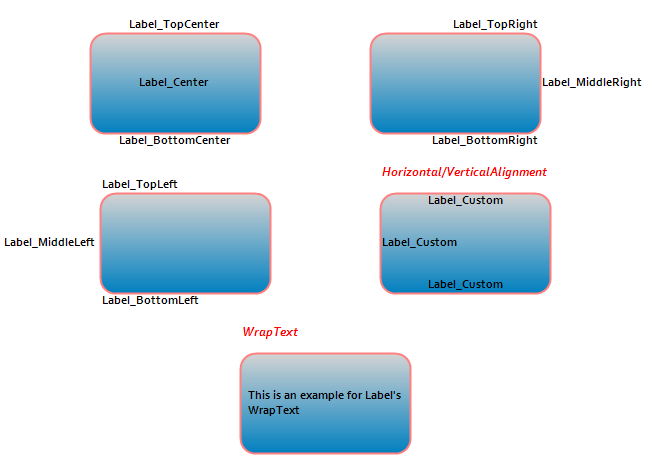

::: {style="DISPLAY: none"}
{#d2h_url_template}{#d2h_package_url style="WIDTH: 0px; DISPLAY: none; HEIGHT: 0px"}
:::

::::: {#nsbanner .d2h_main_nsbanner style="BORDER-BOTTOM: #999999 1px solid; POSITION: relative; PADDING-BOTTOM: 0px; BACKGROUND-COLOR: transparent; PADDING-LEFT: 0px; PADDING-RIGHT: 0px; DISPLAY: none; BORDER-TOP: #999999 1px solid; PADDING-TOP: 0px; LEFT: 0px"}
:::: {#TitleRow .d2h_main_titlerow style="PADDING-BOTTOM: 4px; BACKGROUND-COLOR: transparent; PADDING-LEFT: 22px; WIDTH: 100%; PADDING-RIGHT: 10px; DISPLAY: none; PADDING-TOP: 4px"}
::: {#ienav .d2h_main_ienav style="DISPLAY: none"}
{#D2HPrevious .D2HPreviousEnabled}  {#D2HNext .D2HNextEnabled}
:::
::::
:::::

:::::: {#nstext .d2h_main_nstext style="PADDING-BOTTOM: 10px; BACKGROUND-COLOR: transparent; PADDING-LEFT: 22px; PADDING-RIGHT: 10px; HEIGHT: 100%; OVERFLOW: auto; PADDING-TOP: 5px" hasuserbackground="true" valign="bottom"}
::: {#d2h_breadcrumbs .d2h_breadcrumbs}
[Essential Studio User Guide Documentation](ms-xhelp:///?Id=12457748-09e3-4d74-a240-8e049cedf030){.d2h_breadcrumbsNormal}[ \> ]{.d2h_breadcrumbsLinkSeparator}[User Interface Edition](ms-xhelp:///?Id=c29296b7-531c-413b-a0ec-488ca1f7f669){.d2h_breadcrumbsNormal}[ \> ]{.d2h_breadcrumbsLinkSeparator}[Essential Windows](ms-xhelp:///?Id=e60759d8-47a4-4570-9d7a-16a68d63f2ea){.d2h_breadcrumbsNormal}[ \> ]{.d2h_breadcrumbsLinkSeparator}[Essential Diagram]{.d2h_breadcrumbsContentsOnly}[ \> ]{.d2h_breadcrumbsLinkSeparator}[Concepts And Features](ms-xhelp:///?Id=008cec4b-5177-4859-8616-c062751d8fb6){.d2h_breadcrumbsNormal}[ \> ]{.d2h_breadcrumbsLinkSeparator}[Customizing Nodes](ms-xhelp:///?Id=7372bf61-8d78-49c9-b18c-3645397e182b){.d2h_breadcrumbsNormal}
:::

### Label {#label style="tab-stops: 0pt"}

A label is a text object that is attached to a node and is positioned relative to node coordinates. This enables you to format the label text.  You can also customize the appearance of the label. You can bind the node name to the label so that the name will be displayed as the label text. This can be achieved using the *PropertyBinding* property.

 

The following formatting options are supports for the label text:

 

[·      ]{style="FONT-FAMILY: Symbol"}WrapText

[·      ]{style="FONT-FAMILY: Symbol"}HorizontalAlignment

[·      ]{style="FONT-FAMILY: Symbol"}VerticalAlignment

[·      ]{style="FONT-FAMILY: Symbol"}DirectionRightToLeft

[·      ]{style="FONT-FAMILY: Symbol"}DirectionVertical

[·      ]{style="FONT-FAMILY: Symbol"}TextCase

[·      ]{style="FONT-FAMILY: Symbol"}NoClip

[·      ]{style="FONT-FAMILY: Symbol"}LineLimit

[·      ]{style="FONT-FAMILY: Symbol"}FitBlackBox

[·      ]{style="FONT-FAMILY: Symbol"}MeasureTrailingSpace

 

The following options are supports for customizing the appearance of the label.

 

[·      ]{style="FONT-FAMILY: Symbol"}BackGroundStyle

[·      ]{style="FONT-FAMILY: Symbol"}FontColorStyle

[·      ]{style="FONT-FAMILY: Symbol"}FontStyle

 

Use Case Scenarios                            

When you are drawing a Business Process Flow Diagram, using this support, you can name the node representing the stage.

 

Tables for Properties and Methods

Properties

 

Table 1: Properies Table

::: {align="center"}
+-----------------------+-------------------------------------------------------------------------------------------------------------------------------------------------------+-------------+----------------------+---------------------+
| **Property**          | **Description**                                                                                                                                       | **Type**    | **Data Type**        | **Reference links** |
+-----------------------+-------------------------------------------------------------------------------------------------------------------------------------------------------+-------------+----------------------+---------------------+
| Name                  | Used to specify the name of a label.                                                                                                                  | NA          | string               | NA                  |
+-----------------------+-------------------------------------------------------------------------------------------------------------------------------------------------------+-------------+----------------------+---------------------+
| FullName              | Used to specify the full name of a label.                                                                                                             | NA          | string               | NA                  |
|                       |                                                                                                                                                       |             |                      |                     |
|                       | Label container's name is prefixed with its name.                                                                                                     |             |                      |                     |
+-----------------------+-------------------------------------------------------------------------------------------------------------------------------------------------------+-------------+----------------------+---------------------+
| ReadOnly              | Used to add a flag indicating whether the text object is Read-only or not.                                                                            | NA          | Boolean              | NA                  |
+-----------------------+-------------------------------------------------------------------------------------------------------------------------------------------------------+-------------+----------------------+---------------------+
| Visible               | Specifies the visibility of the label.                                                                                                                | NA          | Boolean              | NA                  |
+-----------------------+-------------------------------------------------------------------------------------------------------------------------------------------------------+-------------+----------------------+---------------------+
| FontColorStyle        | Specifies the font color style.                                                                                                                       | NA          | FillStyle            | NA                  |
+-----------------------+-------------------------------------------------------------------------------------------------------------------------------------------------------+-------------+----------------------+---------------------+
| BackgroundStyle       | Specifies the text background style.                                                                                                                  | NA          | FillStyle            | NA                  |
+-----------------------+-------------------------------------------------------------------------------------------------------------------------------------------------------+-------------+----------------------+---------------------+
| Text                  | Gets or sets the label text.                                                                                                                          | NA          | String               | NA                  |
+-----------------------+-------------------------------------------------------------------------------------------------------------------------------------------------------+-------------+----------------------+---------------------+
| FontStyle             | Specifies the font style.                                                                                                                             | NA          | FontStyle            | NA                  |
+-----------------------+-------------------------------------------------------------------------------------------------------------------------------------------------------+-------------+----------------------+---------------------+
| PropertyBinding       | Binds the text value of the label to the Text property.                                                                                               | NA          | LabelPropertyBinding | NA                  |
+-----------------------+-------------------------------------------------------------------------------------------------------------------------------------------------------+-------------+----------------------+---------------------+
| Size                  | Gets or sets the label text size.                                                                                                                     | NA          | SizeF                | NA                  |
+-----------------------+-------------------------------------------------------------------------------------------------------------------------------------------------------+-------------+----------------------+---------------------+
| SizeToNode            | Set the node size to label size. This can be enabled  if the node has only one label and label\'s position is center.                                 | NA          | Boolean              | NA                  |
+-----------------------+-------------------------------------------------------------------------------------------------------------------------------------------------------+-------------+----------------------+---------------------+
| UpdatePosition        | Gets or Sets whether default positioning has to be used.                                                                                              | NA          | Boolean              | NA                  |
+-----------------------+-------------------------------------------------------------------------------------------------------------------------------------------------------+-------------+----------------------+---------------------+
| AdjustRotationAngle   | Gets or Sets whether the label should remain horizontal on rotation of the node.                                                                      | NA          | Boolean              | NA                  |
+-----------------------+-------------------------------------------------------------------------------------------------------------------------------------------------------+-------------+----------------------+---------------------+
| TextCase              | Gets or sets the case of the text in the label.                                                                                                       | NA          | TextCases            | NA                  |
+-----------------------+-------------------------------------------------------------------------------------------------------------------------------------------------------+-------------+----------------------+---------------------+
| HorizontalAlignment   | Gets or sets the horizontal alignment of the text.                                                                                                    | NA          | StringAlignment      | NA                  |
+-----------------------+-------------------------------------------------------------------------------------------------------------------------------------------------------+-------------+----------------------+---------------------+
| VerticalAlignment     | Gets or sets the vertical alignment of the text.                                                                                                      | NA          | StringAlignment      | NA                  |
+-----------------------+-------------------------------------------------------------------------------------------------------------------------------------------------------+-------------+----------------------+---------------------+
| FormatFlags           | Gets the flags used to format the text.                                                                                                               | NA          | StringFormatFlags    | NA                  |
+-----------------------+-------------------------------------------------------------------------------------------------------------------------------------------------------+-------------+----------------------+---------------------+
| WrapText              | Gets or sets a value indicating whether text should be wrapped, when it exceeds the width of the bounding box.                                        | NA          | Boolean              | NA                  |
+-----------------------+-------------------------------------------------------------------------------------------------------------------------------------------------------+-------------+----------------------+---------------------+
| DirectionRightToLeft  | Gets or sets a value indicating whether the text is right to left.                                                                                    | NA          | Boolean              | NA                  |
+-----------------------+-------------------------------------------------------------------------------------------------------------------------------------------------------+-------------+----------------------+---------------------+
| DirectionVertical     | Gets or sets a value indicating whether the text is vertical.                                                                                         | NA          | Boolean              | NA                  |
+-----------------------+-------------------------------------------------------------------------------------------------------------------------------------------------------+-------------+----------------------+---------------------+
| FitBlackBox           | Gets or sets a value indicating whether no part of any glyph overhangs the label bounds.                                                              | NA          | Boolean              | NA                  |
+-----------------------+-------------------------------------------------------------------------------------------------------------------------------------------------------+-------------+----------------------+---------------------+
| LineLimit             | Gets or sets a value indicating whether only entire lines are laid out in the formatting rectangle.                                                   | NA          | Boolean              | NA                  |
+-----------------------+-------------------------------------------------------------------------------------------------------------------------------------------------------+-------------+----------------------+---------------------+
| MeasureTrailingSpaces | Gets or sets a value indicating whether space at the end of each line in calculations that measure the size of the text.                              | NA          | Boolean              | NA                  |
+-----------------------+-------------------------------------------------------------------------------------------------------------------------------------------------------+-------------+----------------------+---------------------+
| NoClip                | Gets or sets a value indicating whether overhanging parts of glyphs and unwrapped text reaching outside the formatting rectangle are allowed to show. | NA          | Boolean              | NA                  |
+-----------------------+-------------------------------------------------------------------------------------------------------------------------------------------------------+-------------+----------------------+---------------------+
| OffsetX               | Gets or sets the label offset x in percent relative to node\'s width from node\'s top left point.                                                     | NA          | float                | NA                  |
+-----------------------+-------------------------------------------------------------------------------------------------------------------------------------------------------+-------------+----------------------+---------------------+
| OffsetY               | Gets or sets the label offset y in percent relative to node\'s width from node\'s top left point.                                                     | NA          | float                | NA                  |
+-----------------------+-------------------------------------------------------------------------------------------------------------------------------------------------------+-------------+----------------------+---------------------+
| Position              | Gets or sets the position of the label.                                                                                                               | NA          | Position             | NA                  |
+-----------------------+-------------------------------------------------------------------------------------------------------------------------------------------------------+-------------+----------------------+---------------------+
:::

[]{style="FONT-FAMILY: 'Calibri','sans-serif'; COLOR: black"} 

Methods

 

Table 2: Methods Table

::: {align="center"}
  **[Method ]{style="LINE-HEIGHT: 115%; FONT-FAMILY: 'Calibri','sans-serif'; COLOR: black; FONT-SIZE: 11pt"}**[]{style="LINE-HEIGHT: 115%; FONT-FAMILY: 'Calibri','sans-serif'; COLOR: black; FONT-SIZE: 11pt"}   **[Description ]{style="LINE-HEIGHT: 115%; FONT-FAMILY: 'Calibri','sans-serif'; COLOR: black; FONT-SIZE: 11pt"}**[]{style="LINE-HEIGHT: 115%; FONT-FAMILY: 'Calibri','sans-serif'; COLOR: black; FONT-SIZE: 11pt"}   **[Parameters ]{style="LINE-HEIGHT: 115%; FONT-FAMILY: 'Calibri','sans-serif'; COLOR: black; FONT-SIZE: 11pt"}**[]{style="LINE-HEIGHT: 115%; FONT-FAMILY: 'Calibri','sans-serif'; COLOR: black; FONT-SIZE: 11pt"}   **[Type ]{style="LINE-HEIGHT: 115%; FONT-FAMILY: 'Calibri','sans-serif'; COLOR: black; FONT-SIZE: 11pt"}**[]{style="LINE-HEIGHT: 115%; FONT-FAMILY: 'Calibri','sans-serif'; COLOR: black; FONT-SIZE: 11pt"}   **[Return Type ]{style="LINE-HEIGHT: 115%; FONT-FAMILY: 'Calibri','sans-serif'; COLOR: black; FONT-SIZE: 11pt"}**[]{style="LINE-HEIGHT: 115%; FONT-FAMILY: 'Calibri','sans-serif'; COLOR: black; FONT-SIZE: 11pt"}   **[Reference links ]{style="LINE-HEIGHT: 115%; FONT-FAMILY: 'Calibri','sans-serif'; COLOR: black; FONT-SIZE: 11pt"}**[]{style="LINE-HEIGHT: 115%; FONT-FAMILY: 'Calibri','sans-serif'; COLOR: black; FONT-SIZE: 11pt"}
  --------------------------------------------------------------------------------------------------------------------------------------------------------------------------------------------------------------- -------------------------------------------------------------------------------------------------------------------------------------------------------------------------------------------------------------------- ------------------------------------------------------------------------------------------------------------------------------------------------------------------------------------------------------------------- ------------------------------------------------------------------------------------------------------------------------------------------------------------------------------------------------------------- -------------------------------------------------------------------------------------------------------------------------------------------------------------------------------------------------------------------- ------------------------------------------------------------------------------------------------------------------------------------------------------------------------------------------------------------------------
  GetPosition                                                                                                                                                                                                     Gets the label position in the node coordinates.                                                                                                                                                                     Empty                                                                                                                                                                                                               NA                                                                                                                                                                                                            PointF                                                                                                                                                                                                               NA
  GetStringFormat                                                                                                                                                                                                 Creates a StringFormat object that encapsulates the properties of the text object.                                                                                                                                   Empty                                                                                                                                                                                                               NA                                                                                                                                                                                                            StringFormat                                                                                                                                                                                                         NA
:::

[]{style="COLOR: #c00000"} 

[]{style="COLOR: #c00000"} 

Adding a Label to an Application

You can create label as illustrated in the following code example:

 

+--------------------------------------------------------------------------------------------------------------------------------------------------------------------------------------------------------------------------------------------------------------------------------------------------+
| **[\[C#\]]{style="FONT-FAMILY: 'Courier New'"}**                                                                                                                                                                                                                                                 |
|                                                                                                                                                                                                                                                                                                  |
| [RoundRect]{style="FONT-FAMILY: 'Courier New'; COLOR: #2b91af"}[ node = [new]{style="COLOR: blue"} [RoundRect]{style="COLOR: #2b91af"}(0, 0, 170, 100,[MeasureUnits]{style="COLOR: #2b91af"}.Pixel);]{style="FONT-FAMILY: 'Courier New'"}                                                        |
|                                                                                                                                                                                                                                                                                                  |
| []{style="FONT-FAMILY: 'Courier New'"}                                                                                                                                                                                                                                                           |
|                                                                                                                                                                                                                                                                                                  |
| [            [//Create a label with predefined position]{style="COLOR: green"}]{style="FONT-FAMILY: 'Courier New'"}                                                                                                                                                                              |
|                                                                                                                                                                                                                                                                                                  |
| [            Syncfusion.Windows.Forms.Diagram.[Label]{style="COLOR: #2b91af"} lbl_TopCenter = [new]{style="COLOR: blue"} Syncfusion.Windows.Forms.Diagram.[Label]{style="COLOR: #2b91af"}(node, [\"Label_TopCenter\"]{style="COLOR: #a31515"});            ]{style="FONT-FAMILY: 'Courier New'"} |
|                                                                                                                                                                                                                                                                                                  |
| [            [//Postion the label]{style="COLOR: green"}]{style="FONT-FAMILY: 'Courier New'"}                                                                                                                                                                                                    |
|                                                                                                                                                                                                                                                                                                  |
| [            lbl_TopCenter.Position = [Position]{style="COLOR: #2b91af"}.TopCenter; ]{style="FONT-FAMILY: 'Courier New'"}                                                                                                                                                                        |
|                                                                                                                                                                                                                                                                                                  |
| [            [/\* Position enum has the values Center, TopLeft, TopCenter, TopRight, MiddleLeft, MiddleRight, BottomLeft, BottomCenter, BottomRight and Custom \*/]{style="COLOR: green"}]{style="FONT-FAMILY: 'Courier New'"}                                                                   |
|                                                                                                                                                                                                                                                                                                  |
| []{style="FONT-FAMILY: 'Courier New'; COLOR: green"}                                                                                                                                                                                                                                             |
|                                                                                                                                                                                                                                                                                                  |
| [            [//Apply font style]{style="COLOR: green"}]{style="FONT-FAMILY: 'Courier New'"}                                                                                                                                                                                                     |
|                                                                                                                                                                                                                                                                                                  |
| [            lbl_TopCenter.FontStyle.Bold = [true]{style="COLOR: blue"};]{style="FONT-FAMILY: 'Courier New'"}                                                                                                                                                                                    |
|                                                                                                                                                                                                                                                                                                  |
| [            lbl_TopCenter.FontStyle.Family = [\"Corbel\"]{style="COLOR: #a31515"};]{style="FONT-FAMILY: 'Courier New'"}                                                                                                                                                                         |
|                                                                                                                                                                                                                                                                                                  |
| [            lbl_TopCenter.FontStyle.Size = 9;]{style="FONT-FAMILY: 'Courier New'"}                                                                                                                                                                                                              |
|                                                                                                                                                                                                                                                                                                  |
| [            [//Add the label to node\'s label collection]{style="COLOR: green"}]{style="FONT-FAMILY: 'Courier New'"}                                                                                                                                                                            |
|                                                                                                                                                                                                                                                                                                  |
| [            node.Labels.Add(lbl_TopCenter);            ]{style="FONT-FAMILY: 'Courier New'"}                                                                                                                                                                                                    |
|                                                                                                                                                                                                                                                                                                  |
| []{style="FONT-FAMILY: 'Courier New'"}                                                                                                                                                                                                                                                           |
|                                                                                                                                                                                                                                                                                                  |
| [            [//Create a lable with custom position]{style="COLOR: green"}]{style="FONT-FAMILY: 'Courier New'"}                                                                                                                                                                                  |
|                                                                                                                                                                                                                                                                                                  |
| [            Syncfusion.Windows.Forms.Diagram.[Label]{style="COLOR: #2b91af"} lbl_Custom = [new]{style="COLOR: blue"} Syncfusion.Windows.Forms.Diagram.[Label]{style="COLOR: #2b91af"}(node, [\"Label_Custom\"]{style="COLOR: #a31515"});]{style="FONT-FAMILY: 'Courier New'"}                   |
|                                                                                                                                                                                                                                                                                                  |
| [            [//Postion the label]{style="COLOR: green"}]{style="FONT-FAMILY: 'Courier New'"}                                                                                                                                                                                                    |
|                                                                                                                                                                                                                                                                                                  |
| [            lbl_Custom.Position = [Position]{style="COLOR: #2b91af"}.Custom;]{style="FONT-FAMILY: 'Courier New'"}                                                                                                                                                                               |
|                                                                                                                                                                                                                                                                                                  |
| [            lbl_Custom.OffsetX = 0;]{style="FONT-FAMILY: 'Courier New'"}                                                                                                                                                                                                                        |
|                                                                                                                                                                                                                                                                                                  |
| [            lbl_Custom.OffsetY = 0;]{style="FONT-FAMILY: 'Courier New'"}                                                                                                                                                                                                                        |
|                                                                                                                                                                                                                                                                                                  |
| [            [//Apply font style]{style="COLOR: green"}]{style="FONT-FAMILY: 'Courier New'"}                                                                                                                                                                                                     |
|                                                                                                                                                                                                                                                                                                  |
| [            lbl_Custom.FontStyle.Bold = [true]{style="COLOR: blue"};]{style="FONT-FAMILY: 'Courier New'"}                                                                                                                                                                                       |
|                                                                                                                                                                                                                                                                                                  |
| [            lbl_Custom.FontStyle.Family = [\"Corbel\"]{style="COLOR: #a31515"};]{style="FONT-FAMILY: 'Courier New'"}                                                                                                                                                                            |
|                                                                                                                                                                                                                                                                                                  |
| [            lbl_Custom.FontStyle.Size = 9;]{style="FONT-FAMILY: 'Courier New'"}                                                                                                                                                                                                                 |
|                                                                                                                                                                                                                                                                                                  |
| [            [//Format the label text]{style="COLOR: green"}]{style="FONT-FAMILY: 'Courier New'"}                                                                                                                                                                                                |
|                                                                                                                                                                                                                                                                                                  |
| [            lbl_Custom.HorizontalAlignment = [StringAlignment]{style="COLOR: #2b91af"}.Center;]{style="FONT-FAMILY: 'Courier New'"}                                                                                                                                                             |
|                                                                                                                                                                                                                                                                                                  |
| [            lbl_Custom.VerticalAlignment = [StringAlignment]{style="COLOR: #2b91af"}.Far;]{style="FONT-FAMILY: 'Courier New'"}                                                                                                                                                                  |
|                                                                                                                                                                                                                                                                                                  |
| [            [//WrapText is set to true by default]{style="COLOR: green"}]{style="FONT-FAMILY: 'Courier New'"}                                                                                                                                                                                   |
|                                                                                                                                                                                                                                                                                                  |
| []{style="FONT-FAMILY: 'Courier New'; COLOR: green"}                                                                                                                                                                                                                                             |
|                                                                                                                                                                                                                                                                                                  |
| [            [//Add the label to node\'s label collection]{style="COLOR: green"}]{style="FONT-FAMILY: 'Courier New'"}                                                                                                                                                                            |
|                                                                                                                                                                                                                                                                                                  |
| [            node.Labels.Add(lbl_Custom);]{style="FONT-FAMILY: 'Courier New'"}                                                                                                                                                                                                                   |
|                                                                                                                                                                                                                                                                                                  |
| [            [//Add the node to diagram model]{style="COLOR: green"}]{style="FONT-FAMILY: 'Courier New'"}                                                                                                                                                                                        |
|                                                                                                                                                                                                                                                                                                  |
| [            diagram1.Model.AppendChild(node);]{style="FONT-FAMILY: 'Courier New'"}[  ]{style="FONT-FAMILY: 'Courier New'"}                                                                                                                                                                      |
|                                                                                                                                                                                                                                                                                                  |
|                                                                                                                                                                                                                                                                                                  |
+--------------------------------------------------------------------------------------------------------------------------------------------------------------------------------------------------------------------------------------------------------------------------------------------------+

 

+-------------------------------------------------------------------------------------------------------------------------------------------------------------------------------------------------------------------------------------------------------------+
| **[\[VB\]]{style="FONT-FAMILY: 'Courier New'"}**                                                                                                                                                                                                            |
|                                                                                                                                                                                                                                                             |
| [Dim]{style="FONT-FAMILY: 'Courier New'; COLOR: blue"}[ node [As]{style="COLOR: blue"} [New]{style="COLOR: blue"} RoundRect(0, 0, 170, 100,MeasureUnits.Pixel)]{style="FONT-FAMILY: 'Courier New'"}                                                         |
|                                                                                                                                                                                                                                                             |
| []{style="FONT-FAMILY: 'Courier New'"}                                                                                                                                                                                                                      |
|                                                                                                                                                                                                                                                             |
| [                  \'Create a label with predefined position]{style="FONT-FAMILY: 'Courier New'; COLOR: green"}[]{style="FONT-FAMILY: 'Courier New'"}                                                                                                       |
|                                                                                                                                                                                                                                                             |
| [                  [Dim]{style="COLOR: blue"} lbl_TopCenter [As]{style="COLOR: blue"} [New]{style="COLOR: blue"} Syncfusion.Windows.Forms.Diagram.Label(node, [\"Label_TopCenter\"]{style="COLOR: darkred"})]{style="FONT-FAMILY: 'Courier New'"}           |
|                                                                                                                                                                                                                                                             |
| [                  \'Postion the label]{style="FONT-FAMILY: 'Courier New'; COLOR: green"}[]{style="FONT-FAMILY: 'Courier New'"}                                                                                                                             |
|                                                                                                                                                                                                                                                             |
| [                  lbl_TopCenter.Position = Position.TopCenter]{style="FONT-FAMILY: 'Courier New'"}                                                                                                                                                         |
|                                                                                                                                                                                                                                                             |
| [                  \' Position enum has the values Center, TopLeft, TopCenter, TopRight, MiddleLeft, MiddleRight, BottomLeft, BottomCenter, BottomRight and Custom]{style="FONT-FAMILY: 'Courier New'; COLOR: green"}[]{style="FONT-FAMILY: 'Courier New'"} |
|                                                                                                                                                                                                                                                             |
| []{style="FONT-FAMILY: 'Courier New'"}                                                                                                                                                                                                                      |
|                                                                                                                                                                                                                                                             |
| [                  \'Apply font style]{style="FONT-FAMILY: 'Courier New'; COLOR: green"}[]{style="FONT-FAMILY: 'Courier New'"}                                                                                                                              |
|                                                                                                                                                                                                                                                             |
| [                  lbl_TopCenter.FontStyle.Bold = [True]{style="COLOR: blue"}]{style="FONT-FAMILY: 'Courier New'"}                                                                                                                                          |
|                                                                                                                                                                                                                                                             |
| [                  lbl_TopCenter.FontStyle.Family = [\"Corbel\"]{style="COLOR: darkred"}]{style="FONT-FAMILY: 'Courier New'"}                                                                                                                               |
|                                                                                                                                                                                                                                                             |
| [                  lbl_TopCenter.FontStyle.Size = 9]{style="FONT-FAMILY: 'Courier New'"}                                                                                                                                                                    |
|                                                                                                                                                                                                                                                             |
| [                  \'Add the label to node\'s label collection]{style="FONT-FAMILY: 'Courier New'; COLOR: green"}[]{style="FONT-FAMILY: 'Courier New'"}                                                                                                     |
|                                                                                                                                                                                                                                                             |
| [                  node.Labels.Add(lbl_TopCenter)]{style="FONT-FAMILY: 'Courier New'"}                                                                                                                                                                      |
|                                                                                                                                                                                                                                                             |
| []{style="FONT-FAMILY: 'Courier New'"}                                                                                                                                                                                                                      |
|                                                                                                                                                                                                                                                             |
| [                  \'Create a lable with custom position]{style="FONT-FAMILY: 'Courier New'; COLOR: green"}[]{style="FONT-FAMILY: 'Courier New'"}                                                                                                           |
|                                                                                                                                                                                                                                                             |
| [                  [Dim]{style="COLOR: blue"} lbl_Custom [As]{style="COLOR: blue"} [New]{style="COLOR: blue"} Syncfusion.Windows.Forms.Diagram.Label(node, [\"Label_Custom\"]{style="COLOR: darkred"})]{style="FONT-FAMILY: 'Courier New'"}                 |
|                                                                                                                                                                                                                                                             |
| [                  \'Postion the label]{style="FONT-FAMILY: 'Courier New'; COLOR: green"}[]{style="FONT-FAMILY: 'Courier New'"}                                                                                                                             |
|                                                                                                                                                                                                                                                             |
| [                  lbl_Custom.Position = Position.Custom]{style="FONT-FAMILY: 'Courier New'"}                                                                                                                                                               |
|                                                                                                                                                                                                                                                             |
| [                  lbl_Custom.OffsetX = 0]{style="FONT-FAMILY: 'Courier New'"}                                                                                                                                                                              |
|                                                                                                                                                                                                                                                             |
| [                  lbl_Custom.OffsetY = 0]{style="FONT-FAMILY: 'Courier New'"}                                                                                                                                                                              |
|                                                                                                                                                                                                                                                             |
| [                  \'Apply font style]{style="FONT-FAMILY: 'Courier New'; COLOR: green"}[]{style="FONT-FAMILY: 'Courier New'"}                                                                                                                              |
|                                                                                                                                                                                                                                                             |
| [                  lbl_Custom.FontStyle.Bold = [True]{style="COLOR: blue"}]{style="FONT-FAMILY: 'Courier New'"}                                                                                                                                             |
|                                                                                                                                                                                                                                                             |
| [                  lbl_Custom.FontStyle.Family = [\"Corbel\"]{style="COLOR: darkred"}]{style="FONT-FAMILY: 'Courier New'"}                                                                                                                                  |
|                                                                                                                                                                                                                                                             |
| [                  lbl_Custom.FontStyle.Size = 9]{style="FONT-FAMILY: 'Courier New'"}                                                                                                                                                                       |
|                                                                                                                                                                                                                                                             |
| [                  \'Format the label text]{style="FONT-FAMILY: 'Courier New'; COLOR: green"}[]{style="FONT-FAMILY: 'Courier New'"}                                                                                                                         |
|                                                                                                                                                                                                                                                             |
| [                  lbl_Custom.HorizontalAlignment = StringAlignment.Center]{style="FONT-FAMILY: 'Courier New'"}                                                                                                                                             |
|                                                                                                                                                                                                                                                             |
| [                  lbl_Custom.VerticalAlignment = StringAlignment.Far]{style="FONT-FAMILY: 'Courier New'"}                                                                                                                                                  |
|                                                                                                                                                                                                                                                             |
| [                  \'WrapText is true by default]{style="FONT-FAMILY: 'Courier New'; COLOR: green"}[]{style="FONT-FAMILY: 'Courier New'"}                                                                                                                   |
|                                                                                                                                                                                                                                                             |
| []{style="FONT-FAMILY: 'Courier New'"}                                                                                                                                                                                                                      |
|                                                                                                                                                                                                                                                             |
| [                  \'Add the label to node\'s label collection]{style="FONT-FAMILY: 'Courier New'; COLOR: green"}[]{style="FONT-FAMILY: 'Courier New'"}                                                                                                     |
|                                                                                                                                                                                                                                                             |
| [                  node.Labels.Add(lbl_Custom)]{style="FONT-FAMILY: 'Courier New'"}                                                                                                                                                                         |
|                                                                                                                                                                                                                                                             |
| [                  \'Add the node to diagram model]{style="FONT-FAMILY: 'Courier New'; COLOR: green"}[]{style="FONT-FAMILY: 'Courier New'"}                                                                                                                 |
|                                                                                                                                                                                                                                                             |
| [                  diagram1.Model.AppendChild(node)]{style="FONT-FAMILY: 'Courier New'"}                                                                                                                                                                    |
|                                                                                                                                                                                                                                                             |
| [  ]{style="FONT-FAMILY: 'Courier New'"}                                                                                                                                                                                                                    |
|                                                                                                                                                                                                                                                             |
|                                                                                                                                                                                                                                                             |
+-------------------------------------------------------------------------------------------------------------------------------------------------------------------------------------------------------------------------------------------------------------+

 

{border="0"}

*[Figure ]{style="FONT-SIZE: 9pt"}[47]{style="FONT-SIZE: 9pt"}[: Label ]{style="FONT-SIZE: 9pt"}*

 

 

[]{#related-topics}
::::::
