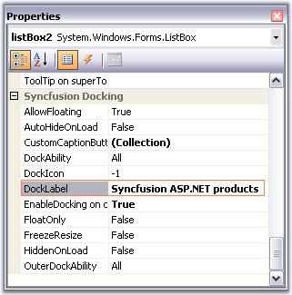
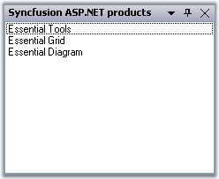
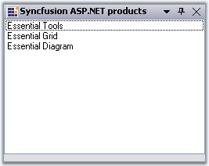

::: {style="DISPLAY: none"}
{#d2h_url_template}{#d2h_package_url style="WIDTH: 0px; DISPLAY: none; HEIGHT: 0px"}
:::

:::::: {.d2h_secondary_topic style="PADDING-BOTTOM: 10pt; MARGIN: 0pt; PADDING-LEFT: 0pt; PADDING-RIGHT: 0pt; PADDING-TOP: 0pt"}
##### Label and Image for CaptionBar {#label-and-image-for-captionbar style="tab-stops: 0pt"}

[]{style="COLOR: #15428b"} 

Caption Label

[]{style="COLOR: #15428b"} 

Docking Manager lets you set the caption label using **DockLabel** property of the particular control, through designer, and programmatically by using **SetDockLabel** method. Alignment of these labels can be specified using **DockLabelAlignment** property.

[]{style="COLOR: #15428b"} 

::: {align="center"}
+-----------------------------------+----------------------------------------------------------------------+
| DockingManager Property           | Description                                                          |
+-----------------------------------+----------------------------------------------------------------------+
| DockLabelAlignment                | Sets the dock label alignment. The different alignments options are, |
|                                   |                                                                      |
|                                   |                                                                      |
|                                   |                                                                      |
|                                   | *Left,*                                                              |
|                                   |                                                                      |
|                                   | *Right and*                                                          |
|                                   |                                                                      |
|                                   | *Center.*                                                            |
+-----------------------------------+----------------------------------------------------------------------+
:::

[]{style="COLOR: #15428b"} 

+----------------------------------------------------------------------------------------------------------------------------------------------------------------------------------------------------------------------------+
| **[\[C#\]]{style="FONT-FAMILY: 'Courier New'; COLOR: black"}**                                                                                                                                                             |
|                                                                                                                                                                                                                            |
| []{style="FONT-FAMILY: 'Courier New'; COLOR: black"}                                                                                                                                                                       |
|                                                                                                                                                                                                                            |
| [this]{style="FONT-FAMILY: 'Courier New'; COLOR: blue"}[.dockingManager.SetDockLabel([this]{style="COLOR: blue"}.listBox1, [\"Syncfusion ASP.NET products\"]{style="COLOR: maroon"});]{style="FONT-FAMILY: 'Courier New'"} |
|                                                                                                                                                                                                                            |
| [this]{style="FONT-FAMILY: 'Courier New'; COLOR: blue"}[.dockingManager1.DockLabelAlignment = Syncfusion.Windows.Forms.Tools.DockLabelAlignmentStyle.Left;]{style="FONT-FAMILY: 'Courier New'"}                            |
+----------------------------------------------------------------------------------------------------------------------------------------------------------------------------------------------------------------------------+

[]{style="COLOR: #15428b"} 

+-----------------------------------------------------------------------------------------------------------------------------------------------------------------------------------------------------------------------+
| **[\[VB.NET\]]{style="FONT-FAMILY: 'Courier New'; COLOR: black"}**                                                                                                                                                    |
|                                                                                                                                                                                                                       |
| []{style="FONT-FAMILY: 'Courier New'; COLOR: black"}                                                                                                                                                                  |
|                                                                                                                                                                                                                       |
| [Me]{style="FONT-FAMILY: 'Courier New'; COLOR: blue"}[.dockingManager.SetDockLabel([Me]{style="COLOR: blue"}.listBox1, [\"Syncfusion ASP.NET products\"]{style="COLOR: maroon"})]{style="FONT-FAMILY: 'Courier New'"} |
|                                                                                                                                                                                                                       |
| [Me]{style="FONT-FAMILY: 'Courier New'; COLOR: blue"}[.dockingManager1.DockLabelAlignment = Syncfusion.Windows.Forms.Tools.DockLabelAlignmentStyle.Left]{style="FONT-FAMILY: 'Courier New'"}                          |
+-----------------------------------------------------------------------------------------------------------------------------------------------------------------------------------------------------------------------+

[]{style="COLOR: #15428b"} 

{border="0"}

[]{style="COLOR: red; FONT-SIZE: 8pt"} 

Figure 56: Property Grid of Docked Control Highlighting DockLabel Property

**[]{style="COLOR: #15428b"}** 

{border="0"}

***[]{style="COLOR: #15428b"}*** 

Figure 57: Caption set for the Docked Control

**[]{style="COLOR: #15428b"}** 

Custom CaptionLabel aligned to left

**[]{style="COLOR: #15428b"}** 

::: {style="BORDER-BOTTOM: windowtext 1pt solid; BORDER-LEFT: medium none; PADDING-BOTTOM: 1pt; MARGIN-TOP: 9pt; PADDING-LEFT: 0pt; PADDING-RIGHT: 0pt; MARGIN-BOTTOM: 9pt; BORDER-TOP: windowtext 1pt solid; BORDER-RIGHT: medium none; PADDING-TOP: 1pt"}
{border="0"} Note: DockLabelAlignment can also be set easily using Task Window.
:::

[]{style="COLOR: red; FONT-SIZE: 8pt"} 

Image for the Caption

**[]{style="COLOR: #15428b"}** 

The captions can also hold images which can be enabled using **ShowCaptionImages** property.

[]{style="COLOR: #15428b"} 

+----------------------------------------------------------------------------------------------------------------------------------------------------------------+
| **[\[C#\]]{style="FONT-FAMILY: 'Courier New'; COLOR: black"}**                                                                                                 |
|                                                                                                                                                                |
| **[]{style="FONT-FAMILY: 'Courier New'; COLOR: black"}**                                                                                                       |
|                                                                                                                                                                |
| [this]{style="FONT-FAMILY: 'Courier New'; COLOR: blue"}[.dockingManager1.ShowCaptionImages = [true]{style="COLOR: blue"};]{style="FONT-FAMILY: 'Courier New'"} |
+----------------------------------------------------------------------------------------------------------------------------------------------------------------+

[]{style="COLOR: #15428b"} 

+-------------------------------------------------------------------------------------------------------------------------------------------------------------+
| **[\[VB.NET\]]{style="FONT-FAMILY: 'Courier New'; COLOR: black"}**                                                                                          |
|                                                                                                                                                             |
| **[]{style="FONT-FAMILY: 'Courier New'; COLOR: black"}**                                                                                                    |
|                                                                                                                                                             |
| [Me]{style="FONT-FAMILY: 'Courier New'; COLOR: blue"}[.dockingManager1.ShowCaptionImages = [True]{style="COLOR: blue"}]{style="FONT-FAMILY: 'Courier New'"} |
+-------------------------------------------------------------------------------------------------------------------------------------------------------------+

[]{style="COLOR: #15428b"} 

The caption icons / the images can be set using this **DockIcon** property of the docked control. To achieve this through designer, follow the below steps.

[]{style="COLOR: #15428b"} 

1.   Create a docked window.

2.   Add ImageList and add the images to it.

3.   Select the image list through the **ImageList** property of the docking manager.

4.   Now go to the property of the docked control to which you have to set the dock icon.

5.   Give the image index value to the DockIcon property.

6.   Run the application.

7.   The corresponding control will be displayed with the icon that is set.

8.   To disable displaying the icon, set the value as -1.

[]{style="COLOR: #15428b"} 

  ------------------------ ---------------------------------------------------------
  DockedControl Property   Description
  DockIcon                 Index of the image associated with this docking window.
  ------------------------ ---------------------------------------------------------

[]{style="COLOR: #15428b"} 

+---------------------------------------------------------------------------------------------------------------------------------------------------------------------+
| **[\[C#\]]{style="FONT-FAMILY: 'Courier New'; COLOR: black"}**                                                                                                      |
|                                                                                                                                                                     |
| **[]{style="FONT-FAMILY: 'Courier New'; COLOR: black"}**                                                                                                            |
|                                                                                                                                                                     |
| [this]{style="FONT-FAMILY: 'Courier New'; COLOR: blue"}[.dockingManager1.SetDockIcon([this]{style="COLOR: blue"}.listBox1, 2);]{style="FONT-FAMILY: 'Courier New'"} |
+---------------------------------------------------------------------------------------------------------------------------------------------------------------------+

[]{style="COLOR: #15428b"} 

+----------------------------------------------------------------------------------------------------------------------------------------------------------------+
| **[\[VB.NET\]]{style="FONT-FAMILY: 'Courier New'; COLOR: black"}**                                                                                             |
|                                                                                                                                                                |
| **[]{style="FONT-FAMILY: 'Courier New'; COLOR: black"}**                                                                                                       |
|                                                                                                                                                                |
| [Me]{style="FONT-FAMILY: 'Courier New'; COLOR: blue"}[.DockingManager1.SetDockIcon([Me]{style="COLOR: blue"}.ListBox1, 2)]{style="FONT-FAMILY: 'Courier New'"} |
+----------------------------------------------------------------------------------------------------------------------------------------------------------------+

[]{style="COLOR: #15428b"} 

{border="0"}

***[]{style="COLOR: #15428b"}*** 

Figure 58: Caption Image set for the Docked Control

[]{style="COLOR: #15428b"} 

Caption Label with Dock Icon

[]{style="COLOR: red; FONT-SIZE: 8pt"} 

Methods for setting Caption icons and labels are as follows.

[]{style="COLOR: #15428b"} 

+-----------------------------------+-------------------------------------------------------------------------------------------------------------+
| Methods                           | Description                                                                                                 |
+-----------------------------------+-------------------------------------------------------------------------------------------------------------+
| SetDockIcon                       | Sets the Icon or the image for the docking window by passing the image icon as a parameter for this method. |
|                                   |                                                                                                             |
|                                   |                                                                                                             |
|                                   |                                                                                                             |
|                                   | *Ctrl* - Represents the dock enabled control.                                                               |
|                                   |                                                                                                             |
|                                   | *image* - Icon representing the docking window.                                                             |
+-----------------------------------+-------------------------------------------------------------------------------------------------------------+
| SetDockIcon(Overloaded)           | This overloaded method returns the index of the image associated with the docking window.                   |
|                                   |                                                                                                             |
|                                   |                                                                                                             |
|                                   |                                                                                                             |
|                                   | *Ctrl* - Indicates the docking window.                                                                      |
|                                   |                                                                                                             |
|                                   | *int* - A zero-based index into the ImageList property value.                                               |
+-----------------------------------+-------------------------------------------------------------------------------------------------------------+
| SetDockLabel                      | Sets the text to be displayed in the docking window caption.                                                |
|                                   |                                                                                                             |
|                                   |                                                                                                             |
|                                   |                                                                                                             |
|                                   | *Ctrl* - Indicates the docking window.                                                                      |
|                                   |                                                                                                             |
|                                   | *strText* - A string value representing the text caption.                                                   |
+-----------------------------------+-------------------------------------------------------------------------------------------------------------+

[]{style="COLOR: #15428b"} 

::: {style="BORDER-BOTTOM: windowtext 1pt solid; BORDER-LEFT: medium none; PADDING-BOTTOM: 1pt; MARGIN-TOP: 9pt; PADDING-LEFT: 0pt; PADDING-RIGHT: 0pt; MARGIN-BOTTOM: 9pt; BORDER-TOP: windowtext 1pt solid; BORDER-RIGHT: medium none; PADDING-TOP: 1pt"}
[{border="0"}]{style="COLOR: #15428b"}[ ]{style="COLOR: #15428b"}Note[:]{style="COLOR: #15428b"}[ ]{style="COLOR: black"}Background[ and ]{style="COLOR: #15428b"}foreground[ appearance of the captions can be customized.]{style="COLOR: #15428b"}
:::

[]{style="COLOR: #15428b"} 

See Also

[]{style="COLOR: #15428b"} 

[Caption Buttons]{.UGHyperlink}[, ]{.UGHyperlink}[Custom Caption Buttons]{.UGHyperlink}[]{.UGHyperlink}

[]{#related-topics}
::::::
