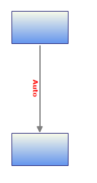
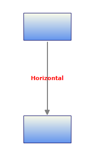
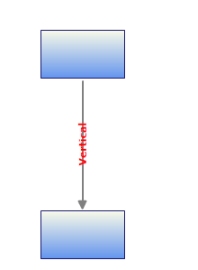

::: {style="DISPLAY: none"}
{#d2h_url_template}{#d2h_package_url style="WIDTH: 0px; DISPLAY: none; HEIGHT: 0px"}
:::

::::: {.d2h_secondary_topic style="PADDING-BOTTOM: 10pt; MARGIN: 0pt; PADDING-LEFT: 0pt; PADDING-RIGHT: 0pt; PADDING-TOP: 0pt"}
#### Label Orientation {#label-orientation style="tab-stops: 0pt"}

Essential Diagram for WPF provides support to orient the LineConnector label as needed.

 

Use Case Scenarios

When the label overlaps with the nodes or connectors, it will not be legible. In such case you can use this feature to align the label to make it legible.

Properties

Table 41: Property Table

::: {align="center"}
+------------------+-------------------------------------------+-----------------------------------------------+---------------------------------------------------------------------------+------------------------------+
| **Property**     | **Description**                           | **Type**                                      | **Data Type**                                                             | **Reference links**          |
+------------------+-------------------------------------------+-----------------------------------------------+---------------------------------------------------------------------------+------------------------------+
| LabelOrientation | Gets or sets a value to  orient the label | Dependency property[]{style="COLOR: #c00000"} | [LabelOrientation]{style="COLOR: #2b91af"}.Auto[]{style="COLOR: #2b91af"} | NA[]{style="COLOR: #c00000"} |
|                  |                                           |                                               |                                                                           |                              |
|                  | []{style="COLOR: green"}                  |                                               | [LabelOrientation]{style="COLOR: #2b91af"}                                |                              |
|                  |                                           |                                               |                                                                           |                              |
|                  | Default Value is Auto.                    |                                               | .Horizontal                                                               |                              |
|                  |                                           |                                               |                                                                           |                              |
|                  |                                           |                                               | [LabelOrientation]{style="COLOR: #2b91af"}                                |                              |
|                  |                                           |                                               |                                                                           |                              |
|                  |                                           |                                               | .Vertical\                                                                |                              |
|                  |                                           |                                               | \                                                                         |                              |
+------------------+-------------------------------------------+-----------------------------------------------+---------------------------------------------------------------------------+------------------------------+
:::

[]{style="FONT-FAMILY: 'Calibri','sans-serif'; COLOR: black"} 

Orienting the Label

You can orient the label using the **LabelOrientation** property*.* You can set this to Horizontal, Vertical or Auto. By default this is set to Auto.

 

The following code illustrates how to set the LabelOrientation to Auto:

 

+------------------------------------------------------------------------------------------------------------------------------------------------------------------------------------------------------------------------------------------------+
| **[\[C#\]]{style="FONT-FAMILY: 'Courier New'"}**                                                                                                                                                                                               |
|                                                                                                                                                                                                                                                |
| **[]{style="FONT-FAMILY: 'Courier New'"}**                                                                                                                                                                                                     |
|                                                                                                                                                                                                                                                |
| [  ]{style="FONT-FAMILY: 'Courier New'; COLOR: #a31515"}[LineConnector]{style="FONT-FAMILY: 'Courier New'; COLOR: #2b91af"}[ line = [new]{style="COLOR: blue"} [LineConnector]{style="COLOR: #2b91af"}();]{style="FONT-FAMILY: 'Courier New'"} |
|                                                                                                                                                                                                                                                |
| [  ]{style="FONT-FAMILY: 'Courier New'; COLOR: #a31515"}[line.LabelOrientation = Syncfusion.Windows.Diagram.[LabelOrientation]{style="COLOR: #2b91af"}.Auto;]{style="FONT-FAMILY: 'Courier New'"}[]{style="FONT-FAMILY: 'Courier New'"}        |
+------------------------------------------------------------------------------------------------------------------------------------------------------------------------------------------------------------------------------------------------+

[]{style="FONT-FAMILY: 'Courier New'; COLOR: blue"} 

[]{style="FONT-FAMILY: 'Courier New'; COLOR: blue"} 

+------------------------------------------------------------------------------------------------------------------------------------------------------------------------+
| **[\[VB\]]{style="FONT-FAMILY: 'Courier New'"}**                                                                                                                       |
|                                                                                                                                                                        |
| **[]{style="FONT-FAMILY: 'Courier New'"}**                                                                                                                             |
|                                                                                                                                                                        |
| [Dim]{style="FONT-FAMILY: 'Courier New'; COLOR: blue"}[ line [As]{style="COLOR: blue"} [New]{style="COLOR: blue"} LineConnector()]{style="FONT-FAMILY: 'Courier New'"} |
|                                                                                                                                                                        |
| [        line.LabelOrientation = Syncfusion.Windows.Diagram.LabelOrientation.Auto]{style="FONT-FAMILY: 'Courier New'"}                                                 |
|                                                                                                                                                                        |
| []{style="FONT-FAMILY: 'Courier New'"}                                                                                                                                 |
+------------------------------------------------------------------------------------------------------------------------------------------------------------------------+

[]{style="FONT-FAMILY: 'Courier New'; COLOR: blue"} 

 

::: {style="BORDER-BOTTOM: windowtext 1pt solid; BORDER-LEFT: medium none; PADDING-BOTTOM: 1pt; MARGIN-TOP: 9pt; PADDING-LEFT: 0pt; PADDING-RIGHT: 0pt; MARGIN-BOTTOM: 9pt; BORDER-TOP: windowtext 1pt solid; BORDER-RIGHT: medium none; PADDING-TOP: 1pt"}
{border="0"}Note: when this property is set to Auto, the label will be positioned along the angle of the line drawn.
:::

 

\
{border="0"}

Figure 89: LabelOrientation is Auto

 

The following code illustrates how to set the LabelOrientation to Horizontal:

+----------------------------------------------------------------------------------------------------------------------------------------------------------------------------------------+
| **[\[C#\]]{style="FONT-FAMILY: 'Courier New'"}**                                                                                                                                       |
|                                                                                                                                                                                        |
| **[]{style="FONT-FAMILY: 'Courier New'"}**                                                                                                                                             |
|                                                                                                                                                                                        |
| [LineConnector]{style="FONT-FAMILY: 'Courier New'; COLOR: #2b91af"}[ line = [new]{style="COLOR: blue"} [LineConnector]{style="COLOR: #2b91af"}();]{style="FONT-FAMILY: 'Courier New'"} |
|                                                                                                                                                                                        |
| [line.LabelOrientation = Syncfusion.Windows.Diagram.[LabelOrientation]{style="COLOR: #2b91af"}.Horizontal;]{style="FONT-FAMILY: 'Courier New'"}[]{style="FONT-FAMILY: 'Courier New'"}  |
+----------------------------------------------------------------------------------------------------------------------------------------------------------------------------------------+

 

+----------------------------------------------------------------------------------------------------------------------------------------------------------------------------------------+
| **[\[VB\]]{style="FONT-FAMILY: 'Courier New'"}**                                                                                                                                       |
|                                                                                                                                                                                        |
| **[]{style="FONT-FAMILY: 'Courier New'"}**                                                                                                                                             |
|                                                                                                                                                                                        |
| [LineConnector]{style="FONT-FAMILY: 'Courier New'; COLOR: #2b91af"}[ line = [new]{style="COLOR: blue"} [LineConnector]{style="COLOR: #2b91af"}();]{style="FONT-FAMILY: 'Courier New'"} |
|                                                                                                                                                                                        |
| [line.LabelOrientation = Syncfusion.Windows.Diagram.[LabelOrientation]{style="COLOR: #2b91af"}.Horizontal;]{style="FONT-FAMILY: 'Courier New'"}[]{style="FONT-FAMILY: 'Courier New'"}  |
+----------------------------------------------------------------------------------------------------------------------------------------------------------------------------------------+

 

\
{border="0"}

Figure 90: LabelOrientation is Horizontal

**\
\**
The following code illustrates how to set the LabelOrientation to Vertical:

+----------------------------------------------------------------------------------------------------------------------------------------------------------------------------------------------------------------+
| **[\[C#\]]{style="FONT-FAMILY: 'Courier New'"}**                                                                                                                                                               |
|                                                                                                                                                                                                                |
| [LineConnector]{style="FONT-FAMILY: 'Courier New'; COLOR: #2b91af"}[ line = [new]{style="COLOR: blue"} [LineConnector]{style="COLOR: #2b91af"}();]{style="FONT-FAMILY: 'Courier New'"}                         |
|                                                                                                                                                                                                                |
| [line.LabelOrientation = Syncfusion.Windows.Diagram.[LabelOrientation]{style="COLOR: #2b91af"}.Vertical;[ ]{style="COLOR: #a31515"}]{style="FONT-FAMILY: 'Courier New'"}[]{style="FONT-FAMILY: 'Courier New'"} |
+----------------------------------------------------------------------------------------------------------------------------------------------------------------------------------------------------------------+

 

+------------------------------------------------------------------------------------------------------------------------------------------------------------------------+
| **[\[VB\]]{style="FONT-FAMILY: 'Courier New'"}**                                                                                                                       |
|                                                                                                                                                                        |
| [Dim]{style="FONT-FAMILY: 'Courier New'; COLOR: blue"}[ line [As]{style="COLOR: blue"} [New]{style="COLOR: blue"} LineConnector()]{style="FONT-FAMILY: 'Courier New'"} |
|                                                                                                                                                                        |
| [      line.LabelOrientation = Syncfusion.Windows.Diagram.LabelOrientation.Vertical]{style="FONT-FAMILY: 'Courier New'"}                                               |
|                                                                                                                                                                        |
| []{style="FONT-FAMILY: 'Courier New'"}                                                                                                                                 |
+------------------------------------------------------------------------------------------------------------------------------------------------------------------------+

 

{border="0"}

Figure 91: LabelOrientation is Vertical

**[]{style="FONT-FAMILY: 'Calibri','sans-serif'; FONT-SIZE: 14pt"}** 

[]{#related-topics}
:::::
