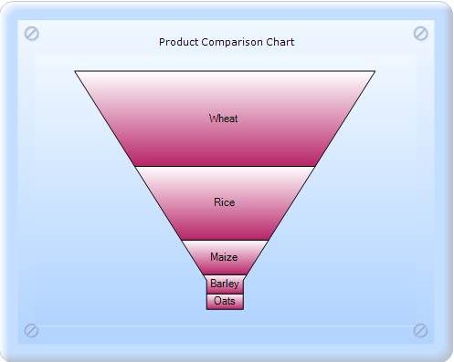
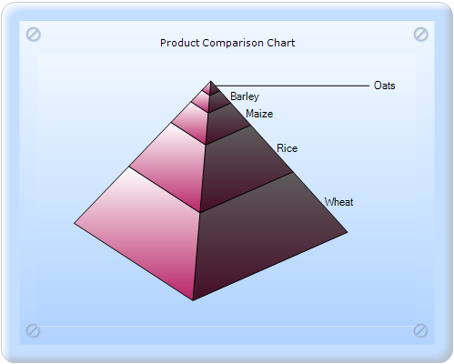

::: {style="DISPLAY: none"}
{#d2h_url_template}{#d2h_package_url style="WIDTH: 0px; DISPLAY: none; HEIGHT: 0px"}
:::

:::: {.d2h_secondary_topic style="PADDING-BOTTOM: 10pt; MARGIN: 0pt; PADDING-LEFT: 0pt; PADDING-RIGHT: 0pt; PADDING-TOP: 0pt"}
##### LabelPlacement {#labelplacement style="tab-stops: 0pt"}

LabelPlacement gets or sets the Pyramid chart or Funnel chart data point label placement when ChartAccumulationLabelStyle is set to Inside.

::: {align="center"}
+-------------------------------------+-----------------------------------------------------------------------------------+
| Details                                                                                                                 |
+-------------------------------------+-----------------------------------------------------------------------------------+
| Possible values                     | **Center** -- DataPoint labels are aligned to the center of the Pyramid segment.\ |
|                                     | **Top** - DataPoint labels are aligned to the top of the Pyramid segment.\        |
|                                     | **Bottom** -- DataPoint labels are aligned to the bottom of the Pyramid segment.  |
|                                     |                                                                                   |
|                                     | **Left** - DataPoint labels are aligned to the left of the Pyramid segment.       |
|                                     |                                                                                   |
|                                     | **Right** - DataPoint labels are aligned to the right of the Pyramid segment.     |
+-------------------------------------+-----------------------------------------------------------------------------------+
| Default value                       | Right                                                                             |
+-------------------------------------+-----------------------------------------------------------------------------------+
| 2D/3D limitations                   | No                                                                                |
+-------------------------------------+-----------------------------------------------------------------------------------+
| Application to chart element        | Any series                                                                        |
+-------------------------------------+-----------------------------------------------------------------------------------+
| Application to chart types          | Funnel chart and Pyramid chart.                                                   |
+-------------------------------------+-----------------------------------------------------------------------------------+
:::

[]{style="FONT-FAMILY: 'Times New Roman','serif'; FONT-SIZE: 12pt"} 

Pyramid Charts:

{border="0"}

Figure 227: Pyramid charts with LabelPlacement Center

[]{style="FONT-FAMILY: 'Calibri','sans-serif'"} 

Funnel Chart:

{border="0"}

Figure 228: 3D Pyramid chart with LabelPlacement Center

 

[]{#related-topics}
::::
