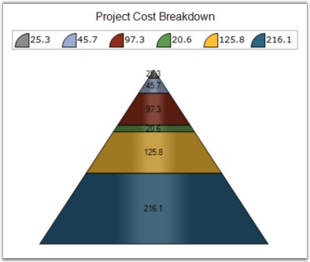
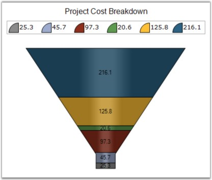

::: {style="DISPLAY: none"}
{#d2h_url_template}{#d2h_package_url style="WIDTH: 0px; DISPLAY: none; HEIGHT: 0px"}
:::

:::: {.d2h_secondary_topic style="PADDING-BOTTOM: 10pt; MARGIN: 0pt; PADDING-LEFT: 0pt; PADDING-RIGHT: 0pt; PADDING-TOP: 0pt"}
#### LabelPlacement {#labelplacement style="tab-stops: 0pt"}

 

Gets or sets the Pyramid chart or Funnel chart data point label placement when **ChartAccumulationLabelStyle** is set as **Inside**.

 

::: {align="center"}
+-------------------------------------+------------------------------------------------------------------------------------------------------------------------+
|                                                                                                                                                              |
|                                                                                                                                                              |
| Details                                                                                                                                                      |
+-------------------------------------+------------------------------------------------------------------------------------------------------------------------+
| **Possible Values**                 |                                                                                                                        |
|                                     |                                                                                                                        |
|                                     | [·      ]{style="FONT-FAMILY: Symbol"}**Center** -- DataPoint labels are aligned to the center of the Pyramid segment. |
|                                     |                                                                                                                        |
|                                     | [·      ]{style="FONT-FAMILY: Symbol"}**Top** - DataPoint labels are aligned to the top of the Pyramid segment.        |
|                                     |                                                                                                                        |
|                                     | [·      ]{style="FONT-FAMILY: Symbol"}**Bottom** -- DataPoint labels are aligned to the bottom of the Pyramid segment. |
|                                     |                                                                                                                        |
|                                     | [·      ]{style="FONT-FAMILY: Symbol"}**Left** - DataPoint labels are aligned to the Left of the Pyramid segment.      |
|                                     |                                                                                                                        |
|                                     | [·      ]{style="FONT-FAMILY: Symbol"}**Right** - DataPoint labels are aligned to the Right of the Pyramid segment.    |
+-------------------------------------+------------------------------------------------------------------------------------------------------------------------+
| **Default Value    **               | **Right**                                                                                                              |
+-------------------------------------+------------------------------------------------------------------------------------------------------------------------+
| **2D / 3D Limitations**             | No                                                                                                                     |
+-------------------------------------+------------------------------------------------------------------------------------------------------------------------+
| **Applies to Chart Element**        | Any Series                                                                                                             |
+-------------------------------------+------------------------------------------------------------------------------------------------------------------------+
| **Applies to Chart Types**          | Funnel and Pyramid Charts                                                                                              |
+-------------------------------------+------------------------------------------------------------------------------------------------------------------------+
:::

 

Here is the code snippet using LabelPlacement in Pyramid Chart.

 

+---------------------------------------------------------------------------------------------------------------------------------------------------------------------------------------------------------------------------------+
| **[\[C#\]]{style="FONT-FAMILY: 'Courier New'; COLOR: black"}**                                                                                                                                                                  |
|                                                                                                                                                                                                                                 |
| **[]{style="FONT-FAMILY: 'Courier New'; COLOR: black"}**                                                                                                                                                                        |
|                                                                                                                                                                                                                                 |
| [this]{style="FONT-FAMILY: 'Courier New'; COLOR: blue"}[.chartControl1.Series\[0\].ConfigItems.PyramidItem.LabelPlacement = [ChartAccumulationLabelPlacement]{style="COLOR: teal"}.Center;]{style="FONT-FAMILY: 'Courier New'"} |
+---------------------------------------------------------------------------------------------------------------------------------------------------------------------------------------------------------------------------------+

 

+----------------------------------------------------------------------------------------------------------------------------------------------------------------------------------------------------------------------------+
| **[\[VB.NET\]]{style="FONT-FAMILY: 'Courier New'; COLOR: black"}**                                                                                                                                                         |
|                                                                                                                                                                                                                            |
| **[]{style="FONT-FAMILY: 'Courier New'; COLOR: black"}**                                                                                                                                                                   |
|                                                                                                                                                                                                                            |
| [Me]{style="FONT-FAMILY: 'Courier New'; COLOR: blue"}[.chartControl1.Series(0).ConfigItems.PyramidItem.LabelPlacement = [ChartAccumulationLabelPlacement]{style="COLOR: teal"}.Center]{style="FONT-FAMILY: 'Courier New'"} |
+----------------------------------------------------------------------------------------------------------------------------------------------------------------------------------------------------------------------------+

 

{border="0"}

 

Figure 155: ChartAccumulationLabelPlacement as Center

 

Here is the code snippet using LabelPlacement in Funnel Chart.

 

+--------------------------------------------------------------------------------------------------------------------------------------------------------------------------------------------------------------------------------+
| **[\[C#\]]{style="FONT-FAMILY: 'Courier New'; COLOR: black"}**                                                                                                                                                                 |
|                                                                                                                                                                                                                                |
| **[]{style="FONT-FAMILY: 'Courier New'; COLOR: black"}**                                                                                                                                                                       |
|                                                                                                                                                                                                                                |
| [this]{style="FONT-FAMILY: 'Courier New'; COLOR: blue"}[.chartControl1.Series\[0\].ConfigItems.FunnelItem.LabelPlacement = [ChartAccumulationLabelPlacement]{style="COLOR: teal"}.Center;]{style="FONT-FAMILY: 'Courier New'"} |
+--------------------------------------------------------------------------------------------------------------------------------------------------------------------------------------------------------------------------------+

 

+---------------------------------------------------------------------------------------------------------------------------------------------------------------------------------------------------------------------------+
| **[\[VB.NET\]]{style="FONT-FAMILY: 'Courier New'; COLOR: black"}**                                                                                                                                                        |
|                                                                                                                                                                                                                           |
| **[]{style="FONT-FAMILY: 'Courier New'; COLOR: black"}**                                                                                                                                                                  |
|                                                                                                                                                                                                                           |
| [Me]{style="FONT-FAMILY: 'Courier New'; COLOR: blue"}[.chartControl1.Series(0).ConfigItems.FunnelItem.LabelPlacement = [ChartAccumulationLabelPlacement]{style="COLOR: teal"}.Center]{style="FONT-FAMILY: 'Courier New'"} |
+---------------------------------------------------------------------------------------------------------------------------------------------------------------------------------------------------------------------------+

 

{border="0"}

 

Figure 156: ChartAccumulationLabelPlacement as Center

 

See Also

 

[Pyramid Chart]{.UGHyperlink}, [Funnel Chart]{.UGHyperlink}[]{style="COLOR: black"}

 

[]{#p119} 

[]{#related-topics}
::::
