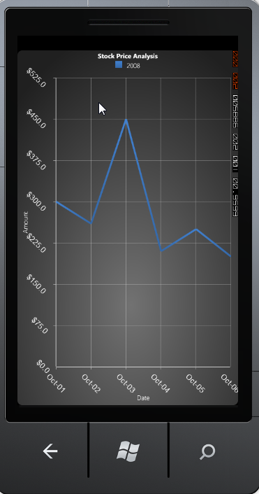

::: {style="DISPLAY: none"}
{#d2h_url_template}{#d2h_package_url style="WIDTH: 0px; DISPLAY: none; HEIGHT: 0px"}
:::

::: {.d2h_secondary_topic style="PADDING-BOTTOM: 10pt; MARGIN: 0pt; PADDING-LEFT: 0pt; PADDING-RIGHT: 0pt; PADDING-TOP: 0pt"}
##### Label Rotate Angle {#label-rotate-angle style="tab-stops: 0pt"}

[]{#p96}[]{style="COLOR: #15428b"} 

The axis label can be rotated to a custom angle using the LabelRotateAngle property. The following code describes setting rotation angle for the axis label to 45 degree.

[]{style="COLOR: #15428b"} 

+-----------------------------------------------------------------------------------------------------------------------------------------------------------------------------------------------------------------------------------------------------------------------------------------------------------------------------------------------------------------------------------------------------------------------------------------------------------------------------------+
| [\[XAML\]]{style="FONT-FAMILY: 'Courier New'"}                                                                                                                                                                                                                                                                                                                                                                                                                                    |
|                                                                                                                                                                                                                                                                                                                                                                                                                                                                                   |
| **[]{style="FONT-FAMILY: 'Courier New'"}**                                                                                                                                                                                                                                                                                                                                                                                                                                        |
|                                                                                                                                                                                                                                                                                                                                                                                                                                                                                   |
| [\<]{style="FONT-FAMILY: 'Courier New'; COLOR: blue"}[syncfusion:ChartArea.PrimaryAxis]{style="FONT-FAMILY: 'Courier New'; COLOR: #a31515"}[\>]{style="FONT-FAMILY: 'Courier New'; COLOR: blue"}                                                                                                                                                                                                                                                                                  |
|                                                                                                                                                                                                                                                                                                                                                                                                                                                                                   |
| [  \<]{style="FONT-FAMILY: 'Courier New'; COLOR: blue"}[syncfusion:ChartAxis]{style="FONT-FAMILY: 'Courier New'; COLOR: #a31515"}[ ]{style="FONT-FAMILY: 'Courier New'; COLOR: blue"}[LabelRotateAngle]{style="FONT-FAMILY: 'Courier New'; COLOR: red"}[=]{style="FONT-FAMILY: 'Courier New'; COLOR: blue"}[\"[45]{style="COLOR: blue"}\"[\>\</]{style="COLOR: blue"}[syncfusion:ChartAxis]{style="COLOR: #a31515"}[\>]{style="COLOR: blue"}]{style="FONT-FAMILY: 'Courier New'"} |
|                                                                                                                                                                                                                                                                                                                                                                                                                                                                                   |
| [\</]{style="FONT-FAMILY: 'Courier New'; COLOR: blue"}[syncfusion:ChartArea.PrimaryAxis]{style="FONT-FAMILY: 'Courier New'; COLOR: #a31515"}[\>]{style="FONT-FAMILY: 'Courier New'; COLOR: blue"}                                                                                                                                                                                                                                                                                 |
|                                                                                                                                                                                                                                                                                                                                                                                                                                                                                   |
| []{style="FONT-FAMILY: 'Courier New'; COLOR: blue"}                                                                                                                                                                                                                                                                                                                                                                                                                               |
|                                                                                                                                                                                                                                                                                                                                                                                                                                                                                   |
| [\<]{style="FONT-FAMILY: 'Courier New'; COLOR: blue"}[syncfusion:ChartArea.SecondaryAxis]{style="FONT-FAMILY: 'Courier New'; COLOR: #a31515"}[\>]{style="FONT-FAMILY: 'Courier New'; COLOR: blue"}                                                                                                                                                                                                                                                                                |
|                                                                                                                                                                                                                                                                                                                                                                                                                                                                                   |
| [  \<]{style="FONT-FAMILY: 'Courier New'; COLOR: blue"}[syncfusion:ChartAxis]{style="FONT-FAMILY: 'Courier New'; COLOR: #a31515"}[ ]{style="FONT-FAMILY: 'Courier New'; COLOR: blue"}[LabelRotateAngle]{style="FONT-FAMILY: 'Courier New'; COLOR: red"}[=]{style="FONT-FAMILY: 'Courier New'; COLOR: blue"}[\"[45]{style="COLOR: blue"}\"[\>\</]{style="COLOR: blue"}[syncfusion:ChartAxis]{style="COLOR: #a31515"}[\>]{style="COLOR: blue"}]{style="FONT-FAMILY: 'Courier New'"} |
|                                                                                                                                                                                                                                                                                                                                                                                                                                                                                   |
| [\</]{style="FONT-FAMILY: 'Courier New'; COLOR: blue"}[syncfusion:ChartArea.SecondaryAxis]{style="FONT-FAMILY: 'Courier New'; COLOR: #a31515"}[\>]{style="FONT-FAMILY: 'Courier New'; COLOR: blue"}                                                                                                                                                                                                                                                                               |
+-----------------------------------------------------------------------------------------------------------------------------------------------------------------------------------------------------------------------------------------------------------------------------------------------------------------------------------------------------------------------------------------------------------------------------------------------------------------------------------+

[]{style="COLOR: #15428b"} 

+----------------------------------------------------------------------------------------------------------------------+
| [\[C#\]]{style="FONT-FAMILY: 'Courier New'"}                                                                         |
|                                                                                                                      |
| []{style="FONT-FAMILY: 'Courier New'"}                                                                               |
|                                                                                                                      |
| [//Intializing the Chart Area and Axis]{style="FONT-FAMILY: 'Courier New'; COLOR: green"}                            |
|                                                                                                                      |
| [ChartArea area = [new]{style="COLOR: blue"} ChartArea();]{style="FONT-FAMILY: 'Courier New'"}                       |
|                                                                                                                      |
| [ChartAxis primary = [new]{style="COLOR: blue"} ChartAxis();]{style="FONT-FAMILY: 'Courier New'"}                    |
|                                                                                                                      |
| [ChartAxis secondary = [new]{style="COLOR: blue"} ChartAxis();]{style="FONT-FAMILY: 'Courier New'"}                  |
|                                                                                                                      |
| []{style="FONT-FAMILY: 'Courier New'"}                                                                               |
|                                                                                                                      |
| [//Initializing the primary and secondary axes Label rotate angle]{style="FONT-FAMILY: 'Courier New'; COLOR: green"} |
|                                                                                                                      |
| [primary.LabelRotateAngle = 45;]{style="FONT-FAMILY: 'Courier New'"}                                                 |
|                                                                                                                      |
| [secondary.LabelRotateAngle = 45;]{style="FONT-FAMILY: 'Courier New'"}                                               |
|                                                                                                                      |
| []{style="FONT-FAMILY: 'Courier New'"}                                                                               |
|                                                                                                                      |
| [area.PrimaryAxis = primary;]{style="FONT-FAMILY: 'Courier New'"}                                                    |
|                                                                                                                      |
| [area.SecondaryAxis = secondary;]{style="FONT-FAMILY: 'Courier New'"}                                                |
+----------------------------------------------------------------------------------------------------------------------+

**[]{style="COLOR: #15428b"}** 

**[]{style="COLOR: #15428b"}** 

{border="0"}

 

Figure 94 : LabelRotateAngle = \"45\"**[]{style="COLOR: #15428b"}**

 

[]{#related-topics}
:::
