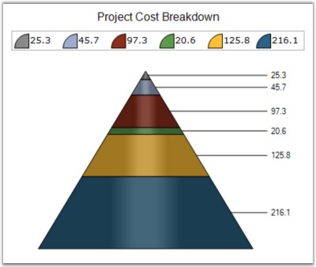

::: {style="DISPLAY: none"}
{#d2h_url_template}{#d2h_package_url style="WIDTH: 0px; DISPLAY: none; HEIGHT: 0px"}
:::

:::: {.d2h_secondary_topic style="PADDING-BOTTOM: 10pt; MARGIN: 0pt; PADDING-LEFT: 0pt; PADDING-RIGHT: 0pt; PADDING-TOP: 0pt"}
#### LabelStyle {#labelstyle style="tab-stops: 0pt"}

[]{style="FONT-FAMILY: 'Trebuchet MS','sans-serif'; FONT-SIZE: 9pt"} 

Gets or sets the Pyramid chart or Funnel chart label style. This property dictates the presence and overall positioning of the DataPoint labels.

[]{style="FONT-FAMILY: 'Trebuchet MS','sans-serif'; FONT-SIZE: 9pt"} 

::: {align="center"}
+-------------------------------------+--------------------------------------------------------------------------------------------+
| Details                                                                                                                          |
+-------------------------------------+--------------------------------------------------------------------------------------------+
| Possible Values                     | Inside - DataPoint label is drawn inside the Pyramid segment.\                             |
|                                     | Outside - DataPoint label is drawn outside and next to the Pyramid segment.\               |
|                                     | OutsideInColumn - DataPoint is drawn outside the Pyramid segment with all labels aligned.\ |
|                                     | Disabled - DataPoint labels are disabled.                                                  |
+-------------------------------------+--------------------------------------------------------------------------------------------+
| Default Value                       | OutsideInColumn                                                                            |
+-------------------------------------+--------------------------------------------------------------------------------------------+
| 2D / 3D Limitations                 | No                                                                                         |
+-------------------------------------+--------------------------------------------------------------------------------------------+
| Applies to Chart Element            | All Series                                                                                 |
+-------------------------------------+--------------------------------------------------------------------------------------------+
| Applies to Chart Types              | Funnel, Pyramid charts                                                                     |
+-------------------------------------+--------------------------------------------------------------------------------------------+
:::

[]{style="FONT-FAMILY: 'Trebuchet MS','sans-serif'; FONT-SIZE: 9pt"} 

Here is the code snippet using LabelStyle in Pyramid Chart.

[]{style="FONT-FAMILY: 'Trebuchet MS','sans-serif'; FONT-SIZE: 9pt"} 

+---------------------------------------------------------------------------------------------------------------------------------------------------------------------------------------------------------------------------------------------------------------------+
| **[\[C#\]]{style="FONT-FAMILY: 'Courier New'; COLOR: black; FONT-SIZE: 9pt"}**                                                                                                                                                                                      |
|                                                                                                                                                                                                                                                                     |
| **[]{style="FONT-FAMILY: 'Courier New'; COLOR: black; FONT-SIZE: 9pt"}**                                                                                                                                                                                            |
|                                                                                                                                                                                                                                                                     |
| [this]{style="FONT-FAMILY: 'Courier New'; COLOR: blue; FONT-SIZE: 9pt"}[.ChartWebControl1.Series\[0\].ConfigItems.PyramidItem.LabelStyle = [ChartAccumulationLabelStyle]{style="COLOR: teal"}.OutsideInColumn;]{style="FONT-FAMILY: 'Courier New'; FONT-SIZE: 9pt"} |
+---------------------------------------------------------------------------------------------------------------------------------------------------------------------------------------------------------------------------------------------------------------------+

[]{style="FONT-FAMILY: 'Trebuchet MS','sans-serif'; FONT-SIZE: 9pt"} 

+---------------------------------------------------------------------------------------------------------------------------------------------------------------------------------------------------------------------------------------------------------------+
| **[\[VB.NET\]]{style="FONT-FAMILY: 'Courier New'; COLOR: black; FONT-SIZE: 9pt"}**                                                                                                                                                                            |
|                                                                                                                                                                                                                                                               |
| **[]{style="FONT-FAMILY: 'Courier New'; COLOR: black; FONT-SIZE: 9pt"}**                                                                                                                                                                                      |
|                                                                                                                                                                                                                                                               |
| [Me]{style="FONT-FAMILY: 'Courier New'; COLOR: blue; FONT-SIZE: 9pt"}[.ChartWebControl1.Series(0).ConfigItems.PyramidItem.LabelStyle= [ChartAccumulationLabelStyle]{style="COLOR: teal"}.OutsideInColumn]{style="FONT-FAMILY: 'Courier New'; FONT-SIZE: 9pt"} |
+---------------------------------------------------------------------------------------------------------------------------------------------------------------------------------------------------------------------------------------------------------------+

[]{style="FONT-FAMILY: 'Trebuchet MS','sans-serif'; FONT-SIZE: 9pt"} 

{border="0"}

[]{style="FONT-FAMILY: 'Trebuchet MS','sans-serif'; FONT-SIZE: 9pt"} 

Figure 152: ChartAccumulationLabelStyle as OutsideInColumn

[]{style="FONT-FAMILY: 'Trebuchet MS','sans-serif'; FONT-SIZE: 9pt"} 

Here is the code snippet using LabelStyle in Funnel Chart.

[]{style="FONT-FAMILY: 'Trebuchet MS','sans-serif'; FONT-SIZE: 9pt"} 

+------------------------------------------------------------------------------------------------------------------------------------------------------------------------------------------------------------------------------------+
| **[\[C#\]]{style="FONT-FAMILY: 'Courier New'; COLOR: black"}**                                                                                                                                                                     |
|                                                                                                                                                                                                                                    |
| **[]{style="FONT-FAMILY: 'Courier New'; COLOR: black"}**                                                                                                                                                                           |
|                                                                                                                                                                                                                                    |
| [this]{style="FONT-FAMILY: 'Courier New'; COLOR: blue"}[.ChartWebControl1.Series\[0\].ConfigItems.FunnelItem.LabelStyle = [ChartAccumulationLabelStyle]{style="COLOR: teal"}.OutsideInColumn;]{style="FONT-FAMILY: 'Courier New'"} |
+------------------------------------------------------------------------------------------------------------------------------------------------------------------------------------------------------------------------------------+

[]{style="COLOR: black; FONT-SIZE: 8pt"} 

+------------------------------------------------------------------------------------------------------------------------------------------------------------------------------------------------------------------------------+
| **[\[VB.NET\]]{style="FONT-FAMILY: 'Courier New'; COLOR: black"}**                                                                                                                                                           |
|                                                                                                                                                                                                                              |
| **[]{style="FONT-FAMILY: 'Courier New'; COLOR: black"}**                                                                                                                                                                     |
|                                                                                                                                                                                                                              |
| [Me]{style="FONT-FAMILY: 'Courier New'; COLOR: blue"}[.ChartWebControl1.Series(0).ConfigItems.FunnelItem.LabelStyle= [ChartAccumulationLabelStyle]{style="COLOR: teal"}.OutsideInColumn]{style="FONT-FAMILY: 'Courier New'"} |
+------------------------------------------------------------------------------------------------------------------------------------------------------------------------------------------------------------------------------+

[]{style="COLOR: black; FONT-SIZE: 8pt"} 

{border="0"}

[]{style="FONT-FAMILY: 'Trebuchet MS','sans-serif'; FONT-SIZE: 9pt"} 

Figure 153: ChartAccumulationLabelStyle as OutsideInColumn

[]{style="FONT-FAMILY: 'Trebuchet MS','sans-serif'; FONT-SIZE: 9pt"} 

See Also

**[]{style="FONT-FAMILY: 'Segoe UI','sans-serif'; COLOR: #4a5c8c; FONT-SIZE: 9pt"}** 

[Pyramid Chart]{.UGHyperlink}[, ]{.UGHyperlink}[Funnel Chart]{.UGHyperlink}[]{.UGHyperlink}

[]{#p121} 

[]{#related-topics}
::::
