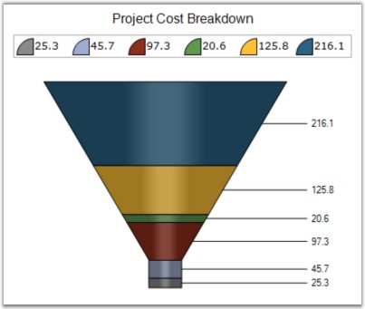

::: {style="DISPLAY: none"}
{#d2h_url_template}{#d2h_package_url style="WIDTH: 0px; DISPLAY: none; HEIGHT: 0px"}
:::

:::: {.d2h_secondary_topic style="PADDING-BOTTOM: 10pt; MARGIN: 0pt; PADDING-LEFT: 0pt; PADDING-RIGHT: 0pt; PADDING-TOP: 0pt"}
#### LabelStyle {#labelstyle style="tab-stops: 0pt"}

 

Gets or sets the Pyramid chart or Funnel chart label style. This property dictates the presence and overall positioning of the DataPoint labels.

 

::: {align="center"}
+-------------------------------------+-------------------------------------------------------------------------------------------------------------------------------------+
| **Details**                                                                                                                                                               |
+-------------------------------------+-------------------------------------------------------------------------------------------------------------------------------------+
| **Possible Values**                 | [·      ]{style="FONT-FAMILY: Symbol"}**Inside** - DataPoint label is drawn inside the Pyramid segment.                             |
|                                     |                                                                                                                                     |
|                                     | [·      ]{style="FONT-FAMILY: Symbol"}**Outside** - DataPoint label is drawn outside and next to the Pyramid segment.               |
|                                     |                                                                                                                                     |
|                                     | [·      ]{style="FONT-FAMILY: Symbol"}**OutsideInColumn** - DataPoint is drawn outside the Pyramid segment with all labels aligned. |
|                                     |                                                                                                                                     |
|                                     | [·      ]{style="FONT-FAMILY: Symbol"}**Disabled** - DataPoint labels are disabled.                                                 |
+-------------------------------------+-------------------------------------------------------------------------------------------------------------------------------------+
| **Default Value    **               | **OutsideInColumn**                                                                                                                 |
+-------------------------------------+-------------------------------------------------------------------------------------------------------------------------------------+
| **2D / 3D Limitations**             | No                                                                                                                                  |
+-------------------------------------+-------------------------------------------------------------------------------------------------------------------------------------+
| **Applies to Chart Element**        | All Series                                                                                                                          |
+-------------------------------------+-------------------------------------------------------------------------------------------------------------------------------------+
| **Applies to Chart Types**          | Funnel, Pyramid charts                                                                                                              |
+-------------------------------------+-------------------------------------------------------------------------------------------------------------------------------------+
:::

 

Here is the code snippet using LabelStyle in Pyramid Chart.

 

+----------------------------------------------------------------------------------------------------------------------------------------------------------------------------------------------------------------------------------+
| **[\[C#\]]{style="FONT-FAMILY: 'Courier New'; COLOR: black"}**                                                                                                                                                                   |
|                                                                                                                                                                                                                                  |
| **[]{style="FONT-FAMILY: 'Courier New'; COLOR: black"}**                                                                                                                                                                         |
|                                                                                                                                                                                                                                  |
| [this]{style="FONT-FAMILY: 'Courier New'; COLOR: blue"}[.chartControl1.Series\[0\].ConfigItems.PyramidItem.LabelStyle = [ChartAccumulationLabelStyle]{style="COLOR: teal"}.OutsideInColumn;]{style="FONT-FAMILY: 'Courier New'"} |
+----------------------------------------------------------------------------------------------------------------------------------------------------------------------------------------------------------------------------------+

[]{style="COLOR: black; FONT-SIZE: 8pt"} 

+----------------------------------------------------------------------------------------------------------------------------------------------------------------------------------------------------------------------------+
| **[\[VB.NET\]]{style="FONT-FAMILY: 'Courier New'; COLOR: black"}**                                                                                                                                                         |
|                                                                                                                                                                                                                            |
| **[]{style="FONT-FAMILY: 'Courier New'; COLOR: black"}**                                                                                                                                                                   |
|                                                                                                                                                                                                                            |
| [Me]{style="FONT-FAMILY: 'Courier New'; COLOR: blue"}[.chartControl1.Series(0).ConfigItems.PyramidItem.LabelStyle= [ChartAccumulationLabelStyle]{style="COLOR: teal"}.OutsideInColumn]{style="FONT-FAMILY: 'Courier New'"} |
+----------------------------------------------------------------------------------------------------------------------------------------------------------------------------------------------------------------------------+

[]{style="COLOR: black; FONT-SIZE: 8pt"} 

{border="0"}

[]{style="COLOR: black; FONT-SIZE: 8pt"} 

Figure 157: ChartAccumulationLabelStyle as OutsideInColumn

 

Here is the code snippet using LabelStyle in Funnel Chart.

 

+---------------------------------------------------------------------------------------------------------------------------------------------------------------------------------------------------------------------------------+
| **[\[C#\]]{style="FONT-FAMILY: 'Courier New'; COLOR: black"}**                                                                                                                                                                  |
|                                                                                                                                                                                                                                 |
| **[]{style="FONT-FAMILY: 'Courier New'; COLOR: black"}**                                                                                                                                                                        |
|                                                                                                                                                                                                                                 |
| [this]{style="FONT-FAMILY: 'Courier New'; COLOR: blue"}[.chartControl1.Series\[0\].ConfigItems.FunnelItem.LabelStyle = [ChartAccumulationLabelStyle]{style="COLOR: teal"}.OutsideInColumn;]{style="FONT-FAMILY: 'Courier New'"} |
+---------------------------------------------------------------------------------------------------------------------------------------------------------------------------------------------------------------------------------+

[]{style="COLOR: black; FONT-SIZE: 8pt"} 

+---------------------------------------------------------------------------------------------------------------------------------------------------------------------------------------------------------------------------+
| **[\[VB.NET\]]{style="FONT-FAMILY: 'Courier New'; COLOR: black"}**                                                                                                                                                        |
|                                                                                                                                                                                                                           |
| **[]{style="FONT-FAMILY: 'Courier New'; COLOR: black"}**                                                                                                                                                                  |
|                                                                                                                                                                                                                           |
| [Me]{style="FONT-FAMILY: 'Courier New'; COLOR: blue"}[.chartControl1.Series(0).ConfigItems.FunnelItem.LabelStyle= [ChartAccumulationLabelStyle]{style="COLOR: teal"}.OutsideInColumn]{style="FONT-FAMILY: 'Courier New'"} |
+---------------------------------------------------------------------------------------------------------------------------------------------------------------------------------------------------------------------------+

[]{style="COLOR: black; FONT-SIZE: 8pt"} 

{border="0"}

[]{style="COLOR: black; FONT-SIZE: 8pt"} 

Figure 158: ChartAccumulationLabelStyle as OutsideInColumn

[]{style="COLOR: black; FONT-SIZE: 8pt"} 

See Also

**[]{style="FONT-FAMILY: 'Segoe UI','sans-serif'; COLOR: #4a5c8c"}** 

[]{#p120}[[Pyramid Chart]{style="COLOR: blue"}]{.UGHyperlink}, [Funnel Chart]{.UGHyperlink}[]{style="COLOR: black"}

 

[]{#related-topics}
::::
