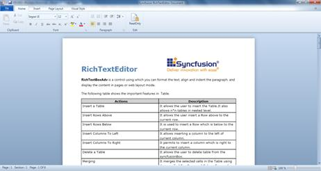
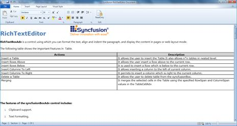

::: {style="DISPLAY: none"}
{#d2h_url_template}{#d2h_package_url style="WIDTH: 0px; DISPLAY: none; HEIGHT: 0px"}
:::

::: {.d2h_secondary_topic style="PADDING-BOTTOM: 10pt; MARGIN: 0pt; PADDING-LEFT: 0pt; PADDING-RIGHT: 0pt; PADDING-TOP: 0pt"}
#### Layout Modes {#layout-modes style="tab-stops: 0pt"}

The layout mode feature allows choosing several layouts in the document. They are:

 

1.  **PageLayout**---A single document in the edited content can be separated into *n* number of pages depending upon the capacity of the content. We can customize the page margin and size using the properties which are available in **SectionAdv**.

 

{border="0"}

Figure 915: RichTextBoxAdv Control in PageLayout

 

2.  **ContinuousLayout**---This layout mode looks like the Web Layout mode in MS Word. Instead of having pages of content, it will have a single page that displays all of the content.

 

{border="0"}

[              ]{style="COLOR: #c00000"}Figure 916: RichTextBoxAdv Control in FlowLayout

[]{#related-topics}
:::
