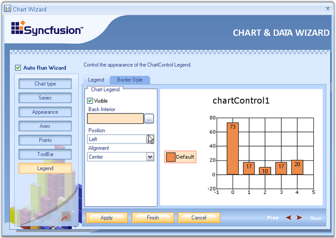
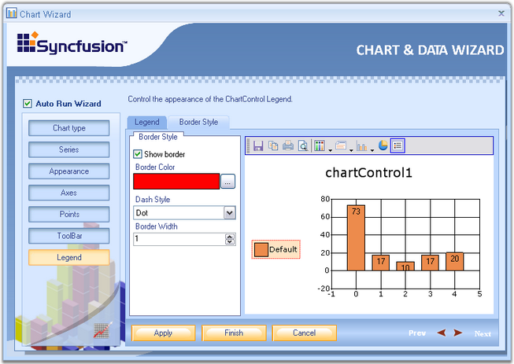

::: {style="DISPLAY: none"}
{#d2h_url_template}{#d2h_package_url style="WIDTH: 0px; DISPLAY: none; HEIGHT: 0px"}
:::

::::: {#nsbanner .d2h_main_nsbanner style="BORDER-BOTTOM: #999999 1px solid; POSITION: relative; PADDING-BOTTOM: 0px; BACKGROUND-COLOR: transparent; PADDING-LEFT: 0px; PADDING-RIGHT: 0px; DISPLAY: none; BORDER-TOP: #999999 1px solid; PADDING-TOP: 0px; LEFT: 0px"}
:::: {#TitleRow .d2h_main_titlerow style="PADDING-BOTTOM: 4px; BACKGROUND-COLOR: transparent; PADDING-LEFT: 22px; WIDTH: 100%; PADDING-RIGHT: 10px; DISPLAY: none; PADDING-TOP: 4px"}
::: {#ienav .d2h_main_ienav style="DISPLAY: none"}
{#D2HPrevious .D2HPreviousEnabled}  {#D2HNext .D2HNextEnabled}
:::
::::
:::::

:::: {#nstext .d2h_main_nstext style="PADDING-BOTTOM: 10px; BACKGROUND-COLOR: transparent; PADDING-LEFT: 22px; PADDING-RIGHT: 10px; HEIGHT: 100%; OVERFLOW: auto; PADDING-TOP: 5px" hasuserbackground="true" valign="bottom"}
::: {#d2h_breadcrumbs .d2h_breadcrumbs}
[Essential Studio User Guide Documentation](ms-xhelp:///?Id=12457748-09e3-4d74-a240-8e049cedf030){.d2h_breadcrumbsNormal}[ \> ]{.d2h_breadcrumbsLinkSeparator}[User Interface Edition](ms-xhelp:///?Id=c29296b7-531c-413b-a0ec-488ca1f7f669){.d2h_breadcrumbsNormal}[ \> ]{.d2h_breadcrumbsLinkSeparator}[Essential Windows](ms-xhelp:///?Id=e60759d8-47a4-4570-9d7a-16a68d63f2ea){.d2h_breadcrumbsNormal}[ \> ]{.d2h_breadcrumbsLinkSeparator}[Essential Chart]{.d2h_breadcrumbsContentsOnly}[ \> ]{.d2h_breadcrumbsLinkSeparator}[Concepts and Features](ms-xhelp:///?Id=71321e9c-336c-4c1c-a127-be9f135ad4bb){.d2h_breadcrumbsNormal}[ \> ]{.d2h_breadcrumbsLinkSeparator}[Chart Wizard](ms-xhelp:///?Id=75ed87e0-40c7-4e39-8fb1-d0da77b99911){.d2h_breadcrumbsNormal}
:::

### Legend {#legend style="tab-stops: 0pt"}

\
The various properties of the chart legend such as position, alignment, orientation etc., can be changed easily using this wizard. It has two tabs.

 

[·      ]{style="FONT-FAMILY: Symbol"}**Legend -** In this window, the user can customize the legend\'s visibility, set it\'s position and alignment using Position and Alignment combo boxes provided. You can also set back interior color using **Back Interior** combo box.

 

{border="0"}

 

Figure 22: Legend button selected in Chart Wizard

 

[·      ]{style="FONT-FAMILY: Symbol"}**Border Style -** Here the user can set custom borders to the legend. The visibility of the border, border color, it\'s Dash style as well as the Border Width can be set easily by selecting the appropriate options.

 

{border="0"}

**** 

Figure 23: Customizing the Border Appearance of the Legend

 

See Also

 

[Chart Legend]{.UGHyperlink}[]{.UGHyperlink}

 

[]{#p20} 

 

[]{#related-topics}
::::
