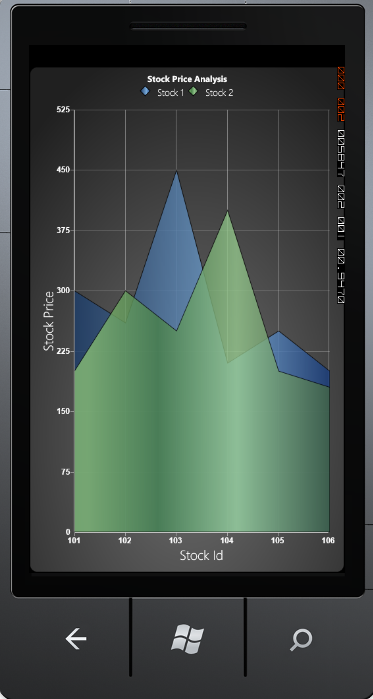

::: {style="DISPLAY: none"}
{#d2h_url_template}{#d2h_package_url style="WIDTH: 0px; DISPLAY: none; HEIGHT: 0px"}
:::

:::::: {.d2h_secondary_topic style="PADDING-BOTTOM: 10pt; MARGIN: 0pt; PADDING-LEFT: 0pt; PADDING-RIGHT: 0pt; PADDING-TOP: 0pt"}
#### Legend ICON {#legend-icon style="tab-stops: 0pt"}

[]{style="COLOR: #15428b"} 

Essential Chart allows you to customize the legend icon of a chart. You can change the legend Icon of a chart legend by using the options provided. The legend icons can be represented in two ways namely:

[]{style="COLOR: #15428b"} 

[·      ]{style="FONT-FAMILY: Symbol"}It can be set as a symbol

[·      ]{style="FONT-FAMILY: Symbol"}It can be set as the chart icon (in case of chart series)

[]{style="COLOR: #15428b"} 

The LegendIcon property is used to set the required icon.

[]{style="COLOR: #15428b"} 

[·      ]{style="FONT-FAMILY: Symbol"}If LegendIcon property is set to a symbol, it will be displayed as the selected legend icon.

[·      ]{style="FONT-FAMILY: Symbol"}If LegendIcon property is set to the SeriesType, the corresponding chart icon will be displayed as a legend icon.

[]{style="COLOR: #15428b"} 

Properties

[]{style="COLOR: #15428b"} 

The following table provides more information on the property used.

[]{style="COLOR: #15428b"} 

::: {align="center"}
  ------------ ----------------------------------------------------------------- ------------ -----------------------
  Property     Description                                                       Type         Value Returned
  LegendIcon   The legend icon is displayed according to the option selected.    Dependency   Enum(ChartLegendIcon)
  ------------ ----------------------------------------------------------------- ------------ -----------------------
:::

[]{style="COLOR: #15428b"} 

Events

[]{style="COLOR: #15428b"} 

The following table provides more information on the event used.

[]{style="COLOR: #15428b"} 

::: {align="center"}
  ------------------- ------------------------------------------------------------------------------------- --------------------- -------------------------------------------------------------------------
  Event               Event Trigger                                                                         Event Args            Purpose
  LegendIconChanged   The event is triggered by calling a method when the value of LegendIcon is changed.   OnLegendIconChanged   The Icon is changed whenever the value for LegendIcon property changes.
  ------------------- ------------------------------------------------------------------------------------- --------------------- -------------------------------------------------------------------------
:::

[]{style="COLOR: #15428b"} 

Methods

[]{style="COLOR: #15428b"} 

The following table provides more information on the method used.

[]{style="COLOR: #15428b"} 

::: {align="center"}
  ------------------ ------------- ------------- --------------------------------------------
  Method             Parameters    Return Type   Description
  UpdateLegendIcon   ChartSeries   Void          Update of the legend icon with a new icon.
  ------------------ ------------- ------------- --------------------------------------------
:::

[]{style="COLOR: #15428b"} 

Customizing Legend Icon

[]{style="COLOR: #15428b"} 

The legend icon can be customized by using the following code snippets.

[]{style="COLOR: #15428b"} 

+-----------------------------------------------------------------------------------------------------------------------------------------------------------------------------------------------------------------------------------------------------------------------------------------------------------------------------------------------------------------------------------------------------------------------------------------------------------------------------------------------------------------------------------------------------------------------------------------------------------------------------------------------------------------------------------------------------------------------------------------------------------------------------------------+
| [\[XAML\]]{style="FONT-FAMILY: 'Courier New'"}                                                                                                                                                                                                                                                                                                                                                                                                                                                                                                                                                                                                                                                                                                                                          |
|                                                                                                                                                                                                                                                                                                                                                                                                                                                                                                                                                                                                                                                                                                                                                                                         |
| []{style="FONT-FAMILY: 'Courier New'; COLOR: blue"}                                                                                                                                                                                                                                                                                                                                                                                                                                                                                                                                                                                                                                                                                                                                     |
|                                                                                                                                                                                                                                                                                                                                                                                                                                                                                                                                                                                                                                                                                                                                                                                         |
| [\<]{style="FONT-FAMILY: 'Courier New'; COLOR: blue"}[syncfusion]{style="FONT-FAMILY: 'Courier New'; COLOR: #a31515"}[:]{style="FONT-FAMILY: 'Courier New'; COLOR: blue"}[ChartLegend]{style="FONT-FAMILY: 'Courier New'; COLOR: #a31515"}[ Name]{style="FONT-FAMILY: 'Courier New'; COLOR: red"}[=\"chrtlgnd\"]{style="FONT-FAMILY: 'Courier New'; COLOR: blue"}[ [BorderThickness]{style="COLOR: red"}[=\"0.5\" \>\</]{style="COLOR: blue"}[syncfusion]{style="COLOR: #a31515"}[:]{style="COLOR: blue"}[ChartLegend]{style="COLOR: #a31515"}[\>]{style="COLOR: blue"}]{style="FONT-FAMILY: 'Courier New'"}                                                                                                                                                                            |
|                                                                                                                                                                                                                                                                                                                                                                                                                                                                                                                                                                                                                                                                                                                                                                                         |
| [\<]{style="FONT-FAMILY: 'Courier New'; COLOR: blue"}[syncfusion]{style="FONT-FAMILY: 'Courier New'; COLOR: #a31515"}[:]{style="FONT-FAMILY: 'Courier New'; COLOR: blue"}[ChartSeries]{style="FONT-FAMILY: 'Courier New'; COLOR: #a31515"}[ Name]{style="FONT-FAMILY: 'Courier New'; COLOR: red"}[=\"SeriesA\"]{style="FONT-FAMILY: 'Courier New'; COLOR: blue"}[ LegendIcon]{style="FONT-FAMILY: 'Courier New'; COLOR: red"}[=\"Circle\"]{style="FONT-FAMILY: 'Courier New'; COLOR: blue"}[ Type]{style="FONT-FAMILY: 'Courier New'; COLOR: red"}[=\"Bar\"]{style="FONT-FAMILY: 'Courier New'; COLOR: blue"}[ BindingPathX]{style="FONT-FAMILY: 'Courier New'; COLOR: red"}[=\"FruitName\"]{style="FONT-FAMILY: 'Courier New'; COLOR: blue"}                                           |
|                                                                                                                                                                                                                                                                                                                                                                                                                                                                                                                                                                                                                                                                                                                                                                                         |
| [BindingPathsY]{style="FONT-FAMILY: 'Courier New'; COLOR: red"}[=\"Price,NumberOfFruits,FruitID,Year\"]{style="FONT-FAMILY: 'Courier New'; COLOR: blue"}[ Label]{style="FONT-FAMILY: 'Courier New'; COLOR: red"}[=\"Series A\"]{style="FONT-FAMILY: 'Courier New'; COLOR: blue"}[ Stroke]{style="FONT-FAMILY: 'Courier New'; COLOR: red"}[=\"#FF000000\"]{style="FONT-FAMILY: 'Courier New'; COLOR: blue"}[ StrokeThickness]{style="FONT-FAMILY: 'Courier New'; COLOR: red"}[=\"0.5\" \>\</]{style="FONT-FAMILY: 'Courier New'; COLOR: blue"}[syncfusion]{style="FONT-FAMILY: 'Courier New'; COLOR: #a31515"}[:]{style="FONT-FAMILY: 'Courier New'; COLOR: blue"}[ChartSeries]{style="FONT-FAMILY: 'Courier New'; COLOR: #a31515"}[\>]{style="FONT-FAMILY: 'Courier New'; COLOR: blue"} |
+-----------------------------------------------------------------------------------------------------------------------------------------------------------------------------------------------------------------------------------------------------------------------------------------------------------------------------------------------------------------------------------------------------------------------------------------------------------------------------------------------------------------------------------------------------------------------------------------------------------------------------------------------------------------------------------------------------------------------------------------------------------------------------------------+

[]{style="COLOR: #15428b"} 

+----------------------------------------------------------------------------------------------------------+
| [\[C#\]]{style="FONT-FAMILY: 'Courier New'"}                                                             |
|                                                                                                          |
| []{style="FONT-FAMILY: 'Courier New'; COLOR: blue"}                                                      |
|                                                                                                          |
| [Chart1.Areas\[0\].Series\[0\].LegendIcon = ChartLegendIcon.Circle;]{style="FONT-FAMILY: 'Courier New'"} |
+----------------------------------------------------------------------------------------------------------+

[]{style="COLOR: #15428b"} 

Run the code. The following output is displayed.

[]{style="COLOR: #15428b"} 

{border="0"}

 

Figure 106 : Chart Legend Icon Changed[]{style="COLOR: #15428b"}

[]{style="COLOR: #15428b"} 

[]{#related-topics}
::::::
