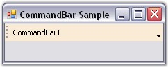

::: {style="DISPLAY: none"}
{#d2h_url_template}{#d2h_package_url style="WIDTH: 0px; DISPLAY: none; HEIGHT: 0px"}
:::

::::: {.d2h_secondary_topic style="PADDING-BOTTOM: 10pt; MARGIN: 0pt; PADDING-LEFT: 0pt; PADDING-RIGHT: 0pt; PADDING-TOP: 0pt"}
##### Length and Height Settings {#length-and-height-settings style="tab-stops: 0pt"}

[]{style="COLOR: #15428b"} 

The[ ]{style="COLOR: black"}properties that define the dimensions for the CommandBar are given below. During design time, the control\'s size can be changed by editing these property values.

[]{style="COLOR: #15428b"} 

::: {align="center"}
  --------------------- -------------------------------------------------------------------------------------------------------
  CommandBar Property   Description
  MaxLength             Gets / sets the maximum linear dimension of the CommandBar.
  MinLength             Gets / sets the minimum linear dimension of the CommandBar.
  OccupyFullRow         Indicates whether the CommandBar should occupy the entire row when docked.
  MinHeight             Gets / sets the ideal lateral dimension of the CommandBar.
  IntegralHeight        Gets / sets the incremental step by which the CommandBar\'s lateral dimension increases when wrapped.
  --------------------- -------------------------------------------------------------------------------------------------------
:::

[]{style="COLOR: #15428b"} 

+--------------------------------------------------------------------------------------------------------------------------------------------------------+
| **[\[C#\]]{style="FONT-FAMILY: 'Courier New'; COLOR: black"}**                                                                                         |
|                                                                                                                                                        |
| []{style="FONT-FAMILY: 'Courier New'; COLOR: black"}                                                                                                   |
|                                                                                                                                                        |
| [this]{style="FONT-FAMILY: 'Courier New'; COLOR: blue"}[.commandBar1.MaxLength = 201;]{style="FONT-FAMILY: 'Courier New'"}                             |
|                                                                                                                                                        |
| [this]{style="FONT-FAMILY: 'Courier New'; COLOR: blue"}[.commandBar1.MinLength = 51;]{style="FONT-FAMILY: 'Courier New'"}                              |
|                                                                                                                                                        |
| [this]{style="FONT-FAMILY: 'Courier New'; COLOR: blue"}[.commandBar1.OccupyFullRow = [true]{style="COLOR: blue"};]{style="FONT-FAMILY: 'Courier New'"} |
|                                                                                                                                                        |
| [this]{style="FONT-FAMILY: 'Courier New'; COLOR: blue"}[.commandBar1.MinHeight = 27;]{style="FONT-FAMILY: 'Courier New'"}                              |
|                                                                                                                                                        |
| [this]{style="FONT-FAMILY: 'Courier New'; COLOR: blue"}[.commandBar1.IntegralHeight = 2;]{style="FONT-FAMILY: 'Courier New'"}                          |
+--------------------------------------------------------------------------------------------------------------------------------------------------------+

[]{style="COLOR: #15428b"} 

+-----------------------------------------------------------------------------------------------------------------------------------------------------+
| **[\[VB.NET\]]{style="FONT-FAMILY: 'Courier New'; COLOR: black"}**                                                                                  |
|                                                                                                                                                     |
| []{style="FONT-FAMILY: 'Courier New'; COLOR: black"}                                                                                                |
|                                                                                                                                                     |
| [Me]{style="FONT-FAMILY: 'Courier New'; COLOR: blue"}[.commandBar1.MaxLength = 201]{style="FONT-FAMILY: 'Courier New'"}                             |
|                                                                                                                                                     |
| [Me]{style="FONT-FAMILY: 'Courier New'; COLOR: blue"}[.commandBar1.MinLength = 51]{style="FONT-FAMILY: 'Courier New'"}                              |
|                                                                                                                                                     |
| [Me]{style="FONT-FAMILY: 'Courier New'; COLOR: blue"}[.commandBar1.OccupyFullRow = [True]{style="COLOR: blue"}]{style="FONT-FAMILY: 'Courier New'"} |
|                                                                                                                                                     |
| [Me]{style="FONT-FAMILY: 'Courier New'; COLOR: blue"}[.commandBar1.MinHeight = 27]{style="FONT-FAMILY: 'Courier New'"}                              |
|                                                                                                                                                     |
| [Me]{style="FONT-FAMILY: 'Courier New'; COLOR: blue"}[.commandBar1.IntegralHeight = 2]{style="FONT-FAMILY: 'Courier New'"}                          |
+-----------------------------------------------------------------------------------------------------------------------------------------------------+

[]{style="COLOR: #15428b"} 

{border="0"}

[]{style="COLOR: #15428b"} 

Figure 30: CommandBar with OccupyFullRow property set to \"True\"

[]{style="COLOR: #15428b"} 

The method associated with the above properties is given below.

[]{style="FONT-SIZE: 8pt"} 

::: {align="center"}
  ------------------------- -----------------------------------------------------------------------------
  Method                    Description
  CalcCommandBarMaxLength   Calculates the CommandBar\'s maximum length for the specified client width.
  ------------------------- -----------------------------------------------------------------------------
:::

[]{style="COLOR: #15428b"} 

See Also

[]{style="COLOR: #15428b"} 

[Interactive Features]{.UGHyperlink}[, ]{.UGHyperlink}[Themes And Visual Styles]{.UGHyperlink}[]{.UGHyperlink}

[]{#related-topics}
:::::
