::: {style="DISPLAY: none"}
{#d2h_url_template}{#d2h_package_url style="WIDTH: 0px; DISPLAY: none; HEIGHT: 0px"}
:::

::: {.d2h_secondary_topic style="PADDING-BOTTOM: 10pt; MARGIN: 0pt; PADDING-LEFT: 0pt; PADDING-RIGHT: 0pt; PADDING-TOP: 0pt"}
#### Lesson: Using ScheduleControl {#lesson-using-schedulecontrol style="tab-stops: 0pt"}

[]{style="FONT-FAMILY: 'Trebuchet MS','sans-serif'; COLOR: #15428b; FONT-SIZE: 9pt"} 

1.   From Visual Studio, go to the **File** menu, select **New** and then click **Project**, to create a new Windows Application named ScheduleSample.

[]{style="FONT-FAMILY: 'Trebuchet MS','sans-serif'; COLOR: #15428b; FONT-SIZE: 9pt"} 

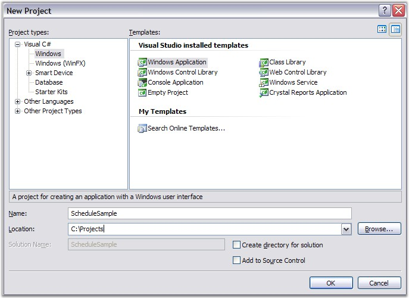{border="0"}

[]{style="FONT-FAMILY: 'Trebuchet MS','sans-serif'; COLOR: #15428b; FONT-SIZE: 9pt"} 

Figure 15: Creating a new Windows Application

[]{style="FONT-FAMILY: 'Trebuchet MS','sans-serif'; COLOR: #15428b; FONT-SIZE: 9pt"} 

[]{style="FONT-FAMILY: 'Trebuchet MS','sans-serif'; COLOR: #15428b; FONT-SIZE: 9pt"} 

2.   When the Visual Studio Designer opens, drag the **ScheduleControl** from the Syncfusion Tab onto the Form.

[]{style="FONT-FAMILY: 'Trebuchet MS','sans-serif'; COLOR: #15428b; FONT-SIZE: 9pt"} 

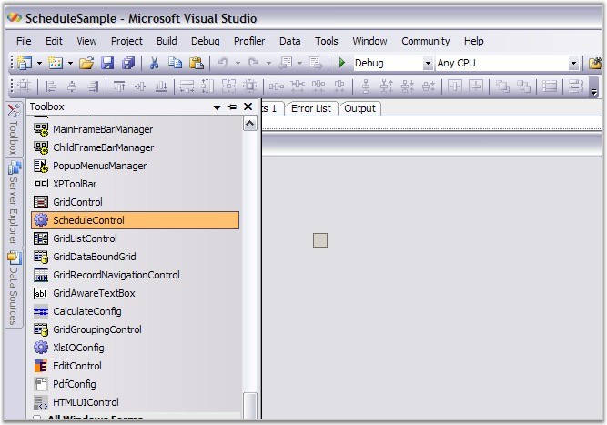{border="0"}

[]{style="FONT-FAMILY: 'Trebuchet MS','sans-serif'; COLOR: #15428b; FONT-SIZE: 9pt"} 

Figure 16: Dragging a ScheduleControl onto the Form

[]{style="FONT-FAMILY: 'Trebuchet MS','sans-serif'; COLOR: #15428b; FONT-SIZE: 9pt"} 

[]{style="FONT-FAMILY: 'Trebuchet MS','sans-serif'; COLOR: #15428b; FONT-SIZE: 9pt"} 

3.   The ScheduleControl will show on the design surface. Below is a typical display of this. Notice the **Appearance** property in the property grid. This is the object that has many properties that affect the appearance of the ScheduleControl.

[]{style="FONT-FAMILY: 'Trebuchet MS','sans-serif'; COLOR: #15428b; FONT-SIZE: 9pt"} 

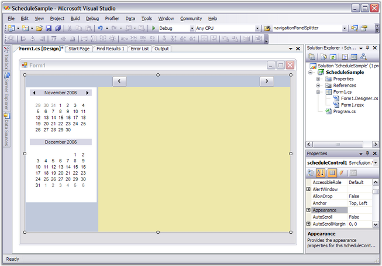{border="0"}

[]{style="FONT-FAMILY: 'Trebuchet MS','sans-serif'; COLOR: #15428b; FONT-SIZE: 9pt"} 

Figure 17: The ScheduleControl on the Design Surface

[]{style="FONT-FAMILY: 'Trebuchet MS','sans-serif'; COLOR: #15428b; FONT-SIZE: 9pt"} 

[]{style="FONT-FAMILY: 'Trebuchet MS','sans-serif'; COLOR: #15428b; FONT-SIZE: 9pt"} 

4.   Add a **Form1_Load handler** to the **Form1.cs** file by double-clicking on the **Form** that is not covered by the **ScheduleControl**. This should display a code window showing code like this.

[]{style="FONT-FAMILY: 'Trebuchet MS','sans-serif'; COLOR: #15428b; FONT-SIZE: 9pt"} 

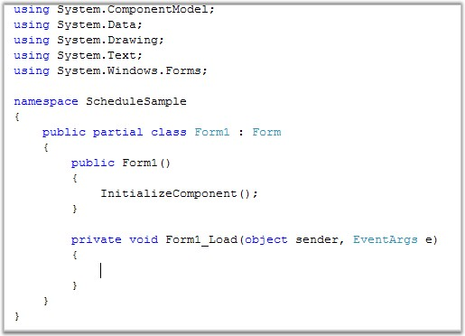{border="0"}

[]{style="FONT-FAMILY: 'Trebuchet MS','sans-serif'; COLOR: #15428b; FONT-SIZE: 9pt"} 

Figure 18: Empty Form1_Load method added by double-clicking the Form in the Designer

[]{style="FONT-FAMILY: 'Trebuchet MS','sans-serif'; COLOR: #15428b; FONT-SIZE: 9pt"} 

5.   Now add an existing file to this project, SimpleScheduleDataProvider.cs (or impleScheduleDataProvider.vb if you are using VB.NET).

This file defines several classes that implement the interfaces that the ScheduleControl needs to manage the data associated with the appointments that will appear in the calendar.

These interfaces are discussed in detail later in this UserGuide.

For now, just use the implementation provided in the SimpleScheduleDataProvider.cs file. This file ships as part of the ***\\Syncfusion\\Essential Studio\\5.x.x.x\\Windows\\Schedule.Windows\\ Samples\\2.0\\ScheduleSample*** sample.

Drill down to this folder, and add this file to your project by using the Solution Explorer window as shown here.

[]{style="FONT-FAMILY: 'Trebuchet MS','sans-serif'; COLOR: #15428b; FONT-SIZE: 9pt"} 

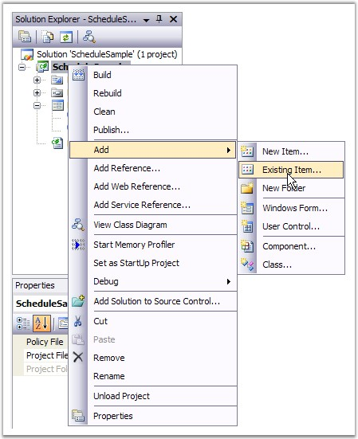{border="0"}

[]{style="FONT-FAMILY: 'Trebuchet MS','sans-serif'; COLOR: #15428b; FONT-SIZE: 9pt"} 

Figure 19: Menu selection showing how to add an existing file to the Project

[]{style="FONT-FAMILY: 'Trebuchet MS','sans-serif'; COLOR: #15428b; FONT-SIZE: 9pt"} 

[]{style="FONT-FAMILY: 'Trebuchet MS','sans-serif'; COLOR: #15428b; FONT-SIZE: 9pt"} 

6.   Here, you can find the SimpleScheduleDataProvider.cs file in the ***\\Syncfusion\\Essential Studio\\5.x.x.x\\Windows\\Schedule.Windows\\ Samples\\ 2.0\\ScheduleSample\\CS*** folder. Drill down to this folder and add this file to our project.

[]{style="FONT-FAMILY: 'Trebuchet MS','sans-serif'; COLOR: #15428b; FONT-SIZE: 9pt"} 

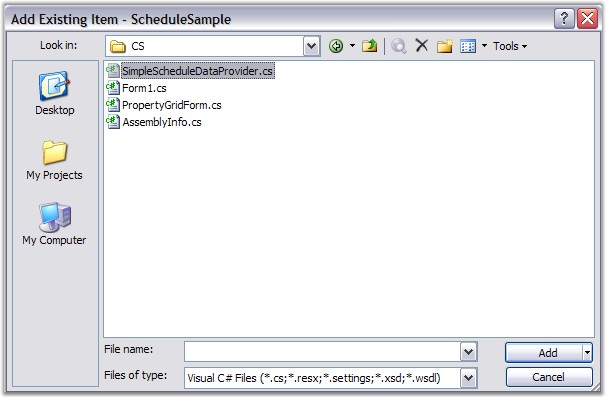{border="0"}

[]{style="FONT-FAMILY: 'Trebuchet MS','sans-serif'; COLOR: #15428b; FONT-SIZE: 9pt"} 

Figure 20: Adding the SimpleScheduleDataProvider.cs file to the Project

[]{style="FONT-FAMILY: 'Trebuchet MS','sans-serif'; COLOR: #15428b; FONT-SIZE: 9pt"} 

7.   After adding the file containing our **SimpleScheduleDataProvider.cs** code, add some code to your **Form.cs** to provide data support to your ScheduleControl.

i.    The first thing to do is to add a using statement to allow us to reference the class names in the SimpleScheduleDataProvider.cs file without adding the Namespace used in that file.

The other is added in the **Form_Load** code to hook up the data support.

ii.    In the Form_Load, create an instance of the DataProvider and a MasterList to hold the data.

iii.   Then set some properties to provide a filename, the **ScheduleViewType** for the initial display and the **DataSource** property for your ScheduleControl.

iv.   Copy this code to your Form1.cs file. (If you are not using the 2.0 FrameWork, remove the partial keyword.)

[]{style="FONT-FAMILY: 'Trebuchet MS','sans-serif'; COLOR: #15428b; FONT-SIZE: 9pt"} 

[]{style="FONT-FAMILY: 'Trebuchet MS','sans-serif'; COLOR: #15428b; FONT-SIZE: 9pt"} 

+------------------------------------------------------------------------------------------------------------------------------------------------------------------------------------------------------------------------+
| **[\[C#\]]{style="FONT-FAMILY: 'Courier New'; COLOR: black"}**                                                                                                                                                         |
|                                                                                                                                                                                                                        |
| []{style="FONT-FAMILY: 'Courier New'; COLOR: black"}                                                                                                                                                                   |
|                                                                                                                                                                                                                        |
| [using]{style="FONT-FAMILY: 'Courier New'; COLOR: blue"}[ System;]{style="FONT-FAMILY: 'Courier New'"}                                                                                                                 |
|                                                                                                                                                                                                                        |
| [using]{style="FONT-FAMILY: 'Courier New'; COLOR: blue"}[ System.Collections.Generic;]{style="FONT-FAMILY: 'Courier New'"}                                                                                             |
|                                                                                                                                                                                                                        |
| [using]{style="FONT-FAMILY: 'Courier New'; COLOR: blue"}[ System.ComponentModel;]{style="FONT-FAMILY: 'Courier New'"}                                                                                                  |
|                                                                                                                                                                                                                        |
| [using]{style="FONT-FAMILY: 'Courier New'; COLOR: blue"}[ System.Data;]{style="FONT-FAMILY: 'Courier New'"}                                                                                                            |
|                                                                                                                                                                                                                        |
| [using]{style="FONT-FAMILY: 'Courier New'; COLOR: blue"}[ System.Drawing;]{style="FONT-FAMILY: 'Courier New'"}                                                                                                         |
|                                                                                                                                                                                                                        |
| [using]{style="FONT-FAMILY: 'Courier New'; COLOR: blue"}[ System.Text;]{style="FONT-FAMILY: 'Courier New'"}                                                                                                            |
|                                                                                                                                                                                                                        |
| [using]{style="FONT-FAMILY: 'Courier New'; COLOR: blue"}[ System.Windows.Forms;]{style="FONT-FAMILY: 'Courier New'"}                                                                                                   |
|                                                                                                                                                                                                                        |
| [using]{style="FONT-FAMILY: 'Courier New'; COLOR: blue"}[ Syncfusion.Windows.Forms.Schedule;]{style="FONT-FAMILY: 'Courier New'"}                                                                                      |
|                                                                                                                                                                                                                        |
| [using]{style="FONT-FAMILY: 'Courier New'; COLOR: blue"}[ GridScheduleSample;]{style="FONT-FAMILY: 'Courier New'"}                                                                                                     |
|                                                                                                                                                                                                                        |
| []{style="FONT-FAMILY: 'Courier New'"}                                                                                                                                                                                 |
|                                                                                                                                                                                                                        |
| [namespace]{style="FONT-FAMILY: 'Courier New'; COLOR: blue"}[ ScheduleSample]{style="FONT-FAMILY: 'Courier New'"}                                                                                                      |
|                                                                                                                                                                                                                        |
| [{]{style="FONT-FAMILY: 'Courier New'"}                                                                                                                                                                                |
|                                                                                                                                                                                                                        |
| [public]{style="FONT-FAMILY: 'Courier New'; COLOR: blue"}[ [partial]{style="COLOR: blue"} [class]{style="COLOR: blue"} [Form1]{style="COLOR: teal"} : [Form]{style="COLOR: teal"}]{style="FONT-FAMILY: 'Courier New'"} |
|                                                                                                                                                                                                                        |
| [{]{style="FONT-FAMILY: 'Courier New'"}                                                                                                                                                                                |
|                                                                                                                                                                                                                        |
| [public]{style="FONT-FAMILY: 'Courier New'; COLOR: blue"}[ Form1()]{style="FONT-FAMILY: 'Courier New'"}                                                                                                                |
|                                                                                                                                                                                                                        |
| [{]{style="FONT-FAMILY: 'Courier New'"}                                                                                                                                                                                |
|                                                                                                                                                                                                                        |
| [InitializeComponent();]{style="FONT-FAMILY: 'Courier New'"}                                                                                                                                                           |
|                                                                                                                                                                                                                        |
| [}]{style="FONT-FAMILY: 'Courier New'"}                                                                                                                                                                                |
|                                                                                                                                                                                                                        |
| []{style="FONT-FAMILY: 'Courier New'"}                                                                                                                                                                                 |
|                                                                                                                                                                                                                        |
| [private]{style="FONT-FAMILY: 'Courier New'; COLOR: blue"}[ [void]{style="COLOR: blue"} Form1_Load([object]{style="COLOR: blue"} sender, [EventArgs]{style="COLOR: teal"} e)]{style="FONT-FAMILY: 'Courier New'"}      |
|                                                                                                                                                                                                                        |
| [{]{style="FONT-FAMILY: 'Courier New'"}                                                                                                                                                                                |
|                                                                                                                                                                                                                        |
| [SimpleScheduleDataProvider]{style="FONT-FAMILY: 'Courier New'; COLOR: teal"}[ data = [new]{style="COLOR: blue"} [SimpleScheduleDataProvider]{style="COLOR: teal"}();]{style="FONT-FAMILY: 'Courier New'"}             |
|                                                                                                                                                                                                                        |
| [data.MasterList = [new]{style="COLOR: blue"} SimpleScheduleItemList();]{style="FONT-FAMILY: 'Courier New'"}                                                                                                           |
|                                                                                                                                                                                                                        |
| [data.FileName = [\"default.schedule\"]{style="COLOR: maroon"};]{style="FONT-FAMILY: 'Courier New'"}                                                                                                                   |
|                                                                                                                                                                                                                        |
| [this]{style="FONT-FAMILY: 'Courier New'; COLOR: blue"}[.scheduleControl1.ScheduleType = [ScheduleViewType]{style="COLOR: teal"}.Month;]{style="FONT-FAMILY: 'Courier New'"}                                           |
|                                                                                                                                                                                                                        |
| [this]{style="FONT-FAMILY: 'Courier New'; COLOR: blue"}[.scheduleControl1.DataSource = data;]{style="FONT-FAMILY: 'Courier New'"}                                                                                      |
|                                                                                                                                                                                                                        |
| [}]{style="FONT-FAMILY: 'Courier New'"}                                                                                                                                                                                |
|                                                                                                                                                                                                                        |
| [}]{style="FONT-FAMILY: 'Courier New'"}                                                                                                                                                                                |
|                                                                                                                                                                                                                        |
| [}]{style="FONT-FAMILY: 'Courier New'"}                                                                                                                                                                                |
+------------------------------------------------------------------------------------------------------------------------------------------------------------------------------------------------------------------------+

**[]{style="FONT-FAMILY: 'Trebuchet MS','sans-serif'; COLOR: #15428b; FONT-SIZE: 9pt"}** 

**[]{style="FONT-FAMILY: 'Trebuchet MS','sans-serif'; COLOR: #15428b; FONT-SIZE: 9pt"}** 

8.   Now press **F5** key to compile and run your application. A screen similar to this one should appear.

[]{style="FONT-FAMILY: 'Trebuchet MS','sans-serif'; COLOR: #15428b; FONT-SIZE: 9pt"} 

[]{style="FONT-FAMILY: 'Trebuchet MS','sans-serif'; COLOR: #15428b; FONT-SIZE: 9pt"} 

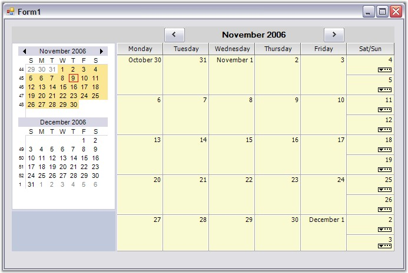{border="0"}

[]{style="FONT-FAMILY: 'Trebuchet MS','sans-serif'; COLOR: #15428b; FONT-SIZE: 9pt"} 

Figure 21: A Month View Schedule displayed in the Sample Application

[]{style="FONT-FAMILY: 'Trebuchet MS','sans-serif'; COLOR: #15428b; FONT-SIZE: 9pt"} 

[]{style="FONT-FAMILY: 'Trebuchet MS','sans-serif'; COLOR: #15428b; FONT-SIZE: 9pt"} 

9.   To change the Month view to a Day view, right-click the ScheduleGrid area of the ScheduleControl to display a ContextMenu and select **Day**.

[]{style="FONT-FAMILY: 'Trebuchet MS','sans-serif'; COLOR: #15428b; FONT-SIZE: 9pt"} 

[]{style="FONT-FAMILY: 'Trebuchet MS','sans-serif'; COLOR: #15428b; FONT-SIZE: 9pt"} 

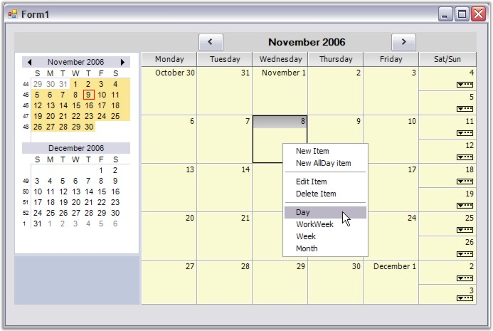{border="0"}

[]{style="FONT-FAMILY: 'Trebuchet MS','sans-serif'; COLOR: #15428b; FONT-SIZE: 9pt"} 

Figure 22: Using the ContextMenu to change the ScheduleViewType

[]{style="FONT-FAMILY: 'Trebuchet MS','sans-serif'; COLOR: #15428b; FONT-SIZE: 9pt"} 

[]{style="FONT-FAMILY: 'Trebuchet MS','sans-serif'; COLOR: #15428b; FONT-SIZE: 9pt"} 

10.  Here is the Day view that appears after the execution of the ContextMenu selection done in step 9.

[]{style="FONT-FAMILY: 'Trebuchet MS','sans-serif'; COLOR: #15428b; FONT-SIZE: 9pt"} 

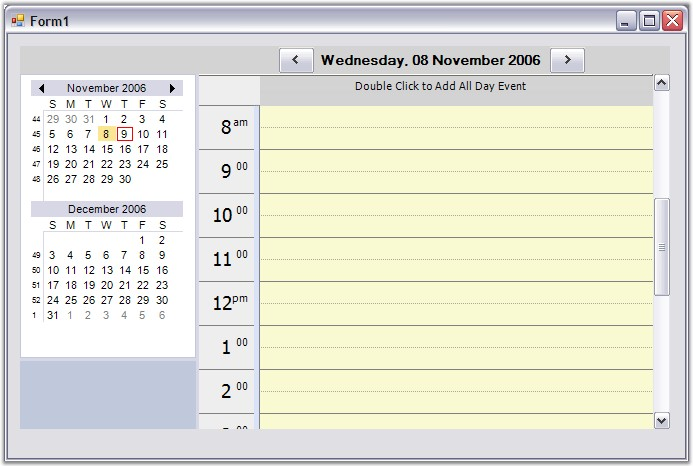{border="0"}

[]{style="FONT-FAMILY: 'Trebuchet MS','sans-serif'; COLOR: #15428b; FONT-SIZE: 9pt"} 

Figure 23: The Day view resulting from the ContextMenu

[]{style="FONT-FAMILY: 'Trebuchet MS','sans-serif'; COLOR: #15428b; FONT-SIZE: 9pt"} 

[]{style="FONT-FAMILY: 'Trebuchet MS','sans-serif'; COLOR: #15428b; FONT-SIZE: 9pt"} 

11.  Double-click one of the time slots on the ScheduleGrid in the ScheduleControl. This action will display a new appointment screen where you can enter a new schedule item as shown below.

[]{style="FONT-FAMILY: 'Trebuchet MS','sans-serif'; COLOR: #15428b; FONT-SIZE: 9pt"} 

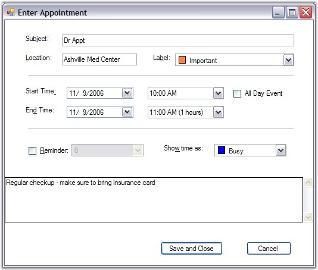{border="0"}

[]{style="FONT-FAMILY: 'Trebuchet MS','sans-serif'; COLOR: #15428b; FONT-SIZE: 9pt"} 

Figure 24: A filled-in New Appointment Screen

 

 

12.  Clicking the **Save** and **Close** button on the Appointment screen will re-display the Day view ScheduleControl with the new appointment displayed. If you hover over the appointment in the ScheduleGrid, a tooltip will display as shown below.

[]{style="FONT-FAMILY: 'Trebuchet MS','sans-serif'; COLOR: #15428b; FONT-SIZE: 9pt"} 

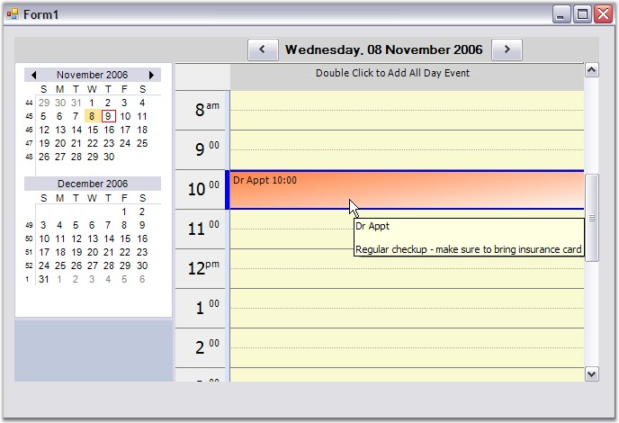{border="0"}

[]{style="FONT-FAMILY: 'Trebuchet MS','sans-serif'; COLOR: #15428b; FONT-SIZE: 9pt"} 

Figure 25: The New Appointment with a ToolTip Displayed

 

 

13.  Click the **Close** button on the form system menu on the upper-right corner of the form. Since the data has been modified in this ScheduleControl, a dialog will appear as below, asking whether you want to save these changes to a disk file. Click **Yes** to save the changes.

[]{style="FONT-FAMILY: 'Trebuchet MS','sans-serif'; COLOR: #15428b; FONT-SIZE: 9pt"} 

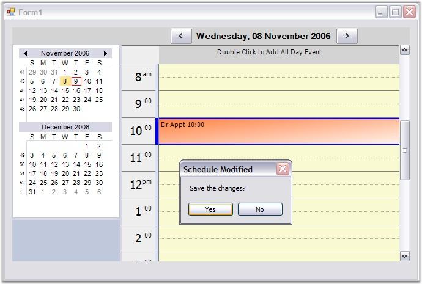{border="0"}

[]{style="FONT-FAMILY: 'Trebuchet MS','sans-serif'; COLOR: #15428b; FONT-SIZE: 9pt"} 

Figure 26: A Prompt is displayed as you try to close the Modified Form

[]{style="FONT-FAMILY: 'Trebuchet MS','sans-serif'; COLOR: #15428b; FONT-SIZE: 9pt"} 

[]{style="FONT-FAMILY: 'Trebuchet MS','sans-serif'; COLOR: #15428b; FONT-SIZE: 9pt"} 

14.  Next modify our **Form_Load** code to conditionally reload the saved data if the file is present on the disk. Here is the new code. Copy this code to your Form1.cs file. Notice that you have added a \"using\" statement to reference the System.IO namespace in addition to the new code in the Form1_Load. (If you are not using the 2.0 FrameWork, remove the partial keyword)

[]{style="FONT-FAMILY: 'Trebuchet MS','sans-serif'; COLOR: #15428b; FONT-SIZE: 9pt"} 

+------------------------------------------------------------------------------------------------------------------------------------------------------------------------------------------------------------------------+
| **[\[C#\]]{style="FONT-FAMILY: 'Courier New'; COLOR: black"}**                                                                                                                                                         |
|                                                                                                                                                                                                                        |
| []{style="FONT-FAMILY: 'Courier New'; COLOR: black"}                                                                                                                                                                   |
|                                                                                                                                                                                                                        |
| [using]{style="FONT-FAMILY: 'Courier New'; COLOR: blue"}[ System;]{style="FONT-FAMILY: 'Courier New'"}                                                                                                                 |
|                                                                                                                                                                                                                        |
| [using]{style="FONT-FAMILY: 'Courier New'; COLOR: blue"}[ System.Collections.Generic;]{style="FONT-FAMILY: 'Courier New'"}                                                                                             |
|                                                                                                                                                                                                                        |
| [using]{style="FONT-FAMILY: 'Courier New'; COLOR: blue"}[ System.ComponentModel;]{style="FONT-FAMILY: 'Courier New'"}                                                                                                  |
|                                                                                                                                                                                                                        |
| [using]{style="FONT-FAMILY: 'Courier New'; COLOR: blue"}[ System.Data;]{style="FONT-FAMILY: 'Courier New'"}                                                                                                            |
|                                                                                                                                                                                                                        |
| [using]{style="FONT-FAMILY: 'Courier New'; COLOR: blue"}[ System.Drawing;]{style="FONT-FAMILY: 'Courier New'"}                                                                                                         |
|                                                                                                                                                                                                                        |
| [using]{style="FONT-FAMILY: 'Courier New'; COLOR: blue"}[ System.Text;]{style="FONT-FAMILY: 'Courier New'"}                                                                                                            |
|                                                                                                                                                                                                                        |
| [using]{style="FONT-FAMILY: 'Courier New'; COLOR: blue"}[ System.Windows.Forms;]{style="FONT-FAMILY: 'Courier New'"}                                                                                                   |
|                                                                                                                                                                                                                        |
| [using]{style="FONT-FAMILY: 'Courier New'; COLOR: blue"}[ Syncfusion.Windows.Forms.Schedule;]{style="FONT-FAMILY: 'Courier New'"}                                                                                      |
|                                                                                                                                                                                                                        |
| [using]{style="FONT-FAMILY: 'Courier New'; COLOR: blue"}[ GridScheduleSample;]{style="FONT-FAMILY: 'Courier New'"}                                                                                                     |
|                                                                                                                                                                                                                        |
| [using]{style="FONT-FAMILY: 'Courier New'; COLOR: blue"}[ System.IO;]{style="FONT-FAMILY: 'Courier New'"}                                                                                                              |
|                                                                                                                                                                                                                        |
| []{style="FONT-FAMILY: 'Courier New'; COLOR: black"}                                                                                                                                                                   |
|                                                                                                                                                                                                                        |
| [namespace]{style="FONT-FAMILY: 'Courier New'; COLOR: blue"}[ ScheduleSample]{style="FONT-FAMILY: 'Courier New'"}                                                                                                      |
|                                                                                                                                                                                                                        |
| [{]{style="FONT-FAMILY: 'Courier New'"}                                                                                                                                                                                |
|                                                                                                                                                                                                                        |
| [public]{style="FONT-FAMILY: 'Courier New'; COLOR: blue"}[ [partial]{style="COLOR: blue"} [class]{style="COLOR: blue"} [Form1]{style="COLOR: teal"} : [Form]{style="COLOR: teal"}]{style="FONT-FAMILY: 'Courier New'"} |
|                                                                                                                                                                                                                        |
| [{]{style="FONT-FAMILY: 'Courier New'"}                                                                                                                                                                                |
|                                                                                                                                                                                                                        |
| [    [public]{style="COLOR: blue"} Form1()]{style="FONT-FAMILY: 'Courier New'"}                                                                                                                                        |
|                                                                                                                                                                                                                        |
| [    {]{style="FONT-FAMILY: 'Courier New'"}                                                                                                                                                                            |
|                                                                                                                                                                                                                        |
| [        InitializeComponent();]{style="FONT-FAMILY: 'Courier New'"}                                                                                                                                                   |
|                                                                                                                                                                                                                        |
| [    }]{style="FONT-FAMILY: 'Courier New'"}                                                                                                                                                                            |
|                                                                                                                                                                                                                        |
| []{style="FONT-FAMILY: 'Courier New'"}                                                                                                                                                                                 |
|                                                                                                                                                                                                                        |
| [    [private]{style="COLOR: blue"} [void]{style="COLOR: blue"} Form1_Load([object]{style="COLOR: blue"} sender, [EventArgs]{style="COLOR: teal"} e)]{style="FONT-FAMILY: 'Courier New'"}                              |
|                                                                                                                                                                                                                        |
| [    {]{style="FONT-FAMILY: 'Courier New'"}                                                                                                                                                                            |
|                                                                                                                                                                                                                        |
| [        [SimpleScheduleDataProvider]{style="COLOR: teal"} data;]{style="FONT-FAMILY: 'Courier New'"}                                                                                                                  |
|                                                                                                                                                                                                                        |
| [        [if]{style="COLOR: blue"} ([File]{style="COLOR: teal"}.Exists([\"default.schedule\"]{style="COLOR: maroon"}))]{style="FONT-FAMILY: 'Courier New'"}                                                            |
|                                                                                                                                                                                                                        |
| [        {]{style="FONT-FAMILY: 'Courier New'"}                                                                                                                                                                        |
|                                                                                                                                                                                                                        |
| [            data = [SimpleScheduleDataProvider]{style="COLOR: teal"}.LoadBinary([\"default.schedule\"]{style="COLOR: maroon"});]{style="FONT-FAMILY: 'Courier New'"}                                                  |
|                                                                                                                                                                                                                        |
| [            data.FileName = [\"default.schedule\"]{style="COLOR: maroon"};]{style="FONT-FAMILY: 'Courier New'"}                                                                                                       |
|                                                                                                                                                                                                                        |
| [        }]{style="FONT-FAMILY: 'Courier New'"}                                                                                                                                                                        |
|                                                                                                                                                                                                                        |
| [        [else]{style="COLOR: blue"}]{style="FONT-FAMILY: 'Courier New'"}                                                                                                                                              |
|                                                                                                                                                                                                                        |
| [        {]{style="FONT-FAMILY: 'Courier New'"}                                                                                                                                                                        |
|                                                                                                                                                                                                                        |
| [            data = [new]{style="COLOR: blue"} [SimpleScheduleDataProvider]{style="COLOR: teal"}();]{style="FONT-FAMILY: 'Courier New'"}                                                                               |
|                                                                                                                                                                                                                        |
| [            data.MasterList = [new]{style="COLOR: blue"} SimpleScheduleItemList();]{style="FONT-FAMILY: 'Courier New'"}                                                                                               |
|                                                                                                                                                                                                                        |
| [            data.FileName = [\"default.schedule\"]{style="COLOR: maroon"};]{style="FONT-FAMILY: 'Courier New'"}                                                                                                       |
|                                                                                                                                                                                                                        |
| [ }]{style="FONT-FAMILY: 'Courier New'"}                                                                                                                                                                               |
|                                                                                                                                                                                                                        |
| [this]{style="FONT-FAMILY: 'Courier New'; COLOR: blue"}[.scheduleControl1.ScheduleType = [ScheduleViewType]{style="COLOR: teal"}.Month;]{style="FONT-FAMILY: 'Courier New'"}                                           |
|                                                                                                                                                                                                                        |
| [this]{style="FONT-FAMILY: 'Courier New'; COLOR: blue"}[.scheduleControl1.DataSource = data;]{style="FONT-FAMILY: 'Courier New'"}                                                                                      |
|                                                                                                                                                                                                                        |
| [}]{style="FONT-FAMILY: 'Courier New'"}                                                                                                                                                                                |
|                                                                                                                                                                                                                        |
| [}]{style="FONT-FAMILY: 'Courier New'"}                                                                                                                                                                                |
|                                                                                                                                                                                                                        |
| [}]{style="FONT-FAMILY: 'Courier New'"}                                                                                                                                                                                |
+------------------------------------------------------------------------------------------------------------------------------------------------------------------------------------------------------------------------+

[]{style="FONT-FAMILY: 'Trebuchet MS','sans-serif'; COLOR: blue; FONT-SIZE: 9pt"} 

15.  As our last step, compile and run the application again. The Month view should reappear but, this time the appointment you added earlier should appear.

[]{style="FONT-FAMILY: 'Trebuchet MS','sans-serif'; COLOR: #15428b; FONT-SIZE: 9pt"} 

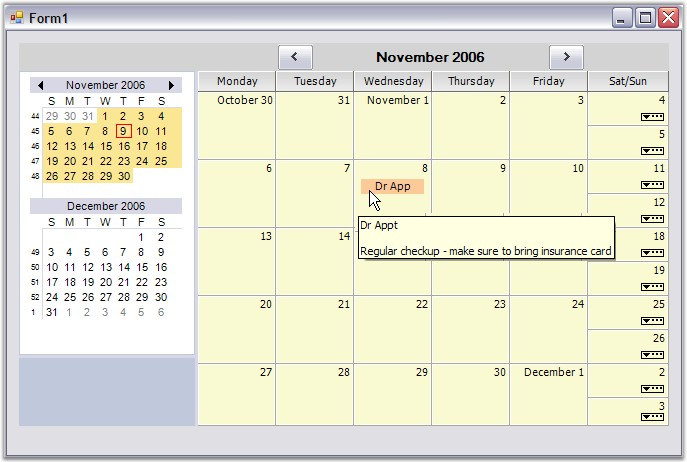{border="0"}

[]{style="FONT-FAMILY: 'Trebuchet MS','sans-serif'; COLOR: #15428b; FONT-SIZE: 9pt"} 

Figure 27: The Month View showing the previously saved Appointment

[]{#p14} 

[]{#related-topics}
:::
