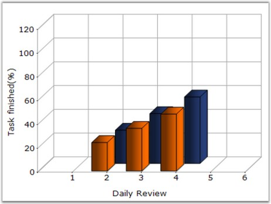
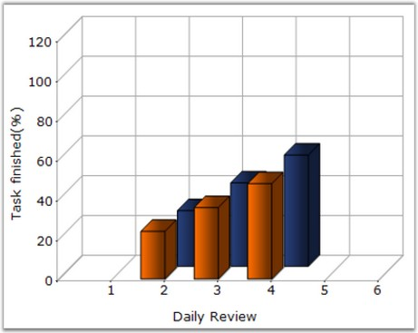

::: {style="DISPLAY: none"}
{#d2h_url_template}{#d2h_package_url style="WIDTH: 0px; DISPLAY: none; HEIGHT: 0px"}
:::

:::: {.d2h_secondary_topic style="PADDING-BOTTOM: 10pt; MARGIN: 0pt; PADDING-LEFT: 0pt; PADDING-RIGHT: 0pt; PADDING-TOP: 0pt"}
#### LightAngle {#lightangle style="tab-stops: 0pt"}

**[     ]{style="FONT-FAMILY: 'Trebuchet MS','sans-serif'; FONT-SIZE: 9pt"}**

Specifies the light angle in horizontal plane.

[]{style="COLOR: red; FONT-SIZE: 8pt"} 

::: {align="center"}
+---------------------------------------+------------------------------------------------------------------------------------------------------------------------------------------------------------------------+
| **[]{style="FONT-FAMILY: 'Trebuchet MS','sans-serif'; FONT-SIZE: 9pt"}**                                                                                                                                       |
|                                                                                                                                                                                                                |
| Details                                                                                                                                                                                                        |
+---------------------------------------+------------------------------------------------------------------------------------------------------------------------------------------------------------------------+
| Possible Values                       | Any double value                                                                                                                                                       |
+---------------------------------------+------------------------------------------------------------------------------------------------------------------------------------------------------------------------+
| Default Value                         | -0.785398163397448                                                                                                                                                     |
+---------------------------------------+------------------------------------------------------------------------------------------------------------------------------------------------------------------------+
| 2D / 3D Limitations                   | No                                                                                                                                                                     |
+---------------------------------------+------------------------------------------------------------------------------------------------------------------------------------------------------------------------+
| Applies to Chart Element              | Any Series                                                                                                                                                             |
+---------------------------------------+------------------------------------------------------------------------------------------------------------------------------------------------------------------------+
| Applies to Chart Types                | Column Charts , Bar Charts, Box and Whisker Chart, Gantt Chart, Histogram Chart, Tornado Chart, Polar and Radar Chart, Candle Chart, Hilo Chart(3D), HiloOpenClose(3D) |
+---------------------------------------+------------------------------------------------------------------------------------------------------------------------------------------------------------------------+
:::

**[]{style="FONT-FAMILY: 'Trebuchet MS','sans-serif'; FONT-SIZE: 9pt"}** 

Here is code snippet using **LightAngle** in Column Chart.

[]{style="FONT-FAMILY: 'Trebuchet MS','sans-serif'; FONT-SIZE: 9pt"} 

+----------------------------------------------------------------------------------------------------------------------------------------------------------------------------------+
| **[\[C#\]]{style="FONT-FAMILY: 'Courier New'; COLOR: black"}**                                                                                                                   |
|                                                                                                                                                                                  |
| **[]{style="FONT-FAMILY: 'Courier New'; COLOR: black"}**                                                                                                                         |
|                                                                                                                                                                                  |
| [// Specifies light angle of both the series]{style="FONT-FAMILY: 'Courier New'; COLOR: green"}                                                                                  |
|                                                                                                                                                                                  |
| [this]{style="FONT-FAMILY: 'Courier New'; COLOR: blue"}[.ChartWebControl1.Series\[0\].ConfigItems.ColumnItem.LightAngle = 45;]{style="FONT-FAMILY: 'Courier New'; COLOR: black"} |
|                                                                                                                                                                                  |
| [this]{style="FONT-FAMILY: 'Courier New'; COLOR: blue"}[.ChartWebControl1.Series\[1\].ConfigItems.ColumnItem.LightAngle = 45;]{style="FONT-FAMILY: 'Courier New'; COLOR: black"} |
+----------------------------------------------------------------------------------------------------------------------------------------------------------------------------------+

[]{style="FONT-FAMILY: 'Trebuchet MS','sans-serif'; FONT-SIZE: 9pt"} 

+-------------------------------------------------------------------------------------------------------------------------------------------------------------------------------------+
| **[\[VB.NET\]]{style="FONT-FAMILY: 'Courier New'; COLOR: black"}**                                                                                                                  |
|                                                                                                                                                                                     |
| **[]{style="FONT-FAMILY: 'Courier New'; COLOR: black"}**                                                                                                                            |
|                                                                                                                                                                                     |
| [\' Specifies light angle of both the series]{style="FONT-FAMILY: 'Courier New'; COLOR: green"}                                                                                     |
|                                                                                                                                                                                     |
| [Private Me]{style="FONT-FAMILY: 'Courier New'; COLOR: blue"}[.ChartWebControl1.Series(0).ConfigItems.ColumnItem.LightAngle =45]{style="FONT-FAMILY: 'Courier New'; COLOR: black"}  |
|                                                                                                                                                                                     |
| [Private Me]{style="FONT-FAMILY: 'Courier New'; COLOR: blue"}[.ChartWebControl1.Series(1).ConfigItems.ColumnItem.LightAngle = 45]{style="FONT-FAMILY: 'Courier New'; COLOR: black"} |
+-------------------------------------------------------------------------------------------------------------------------------------------------------------------------------------+

**[]{style="FONT-FAMILY: 'Trebuchet MS','sans-serif'; FONT-SIZE: 9pt"}** 

{border="0"}

[]{style="FONT-FAMILY: 'Trebuchet MS','sans-serif'; FONT-SIZE: 9pt"} 

Figure 154: Light Angle set to \"45\" with 3D Effect

[]{style="FONT-FAMILY: 'Trebuchet MS','sans-serif'; FONT-SIZE: 9pt"} 

{border="0"}

**[]{style="FONT-FAMILY: 'Trebuchet MS','sans-serif'; FONT-SIZE: 9pt"}** 

Figure 155: Light Angle set to \"30\" with 3D Effect

**[]{style="FONT-FAMILY: 'Trebuchet MS','sans-serif'"}** 

See Also

**[]{style="FONT-FAMILY: 'Trebuchet MS','sans-serif'; FONT-SIZE: 9pt"}** 

[Pyramid Chart]{.UGHyperlink}[, ]{.UGHyperlink}[Funnel Chart]{.UGHyperlink}[, ]{.UGHyperlink}[Area Charts]{.UGHyperlink}[, ]{.UGHyperlink}[Bar Charts]{.UGHyperlink}[, ]{.UGHyperlink}[Bubble Chart]{.UGHyperlink}[, ]{.UGHyperlink}[Column Charts]{.UGHyperlink}[, ]{.UGHyperlink}[Candle Chart]{.UGHyperlink}[, ]{.UGHyperlink}[Renko chart]{.UGHyperlink}[, ]{.UGHyperlink}[Three Line Break Chart]{.UGHyperlink}[, ]{.UGHyperlink}[Box and Whisker Chart]{.UGHyperlink}[, ]{.UGHyperlink}[Gantt Chart]{.UGHyperlink}[, ]{.UGHyperlink}[Histogram Chart]{.UGHyperlink}[, ]{.UGHyperlink}[Tornado Chart]{.UGHyperlink}[, ]{.UGHyperlink}[Polar and Radar Chart]{.UGHyperlink}[, ]{.UGHyperlink}[Pie Chart]{.UGHyperlink}[]{.UGHyperlink}

[]{#p123} 

[]{#related-topics}
::::
