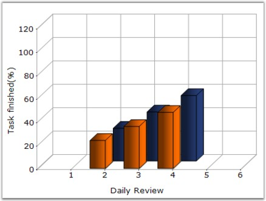
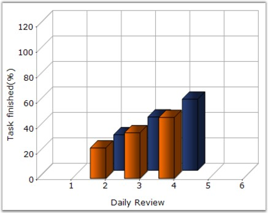

::: {style="DISPLAY: none"}
{#d2h_url_template}{#d2h_package_url style="WIDTH: 0px; DISPLAY: none; HEIGHT: 0px"}
:::

:::: {.d2h_secondary_topic style="PADDING-BOTTOM: 10pt; MARGIN: 0pt; PADDING-LEFT: 0pt; PADDING-RIGHT: 0pt; PADDING-TOP: 0pt"}
#### LightAngle {#lightangle style="tab-stops: 0pt"}

**    **

Specifies the light angle in horizontal plane.

[]{style="COLOR: red; FONT-SIZE: 8pt"} 

::: {align="center"}
+-------------------------------------+------------------------------------------------------------------------------------------------------------------------------------------------------------------------+
|                                                                                                                                                                                                              |
|                                                                                                                                                                                                              |
| Details                                                                                                                                                                                                      |
+-------------------------------------+------------------------------------------------------------------------------------------------------------------------------------------------------------------------+
| **Possible Values**                 | Any double value                                                                                                                                                       |
+-------------------------------------+------------------------------------------------------------------------------------------------------------------------------------------------------------------------+
| **Default Value    **               | **-0.785398163397448**                                                                                                                                                 |
+-------------------------------------+------------------------------------------------------------------------------------------------------------------------------------------------------------------------+
| **2D / 3D Limitations**             | No                                                                                                                                                                     |
+-------------------------------------+------------------------------------------------------------------------------------------------------------------------------------------------------------------------+
| **Applies to Chart Element**        | Any Series                                                                                                                                                             |
+-------------------------------------+------------------------------------------------------------------------------------------------------------------------------------------------------------------------+
| **Applies to Chart Types**          | Column Charts , Bar Charts, Box and Whisker Chart, Gantt Chart, Histogram Chart, Tornado Chart, Polar and Radar Chart, Candle Chart, Hilo Chart(3D), HiloOpenClose(3D) |
+-------------------------------------+------------------------------------------------------------------------------------------------------------------------------------------------------------------------+
:::

 

Here is code snippet using **LightAngle** in Column Chart.

 

+-------------------------------------------------------------------------------------------------------------------------------------------------------------------------------+
| **[\[C#\]]{style="FONT-FAMILY: 'Courier New'; COLOR: black"}**                                                                                                                |
|                                                                                                                                                                               |
| **[]{style="FONT-FAMILY: 'Courier New'; COLOR: black"}**                                                                                                                      |
|                                                                                                                                                                               |
| [// Specifies light angle of both the series]{style="FONT-FAMILY: 'Courier New'; COLOR: green"}                                                                               |
|                                                                                                                                                                               |
| [this]{style="FONT-FAMILY: 'Courier New'; COLOR: blue"}[.chartControl1.Series\[0\].ConfigItems.ColumnItem.LightAngle = 45;]{style="FONT-FAMILY: 'Courier New'; COLOR: black"} |
|                                                                                                                                                                               |
| [this]{style="FONT-FAMILY: 'Courier New'; COLOR: blue"}[.chartControl1.Series\[1\].ConfigItems.ColumnItem.LightAngle = 45;]{style="FONT-FAMILY: 'Courier New'; COLOR: black"} |
+-------------------------------------------------------------------------------------------------------------------------------------------------------------------------------+

 

+----------------------------------------------------------------------------------------------------------------------------------------------------------------------------------+
| **[\[VB.NET\]]{style="FONT-FAMILY: 'Courier New'; COLOR: black"}**                                                                                                               |
|                                                                                                                                                                                  |
| **[]{style="FONT-FAMILY: 'Courier New'; COLOR: black"}**                                                                                                                         |
|                                                                                                                                                                                  |
| [\' Specifies light angle of both the series]{style="FONT-FAMILY: 'Courier New'; COLOR: green"}                                                                                  |
|                                                                                                                                                                                  |
| [Private Me]{style="FONT-FAMILY: 'Courier New'; COLOR: blue"}[.chartControl1.Series(0).ConfigItems.ColumnItem.LightAngle =45]{style="FONT-FAMILY: 'Courier New'; COLOR: black"}  |
|                                                                                                                                                                                  |
| [Private Me]{style="FONT-FAMILY: 'Courier New'; COLOR: blue"}[.chartControl1.Series(1).ConfigItems.ColumnItem.LightAngle = 45]{style="FONT-FAMILY: 'Courier New'; COLOR: black"} |
+----------------------------------------------------------------------------------------------------------------------------------------------------------------------------------+

 

{border="0"}

 

Figure 159: Light Angle = 45 with 3D Effect

 

{border="0"}

**                                                                    **

Figure 160: Light Angle = 30 with 3D Effect

 

See Also

 

[Column Charts]{.UGHyperlink},[Bar Charts]{.UGHyperlink}, [Box and Whisker Chart]{.UGHyperlink} , [Gantt Chart]{.UGHyperlink} , Histogram Chart, [Tornado Chart]{.UGHyperlink} , [Polar and Radar Chart]{.UGHyperlink},[ ]{.UGHyperlink}[Candle Chart]{.UGHyperlink}, [Hilo Chart]{.UGHyperlink}(3D), [HiloOpenClose]{.UGHyperlink}(3D)

[]{style="COLOR: black"} 

 

 

[]{#related-topics}
::::
