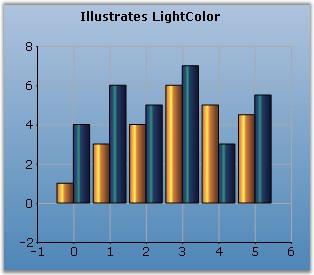

::: {style="DISPLAY: none"}
{#d2h_url_template}{#d2h_package_url style="WIDTH: 0px; DISPLAY: none; HEIGHT: 0px"}
:::

:::: {.d2h_secondary_topic style="PADDING-BOTTOM: 10pt; MARGIN: 0pt; PADDING-LEFT: 0pt; PADDING-RIGHT: 0pt; PADDING-TOP: 0pt"}
#### LightColor {#lightcolor style="tab-stops: 0pt"}

 

Specifies the color of light for all shading modes except ChartColumnShadingMode.FlatRectangle.

 

::: {align="center"}
+-------------------------------------+----------------------------------------------------------------------------------------------------------+
|                                                                                                                                                |
|                                                                                                                                                |
| **Details**                                                                                                                                    |
+-------------------------------------+----------------------------------------------------------------------------------------------------------+
| **Possible Values**                 | A Color object                                                                                           |
+-------------------------------------+----------------------------------------------------------------------------------------------------------+
| **Default Value    **               | **Color.White**                                                                                          |
+-------------------------------------+----------------------------------------------------------------------------------------------------------+
| **2D / 3D Limitations**             | No                                                                                                       |
+-------------------------------------+----------------------------------------------------------------------------------------------------------+
| **Applies to Chart Element**        | Any Series                                                                                               |
+-------------------------------------+----------------------------------------------------------------------------------------------------------+
| **Applies to Chart Types**          | Column Chart, Bar Chart, Box and Whisker Chart, Gantt Chart, Histogram Chart, Tornado Chart, Radar Chart |
+-------------------------------------+----------------------------------------------------------------------------------------------------------+
:::

 

Here is sample code snippet using **LightColor** in Column Chart.

 

+-----------------------------------------------------------------------------------------------------------------------------------------------------------------------------------------------------------------------------------------------------------------------------------------------+
| **[\[C#\]]{style="FONT-FAMILY: 'Courier New'; COLOR: black"}**                                                                                                                                                                                                                                |
|                                                                                                                                                                                                                                                                                               |
| **[]{style="FONT-FAMILY: 'Courier New'; COLOR: black"}**                                                                                                                                                                                                                                      |
|                                                                                                                                                                                                                                                                                               |
| [this]{style="FONT-FAMILY: 'Courier New'; COLOR: blue"}[.chartControl1.Series\[0\].ConfigItems.ColumnItem.LightColor = ]{style="FONT-FAMILY: 'Courier New'; COLOR: black"}[Color]{style="FONT-FAMILY: 'Courier New'; COLOR: teal"}[.Blue;]{style="FONT-FAMILY: 'Courier New'; COLOR: black"}  |
|                                                                                                                                                                                                                                                                                               |
| [this]{style="FONT-FAMILY: 'Courier New'; COLOR: blue"}[.chartControl1.Series\[1\].ConfigItems.ColumnItem.LightColor = ]{style="FONT-FAMILY: 'Courier New'; COLOR: black"}[Color]{style="FONT-FAMILY: 'Courier New'; COLOR: teal"}[.Green;]{style="FONT-FAMILY: 'Courier New'; COLOR: black"} |
+-----------------------------------------------------------------------------------------------------------------------------------------------------------------------------------------------------------------------------------------------------------------------------------------------+

 

+--------------------------------------------------------------------------------------------------------------------------------------------------------------------------------------------------------------------------------------------------------------------------------------------------+
| **[\[VB.NET\]]{style="FONT-FAMILY: 'Courier New'; COLOR: black"}**                                                                                                                                                                                                                               |
|                                                                                                                                                                                                                                                                                                  |
| **[]{style="FONT-FAMILY: 'Courier New'; COLOR: black"}**                                                                                                                                                                                                                                         |
|                                                                                                                                                                                                                                                                                                  |
| [Private Me]{style="FONT-FAMILY: 'Courier New'; COLOR: blue"}[.chartControl1.Series(0).ConfigItems.ColumnItem.LightColor = ]{style="FONT-FAMILY: 'Courier New'; COLOR: black"}[Color]{style="FONT-FAMILY: 'Courier New'; COLOR: teal"}[.Blue]{style="FONT-FAMILY: 'Courier New'; COLOR: black"}  |
|                                                                                                                                                                                                                                                                                                  |
| [Private Me]{style="FONT-FAMILY: 'Courier New'; COLOR: blue"}[.chartControl1.Series(1).ConfigItems.ColumnItem.LightColor = ]{style="FONT-FAMILY: 'Courier New'; COLOR: black"}[Color]{style="FONT-FAMILY: 'Courier New'; COLOR: teal"}[.Green]{style="FONT-FAMILY: 'Courier New'; COLOR: black"} |
+--------------------------------------------------------------------------------------------------------------------------------------------------------------------------------------------------------------------------------------------------------------------------------------------------+

 

{border="0"}

 

**[Figure ]{style="FONT-STYLE: normal"}[161]{style="FONT-STYLE: normal"}[: LightColor applied to Chart Series]{style="FONT-STYLE: normal"}**

 

**See Also**

 

[Scatter Chart]{.UGHyperlink}, [Column Charts]{.UGHyperlink}, [Bar Charts]{.UGHyperlink},[ ]{.UGHyperlink}[Box and Whisker Chart]{.UGHyperlink} ,[ ]{.UGHyperlink}[Gantt Chart]{.UGHyperlink} , [Histogram Chart]{.UGHyperlink}, [Tornado Chart]{.UGHyperlink} , []{style="COLOR: black"}

[[ ]{style="TEXT-DECORATION: none; text-underline: none"}]{.UGHyperlink} [Polar and Radar Chart]{.UGHyperlink}[]{.UGHyperlink}

[]{#p123} 

 

[]{#related-topics}
::::
