::: {style="DISPLAY: none"}
{#d2h_url_template} {#d2h_package_url style="WIDTH: 0px; DISPLAY: none; HEIGHT: 0px"}
:::

::::: {#nsbanner .d2h_main_nsbanner style="BORDER-BOTTOM: #999999 1px solid; POSITION: relative; PADDING-BOTTOM: 0px; BACKGROUND-COLOR: transparent; PADDING-LEFT: 0px; PADDING-RIGHT: 0px; DISPLAY: none; BORDER-TOP: #999999 1px solid; PADDING-TOP: 0px; LEFT: 0px"}
:::: {#TitleRow .d2h_main_titlerow style="PADDING-BOTTOM: 4px; BACKGROUND-COLOR: transparent; PADDING-LEFT: 22px; WIDTH: 100%; PADDING-RIGHT: 10px; DISPLAY: none; PADDING-TOP: 4px"}
::: {#ienav .d2h_main_ienav style="DISPLAY: none"}
{#D2HPrevious .D2HPreviousEnabled}  {#D2HNext .D2HNextEnabled}
:::
::::
:::::

:::: {#nstext .d2h_main_nstext style="PADDING-BOTTOM: 10px; BACKGROUND-COLOR: transparent; PADDING-LEFT: 22px; PADDING-RIGHT: 10px; HEIGHT: 100%; OVERFLOW: auto; PADDING-TOP: 5px" hasuserbackground="true" valign="bottom"}
::: {#d2h_breadcrumbs .d2h_breadcrumbs}
[Essential Studio User Guide Documentation](ms-xhelp:///?Id=12457748-09e3-4d74-a240-8e049cedf030){.d2h_breadcrumbsNormal} [ \> ]{.d2h_breadcrumbsLinkSeparator} [User Interface Edition](ms-xhelp:///?Id=c29296b7-531c-413b-a0ec-488ca1f7f669){.d2h_breadcrumbsNormal} [ \> ]{.d2h_breadcrumbsLinkSeparator} [Essential ASP.NET](ms-xhelp:///?Id=25c35330-c127-4dad-9a92-ed79dc7261a6){.d2h_breadcrumbsNormal} [ \> ]{.d2h_breadcrumbsLinkSeparator} [Essential Gauge]{.d2h_breadcrumbsContentsOnly} [ \> ]{.d2h_breadcrumbsLinkSeparator} [Getting Started](ms-xhelp:///?Id=34a29395-708d-43cb-9013-8c236b278443){.d2h_breadcrumbsNormal} [ \> ]{.d2h_breadcrumbsLinkSeparator} [Feature Summary](ms-xhelp:///?Id=d797ebe8-dc93-4523-95bb-325c3a63eb23){.d2h_breadcrumbsNormal}
:::

### Linear Gauge {#linear-gauge style="tab-stops: 0pt"}

The linear gauge measures the values of scales and represents them horizontally or vertically, along a linear scale similar to a thermometer in the form of a slider, with the help of a pointer, tick and a label. The linear gauge supports the following features:

Orientation

The linear gauge can be oriented vertically or horizontally, as shown in the following figures:

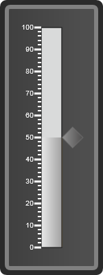{border="0"}

Figure 19: Vertcial linear gauge

 

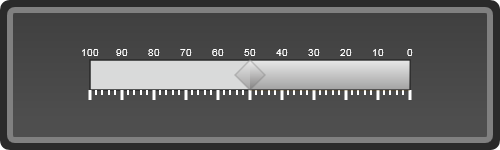{border="0"}

Figure 20: Horizontal linear gauge

 

Frame Types

The linear gauge can have the following three frame types:

[·      ]{style="FONT-FAMILY: Symbol"}Rectangle

 

 

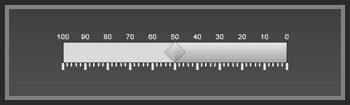{border="0"}

Figure 21:Horizontal linear gauge with a rectangle frame

 

[·      ]{style="FONT-FAMILY: Symbol"}Rounded rectangle

 

{border="0"}

Figure 22: Horizontal linear gauge with a rounded rectangle frame

 

[·      ]{style="FONT-FAMILY: Symbol"}Cropped rectangle

 

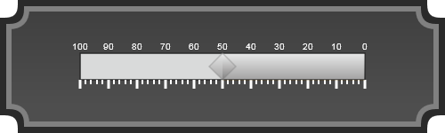{border="0"}

Figure 23: Horizontal linear gauge with a cropped rectangle

 

Pointer Types

The linear gauge can have 12 pointer types:

[·      ]{style="FONT-FAMILY: Symbol"}Rectangle

[·      ]{style="FONT-FAMILY: Symbol"}Triangle

[·      ]{style="FONT-FAMILY: Symbol"}Ellipse

[·      ]{style="FONT-FAMILY: Symbol"}Diamond

[·      ]{style="FONT-FAMILY: Symbol"}Pentagon

[·      ]{style="FONT-FAMILY: Symbol"}Circle

[·      ]{style="FONT-FAMILY: Symbol"}Slider

[·      ]{style="FONT-FAMILY: Symbol"}Pointer

[·      ]{style="FONT-FAMILY: Symbol"}Wedge

[·      ]{style="FONT-FAMILY: Symbol"}Trapezoid

[·      ]{style="FONT-FAMILY: Symbol"}Rounded Rectangle

[·      ]{style="FONT-FAMILY: Symbol"}Star  

         

 

{border="0"}

Figure 24:Vertical linear gauge with a rounded rectangle pointer

      

     

 

  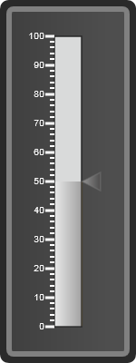{border="0"}

Figure 25: Vertical linear gauge with triangle pointer

 

         {border="0"}

Figure 26: Vertical linear gauge with wedge pointer

 

Range

The linear gauge supports the display of range, with a range meter. This shows you which values are within the specified range, and which are not.

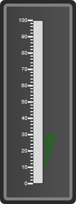{border="0"}

Figure 27: Vertical linear gauge with range

 

Scale

There are 3 types of scales in linear gauge, based on their shapes:

[·      ]{style="FONT-FAMILY: Symbol"}Rounded

[·      ]{style="FONT-FAMILY: Symbol"}Rectangle

[·      ]{style="FONT-FAMILY: Symbol"}Thermometer

The scale helps to position and measure elements of the gauge such as ticks, labels etc.

{border="0"}

Figure 28: Vertical linear gauge with rounded rectangle scale

 

{border="0"}

Figure 29:Vertical linear gauge with rectangle scale

 

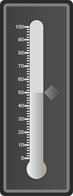{border="0"}

Figure 30: Vertical linear gauge with thermometer scale

 

Custom Label

The linear gauge supports for the custom label in which to display the own label to the linear gauge.

 

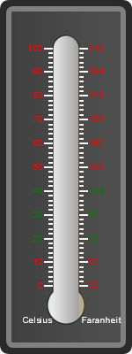{border="0"}

Figure 31: Linear gauge with custom labels

 

Appearance

The linear gauge has a flexible appearance, as you can apply any one of the skins from the 14 skins that are applicable for the circular gauge.\
The following figures give you an idea of a few of the skins available:

 

 

 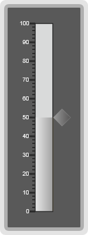{border="0"}

Figure 32: Vertical linear gauge with Office 2007 Black skin

 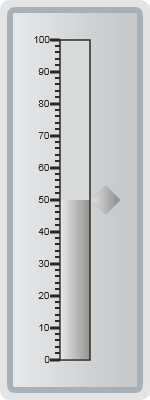{border="0"}

Figure 33: Vertical linear gauge with Office2007 Silver skin

                  

 

    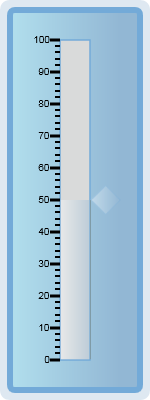{border="0"}

Figure 34: Vertical linear gauge with Blueberry skin

 

[]{#related-topics}
::::
