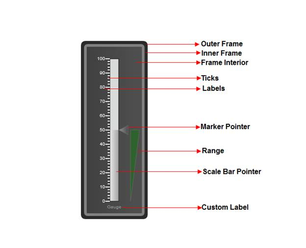

::: {style="DISPLAY: none"}
{#d2h_url_template} {#d2h_package_url style="WIDTH: 0px; DISPLAY: none; HEIGHT: 0px"}
:::

::::: {#nsbanner .d2h_main_nsbanner style="BORDER-BOTTOM: #999999 1px solid; POSITION: relative; PADDING-BOTTOM: 0px; BACKGROUND-COLOR: transparent; PADDING-LEFT: 0px; PADDING-RIGHT: 0px; DISPLAY: none; BORDER-TOP: #999999 1px solid; PADDING-TOP: 0px; LEFT: 0px"}
:::: {#TitleRow .d2h_main_titlerow style="PADDING-BOTTOM: 4px; BACKGROUND-COLOR: transparent; PADDING-LEFT: 22px; WIDTH: 100%; PADDING-RIGHT: 10px; DISPLAY: none; PADDING-TOP: 4px"}
::: {#ienav .d2h_main_ienav style="DISPLAY: none"}
{#D2HPrevious .D2HPreviousEnabled}  {#D2HNext .D2HNextEnabled}
:::
::::
:::::

::::: {#nstext .d2h_main_nstext style="PADDING-BOTTOM: 10px; BACKGROUND-COLOR: transparent; PADDING-LEFT: 22px; PADDING-RIGHT: 10px; HEIGHT: 100%; OVERFLOW: auto; PADDING-TOP: 5px" hasuserbackground="true" valign="bottom"}
::: {#d2h_breadcrumbs .d2h_breadcrumbs}
[Essential Studio User Guide Documentation](ms-xhelp:///?Id=12457748-09e3-4d74-a240-8e049cedf030){.d2h_breadcrumbsNormal} [ \> ]{.d2h_breadcrumbsLinkSeparator} [User Interface Edition](ms-xhelp:///?Id=c29296b7-531c-413b-a0ec-488ca1f7f669){.d2h_breadcrumbsNormal} [ \> ]{.d2h_breadcrumbsLinkSeparator} [Essential ASP.NET](ms-xhelp:///?Id=25c35330-c127-4dad-9a92-ed79dc7261a6){.d2h_breadcrumbsNormal} [ \> ]{.d2h_breadcrumbsLinkSeparator} [Essential Gauge]{.d2h_breadcrumbsContentsOnly} [ \> ]{.d2h_breadcrumbsLinkSeparator} [Concepts and Features](ms-xhelp:///?Id=071561c1-cde5-4272-ad2b-e81a94f42438){.d2h_breadcrumbsNormal}
:::

## Linear Gauge {#linear-gauge style="tab-stops: 0pt"}

The linear gauge measures the values of scales and represents them horizontally or vertically, in the form of a slider, with the help of a pointer, tick and a label.

 

 

Where do I find the installed samples?

[To view the installed samples:]{style="BACKGROUND: white"}

1.   [Open the ASP.NET Sample browser from the Dashboard. (Refer to the Samples and Locations section).]{style="BACKGROUND: white"}

2.   [Select ASP.NET Gauge under Other Products. ]{style="BACKGROUND: white"}

3.   [Go through the samples installed.]{style="BACKGROUND: white"}

[ Refer to the ]{style="BACKGROUND: white"} [Viewing samples]{style="BACKGROUND: white"} [ section for more detail.]{style="BACKGROUND: white"}

 

Elaborate Structure of a linear gauge

This section gives you an idea of the different sections of a Gauge Control.\
None of the elements of the gauge control are steadfast, i.e. you can choose which of the elements you would want to display in your gauge.\
Below is the image that illustrates various sections of the control, along with their detailed descriptions:

 

{border="0"}

**[Elements and Features]{style="FONT-FAMILY: 'Arial','sans-serif'"}**

Scales

Scales are used to control the value ranges and also used as a basis for the placement of child elements, such as the tick marks. By default, the values start from the minimum value and move clock-wise to the maximum value. It is possible to reverse this direction by setting the **ScaleDirection** property to Anticlockwise.

Multiple scales can be added to linear gauge using its different parameters to present complex gauge.

The Orientation of the Linear Gauge can be customized. It can be Horizontal or Vertical.

 

Pointer

Linear Pointers are scale indicator that points to a value along a scale. Linear Pointers are highly customizable. Linear Pointers can be added to the linear scale using different parameters to present the scales. Linear Bar and Marker pointers can be added at a time.

 

Range

Ranges are objects that highlight a range of values.  Start Value and End value of the range can be specified using its **StartValue** and **Endvalue** properties. The Width of the range can be customized using its **StartWidth** and **EndWidth** properties.

You can set the location of the range based on the scale position using  **DistanceFromScale** property and the **RangePosition** property.

 

**[Major and Minor Ticks]{style="FONT-FAMILY: 'Arial','sans-serif'"}**

**Major Ticks** are the primary scale indicators.

**Minor Ticks** are the secondary scale indicators.

**TickStyle** property of the tick element specifies the number of value intervals along the entire length of the scale bar.

 

Labels

Circular Label comprises numerous options to customize label display. Circular labels can be added to the circular scale using its different parameters to present the scales with meaningful labels.

You can set the location of the labels based on the scale position using the **DistanceFromScale** property and the **TickPlacement** property.  Labels can be shown for Major or Minor ticks. This can be set using the **TickStyle** property.

 

Gauge Custom Label

Using the CustomLabel element of gauge, you can add custom text labels to the Essential Gauge. 

The label value can be set using its  **LabelValue**  property. Also you can customize the custom text, using its **FontSize** and **FontFamily** properties.

The location of the label can be customized using its **Location** property. The custom text angle can be set using its **TextAngle** property.

 

::: {style="BORDER-BOTTOM: windowtext 1pt solid; BORDER-LEFT: medium none; PADDING-BOTTOM: 1pt; MARGIN-TOP: 9pt; PADDING-LEFT: 0pt; PADDING-RIGHT: 0pt; MARGIN-BOTTOM: 9pt; BORDER-TOP: windowtext 1pt solid; BORDER-RIGHT: medium none; PADDING-TOP: 1pt"}
Note: Gauge scales, Label, Ticks, Label Tick and Pointer elements are collection types. You can host any number of items in it.
:::

 

More:

[ ]{#related-topics}

[{border="0" align="absMiddle"}Creating Linear gauge in your Web application](ms-xhelp:///?Id=e43f4736-3477-4e49-b1a1-fc77f950c265){style="TEXT-DECORATION: none"}

[{border="0" align="absMiddle"}Features of Linear Gauge](ms-xhelp:///?Id=e46ac5ed-5ef1-473f-b753-2f8fbadcdb05){style="TEXT-DECORATION: none"}
:::::
