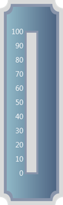

::: {style="DISPLAY: none"}
{#d2h_url_template}{#d2h_package_url style="WIDTH: 0px; DISPLAY: none; HEIGHT: 0px"}
:::

:::: {.d2h_secondary_topic style="PADDING-BOTTOM: 10pt; MARGIN: 0pt; PADDING-LEFT: 0pt; PADDING-RIGHT: 0pt; PADDING-TOP: 0pt"}
##### Linear LabelTick {#linear-labeltick style="tab-stops: 0pt"}

 

Circular Label comprises numerous options to customize label display. Circular labels can be added to the circular scale using its different parameters to present the scales with meaningful labels.

 

You can set the location of the labels based on the scale position using the **DistanceFromScale** property and the **TickPlacement** property.  Labels can be shown for Major or Minor ticks. This can be set using the **TickStyle** property.

 

When **IsLogarithmic** property is set to True, base 10 is used for the logarithmic scale by default. To modify the base of the logarithmic scale, set the **LogBase** property accordingly.

 

Labels can be displayed using formulas. This can be done by setting its **IsCalculateFormulaEnabled** property to True. The formula used to display labels can be set using the **CalculateFormula** property.The labels can be displayed in the specified format using **NumberFormatInfo** property.

 

Using the **Ranged Brush** property, you can specify colors for the specified range of labels. The Range can be set using its **RangedBrushStartValue** and **RangedBrushEndValue** properties..

 

::: {align="center"}
+---------------------------------+---------------------------------------------------------------------------------------------------------------------------------------------------------------------------------------------------+------------------------------------------------------------------+------------------------------------------------------------------------------------------------------------------------------------------------------------------------------------------------------------+--------------------------------------------------------------+
| Table 3: Property TableProperty | Description                                                                                                                                                                                       | Type of Property                                                 | Value It Accepts                                                                                                                                                                                           | Any other dependencies/Sub properties associated             |
+---------------------------------+---------------------------------------------------------------------------------------------------------------------------------------------------------------------------------------------------+------------------------------------------------------------------+------------------------------------------------------------------------------------------------------------------------------------------------------------------------------------------------------------+--------------------------------------------------------------+
| DistanceFromScale               | Sets the distance that need to be maintained to present the ticks on the scale.                                                                                                                   | [double]{style="COLOR: blue"}                                    | [double]{style="COLOR: blue"}                                                                                                                                                                              | NA                                                           |
+---------------------------------+---------------------------------------------------------------------------------------------------------------------------------------------------------------------------------------------------+------------------------------------------------------------------+------------------------------------------------------------------------------------------------------------------------------------------------------------------------------------------------------------+--------------------------------------------------------------+
| Angle                           | Sets the angle of rotation for ticks.                                                                                                                                                             | [double]{style="COLOR: blue"}                                    | [double]{style="COLOR: blue"}                                                                                                                                                                              | NA                                                           |
+---------------------------------+---------------------------------------------------------------------------------------------------------------------------------------------------------------------------------------------------+------------------------------------------------------------------+------------------------------------------------------------------------------------------------------------------------------------------------------------------------------------------------------------+--------------------------------------------------------------+
| TickStyle                       | Sets the tick style for which the label should be displayed. The default value is Major tick.                                                                                                     | [enum]{style="COLOR: blue"}                                      | [TickStyle]{style="COLOR: #2b91af"}.MajorTick                                                                                                                                                              | NA                                                           |
|                                 |                                                                                                                                                                                                   |                                                                  |                                                                                                                                                                                                            |                                                              |
|                                 |                                                                                                                                                                                                   |                                                                  |                                                                                                                                                                                                            |                                                              |
|                                 |                                                                                                                                                                                                   |                                                                  |                                                                                                                                                                                                            |                                                              |
|                                 |                                                                                                                                                                                                   |                                                                  | [TickStyle]{style="COLOR: #2b91af"}.MinorTick                                                                                                                                                              |                                                              |
+---------------------------------+---------------------------------------------------------------------------------------------------------------------------------------------------------------------------------------------------+------------------------------------------------------------------+------------------------------------------------------------------------------------------------------------------------------------------------------------------------------------------------------------+--------------------------------------------------------------+
| BackgroundBrush                 | Sets the background brush for ticks.                                                                                                                                                              | System.Windows.Media.[Brushes]{style="COLOR: #2b91af"}           | Refer to the below Link for  Value for the Brushes class                                                                                                                                                   | NA                                                           |
|                                 |                                                                                                                                                                                                   |                                                                  |                                                                                                                                                                                                            |                                                              |
|                                 |                                                                                                                                                                                                   |                                                                  | [[Brushes]{style="COLOR: windowtext; TEXT-DECORATION: none; text-underline: none"}](http://msdn.microsoft.com/en-us/library/system.windows.media.brushes.aspx)                                             |                                                              |
+---------------------------------+---------------------------------------------------------------------------------------------------------------------------------------------------------------------------------------------------+------------------------------------------------------------------+------------------------------------------------------------------------------------------------------------------------------------------------------------------------------------------------------------+--------------------------------------------------------------+
| TickPlacement                   | Sets the placement for ticks.                                                                                                                                                                     | [enum]{style="COLOR: blue"}                                      | [ScalePlacement]{style="COLOR: #2b91af"}.Cross                                                                                                                                                             | NA                                                           |
|                                 |                                                                                                                                                                                                   |                                                                  |                                                                                                                                                                                                            |                                                              |
|                                 |                                                                                                                                                                                                   |                                                                  |                                                                                                                                                                                                            |                                                              |
|                                 |                                                                                                                                                                                                   |                                                                  |                                                                                                                                                                                                            |                                                              |
|                                 |                                                                                                                                                                                                   |                                                                  | [ScalePlacement]{style="COLOR: #2b91af"}.Inside                                                                                                                                                            |                                                              |
|                                 |                                                                                                                                                                                                   |                                                                  |                                                                                                                                                                                                            |                                                              |
|                                 |                                                                                                                                                                                                   |                                                                  |                                                                                                                                                                                                            |                                                              |
|                                 |                                                                                                                                                                                                   |                                                                  |                                                                                                                                                                                                            |                                                              |
|                                 |                                                                                                                                                                                                   |                                                                  | [ScalePlacement]{style="COLOR: #2b91af"}.Outside                                                                                                                                                           |                                                              |
+---------------------------------+---------------------------------------------------------------------------------------------------------------------------------------------------------------------------------------------------+------------------------------------------------------------------+------------------------------------------------------------------------------------------------------------------------------------------------------------------------------------------------------------+--------------------------------------------------------------+
| TickShape                       | Sets the Shape for the Ticks.                                                                                                                                                                     | [enum]{style="COLOR: blue"}                                      | [TickShape]{style="COLOR: #2b91af"}.Ellipse                                                                                                                                                                |                                                              |
|                                 |                                                                                                                                                                                                   |                                                                  |                                                                                                                                                                                                            |                                                              |
|                                 |                                                                                                                                                                                                   |                                                                  |                                                                                                                                                                                                            |                                                              |
|                                 |                                                                                                                                                                                                   |                                                                  |                                                                                                                                                                                                            |                                                              |
|                                 |                                                                                                                                                                                                   |                                                                  | [TickShape]{style="COLOR: #2b91af"}.Rectangle                                                                                                                                                              |                                                              |
|                                 |                                                                                                                                                                                                   |                                                                  |                                                                                                                                                                                                            |                                                              |
|                                 |                                                                                                                                                                                                   |                                                                  |                                                                                                                                                                                                            |                                                              |
|                                 |                                                                                                                                                                                                   |                                                                  |                                                                                                                                                                                                            |                                                              |
|                                 |                                                                                                                                                                                                   |                                                                  | [TickShape]{style="COLOR: #2b91af"}.RoundedRectangle                                                                                                                                                       |                                                              |
|                                 |                                                                                                                                                                                                   |                                                                  |                                                                                                                                                                                                            |                                                              |
|                                 |                                                                                                                                                                                                   |                                                                  |                                                                                                                                                                                                            |                                                              |
|                                 |                                                                                                                                                                                                   |                                                                  |                                                                                                                                                                                                            |                                                              |
|                                 |                                                                                                                                                                                                   |                                                                  | [TickShape]{style="COLOR: #2b91af"}.Triangle                                                                                                                                                               |                                                              |
+---------------------------------+---------------------------------------------------------------------------------------------------------------------------------------------------------------------------------------------------+------------------------------------------------------------------+------------------------------------------------------------------------------------------------------------------------------------------------------------------------------------------------------------+--------------------------------------------------------------+
| IncludeFirstValue               | Sets whether the label values should include the first value or not.                                                                                                                              | [bool]{style="COLOR: blue"}                                      | [True]{style="COLOR: blue"}                                                                                                                                                                                | NA                                                           |
|                                 |                                                                                                                                                                                                   |                                                                  |                                                                                                                                                                                                            |                                                              |
|                                 |                                                                                                                                                                                                   |                                                                  | []{style="COLOR: blue"}                                                                                                                                                                                    |                                                              |
|                                 |                                                                                                                                                                                                   |                                                                  |                                                                                                                                                                                                            |                                                              |
|                                 |                                                                                                                                                                                                   |                                                                  | [false]{style="COLOR: blue"}                                                                                                                                                                               |                                                              |
+---------------------------------+---------------------------------------------------------------------------------------------------------------------------------------------------------------------------------------------------+------------------------------------------------------------------+------------------------------------------------------------------------------------------------------------------------------------------------------------------------------------------------------------+--------------------------------------------------------------+
| IsLogarithmic                   | Sets whether the label values should be displayed as logarithmic values.                                                                                                                          | [bool]{style="COLOR: blue"}                                      | [True]{style="COLOR: blue"}                                                                                                                                                                                | NA                                                           |
|                                 |                                                                                                                                                                                                   |                                                                  |                                                                                                                                                                                                            |                                                              |
|                                 |                                                                                                                                                                                                   |                                                                  | []{style="COLOR: blue"}                                                                                                                                                                                    |                                                              |
|                                 |                                                                                                                                                                                                   |                                                                  |                                                                                                                                                                                                            |                                                              |
|                                 |                                                                                                                                                                                                   |                                                                  | [false]{style="COLOR: blue"}                                                                                                                                                                               |                                                              |
+---------------------------------+---------------------------------------------------------------------------------------------------------------------------------------------------------------------------------------------------+------------------------------------------------------------------+------------------------------------------------------------------------------------------------------------------------------------------------------------------------------------------------------------+--------------------------------------------------------------+
| LogBase                         | Sets the base to which the logarithmic values should be calculated.                                                                                                                               | [double]{style="COLOR: blue"}                                    | [double]{style="COLOR: blue"}                                                                                                                                                                              | Dependency(Dependent on IsLogarithmic property)              |
|                                 |                                                                                                                                                                                                   |                                                                  |                                                                                                                                                                                                            |                                                              |
|                                 | Default value is 10.                                                                                                                                                                              |                                                                  |                                                                                                                                                                                                            |                                                              |
|                                 |                                                                                                                                                                                                   |                                                                  |                                                                                                                                                                                                            |                                                              |
|                                 | LogBase will work only if IsLogarithmic property is set to True.                                                                                                                                  |                                                                  |                                                                                                                                                                                                            |                                                              |
+---------------------------------+---------------------------------------------------------------------------------------------------------------------------------------------------------------------------------------------------+------------------------------------------------------------------+------------------------------------------------------------------------------------------------------------------------------------------------------------------------------------------------------------+--------------------------------------------------------------+
| IsCalculateFormulaEnabled       | Sets whether any formula should be acted upon the label values of the scale. Default is False.                                                                                                    | [bool]{style="COLOR: blue"}                                      | [True]{style="COLOR: blue"}                                                                                                                                                                                |                                                              |
|                                 |                                                                                                                                                                                                   |                                                                  |                                                                                                                                                                                                            |                                                              |
|                                 |                                                                                                                                                                                                   |                                                                  | []{style="COLOR: blue"}                                                                                                                                                                                    |                                                              |
|                                 |                                                                                                                                                                                                   |                                                                  |                                                                                                                                                                                                            |                                                              |
|                                 |                                                                                                                                                                                                   |                                                                  | [false]{style="COLOR: blue"}                                                                                                                                                                               |                                                              |
+---------------------------------+---------------------------------------------------------------------------------------------------------------------------------------------------------------------------------------------------+------------------------------------------------------------------+------------------------------------------------------------------------------------------------------------------------------------------------------------------------------------------------------------+--------------------------------------------------------------+
| CalculateFormula                | Sets the formula to be acted upon the labels. Default is String.Empty. CalculateFormula will work only if IsCalculateFormulaEnabled property is set to True.                                      | [string]{style="COLOR: blue"}                                    | [string]{style="COLOR: blue"}                                                                                                                                                                              | Dependency (Dependent on IsCalculateFormulaEnabled property) |
+---------------------------------+---------------------------------------------------------------------------------------------------------------------------------------------------------------------------------------------------+------------------------------------------------------------------+------------------------------------------------------------------------------------------------------------------------------------------------------------------------------------------------------------+--------------------------------------------------------------+
| IsRelativeAngle                 | Sets the labels relative to the angle of the scale.                                                                                                                                               | [bool]{style="COLOR: blue"}                                      | [True]{style="COLOR: blue"}                                                                                                                                                                                | NA                                                           |
|                                 |                                                                                                                                                                                                   |                                                                  |                                                                                                                                                                                                            |                                                              |
|                                 |                                                                                                                                                                                                   |                                                                  | []{style="COLOR: blue"}                                                                                                                                                                                    |                                                              |
|                                 |                                                                                                                                                                                                   |                                                                  |                                                                                                                                                                                                            |                                                              |
|                                 |                                                                                                                                                                                                   |                                                                  | [false]{style="COLOR: blue"}                                                                                                                                                                               |                                                              |
+---------------------------------+---------------------------------------------------------------------------------------------------------------------------------------------------------------------------------------------------+------------------------------------------------------------------+------------------------------------------------------------------------------------------------------------------------------------------------------------------------------------------------------------+--------------------------------------------------------------+
| Opacity                         | Sets the opacity of the label ticks.                                                                                                                                                              | [double]{style="COLOR: blue"}                                    | [double]{style="COLOR: blue"}                                                                                                                                                                              | NA                                                           |
+---------------------------------+---------------------------------------------------------------------------------------------------------------------------------------------------------------------------------------------------+------------------------------------------------------------------+------------------------------------------------------------------------------------------------------------------------------------------------------------------------------------------------------------+--------------------------------------------------------------+
| FontWeight                      | Sets the font weight for the labels.                                                                                                                                                              | System.Globalization. [NumberFormatInfo]{style="COLOR: #2b91af"} | System.Globalization. [NumberFormatInfo]{style="COLOR: #2b91af"}                                                                                                                                           | NA                                                           |
+---------------------------------+---------------------------------------------------------------------------------------------------------------------------------------------------------------------------------------------------+------------------------------------------------------------------+------------------------------------------------------------------------------------------------------------------------------------------------------------------------------------------------------------+--------------------------------------------------------------+
| FontSize                        | Sets the font size for the labels.                                                                                                                                                                | [double]{style="COLOR: blue"}                                    | [double]{style="COLOR: blue"}                                                                                                                                                                              | NA                                                           |
+---------------------------------+---------------------------------------------------------------------------------------------------------------------------------------------------------------------------------------------------+------------------------------------------------------------------+------------------------------------------------------------------------------------------------------------------------------------------------------------------------------------------------------------+--------------------------------------------------------------+
| NumberFormatInfo                | Sets the label tick values in a specified format.                                                                                                                                                 | System.Globalization. NumberFormatInfo                           | System.Globalization. NumberFormatInfo                                                                                                                                                                     | NA                                                           |
+---------------------------------+---------------------------------------------------------------------------------------------------------------------------------------------------------------------------------------------------+------------------------------------------------------------------+------------------------------------------------------------------------------------------------------------------------------------------------------------------------------------------------------------+--------------------------------------------------------------+
| RangedBrush                     | Sets an alternate brush to the ticks (Apart from the brush provided by the BackgroundBrush property) for a range specified by using the RangedBrushStartValue and RangedBrushEndValue properties. | System.Windows.Media.[Brushes]{style="COLOR: #2b91af"}           | Refer to the below Link for  Value for the Brushes class                                                                                                                                                   | NA                                                           |
|                                 |                                                                                                                                                                                                   |                                                                  |                                                                                                                                                                                                            |                                                              |
|                                 |                                                                                                                                                                                                   |                                                                  | [[Brushes]{style="COLOR: windowtext; FONT-SIZE: 11pt; TEXT-DECORATION: none; text-underline: none"}](http://msdn.microsoft.com/en-us/library/system.windows.media.brushes.aspx)[]{style="FONT-SIZE: 11pt"} |                                                              |
+---------------------------------+---------------------------------------------------------------------------------------------------------------------------------------------------------------------------------------------------+------------------------------------------------------------------+------------------------------------------------------------------------------------------------------------------------------------------------------------------------------------------------------------+--------------------------------------------------------------+
| RangedBrushStartValue           | Sets the start value from which the ticks should be painted with the alternate brush stored in the RangedBrush property.                                                                          | [double]{style="COLOR: blue"}                                    | [double]{style="COLOR: blue; FONT-SIZE: 11pt"}[]{style="FONT-SIZE: 11pt"}                                                                                                                                  | NA                                                           |
+---------------------------------+---------------------------------------------------------------------------------------------------------------------------------------------------------------------------------------------------+------------------------------------------------------------------+------------------------------------------------------------------------------------------------------------------------------------------------------------------------------------------------------------+--------------------------------------------------------------+
| RangedBrushEndValue             | Sets the end value up to which the ticks should be painted with the alternate brush stored in the RangedBrush property.                                                                           | [double]{style="COLOR: blue"}                                    | [double]{style="COLOR: blue; FONT-SIZE: 11pt"}[]{style="FONT-SIZE: 11pt"}                                                                                                                                  | NA                                                           |
+---------------------------------+---------------------------------------------------------------------------------------------------------------------------------------------------------------------------------------------------+------------------------------------------------------------------+------------------------------------------------------------------------------------------------------------------------------------------------------------------------------------------------------------+--------------------------------------------------------------+
:::

**[]{style="FONT-FAMILY: 'Calibri','sans-serif'"}** 

###### 5.2.3.3.1.1 Through View Customization {#through-view-customization style="tab-stops: 0pt"}

 

Step 1:

View:

 

Add the below code in your aspx file. Using the Labels mapper, you can add labels for the linear scale.

 

+-------------------------------------------------------------------------------------------------------------------------------------------------------------------------------------------------------------------------------------------------------------------------------------------------------------------------------------------------------------------------------------------------------------------------------------------------------------------------------------+
| [View\[ASPX\]]{style="FONT-FAMILY: 'Courier New'"}                                                                                                                                                                                                                                                                                                                                                                                                                                  |
|                                                                                                                                                                                                                                                                                                                                                                                                                                                                                     |
| [\<%]{style="FONT-FAMILY: 'Courier New'; BACKGROUND: yellow"}[@]{style="FONT-FAMILY: 'Courier New'; COLOR: blue"}[ [Page]{style="COLOR: maroon"} [Language]{style="COLOR: red"}[=\"C#\"]{style="COLOR: blue"} [MasterPageFile]{style="COLOR: red"}[=\"\~/Views/Shared/Site.Master\"]{style="COLOR: blue"} [Inherits]{style="COLOR: red"}[=\"System.Web.Mvc.ViewPage\"]{style="COLOR: blue"} [%\>]{style="BACKGROUND: yellow"}]{style="FONT-FAMILY: 'Courier New'"}                  |
|                                                                                                                                                                                                                                                                                                                                                                                                                                                                                     |
| [\<]{style="FONT-FAMILY: 'Courier New'; COLOR: blue"}[asp]{style="FONT-FAMILY: 'Courier New'; COLOR: maroon"}[:]{style="FONT-FAMILY: 'Courier New'; COLOR: blue"}[Content]{style="FONT-FAMILY: 'Courier New'; COLOR: maroon"}[ [ID]{style="COLOR: red"}[=\"Content1\"]{style="COLOR: blue"} [ContentPlaceHolderID]{style="COLOR: red"}[=\"TitleContent\"]{style="COLOR: blue"} [runat]{style="COLOR: red"}[=\"server\"\>]{style="COLOR: blue"}]{style="FONT-FAMILY: 'Courier New'"} |
|                                                                                                                                                                                                                                                                                                                                                                                                                                                                                     |
| [    Linear Gauge]{style="FONT-FAMILY: 'Courier New'"}                                                                                                                                                                                                                                                                                                                                                                                                                              |
|                                                                                                                                                                                                                                                                                                                                                                                                                                                                                     |
| [\</]{style="FONT-FAMILY: 'Courier New'; COLOR: blue"}[asp]{style="FONT-FAMILY: 'Courier New'; COLOR: maroon"}[:]{style="FONT-FAMILY: 'Courier New'; COLOR: blue"}[Content]{style="FONT-FAMILY: 'Courier New'; COLOR: maroon"}[\>]{style="FONT-FAMILY: 'Courier New'; COLOR: blue"}[]{style="FONT-FAMILY: 'Courier New'"}                                                                                                                                                           |
|                                                                                                                                                                                                                                                                                                                                                                                                                                                                                     |
| []{style="FONT-FAMILY: 'Courier New'"}                                                                                                                                                                                                                                                                                                                                                                                                                                              |
|                                                                                                                                                                                                                                                                                                                                                                                                                                                                                     |
| [\<]{style="FONT-FAMILY: 'Courier New'; COLOR: blue"}[asp]{style="FONT-FAMILY: 'Courier New'; COLOR: maroon"}[:]{style="FONT-FAMILY: 'Courier New'; COLOR: blue"}[Content]{style="FONT-FAMILY: 'Courier New'; COLOR: maroon"}[ [ID]{style="COLOR: red"}[=\"Content2\"]{style="COLOR: blue"} [ContentPlaceHolderID]{style="COLOR: red"}[=\"MainContent\"]{style="COLOR: blue"} [runat]{style="COLOR: red"}[=\"server\"\>]{style="COLOR: blue"}]{style="FONT-FAMILY: 'Courier New'"}  |
|                                                                                                                                                                                                                                                                                                                                                                                                                                                                                     |
| []{style="FONT-FAMILY: 'Courier New'"}                                                                                                                                                                                                                                                                                                                                                                                                                                              |
|                                                                                                                                                                                                                                                                                                                                                                                                                                                                                     |
| [\<%]{style="FONT-FAMILY: 'Courier New'; BACKGROUND: yellow"}[\--Rendering the Linear Gauge\--]{style="FONT-FAMILY: 'Courier New'; COLOR: darkgreen"}[%\>]{style="FONT-FAMILY: 'Courier New'; BACKGROUND: yellow"}[]{style="FONT-FAMILY: 'Courier New'"}                                                                                                                                                                                                                            |
|                                                                                                                                                                                                                                                                                                                                                                                                                                                                                     |
| [    [\<%]{style="BACKGROUND: yellow"}[=]{style="COLOR: blue"}Html.Syncfusion().LinearGauge([\"Gauge\"]{style="COLOR: #a31515"})]{style="FONT-FAMILY: 'Courier New'"}                                                                                                                                                                                                                                                                                                               |
|                                                                                                                                                                                                                                                                                                                                                                                                                                                                                     |
| [        .Height(420)]{style="FONT-FAMILY: 'Courier New'"}                                                                                                                                                                                                                                                                                                                                                                                                                          |
|                                                                                                                                                                                                                                                                                                                                                                                                                                                                                     |
| [        .Width(130)]{style="FONT-FAMILY: 'Courier New'"}                                                                                                                                                                                                                                                                                                                                                                                                                           |
|                                                                                                                                                                                                                                                                                                                                                                                                                                                                                     |
| [        .GaugeSkins([GaugeSkins]{style="COLOR: #2b91af"}.VS2010)]{style="FONT-FAMILY: 'Courier New'"}                                                                                                                                                                                                                                                                                                                                                                              |
|                                                                                                                                                                                                                                                                                                                                                                                                                                                                                     |
| [        .Orientation([GaugeOrientation]{style="COLOR: #2b91af"}.Vertical)]{style="FONT-FAMILY: 'Courier New'"}                                                                                                                                                                                                                                                                                                                                                                     |
|                                                                                                                                                                                                                                                                                                                                                                                                                                                                                     |
| [        .FrameType([LinearGaugeFrameType]{style="COLOR: #2b91af"}.CroppedRectangle)]{style="FONT-FAMILY: 'Courier New'"}                                                                                                                                                                                                                                                                                                                                                           |
|                                                                                                                                                                                                                                                                                                                                                                                                                                                                                     |
| [            .Scales(scale =\>]{style="FONT-FAMILY: 'Courier New'"}                                                                                                                                                                                                                                                                                                                                                                                                                 |
|                                                                                                                                                                                                                                                                                                                                                                                                                                                                                     |
| [            {]{style="FONT-FAMILY: 'Courier New'"}                                                                                                                                                                                                                                                                                                                                                                                                                                 |
|                                                                                                                                                                                                                                                                                                                                                                                                                                                                                     |
| [                scale.Add()]{style="FONT-FAMILY: 'Courier New'"}                                                                                                                                                                                                                                                                                                                                                                                                                   |
|                                                                                                                                                                                                                                                                                                                                                                                                                                                                                     |
| [                    .Maximum(100)]{style="FONT-FAMILY: 'Courier New'"}                                                                                                                                                                                                                                                                                                                                                                                                             |
|                                                                                                                                                                                                                                                                                                                                                                                                                                                                                     |
| [                    .Minimum(0)]{style="FONT-FAMILY: 'Courier New'"}                                                                                                                                                                                                                                                                                                                                                                                                               |
|                                                                                                                                                                                                                                                                                                                                                                                                                                                                                     |
| [                    .MajorIntervalValue(10)]{style="FONT-FAMILY: 'Courier New'"}                                                                                                                                                                                                                                                                                                                                                                                                   |
|                                                                                                                                                                                                                                                                                                                                                                                                                                                                                     |
| [                    .MinorIntervalValue(2)]{style="FONT-FAMILY: 'Courier New'"}                                                                                                                                                                                                                                                                                                                                                                                                    |
|                                                                                                                                                                                                                                                                                                                                                                                                                                                                                     |
| [                    .ScaleBarSize(24)]{style="FONT-FAMILY: 'Courier New'"}                                                                                                                                                                                                                                                                                                                                                                                                         |
|                                                                                                                                                                                                                                                                                                                                                                                                                                                                                     |
| [                    .ScaleDirection([ScaleDirection]{style="COLOR: #2b91af"}.CounterClockwise)]{style="FONT-FAMILY: 'Courier New'"}                                                                                                                                                                                                                                                                                                                                                |
|                                                                                                                                                                                                                                                                                                                                                                                                                                                                                     |
| [                    .BorderWidth(4)]{style="FONT-FAMILY: 'Courier New'"}                                                                                                                                                                                                                                                                                                                                                                                                           |
|                                                                                                                                                                                                                                                                                                                                                                                                                                                                                     |
| [                    .ScaleBarLength(290)]{style="FONT-FAMILY: 'Courier New'"}                                                                                                                                                                                                                                                                                                                                                                                                      |
|                                                                                                                                                                                                                                                                                                                                                                                                                                                                                     |
| [                    [//Adding the labels for the linear scale.]{style="COLOR: green"}]{style="FONT-FAMILY: 'Courier New'"}                                                                                                                                                                                                                                                                                                                                                         |
|                                                                                                                                                                                                                                                                                                                                                                                                                                                                                     |
| [                   .Labels(label =\>]{style="FONT-FAMILY: 'Courier New'"}                                                                                                                                                                                                                                                                                                                                                                                                          |
|                                                                                                                                                                                                                                                                                                                                                                                                                                                                                     |
| [                       {]{style="FONT-FAMILY: 'Courier New'"}                                                                                                                                                                                                                                                                                                                                                                                                                      |
|                                                                                                                                                                                                                                                                                                                                                                                                                                                                                     |
| [                           label.Add()]{style="FONT-FAMILY: 'Courier New'"}                                                                                                                                                                                                                                                                                                                                                                                                        |
|                                                                                                                                                                                                                                                                                                                                                                                                                                                                                     |
| [                               [//Setting the position of the labels.]{style="COLOR: green"}]{style="FONT-FAMILY: 'Courier New'"}                                                                                                                                                                                                                                                                                                                                                  |
|                                                                                                                                                                                                                                                                                                                                                                                                                                                                                     |
| [                               .DistanceFromScale(5)]{style="FONT-FAMILY: 'Courier New'"}                                                                                                                                                                                                                                                                                                                                                                                          |
|                                                                                                                                                                                                                                                                                                                                                                                                                                                                                     |
| [                               .TickPlacement([ScalePlacement]{style="COLOR: #2b91af"}.Inside)]{style="FONT-FAMILY: 'Courier New'"}                                                                                                                                                                                                                                                                                                                                                |
|                                                                                                                                                                                                                                                                                                                                                                                                                                                                                     |
| [                               .FontSize(15)]{style="FONT-FAMILY: 'Courier New'"}                                                                                                                                                                                                                                                                                                                                                                                                  |
|                                                                                                                                                                                                                                                                                                                                                                                                                                                                                     |
| [                          [//Specifying that the labels should be shown for major tick values.]{style="COLOR: green"}]{style="FONT-FAMILY: 'Courier New'"}                                                                                                                                                                                                                                                                                                                         |
|                                                                                                                                                                                                                                                                                                                                                                                                                                                                                     |
| [                               .TickStyle([TickStyle]{style="COLOR: #2b91af"}.MajorTick)]{style="FONT-FAMILY: 'Courier New'"}                                                                                                                                                                                                                                                                                                                                                      |
|                                                                                                                                                                                                                                                                                                                                                                                                                                                                                     |
| [                               .Angle(0);]{style="FONT-FAMILY: 'Courier New'"}                                                                                                                                                                                                                                                                                                                                                                                                     |
|                                                                                                                                                                                                                                                                                                                                                                                                                                                                                     |
| [                       });]{style="FONT-FAMILY: 'Courier New'"}                                                                                                                                                                                                                                                                                                                                                                                                                    |
|                                                                                                                                                                                                                                                                                                                                                                                                                                                                                     |
| [            })               ]{style="FONT-FAMILY: 'Courier New'"}                                                                                                                                                                                                                                                                                                                                                                                                                 |
|                                                                                                                                                                                                                                                                                                                                                                                                                                                                                     |
| [       [%\>]{style="BACKGROUND: yellow"}             ]{style="FONT-FAMILY: 'Courier New'"}                                                                                                                                                                                                                                                                                                                                                                                         |
|                                                                                                                                                                                                                                                                                                                                                                                                                                                                                     |
| [\</]{style="FONT-FAMILY: 'Courier New'; COLOR: blue"}[asp]{style="FONT-FAMILY: 'Courier New'; COLOR: maroon"}[:]{style="FONT-FAMILY: 'Courier New'; COLOR: blue"}[Content]{style="FONT-FAMILY: 'Courier New'; COLOR: maroon"}[\>]{style="FONT-FAMILY: 'Courier New'; COLOR: blue"}[]{style="FONT-FAMILY: 'Courier New'"}                                                                                                                                                           |
+-------------------------------------------------------------------------------------------------------------------------------------------------------------------------------------------------------------------------------------------------------------------------------------------------------------------------------------------------------------------------------------------------------------------------------------------------------------------------------------+

[]{style="FONT-FAMILY: 'Calibri','sans-serif'"} 

 

+----------------------------------------------------------------------------------------------------------------------------------------------------------------------------------------------------------------------------------------------------------+
| [View\[cshtml\]]{style="FONT-FAMILY: 'Courier New'"}                                                                                                                                                                                                     |
|                                                                                                                                                                                                                                                          |
| [\<]{style="FONT-FAMILY: 'Courier New'; COLOR: blue"}[div]{style="FONT-FAMILY: 'Courier New'; COLOR: maroon"}[\>]{style="FONT-FAMILY: 'Courier New'; COLOR: blue"}[]{style="FONT-FAMILY: 'Courier New'"}                                                 |
|                                                                                                                                                                                                                                                          |
| [@\*]{style="FONT-FAMILY: 'Courier New'; BACKGROUND: yellow"}[\--Rendering the Linear Gauge\--]{style="FONT-FAMILY: 'Courier New'; COLOR: darkgreen"}[\*@]{style="FONT-FAMILY: 'Courier New'; BACKGROUND: yellow"}[]{style="FONT-FAMILY: 'Courier New'"} |
|                                                                                                                                                                                                                                                          |
| [    [\@{]{style="BACKGROUND: yellow"} Html.Syncfusion().LinearGauge([\"Gauge\"]{style="COLOR: #a31515"})]{style="FONT-FAMILY: 'Courier New'"}                                                                                                           |
|                                                                                                                                                                                                                                                          |
| [        .Height(420)]{style="FONT-FAMILY: 'Courier New'"}                                                                                                                                                                                               |
|                                                                                                                                                                                                                                                          |
| [        .Width(130)]{style="FONT-FAMILY: 'Courier New'"}                                                                                                                                                                                                |
|                                                                                                                                                                                                                                                          |
| [        .GaugeSkins([GaugeSkins]{style="COLOR: #2b91af"}.VS2010)]{style="FONT-FAMILY: 'Courier New'"}                                                                                                                                                   |
|                                                                                                                                                                                                                                                          |
| [        .Orientation([GaugeOrientation]{style="COLOR: #2b91af"}.Vertical)]{style="FONT-FAMILY: 'Courier New'"}                                                                                                                                          |
|                                                                                                                                                                                                                                                          |
| [        .FrameType([LinearGaugeFrameType]{style="COLOR: #2b91af"}.CroppedRectangle)]{style="FONT-FAMILY: 'Courier New'"}                                                                                                                                |
|                                                                                                                                                                                                                                                          |
| [            .Scales(scale =\>]{style="FONT-FAMILY: 'Courier New'"}                                                                                                                                                                                      |
|                                                                                                                                                                                                                                                          |
| [            {]{style="FONT-FAMILY: 'Courier New'"}                                                                                                                                                                                                      |
|                                                                                                                                                                                                                                                          |
| [                scale.Add()]{style="FONT-FAMILY: 'Courier New'"}                                                                                                                                                                                        |
|                                                                                                                                                                                                                                                          |
| [                    .Maximum(100)]{style="FONT-FAMILY: 'Courier New'"}                                                                                                                                                                                  |
|                                                                                                                                                                                                                                                          |
| [                    .Minimum(0)]{style="FONT-FAMILY: 'Courier New'"}                                                                                                                                                                                    |
|                                                                                                                                                                                                                                                          |
| [                    .MajorIntervalValue(10)]{style="FONT-FAMILY: 'Courier New'"}                                                                                                                                                                        |
|                                                                                                                                                                                                                                                          |
| [                    .MinorIntervalValue(2)]{style="FONT-FAMILY: 'Courier New'"}                                                                                                                                                                         |
|                                                                                                                                                                                                                                                          |
| [                    .ScaleBarSize(24)]{style="FONT-FAMILY: 'Courier New'"}                                                                                                                                                                              |
|                                                                                                                                                                                                                                                          |
| [                    .ScaleDirection([ScaleDirection]{style="COLOR: #2b91af"}.CounterClockwise)]{style="FONT-FAMILY: 'Courier New'"}                                                                                                                     |
|                                                                                                                                                                                                                                                          |
| [                    .BorderWidth(4)]{style="FONT-FAMILY: 'Courier New'"}                                                                                                                                                                                |
|                                                                                                                                                                                                                                                          |
| [                    .ScaleBarLength(290)]{style="FONT-FAMILY: 'Courier New'"}                                                                                                                                                                           |
|                                                                                                                                                                                                                                                          |
| [                    [//Adding the labels for the linear scale.]{style="COLOR: green"}]{style="FONT-FAMILY: 'Courier New'"}                                                                                                                              |
|                                                                                                                                                                                                                                                          |
| [                   .Labels(label =\>]{style="FONT-FAMILY: 'Courier New'"}                                                                                                                                                                               |
|                                                                                                                                                                                                                                                          |
| [                       {]{style="FONT-FAMILY: 'Courier New'"}                                                                                                                                                                                           |
|                                                                                                                                                                                                                                                          |
| [                           label.Add()]{style="FONT-FAMILY: 'Courier New'"}                                                                                                                                                                             |
|                                                                                                                                                                                                                                                          |
| [                               [//Setting the position of the labels.]{style="COLOR: green"}]{style="FONT-FAMILY: 'Courier New'"}                                                                                                                       |
|                                                                                                                                                                                                                                                          |
| [                               .DistanceFromScale(5)]{style="FONT-FAMILY: 'Courier New'"}                                                                                                                                                               |
|                                                                                                                                                                                                                                                          |
| [                               .TickPlacement([ScalePlacement]{style="COLOR: #2b91af"}.Inside)]{style="FONT-FAMILY: 'Courier New'"}                                                                                                                     |
|                                                                                                                                                                                                                                                          |
| [                               .FontSize(15)]{style="FONT-FAMILY: 'Courier New'"}                                                                                                                                                                       |
|                                                                                                                                                                                                                                                          |
| [                          [//Specifying that the labels should be shown for major tick values.]{style="COLOR: green"}]{style="FONT-FAMILY: 'Courier New'"}                                                                                              |
|                                                                                                                                                                                                                                                          |
| [                               .TickStyle([TickStyle]{style="COLOR: #2b91af"}.MajorTick)]{style="FONT-FAMILY: 'Courier New'"}                                                                                                                           |
|                                                                                                                                                                                                                                                          |
| [                               .Angle(0);]{style="FONT-FAMILY: 'Courier New'"}                                                                                                                                                                          |
|                                                                                                                                                                                                                                                          |
| [                       });]{style="FONT-FAMILY: 'Courier New'"}                                                                                                                                                                                         |
|                                                                                                                                                                                                                                                          |
| [            }).Render();               ]{style="FONT-FAMILY: 'Courier New'"}                                                                                                                                                                            |
|                                                                                                                                                                                                                                                          |
| [     [}]{style="BACKGROUND: yellow"} ]{style="FONT-FAMILY: 'Courier New'"}                                                                                                                                                                              |
|                                                                                                                                                                                                                                                          |
| [\</]{style="FONT-FAMILY: 'Courier New'; COLOR: blue"}[div]{style="FONT-FAMILY: 'Courier New'; COLOR: maroon"}[\>]{style="FONT-FAMILY: 'Courier New'; COLOR: blue"}[]{style="FONT-FAMILY: 'Courier New'"}                                                |
+----------------------------------------------------------------------------------------------------------------------------------------------------------------------------------------------------------------------------------------------------------+

[]{style="FONT-FAMILY: 'Calibri','sans-serif'"} 

[]{style="FONT-FAMILY: 'Calibri','sans-serif'"} 

Step 2:

Controller:

 

Add the below code in your controller.

 

+--------------------------------------------------------------------------------------------------------------------------------------------------------------------------------------+
| []{style="FONT-FAMILY: 'Courier New'"}                                                                                                                                               |
|                                                                                                                                                                                      |
| [using]{style="FONT-FAMILY: 'Courier New'; COLOR: blue"}[ System;]{style="FONT-FAMILY: 'Courier New'"}                                                                               |
|                                                                                                                                                                                      |
| [using]{style="FONT-FAMILY: 'Courier New'; COLOR: blue"}[ System.Collections.Generic;]{style="FONT-FAMILY: 'Courier New'"}                                                           |
|                                                                                                                                                                                      |
| [using]{style="FONT-FAMILY: 'Courier New'; COLOR: blue"}[ System.Linq;]{style="FONT-FAMILY: 'Courier New'"}                                                                          |
|                                                                                                                                                                                      |
| [using]{style="FONT-FAMILY: 'Courier New'; COLOR: blue"}[ System.Web;]{style="FONT-FAMILY: 'Courier New'"}                                                                           |
|                                                                                                                                                                                      |
| [using]{style="FONT-FAMILY: 'Courier New'; COLOR: blue"}[ System.Web.Mvc;]{style="FONT-FAMILY: 'Courier New'"}                                                                       |
|                                                                                                                                                                                      |
| []{style="FONT-FAMILY: 'Courier New'"}                                                                                                                                               |
|                                                                                                                                                                                      |
| []{style="FONT-FAMILY: 'Courier New'"}                                                                                                                                               |
|                                                                                                                                                                                      |
| [namespace]{style="FONT-FAMILY: 'Courier New'; COLOR: blue"}[ LinearGauge.Controllers]{style="FONT-FAMILY: 'Courier New'"}                                                           |
|                                                                                                                                                                                      |
| [{]{style="FONT-FAMILY: 'Courier New'"}                                                                                                                                              |
|                                                                                                                                                                                      |
| [    \[[HandleError]{style="COLOR: #2b91af"}\]]{style="FONT-FAMILY: 'Courier New'"}                                                                                                  |
|                                                                                                                                                                                      |
| [    [public]{style="COLOR: blue"} [class]{style="COLOR: blue"} [HomeController]{style="COLOR: #2b91af"} : [Controller]{style="COLOR: #2b91af"}]{style="FONT-FAMILY: 'Courier New'"} |
|                                                                                                                                                                                      |
| [    {]{style="FONT-FAMILY: 'Courier New'"}                                                                                                                                          |
|                                                                                                                                                                                      |
| [        [public]{style="COLOR: blue"} [ActionResult]{style="COLOR: #2b91af"} Index()]{style="FONT-FAMILY: 'Courier New'"}                                                           |
|                                                                                                                                                                                      |
| [        {]{style="FONT-FAMILY: 'Courier New'"}                                                                                                                                      |
|                                                                                                                                                                                      |
| []{style="FONT-FAMILY: 'Courier New'"}                                                                                                                                               |
|                                                                                                                                                                                      |
| [            [return]{style="COLOR: blue"} View();]{style="FONT-FAMILY: 'Courier New'"}                                                                                              |
|                                                                                                                                                                                      |
| [        }]{style="FONT-FAMILY: 'Courier New'"}                                                                                                                                      |
|                                                                                                                                                                                      |
| []{style="FONT-FAMILY: 'Courier New'"}                                                                                                                                               |
|                                                                                                                                                                                      |
| []{style="FONT-FAMILY: 'Courier New'"}                                                                                                                                               |
|                                                                                                                                                                                      |
| [    }]{style="FONT-FAMILY: 'Courier New'"}                                                                                                                                          |
|                                                                                                                                                                                      |
| [}]{style="FONT-FAMILY: 'Courier New'"}                                                                                                                                              |
+--------------------------------------------------------------------------------------------------------------------------------------------------------------------------------------+

[]{style="FONT-FAMILY: 'Calibri','sans-serif'"} 

Step 3:

 

Run the code. You will get the following output.

[]{style="FONT-FAMILY: 'Calibri','sans-serif'; COLOR: black"} 

{border="0"}

Figure 99: Linear Gauge-Label Ticks**[]{style="FONT-FAMILY: 'Calibri','sans-serif'; COLOR: black"}**

###### 5.2.3.3.1.2 Through LinearGaugeModel {#through-lineargaugemodel style="tab-stops: 0pt"}

 

Step 1:

View:

Add the below code in your aspx file.

 

+-------------------------------------------------------------------------------------------------------------------------------------------------------------------------------------------------------------------------------------------------------------------------------------------------------------------------------------------------------------------------------------------------------------------------------------------------------------------------------------+
| [View\[ASPX\]]{style="FONT-FAMILY: 'Courier New'"}                                                                                                                                                                                                                                                                                                                                                                                                                                  |
|                                                                                                                                                                                                                                                                                                                                                                                                                                                                                     |
| [\<%]{style="FONT-FAMILY: 'Courier New'; BACKGROUND: yellow"}[@]{style="FONT-FAMILY: 'Courier New'; COLOR: blue"}[ [Page]{style="COLOR: maroon"} [Language]{style="COLOR: red"}[=\"C#\"]{style="COLOR: blue"} [MasterPageFile]{style="COLOR: red"}[=\"\~/Views/Shared/Site.Master\"]{style="COLOR: blue"} [Inherits]{style="COLOR: red"}[=\"System.Web.Mvc.ViewPage\"]{style="COLOR: blue"} [%\>]{style="BACKGROUND: yellow"}]{style="FONT-FAMILY: 'Courier New'"}                  |
|                                                                                                                                                                                                                                                                                                                                                                                                                                                                                     |
| [\<]{style="FONT-FAMILY: 'Courier New'; COLOR: blue"}[asp]{style="FONT-FAMILY: 'Courier New'; COLOR: maroon"}[:]{style="FONT-FAMILY: 'Courier New'; COLOR: blue"}[Content]{style="FONT-FAMILY: 'Courier New'; COLOR: maroon"}[ [ID]{style="COLOR: red"}[=\"Content3\"]{style="COLOR: blue"} [ContentPlaceHolderID]{style="COLOR: red"}[=\"TitleContent\"]{style="COLOR: blue"} [runat]{style="COLOR: red"}[=\"server\"\>]{style="COLOR: blue"}]{style="FONT-FAMILY: 'Courier New'"} |
|                                                                                                                                                                                                                                                                                                                                                                                                                                                                                     |
| [    Linear Gauge]{style="FONT-FAMILY: 'Courier New'"}                                                                                                                                                                                                                                                                                                                                                                                                                              |
|                                                                                                                                                                                                                                                                                                                                                                                                                                                                                     |
| [\</]{style="FONT-FAMILY: 'Courier New'; COLOR: blue"}[asp]{style="FONT-FAMILY: 'Courier New'; COLOR: maroon"}[:]{style="FONT-FAMILY: 'Courier New'; COLOR: blue"}[Content]{style="FONT-FAMILY: 'Courier New'; COLOR: maroon"}[\>]{style="FONT-FAMILY: 'Courier New'; COLOR: blue"}[]{style="FONT-FAMILY: 'Courier New'"}                                                                                                                                                           |
|                                                                                                                                                                                                                                                                                                                                                                                                                                                                                     |
| []{style="FONT-FAMILY: 'Courier New'"}                                                                                                                                                                                                                                                                                                                                                                                                                                              |
|                                                                                                                                                                                                                                                                                                                                                                                                                                                                                     |
| [\<]{style="FONT-FAMILY: 'Courier New'; COLOR: blue"}[asp]{style="FONT-FAMILY: 'Courier New'; COLOR: maroon"}[:]{style="FONT-FAMILY: 'Courier New'; COLOR: blue"}[Content]{style="FONT-FAMILY: 'Courier New'; COLOR: maroon"}[ [ID]{style="COLOR: red"}[=\"Content4\"]{style="COLOR: blue"} [ContentPlaceHolderID]{style="COLOR: red"}[=\"MainContent\"]{style="COLOR: blue"} [runat]{style="COLOR: red"}[=\"server\"\>]{style="COLOR: blue"}]{style="FONT-FAMILY: 'Courier New'"}  |
|                                                                                                                                                                                                                                                                                                                                                                                                                                                                                     |
| [\<%]{style="FONT-FAMILY: 'Courier New'; BACKGROUND: yellow"}[\--Rendering the linear gauge\--]{style="FONT-FAMILY: 'Courier New'; COLOR: darkgreen"}[%\>]{style="FONT-FAMILY: 'Courier New'; BACKGROUND: yellow"}[]{style="FONT-FAMILY: 'Courier New'"}                                                                                                                                                                                                                            |
|                                                                                                                                                                                                                                                                                                                                                                                                                                                                                     |
| [    [\<%]{style="BACKGROUND: yellow"}[=]{style="COLOR: blue"}Html.Syncfusion().LinearGauge([\"Gauge\"]{style="COLOR: #a31515"}, ([LinearGaugeModel]{style="COLOR: #2b91af"})ViewData\[[\"GaugeModel\"]{style="COLOR: #a31515"}\])[%\>]{style="BACKGROUND: yellow"}]{style="FONT-FAMILY: 'Courier New'"}                                                                                                                                                                            |
|                                                                                                                                                                                                                                                                                                                                                                                                                                                                                     |
| []{style="FONT-FAMILY: 'Courier New'"}                                                                                                                                                                                                                                                                                                                                                                                                                                              |
|                                                                                                                                                                                                                                                                                                                                                                                                                                                                                     |
| [\</]{style="FONT-FAMILY: 'Courier New'; COLOR: blue"}[asp]{style="FONT-FAMILY: 'Courier New'; COLOR: maroon"}[:]{style="FONT-FAMILY: 'Courier New'; COLOR: blue"}[Content]{style="FONT-FAMILY: 'Courier New'; COLOR: maroon"}[\>]{style="FONT-FAMILY: 'Courier New'; COLOR: blue"}[]{style="FONT-FAMILY: 'Courier New'"}                                                                                                                                                           |
+-------------------------------------------------------------------------------------------------------------------------------------------------------------------------------------------------------------------------------------------------------------------------------------------------------------------------------------------------------------------------------------------------------------------------------------------------------------------------------------+

 

+-------------------------------------------------------------------------------------------------------------------------------------------------------------------------------------------------------------------------------------------------------------------------------------------------+
| [View\[cshtml\]]{style="FONT-FAMILY: 'Courier New'"}                                                                                                                                                                                                                                            |
|                                                                                                                                                                                                                                                                                                 |
| [\<]{style="FONT-FAMILY: 'Courier New'; COLOR: blue"}[div]{style="FONT-FAMILY: 'Courier New'; COLOR: maroon"}[\>]{style="FONT-FAMILY: 'Courier New'; COLOR: blue"}[]{style="FONT-FAMILY: 'Courier New'"}                                                                                        |
|                                                                                                                                                                                                                                                                                                 |
| [@\*]{style="FONT-FAMILY: 'Courier New'; BACKGROUND: yellow"}[\--Rendering the linear gauge\--]{style="FONT-FAMILY: 'Courier New'; COLOR: darkgreen"}[\*@]{style="FONT-FAMILY: 'Courier New'; BACKGROUND: yellow"}[]{style="FONT-FAMILY: 'Courier New'"}                                        |
|                                                                                                                                                                                                                                                                                                 |
| [@]{style="FONT-FAMILY: Consolas; BACKGROUND: yellow; FONT-SIZE: 9.5pt"}[Html.Syncfusion().LinearGauge([\"Gauge\"]{style="COLOR: #a31515"}, ([LinearGaugeModel]{style="COLOR: #2b91af"})ViewData\[[\"GaugeModel\"]{style="COLOR: #a31515"}\])]{style="FONT-FAMILY: Consolas; FONT-SIZE: 9.5pt"} |
|                                                                                                                                                                                                                                                                                                 |
| []{style="FONT-FAMILY: 'Courier New'"}                                                                                                                                                                                                                                                          |
|                                                                                                                                                                                                                                                                                                 |
| [\</]{style="FONT-FAMILY: 'Courier New'; COLOR: blue"}[div]{style="FONT-FAMILY: 'Courier New'; COLOR: maroon"}[\>]{style="FONT-FAMILY: 'Courier New'; COLOR: blue"}[]{style="FONT-FAMILY: 'Courier New'"}                                                                                       |
+-------------------------------------------------------------------------------------------------------------------------------------------------------------------------------------------------------------------------------------------------------------------------------------------------+

 

Step 2:

[Controller:]{style="COLOR: black"}

Add the below code in your controller.

 

+-----------------------------------------------------------------------------------------------------------------------------------------------------------------------------------------------+
| []{style="FONT-FAMILY: 'Calibri','sans-serif'"}                                                                                                                                               |
|                                                                                                                                                                                               |
| [using]{style="FONT-FAMILY: 'Calibri','sans-serif'; COLOR: blue"}[ System;]{style="FONT-FAMILY: 'Calibri','sans-serif'"}                                                                      |
|                                                                                                                                                                                               |
| [using]{style="FONT-FAMILY: 'Calibri','sans-serif'; COLOR: blue"}[ System.Collections.Generic;]{style="FONT-FAMILY: 'Calibri','sans-serif'"}                                                  |
|                                                                                                                                                                                               |
| [using]{style="FONT-FAMILY: 'Calibri','sans-serif'; COLOR: blue"}[ System.Linq;]{style="FONT-FAMILY: 'Calibri','sans-serif'"}                                                                 |
|                                                                                                                                                                                               |
| [using]{style="FONT-FAMILY: 'Calibri','sans-serif'; COLOR: blue"}[ System.Web;]{style="FONT-FAMILY: 'Calibri','sans-serif'"}                                                                  |
|                                                                                                                                                                                               |
| [using]{style="FONT-FAMILY: 'Calibri','sans-serif'; COLOR: blue"}[ System.Web.Mvc;]{style="FONT-FAMILY: 'Calibri','sans-serif'"}                                                              |
|                                                                                                                                                                                               |
| [using]{style="FONT-FAMILY: 'Calibri','sans-serif'; COLOR: blue"}[ Syncfusion.Mvc.Gauge;]{style="FONT-FAMILY: 'Calibri','sans-serif'"}                                                        |
|                                                                                                                                                                                               |
| [using]{style="FONT-FAMILY: 'Calibri','sans-serif'; COLOR: blue"}[ Syncfusion.Mvc.Shared;]{style="FONT-FAMILY: 'Calibri','sans-serif'"}                                                       |
|                                                                                                                                                                                               |
| [using]{style="FONT-FAMILY: 'Calibri','sans-serif'; COLOR: blue"}[ System.Windows.Media;]{style="FONT-FAMILY: 'Calibri','sans-serif'"}                                                        |
|                                                                                                                                                                                               |
| []{style="FONT-FAMILY: 'Calibri','sans-serif'"}                                                                                                                                               |
|                                                                                                                                                                                               |
| []{style="FONT-FAMILY: 'Calibri','sans-serif'"}                                                                                                                                               |
|                                                                                                                                                                                               |
| [namespace]{style="FONT-FAMILY: 'Calibri','sans-serif'; COLOR: blue"}[ LinearGauge.Controllers]{style="FONT-FAMILY: 'Calibri','sans-serif'"}                                                  |
|                                                                                                                                                                                               |
| [{]{style="FONT-FAMILY: 'Calibri','sans-serif'"}                                                                                                                                              |
|                                                                                                                                                                                               |
| [    \[[HandleError]{style="COLOR: #2b91af"}\]]{style="FONT-FAMILY: 'Calibri','sans-serif'"}                                                                                                  |
|                                                                                                                                                                                               |
| [    [public]{style="COLOR: blue"} [class]{style="COLOR: blue"} [HomeController]{style="COLOR: #2b91af"} : [Controller]{style="COLOR: #2b91af"}]{style="FONT-FAMILY: 'Calibri','sans-serif'"} |
|                                                                                                                                                                                               |
| [    {]{style="FONT-FAMILY: 'Calibri','sans-serif'"}                                                                                                                                          |
|                                                                                                                                                                                               |
| [        [public]{style="COLOR: blue"} [ActionResult]{style="COLOR: #2b91af"} Index()]{style="FONT-FAMILY: 'Calibri','sans-serif'"}                                                           |
|                                                                                                                                                                                               |
| [        {]{style="FONT-FAMILY: 'Calibri','sans-serif'"}                                                                                                                                      |
|                                                                                                                                                                                               |
| [            [LinearGaugeModel]{style="COLOR: #2b91af"} model = [new]{style="COLOR: blue"} [LinearGaugeModel]{style="COLOR: #2b91af"}();]{style="FONT-FAMILY: 'Calibri','sans-serif'"}        |
|                                                                                                                                                                                               |
| [            model.FrameType = [LinearGaugeFrameType]{style="COLOR: #2b91af"}.CroppedRectangle;]{style="FONT-FAMILY: 'Calibri','sans-serif'"}                                                 |
|                                                                                                                                                                                               |
| [            model.GaugeSkins = [GaugeSkins]{style="COLOR: #2b91af"}.VS2010;]{style="FONT-FAMILY: 'Calibri','sans-serif'"}                                                                    |
|                                                                                                                                                                                               |
| [            model.Height = 420;]{style="FONT-FAMILY: 'Calibri','sans-serif'"}                                                                                                                |
|                                                                                                                                                                                               |
| [            model.Width = 130;]{style="FONT-FAMILY: 'Calibri','sans-serif'"}                                                                                                                 |
|                                                                                                                                                                                               |
| [            model.Orientation = [GaugeOrientation]{style="COLOR: #2b91af"}.Vertical;]{style="FONT-FAMILY: 'Calibri','sans-serif'"}                                                           |
|                                                                                                                                                                                               |
| []{style="FONT-FAMILY: 'Calibri','sans-serif'"}                                                                                                                                               |
|                                                                                                                                                                                               |
| [            [LinearScale]{style="COLOR: #2b91af"} l_Scale = [new]{style="COLOR: blue"} [LinearScale]{style="COLOR: #2b91af"}();]{style="FONT-FAMILY: 'Calibri','sans-serif'"}                |
|                                                                                                                                                                                               |
| [            l_Scale.Maximum = 100;]{style="FONT-FAMILY: 'Calibri','sans-serif'"}                                                                                                             |
|                                                                                                                                                                                               |
| [            l_Scale.Minimum = 0;]{style="FONT-FAMILY: 'Calibri','sans-serif'"}                                                                                                               |
|                                                                                                                                                                                               |
| [            l_Scale.MinorIntervalValue = 2;]{style="FONT-FAMILY: 'Calibri','sans-serif'"}                                                                                                    |
|                                                                                                                                                                                               |
| [            l_Scale.MajorIntervalValue = 10;]{style="FONT-FAMILY: 'Calibri','sans-serif'"}                                                                                                   |
|                                                                                                                                                                                               |
| [            l_Scale.BackgroundBrush = [Brushes]{style="COLOR: #2b91af"}.White;]{style="FONT-FAMILY: 'Calibri','sans-serif'"}                                                                 |
|                                                                                                                                                                                               |
| [            l_Scale.ScaleBarSize = 24;]{style="FONT-FAMILY: 'Calibri','sans-serif'"}                                                                                                         |
|                                                                                                                                                                                               |
| [            l_Scale.ScaleBarLength = 290;]{style="FONT-FAMILY: 'Calibri','sans-serif'"}                                                                                                      |
|                                                                                                                                                                                               |
| [            l_Scale.ScaleDirection = [ScaleDirection]{style="COLOR: #2b91af"}.CounterClockwise;]{style="FONT-FAMILY: 'Calibri','sans-serif'"}                                                |
|                                                                                                                                                                                               |
| [            l_Scale.BorderWidth = 4;]{style="FONT-FAMILY: 'Calibri','sans-serif'"}                                                                                                           |
|                                                                                                                                                                                               |
| [            ]{style="FONT-FAMILY: 'Calibri','sans-serif'"}                                                                                                                                   |
|                                                                                                                                                                                               |
| [            [//Creating labels for the linear scale.]{style="COLOR: green"}]{style="FONT-FAMILY: 'Calibri','sans-serif'"}                                                                    |
|                                                                                                                                                                                               |
| [            [GaugeLabelTick]{style="COLOR: #2b91af"} c_LabelTick = [new]{style="COLOR: blue"} [GaugeLabelTick]{style="COLOR: #2b91af"}();]{style="FONT-FAMILY: 'Calibri','sans-serif'"}      |
|                                                                                                                                                                                               |
| [            [//Specifying that the labels should be shown for major tick values.]{style="COLOR: green"}]{style="FONT-FAMILY: 'Calibri','sans-serif'"}                                        |
|                                                                                                                                                                                               |
| [            c_LabelTick.TickStyle = [TickStyle]{style="COLOR: #2b91af"}.MajorTick;]{style="FONT-FAMILY: 'Calibri','sans-serif'"}                                                             |
|                                                                                                                                                                                               |
| [            c_LabelTick.FontSize = 15;]{style="FONT-FAMILY: 'Calibri','sans-serif'"}                                                                                                         |
|                                                                                                                                                                                               |
| []{style="FONT-FAMILY: 'Calibri','sans-serif'"}                                                                                                                                               |
|                                                                                                                                                                                               |
| [            [//Setting the position of the labels.]{style="COLOR: green"}]{style="FONT-FAMILY: 'Calibri','sans-serif'"}                                                                      |
|                                                                                                                                                                                               |
| [            c_LabelTick.DistanceFromScale = 5;]{style="FONT-FAMILY: 'Calibri','sans-serif'"}                                                                                                 |
|                                                                                                                                                                                               |
| [            c_LabelTick.TickPlacement = [ScalePlacement]{style="COLOR: #2b91af"}.Inside;]{style="FONT-FAMILY: 'Calibri','sans-serif'"}                                                       |
|                                                                                                                                                                                               |
| [            c_LabelTick.Angle = 0;]{style="FONT-FAMILY: 'Calibri','sans-serif'"}                                                                                                             |
|                                                                                                                                                                                               |
| []{style="FONT-FAMILY: 'Calibri','sans-serif'"}                                                                                                                                               |
|                                                                                                                                                                                               |
| [            [//Adding the labels in linear scale.]{style="COLOR: green"}]{style="FONT-FAMILY: 'Calibri','sans-serif'"}                                                                       |
|                                                                                                                                                                                               |
| [            l_Scale.Labels.Add(c_LabelTick);]{style="FONT-FAMILY: 'Calibri','sans-serif'"}                                                                                                   |
|                                                                                                                                                                                               |
| []{style="FONT-FAMILY: 'Calibri','sans-serif'"}                                                                                                                                               |
|                                                                                                                                                                                               |
| [            model.Scales.Add(l_Scale);]{style="FONT-FAMILY: 'Calibri','sans-serif'"}                                                                                                         |
|                                                                                                                                                                                               |
| []{style="FONT-FAMILY: 'Calibri','sans-serif'"}                                                                                                                                               |
|                                                                                                                                                                                               |
| [            ViewData\[[\"GaugeModel\"]{style="COLOR: #a31515"}\] = model;]{style="FONT-FAMILY: 'Calibri','sans-serif'"}                                                                      |
|                                                                                                                                                                                               |
| [            [return]{style="COLOR: blue"} View();]{style="FONT-FAMILY: 'Calibri','sans-serif'"}                                                                                              |
|                                                                                                                                                                                               |
| [        }]{style="FONT-FAMILY: 'Calibri','sans-serif'"}                                                                                                                                      |
|                                                                                                                                                                                               |
| [    }]{style="FONT-FAMILY: 'Calibri','sans-serif'"}                                                                                                                                          |
|                                                                                                                                                                                               |
| [}]{style="FONT-FAMILY: 'Calibri','sans-serif'"}                                                                                                                                              |
+-----------------------------------------------------------------------------------------------------------------------------------------------------------------------------------------------+

 

Step 3:

Run the code. You will get the below output.

 

{border="0"}

Figure 100: Linear Gauge-Label Ticks**[]{style="FONT-FAMILY: 'Calibri','sans-serif'; COLOR: black"}**

[                        ]{style="FONT-FAMILY: 'Calibri','sans-serif'; COLOR: black"}

[]{#related-topics}
::::
