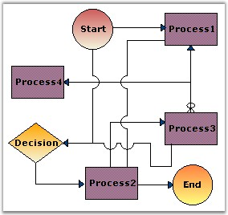

::: {style="DISPLAY: none"}
{#d2h_url_template}{#d2h_package_url style="WIDTH: 0px; DISPLAY: none; HEIGHT: 0px"}
:::

::::: {#nsbanner .d2h_main_nsbanner style="BORDER-BOTTOM: #999999 1px solid; POSITION: relative; PADDING-BOTTOM: 0px; BACKGROUND-COLOR: transparent; PADDING-LEFT: 0px; PADDING-RIGHT: 0px; DISPLAY: none; BORDER-TOP: #999999 1px solid; PADDING-TOP: 0px; LEFT: 0px"}
:::: {#TitleRow .d2h_main_titlerow style="PADDING-BOTTOM: 4px; BACKGROUND-COLOR: transparent; PADDING-LEFT: 22px; WIDTH: 100%; PADDING-RIGHT: 10px; DISPLAY: none; PADDING-TOP: 4px"}
::: {#ienav .d2h_main_ienav style="DISPLAY: none"}
{#D2HPrevious .D2HPreviousEnabled}  {#D2HNext .D2HNextEnabled}
:::
::::
:::::

:::::: {#nstext .d2h_main_nstext style="PADDING-BOTTOM: 10px; BACKGROUND-COLOR: transparent; PADDING-LEFT: 22px; PADDING-RIGHT: 10px; HEIGHT: 100%; OVERFLOW: auto; PADDING-TOP: 5px" hasuserbackground="true" valign="bottom"}
::: {#d2h_breadcrumbs .d2h_breadcrumbs}
[Essential Studio User Guide Documentation](ms-xhelp:///?Id=12457748-09e3-4d74-a240-8e049cedf030){.d2h_breadcrumbsNormal}[ \> ]{.d2h_breadcrumbsLinkSeparator}[User Interface Edition](ms-xhelp:///?Id=c29296b7-531c-413b-a0ec-488ca1f7f669){.d2h_breadcrumbsNormal}[ \> ]{.d2h_breadcrumbsLinkSeparator}[Essential Windows](ms-xhelp:///?Id=e60759d8-47a4-4570-9d7a-16a68d63f2ea){.d2h_breadcrumbsNormal}[ \> ]{.d2h_breadcrumbsLinkSeparator}[Essential Diagram]{.d2h_breadcrumbsContentsOnly}[ \> ]{.d2h_breadcrumbsLinkSeparator}[Concepts And Features](ms-xhelp:///?Id=008cec4b-5177-4859-8616-c062751d8fb6){.d2h_breadcrumbsNormal}[ \> ]{.d2h_breadcrumbsLinkSeparator}[Customizing Nodes](ms-xhelp:///?Id=7372bf61-8d78-49c9-b18c-3645397e182b){.d2h_breadcrumbsNormal}
:::

### Line Bridging {#line-bridging style="tab-stops: 0pt"}

[]{style="FONT-FAMILY: 'Trebuchet MS','sans-serif'; COLOR: #15428b; FONT-SIZE: 9pt"} 

Line bridging provides the visual effect such that the links jump over other links that are found in it\'s way with lower ZOrder, thereby avoiding the links from intersecting each other and providing a hassle-free view to clearly state the various connections between the nodes. This is done by enabling the LineBridgingEnabled property. Default value is ***false***.

[]{style="FONT-FAMILY: 'Trebuchet MS','sans-serif'; COLOR: #15428b; FONT-SIZE: 9pt"} 

{border="0"}

[]{style="FONT-FAMILY: 'Trebuchet MS','sans-serif'; COLOR: #15428b; FONT-SIZE: 9pt"} 

Figure 45:  Line Bridging

[]{style="FONT-FAMILY: 'Trebuchet MS','sans-serif'; COLOR: #15428b; FONT-SIZE: 9pt"} 

The below table lists the properties which controls the appearance of the bridge.

[]{style="FONT-FAMILY: 'Trebuchet MS','sans-serif'; COLOR: #15428b; FONT-SIZE: 9pt"} 

::: {align="center"}
+-----------------------------------+----------------------------------------------------------------------------------------------------------------------------------------------------------------------------------------------------------------------------------------------------------------------+
| Property                          | Description                                                                                                                                                                                                                                                          |
+-----------------------------------+----------------------------------------------------------------------------------------------------------------------------------------------------------------------------------------------------------------------------------------------------------------------+
| LineBridgeSize                    | Allows to set the size of the bridge when the links intersect each other. Default value is 16.                                                                                                                                                                       |
+-----------------------------------+----------------------------------------------------------------------------------------------------------------------------------------------------------------------------------------------------------------------------------------------------------------------+
| BridgeStyle                       | Specifies the type of bridge to be applied. Default value is \'Arc\'. The value when set, applies to all the links that are drawn on the diagram. The links will bridge over the other link only when it\'s ZOrder value is high. The options include the following: |
|                                   |                                                                                                                                                                                                                                                                      |
|                                   | []{style="FONT-FAMILY: 'Trebuchet MS','sans-serif'; COLOR: #15428b; FONT-SIZE: 9pt"}                                                                                                                                                                                 |
|                                   |                                                                                                                                                                                                                                                                      |
|                                   | [·      ]{style="FONT-FAMILY: Symbol"}Arc                                                                                                                                                                                                                            |
|                                   |                                                                                                                                                                                                                                                                      |
|                                   | [·      ]{style="FONT-FAMILY: Symbol"}Gap                                                                                                                                                                                                                            |
|                                   |                                                                                                                                                                                                                                                                      |
|                                   | [·      ]{style="FONT-FAMILY: Symbol"}Square                                                                                                                                                                                                                         |
|                                   |                                                                                                                                                                                                                                                                      |
|                                   | [·      ]{style="FONT-FAMILY: Symbol"}Side2                                                                                                                                                                                                                          |
|                                   |                                                                                                                                                                                                                                                                      |
|                                   | [·      ]{style="FONT-FAMILY: Symbol"}Side3                                                                                                                                                                                                                          |
|                                   |                                                                                                                                                                                                                                                                      |
|                                   | [·      ]{style="FONT-FAMILY: Symbol"}Side4                                                                                                                                                                                                                          |
|                                   |                                                                                                                                                                                                                                                                      |
|                                   | [·      ]{style="FONT-FAMILY: Symbol"}Side5                                                                                                                                                                                                                          |
|                                   |                                                                                                                                                                                                                                                                      |
|                                   | [·      ]{style="FONT-FAMILY: Symbol"}Side6                                                                                                                                                                                                                          |
|                                   |                                                                                                                                                                                                                                                                      |
|                                   | [·      ]{style="FONT-FAMILY: Symbol"}Side7                                                                                                                                                                                                                          |
+-----------------------------------+----------------------------------------------------------------------------------------------------------------------------------------------------------------------------------------------------------------------------------------------------------------------+
:::

[]{style="FONT-FAMILY: 'Trebuchet MS','sans-serif'; COLOR: #15428b; FONT-SIZE: 9pt"} 

Programmatically it can be set as follows:

[]{style="FONT-FAMILY: 'Trebuchet MS','sans-serif'; COLOR: #15428b; FONT-SIZE: 9pt"} 

+-----------------------------------------------------------------------------------------------------------------------------------------------------------------+
| **[\[C#\]]{style="FONT-FAMILY: 'Courier New'; COLOR: black"}**                                                                                                  |
|                                                                                                                                                                 |
| []{style="FONT-FAMILY: 'Courier New'; COLOR: blue"}                                                                                                             |
|                                                                                                                                                                 |
| [this]{style="FONT-FAMILY: 'Courier New'; COLOR: blue"}[.diagram1.Model.LineBridgeSize = 5;]{style="FONT-FAMILY: 'Courier New'"}                                |
|                                                                                                                                                                 |
| []{style="FONT-FAMILY: 'Courier New'"}                                                                                                                          |
|                                                                                                                                                                 |
| [//enabling for model]{style="FONT-FAMILY: 'Courier New'; COLOR: green"}                                                                                        |
|                                                                                                                                                                 |
| [this]{style="FONT-FAMILY: 'Courier New'; COLOR: blue"}[.diagram1.Model.LineBridgingEnabled = [true]{style="COLOR: blue"};]{style="FONT-FAMILY: 'Courier New'"} |
|                                                                                                                                                                 |
| []{style="FONT-FAMILY: 'Courier New'"}                                                                                                                          |
|                                                                                                                                                                 |
| [//enabling for link object]{style="FONT-FAMILY: 'Courier New'; COLOR: green"}                                                                                  |
|                                                                                                                                                                 |
| [link.LineBridgingEnabled = [true]{style="COLOR: blue"};]{style="FONT-FAMILY: 'Courier New'"}                                                                   |
|                                                                                                                                                                 |
| []{style="FONT-FAMILY: 'Courier New'"}                                                                                                                          |
|                                                                                                                                                                 |
| [this]{style="FONT-FAMILY: 'Courier New'; COLOR: blue"}[.diagram1.Model.BridgeStyle = BridgeStyle.Square;]{style="FONT-FAMILY: 'Courier New'"}                  |
+-----------------------------------------------------------------------------------------------------------------------------------------------------------------+

**[]{style="FONT-FAMILY: 'Trebuchet MS','sans-serif'; COLOR: #15428b; FONT-SIZE: 9pt"}** 

+--------------------------------------------------------------------------------------------------------------------------------------------------------------+
| **[\[VB\]]{style="FONT-FAMILY: 'Courier New'; COLOR: black"}**                                                                                               |
|                                                                                                                                                              |
| []{style="FONT-FAMILY: 'Courier New'; COLOR: blue"}                                                                                                          |
|                                                                                                                                                              |
| [Me]{style="FONT-FAMILY: 'Courier New'; COLOR: blue"}[.diagram1.Model.LineBridgeSize = 5]{style="FONT-FAMILY: 'Courier New'"}                                |
|                                                                                                                                                              |
| []{style="FONT-FAMILY: 'Courier New'"}                                                                                                                       |
|                                                                                                                                                              |
| [\'enabling for model]{style="FONT-FAMILY: 'Courier New'; COLOR: green"}                                                                                     |
|                                                                                                                                                              |
| [Me]{style="FONT-FAMILY: 'Courier New'; COLOR: blue"}[.diagram1.Model.LineBridgingEnabled = [True]{style="COLOR: blue"}]{style="FONT-FAMILY: 'Courier New'"} |
|                                                                                                                                                              |
| []{style="FONT-FAMILY: 'Courier New'"}                                                                                                                       |
|                                                                                                                                                              |
| [\'enabling for link object]{style="FONT-FAMILY: 'Courier New'; COLOR: green"}                                                                               |
|                                                                                                                                                              |
| [link.LineBridgingEnabled = [True]{style="COLOR: blue"}]{style="FONT-FAMILY: 'Courier New'"}                                                                 |
|                                                                                                                                                              |
| []{style="FONT-FAMILY: 'Courier New'"}                                                                                                                       |
|                                                                                                                                                              |
| [Me]{style="FONT-FAMILY: 'Courier New'; COLOR: blue"}[.diagram1.Model.BridgeStyle = BridgeStyle.Square]{style="FONT-FAMILY: 'Courier New'"}                  |
+--------------------------------------------------------------------------------------------------------------------------------------------------------------+

[]{style="FONT-FAMILY: 'Trebuchet MS','sans-serif'; COLOR: #15428b; FONT-SIZE: 9pt"} 

::: {style="BORDER-BOTTOM: windowtext 1pt solid; BORDER-LEFT: medium none; PADDING-BOTTOM: 1pt; MARGIN-TOP: 9pt; PADDING-LEFT: 0pt; PADDING-RIGHT: 0pt; MARGIN-BOTTOM: 9pt; BORDER-TOP: windowtext 1pt solid; BORDER-RIGHT: medium none; PADDING-TOP: 1pt"}
{border="0"}Note: In the above code snippets, link refers to the instance of the Link node.
:::

[]{#p28} 

[]{#related-topics}
::::::
