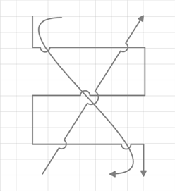

::: {style="DISPLAY: none"}
{#d2h_url_template}{#d2h_package_url style="WIDTH: 0px; DISPLAY: none; HEIGHT: 0px"}
:::

::::: {#nsbanner .d2h_main_nsbanner style="BORDER-BOTTOM: #999999 1px solid; POSITION: relative; PADDING-BOTTOM: 0px; BACKGROUND-COLOR: transparent; PADDING-LEFT: 0px; PADDING-RIGHT: 0px; DISPLAY: none; BORDER-TOP: #999999 1px solid; PADDING-TOP: 0px; LEFT: 0px"}
:::: {#TitleRow .d2h_main_titlerow style="PADDING-BOTTOM: 4px; BACKGROUND-COLOR: transparent; PADDING-LEFT: 22px; WIDTH: 100%; PADDING-RIGHT: 10px; DISPLAY: none; PADDING-TOP: 4px"}
::: {#ienav .d2h_main_ienav style="DISPLAY: none"}
{#D2HPrevious .D2HPreviousEnabled}  {#D2HNext .D2HNextEnabled}
:::
::::
:::::

:::::: {#nstext .d2h_main_nstext style="PADDING-BOTTOM: 10px; BACKGROUND-COLOR: transparent; PADDING-LEFT: 22px; PADDING-RIGHT: 10px; HEIGHT: 100%; OVERFLOW: auto; PADDING-TOP: 5px" hasuserbackground="true" valign="bottom"}
::: {#d2h_breadcrumbs .d2h_breadcrumbs}
[Essential Studio User Guide Documentation](ms-xhelp:///?Id=12457748-09e3-4d74-a240-8e049cedf030){.d2h_breadcrumbsNormal}[ \> ]{.d2h_breadcrumbsLinkSeparator}[User Interface Edition](ms-xhelp:///?Id=c29296b7-531c-413b-a0ec-488ca1f7f669){.d2h_breadcrumbsNormal}[ \> ]{.d2h_breadcrumbsLinkSeparator}[Essential Silverlight](ms-xhelp:///?Id=66221bd1-ba2e-43c2-94a7-618f50e01d24){.d2h_breadcrumbsNormal}[ \> ]{.d2h_breadcrumbsLinkSeparator}[Essential Diagram]{.d2h_breadcrumbsContentsOnly}[ \> ]{.d2h_breadcrumbsLinkSeparator}[Concepts and Features](ms-xhelp:///?Id=d592a058-dcc0-44a4-994e-e7901da8db52){.d2h_breadcrumbsNormal}[ \> ]{.d2h_breadcrumbsLinkSeparator}[Line Connectors](ms-xhelp:///?Id=c0725ce8-38f1-496a-8a8e-c6602250e6b6){.d2h_breadcrumbsNormal}
:::

### Line bridging support for Diagram Silverlight {#line-bridging-support-for-diagram-silverlight style="tab-stops: 0pt"}

Line Bridging creates a bridge for lines to smartly cross over other line at points of intersection. When two line connectors meets each other, line with higher z-order will draw an arc over the line with lower z-order. Only Straight and Orthogonal Connector type supports line bridging.

[]{style="FONT-FAMILY: 'Calibri','sans-serif'; FONT-SIZE: 11pt"} 

Properties

*[]{style="FONT-SIZE: 9pt"}* 

::: {align="center"}
+---------------------+-------------------------------------------------------------------+---------------------+-------------+-----------------+
| Property            | Description                                                       | Type                | Data Type   | Reference Links |
+---------------------+-------------------------------------------------------------------+---------------------+-------------+-----------------+
| LineBridgingEnabled | Gets or sets a value indicating whether line bridging is enabled. | Dependency property | Boolean     | No              |
|                     |                                                                   |                     |             |                 |
|                     | The default value is false.                                       |                     |             |                 |
+---------------------+-------------------------------------------------------------------+---------------------+-------------+-----------------+
:::

[]{style="FONT-FAMILY: 'Calibri','sans-serif'; FONT-SIZE: 11pt"} 

Enabling Line Bridging for a Line connector

To enable line bridging for a line connector, set the *LineBridgingEnabled* property of *ConnectorBase* to true.  To disable line bridging, set this to false. Default value is false.

[]{style="FONT-FAMILY: 'Calibri','sans-serif'; FONT-SIZE: 11pt"} 

Following code illustrates how to enable line bridging for a line connector:

[]{style="FONT-FAMILY: 'Calibri','sans-serif'; FONT-SIZE: 11pt"} 

+-------------------------------------------------------------------------------------------------------------------------------------------------------------------------------------------+
| **[\[C#\]]{style="FONT-FAMILY: 'Courier New'"}**                                                                                                                                          |
|                                                                                                                                                                                           |
| [      LineConnector]{style="FONT-FAMILY: 'Courier New'; COLOR: #2b91af"}[ l = [new]{style="COLOR: blue"} [LineConnector]{style="COLOR: #2b91af"}();]{style="FONT-FAMILY: 'Courier New'"} |
|                                                                                                                                                                                           |
| [      l.LineBridgingEnabled = [true]{style="COLOR: blue"};]{style="FONT-FAMILY: 'Courier New'"}                                                                                          |
|                                                                                                                                                                                           |
| []{style="FONT-FAMILY: 'Courier New'"}                                                                                                                                                    |
+-------------------------------------------------------------------------------------------------------------------------------------------------------------------------------------------+

[]{style="FONT-FAMILY: 'Calibri','sans-serif'; FONT-SIZE: 11pt"} 

+-----------------------------------------------------------------------------------------------------------------------------------------------------------------------------------------------------------------------------------------------+
| **[\[VB\]]{style="FONT-FAMILY: 'Courier New'"}**                                                                                                                                                                                              |
|                                                                                                                                                                                                                                               |
| [       ]{style="FONT-FAMILY: Consolas; COLOR: #2b91af; FONT-SIZE: 9.5pt"}[Dim]{style="FONT-FAMILY: 'Courier New'; COLOR: blue"}[ l [As]{style="COLOR: blue"} [New]{style="COLOR: blue"} LineConnector()]{style="FONT-FAMILY: 'Courier New'"} |
|                                                                                                                                                                                                                                               |
| [      l.LineBridgingEnabled = [True]{style="COLOR: blue"}]{style="FONT-FAMILY: 'Courier New'"}                                                                                                                                               |
|                                                                                                                                                                                                                                               |
| []{style="FONT-FAMILY: 'Courier New'"}                                                                                                                                                                                                        |
+-----------------------------------------------------------------------------------------------------------------------------------------------------------------------------------------------------------------------------------------------+

[                ]{style="FONT-FAMILY: 'Calibri','sans-serif'; FONT-SIZE: 11pt"}

Enabling Line Bridging for Diagram View[]{style="FONT-FAMILY: 'Cambria','serif'; FONT-SIZE: 13pt"}

To enable line bridging for the Diagram View, set the *LineBridgingEnabled* property of *DiagramView* to true.  To disable line bridging, set this to false. Default value is false.

 

Following code illustrates how to enable line bridging for the Diagram View:

 

+---------------------------------------------------------------------------------------------------------------------------------------------------------------------------------------------------+
| **[\[C#\]]{style="FONT-FAMILY: 'Courier New'"}**                                                                                                                                                  |
|                                                                                                                                                                                                   |
| [      DiagramView]{style="FONT-FAMILY: 'Courier New'; COLOR: #2b91af"}[ diagramView1 = [new]{style="COLOR: blue"} [DiagramView]{style="COLOR: #2b91af"} ();]{style="FONT-FAMILY: 'Courier New'"} |
|                                                                                                                                                                                                   |
| [      diagramView1.LineBridgingEnabled = [true]{style="COLOR: blue"};]{style="FONT-FAMILY: 'Courier New'"}                                                                                       |
|                                                                                                                                                                                                   |
| []{style="FONT-FAMILY: 'Courier New'"}                                                                                                                                                            |
+---------------------------------------------------------------------------------------------------------------------------------------------------------------------------------------------------+

[]{style="FONT-FAMILY: 'Calibri','sans-serif'; FONT-SIZE: 11pt"} 

+---------------------------------------------------------------------------------------------------------------------------------------------------------------------------------------------------------------------------------------------------------+
| **[\[VB\]]{style="FONT-FAMILY: 'Courier New'"}**                                                                                                                                                                                                        |
|                                                                                                                                                                                                                                                         |
| [       ]{style="FONT-FAMILY: Consolas; COLOR: #2b91af; FONT-SIZE: 9.5pt"}[Dim]{style="FONT-FAMILY: 'Courier New'; COLOR: blue"}[ diagramView1 [As]{style="COLOR: blue"} [New]{style="COLOR: blue"} DiagramView ()]{style="FONT-FAMILY: 'Courier New'"} |
|                                                                                                                                                                                                                                                         |
| [      diagramView1.LineBridgingEnabled = [True]{style="COLOR: blue"}]{style="FONT-FAMILY: 'Courier New'"}                                                                                                                                              |
|                                                                                                                                                                                                                                                         |
| []{style="FONT-FAMILY: 'Courier New'"}                                                                                                                                                                                                                  |
+---------------------------------------------------------------------------------------------------------------------------------------------------------------------------------------------------------------------------------------------------------+

[                ]{style="FONT-FAMILY: 'Calibri','sans-serif'; FONT-SIZE: 11pt"}

[]{style="FONT-FAMILY: 'Calibri','sans-serif'; FONT-SIZE: 11pt"} 

::: {style="BORDER-BOTTOM: windowtext 1pt solid; BORDER-LEFT: medium none; PADDING-BOTTOM: 1pt; MARGIN-TOP: 9pt; PADDING-LEFT: 0pt; PADDING-RIGHT: 0pt; MARGIN-BOTTOM: 9pt; BORDER-TOP: windowtext 1pt solid; BORDER-RIGHT: medium none; PADDING-TOP: 1pt"}
 

{border="0"}Note: When LineBridging for DiagramView is enabled or disabled, LineBridging for all the lines will also be enabled or disabled respectively. You can change this binding by specifying a value for an individual LineConnector.
:::

 

{border="0"}

Figure 71: Connectors with Line Bridging

 

Selecting, Moving, Deleting a LineConnector\
\

As this is a general topic to be shared between the Node and LineConnector, refer the general topics under Concepts and features using the following links:\
\

[Select Node and Connector]{.UGHyperlink}[s]{.UGHyperlink}

[Move Node and Connectors]{.UGHyperlink}[]{.UGHyperlink}

[[]{style="TEXT-DECORATION: none"}]{.UGHyperlink} 

[[]{style="TEXT-DECORATION: none"}]{.UGHyperlink} 

[]{#related-topics}
::::::
