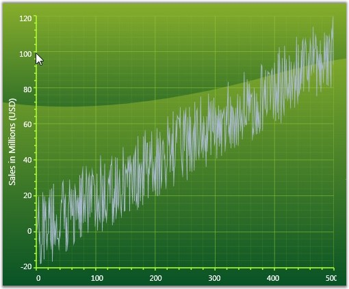
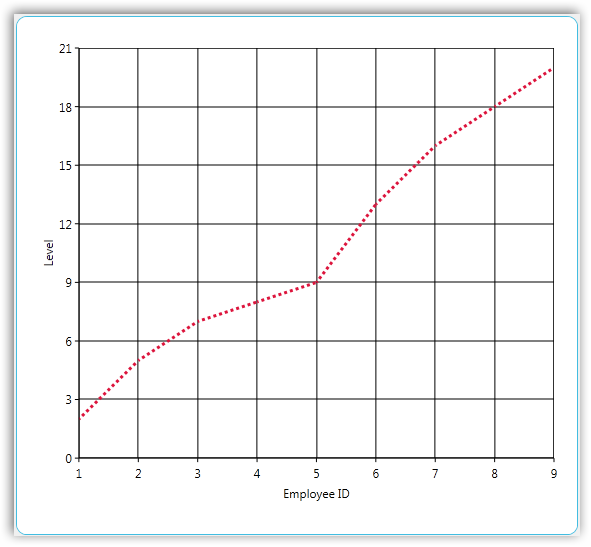
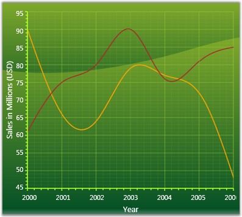
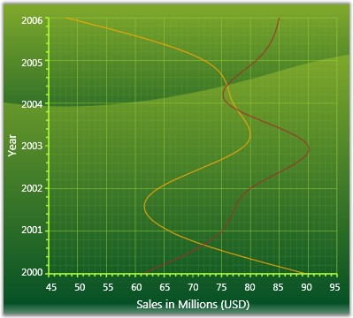
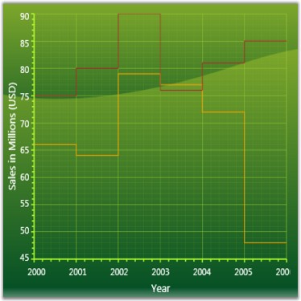

::: {style="DISPLAY: none"}
{#d2h_url_template}{#d2h_package_url style="WIDTH: 0px; DISPLAY: none; HEIGHT: 0px"}
:::

::::::::::::::: {.d2h_secondary_topic style="PADDING-BOTTOM: 10pt; MARGIN: 0pt; PADDING-LEFT: 0pt; PADDING-RIGHT: 0pt; PADDING-TOP: 0pt"}
##### Line Charts[]{#p72} {#line-charts style="tab-stops: 0pt"}

###### 4.1.1.4.1.1 Line Chart {#line-chart style="tab-stops: 0pt"}

Line Charts join points on a plot using straight lines showing trends in data at equal intervals. Line charts treats the input as non-numeric, categorical information, equally spaced along the x-axis. This is appropriate for categorical data, such as text labels, but can produce unexpected results when the x values consist of numbers.

 

When rendered in 3D the plot looks like a ribbon and hence such types are also referred to as Ribbon or Strip Charts.

 

The appearance of the lines and the points can be configured with options such as the colors used, thickness of the lines and the symbols displayed.

 

{border="0"}

Figure 114: Line Chart

[]{style="FONT-FAMILY: 'Trebuchet MS','sans-serif'; COLOR: #15428b; FONT-SIZE: 9pt"} 

Data Requirements

The following are the details about Line Chart:

[]{style="FONT-FAMILY: 'Trebuchet MS','sans-serif'; COLOR: #15428b; FONT-SIZE: 9pt"} 

Table 21: Data Requirement

::: {align="center"}
+------------------------------+-------------+
| Details                                    |
+------------------------------+-------------+
| Number of y values per point | one         |
+------------------------------+-------------+
| Number of points             | one or more |
+------------------------------+-------------+
| Number of series             | one or more |
+------------------------------+-------------+
:::

[]{style="FONT-FAMILY: 'Trebuchet MS','sans-serif'; COLOR: #15428b; FONT-SIZE: 9pt"} 

Template

While setting template the following parameters can be used.

[]{style="FONT-FAMILY: 'Trebuchet MS','sans-serif'; COLOR: #15428b; FONT-SIZE: 9pt"} 

Table 22: Template parameters

::: {align="center"}
  ---------- ------------- ------------------------------
  Name       Type          Description
  X1         double        x-coordinate of first point
  Y1         double        y-coordinate of first point
  X2         double        x-coordinate of second point
  Y2         double        y-coordinate of second point
  Interior   Brush         column color
  Series     ChartSeries   reference to series-owner
  ---------- ------------- ------------------------------
:::

[]{style="FONT-FAMILY: 'Trebuchet MS','sans-serif'; COLOR: #15428b; FONT-SIZE: 9pt"} 

A sample which demonstrates Line Chart Types is available in the following sample installation path.

[]{style="FONT-FAMILY: 'Trebuchet MS','sans-serif'; COLOR: #15428b; FONT-SIZE: 9pt"} 

***..My Documents\\Syncfusion\\EssentialStudio\\\<Version Number\>\\WPF\\Chart.WPF\\Samples\\3.5\\WindowsSamples\\Chart Gallery\\Line Chart Demo***

[]{style="FONT-FAMILY: 'Trebuchet MS','sans-serif'; COLOR: #15428b; FONT-SIZE: 9pt"} 

See Also

[[Chart Types]{.UGHyperlink}](ms-xhelp:///?Id=4fc74b66-07ff-4d5b-81e2-b57393d53fc3)[]{.UGHyperlink}

[]{#p73} 

###### 4.1.1.4.1.2 Fast Line Chart {#fast-line-chart style="tab-stops: 0pt"}

Use a Fast Line chart instead of a Line chart when displaying a large number of data points in the chart. This chart type improves performance by foregoing some features in the Line chart.

[]{style="FONT-FAMILY: 'Trebuchet MS','sans-serif'; COLOR: #15428b; FONT-SIZE: 9pt"} 

{border="0"}

Figure 115: FastLine Chart

 

Data Requirements

The following are the details about Fast Line Chart:

[]{style="FONT-FAMILY: 'Trebuchet MS','sans-serif'; COLOR: #15428b; FONT-SIZE: 9pt"} 

Table 23: Data Requirement

::: {align="center"}
+------------------------------+-------------+
| Details                                    |
+------------------------------+-------------+
| Number of y values per point | One         |
+------------------------------+-------------+
| Number of points             | one or more |
+------------------------------+-------------+
| Number of series             | one or more |
+------------------------------+-------------+
:::

[]{style="FONT-FAMILY: 'Trebuchet MS','sans-serif'; COLOR: #15428b; FONT-SIZE: 9pt"} 

 

Template

While setting template the following parameters can be used:

[]{style="FONT-FAMILY: 'Trebuchet MS','sans-serif'; COLOR: #15428b; FONT-SIZE: 9pt"} 

Table 24: Template Parameter

::: {align="center"}
  ---------- ------------- ------------------------------
  Name       Type          Description
  X1         Double        x-coordinate of first point
  Y1         Double        y-coordinate of first point
  X2         Double        x-coordinate of second point
  Y2         Double        y-coordinate of second point
  Interior   Brush         column color
  Series     ChartSeries   reference to series-owner
  ---------- ------------- ------------------------------
:::

[]{style="FONT-FAMILY: 'Trebuchet MS','sans-serif'; COLOR: #15428b; FONT-SIZE: 9pt"} 

A sample which demonstrates Line Chart Types is available in the following sample installation path.

[]{style="FONT-FAMILY: 'Trebuchet MS','sans-serif'; COLOR: #15428b; FONT-SIZE: 9pt"} 

***..My Documents\\Syncfusion\\EssentialStudio\\\<Version Number\>\\WPF\\Chart.WPF\\Samples\\3.5\\WindowsSamples\\Chart Gallery\\Line Chart Demo***

**** 

**** 

Customization of FastLine

Essential Chart enables you to customize the look and feel of the Fastline chart.

Following types of lines are supported for FastLine chart:

[·      ]{style="FONT-FAMILY: Symbol"}Dash line

[·      ]{style="FONT-FAMILY: Symbol"}Dot line

[·      ]{style="FONT-FAMILY: Symbol"}Dash-dot line

[·      ]{style="FONT-FAMILY: Symbol"}Dash-dot-dot line

 

Property

Table 25: Property Table

::: {align="center"}
  ---------- --------------------------------------------------------------- ------------------------------------------------ -------------------- --------------------------------------------------------------------------------------------------------------
  Property   Description                                                     Type                                             Data Type            Reference links
  Pen        Gets and sets various types of pen for drawing fastchat type.   Attached property for ChartFastSeriesPresenter   System.Drawing.Pen   [[Pen Class]{.UGHyperlink}](http://msdn.microsoft.com/en-us/library/system.drawing.pen.aspx)[]{.UGHyperlink}
  ---------- --------------------------------------------------------------- ------------------------------------------------ -------------------- --------------------------------------------------------------------------------------------------------------
:::

 

Customizing Fastline

To customize the FastLine chart, use the *Pen* property of *ChartFastSeriesPresenter*.

 

The following code illustrates this:

[]{style="FONT-WEIGHT: normal"} 

+----------------------------------------------------------------------------------------------------------------------------------------------------------------------------------------------------------------------------------------------------------------------------------------------------------------------------------------------------------------------------------------------------------------------------------------------------------------------------------------------------------------------------------------------------------------------------------------------------------------------------------------------------------------------------------------------------------------------------------------------------------------------------------------------------------------------------------------------------------------------------+
| **[\[XAML\]]{style="FONT-FAMILY: 'Courier New'"}**                                                                                                                                                                                                                                                                                                                                                                                                                                                                                                                                                                                                                                                                                                                                                                                                                         |
|                                                                                                                                                                                                                                                                                                                                                                                                                                                                                                                                                                                                                                                                                                                                                                                                                                                                            |
| []{style="FONT-FAMILY: 'Courier New'; COLOR: blue"}                                                                                                                                                                                                                                                                                                                                                                                                                                                                                                                                                                                                                                                                                                                                                                                                                        |
|                                                                                                                                                                                                                                                                                                                                                                                                                                                                                                                                                                                                                                                                                                                                                                                                                                                                            |
| [\<]{style="FONT-FAMILY: 'Courier New'; COLOR: blue"}[syncfusion]{style="FONT-FAMILY: 'Courier New'; COLOR: #a31515"}[:]{style="FONT-FAMILY: 'Courier New'; COLOR: blue"}[ChartSeries]{style="FONT-FAMILY: 'Courier New'; COLOR: #a31515"}[ Name]{style="FONT-FAMILY: 'Courier New'; COLOR: red"}[=\"series\"]{style="FONT-FAMILY: 'Courier New'; COLOR: blue"}[ Type]{style="FONT-FAMILY: 'Courier New'; COLOR: red"}[=\"FastLine\"]{style="FONT-FAMILY: 'Courier New'; COLOR: blue"}[ IsIndexed]{style="FONT-FAMILY: 'Courier New'; COLOR: red"}[=\"True\"]{style="FONT-FAMILY: 'Courier New'; COLOR: blue"}[ [ Interior]{style="COLOR: red"}[=\"LightBlue\" \>]{style="COLOR: blue"}]{style="FONT-FAMILY: 'Courier New'"}                                                                                                                                               |
|                                                                                                                                                                                                                                                                                                                                                                                                                                                                                                                                                                                                                                                                                                                                                                                                                                                                            |
| [                            ]{style="FONT-FAMILY: 'Courier New'; COLOR: #a31515"}[\<]{style="FONT-FAMILY: 'Courier New'; COLOR: blue"}[syncfusion]{style="FONT-FAMILY: 'Courier New'; COLOR: #a31515"}[:]{style="FONT-FAMILY: 'Courier New'; COLOR: blue"}[ChartFastSeriesPresenter.Pen]{style="FONT-FAMILY: 'Courier New'; COLOR: #a31515"}[\>]{style="FONT-FAMILY: 'Courier New'; COLOR: blue"}[]{style="FONT-FAMILY: 'Courier New'"}                                                                                                                                                                                                                                                                                                                                                                                                                                   |
|                                                                                                                                                                                                                                                                                                                                                                                                                                                                                                                                                                                                                                                                                                                                                                                                                                                                            |
| [                                ]{style="FONT-FAMILY: 'Courier New'; COLOR: #a31515"}[\<]{style="FONT-FAMILY: 'Courier New'; COLOR: blue"}[Pen]{style="FONT-FAMILY: 'Courier New'; COLOR: #a31515"}[ Brush]{style="FONT-FAMILY: 'Courier New'; COLOR: red"}[=\"Black\"]{style="FONT-FAMILY: 'Courier New'; COLOR: blue"}[ DashCap]{style="FONT-FAMILY: 'Courier New'; COLOR: red"}[=\"Round\"]{style="FONT-FAMILY: 'Courier New'; COLOR: blue"}[ DashStyle]{style="FONT-FAMILY: 'Courier New'; COLOR: red"}[=\"DashDot\"]{style="FONT-FAMILY: 'Courier New'; COLOR: blue"}[ StartLineCap]{style="FONT-FAMILY: 'Courier New'; COLOR: red"}[=\"Round\"]{style="FONT-FAMILY: 'Courier New'; COLOR: blue"}[ EndLineCap]{style="FONT-FAMILY: 'Courier New'; COLOR: red"}[=\"Round\"/\>]{style="FONT-FAMILY: 'Courier New'; COLOR: blue"}[]{style="FONT-FAMILY: 'Courier New'"} |
|                                                                                                                                                                                                                                                                                                                                                                                                                                                                                                                                                                                                                                                                                                                                                                                                                                                                            |
| [                            ]{style="FONT-FAMILY: 'Courier New'; COLOR: #a31515"}[\</]{style="FONT-FAMILY: 'Courier New'; COLOR: blue"}[syncfusion]{style="FONT-FAMILY: 'Courier New'; COLOR: #a31515"}[:]{style="FONT-FAMILY: 'Courier New'; COLOR: blue"}[ChartFastSeriesPresenter.Pen]{style="FONT-FAMILY: 'Courier New'; COLOR: #a31515"}[\>]{style="FONT-FAMILY: 'Courier New'; COLOR: blue"}[]{style="FONT-FAMILY: 'Courier New'"}                                                                                                                                                                                                                                                                                                                                                                                                                                  |
|                                                                                                                                                                                                                                                                                                                                                                                                                                                                                                                                                                                                                                                                                                                                                                                                                                                                            |
| [                        ]{style="FONT-FAMILY: 'Courier New'; COLOR: #a31515"}[\</]{style="FONT-FAMILY: 'Courier New'; COLOR: blue"}[syncfusion]{style="FONT-FAMILY: 'Courier New'; COLOR: #a31515"}[:]{style="FONT-FAMILY: 'Courier New'; COLOR: blue"}[ChartSeries]{style="FONT-FAMILY: 'Courier New'; COLOR: #a31515"}[\>]{style="FONT-FAMILY: 'Courier New'; COLOR: blue"}                                                                                                                                                                                                                                                                                                                                                                                                                                                                                             |
+----------------------------------------------------------------------------------------------------------------------------------------------------------------------------------------------------------------------------------------------------------------------------------------------------------------------------------------------------------------------------------------------------------------------------------------------------------------------------------------------------------------------------------------------------------------------------------------------------------------------------------------------------------------------------------------------------------------------------------------------------------------------------------------------------------------------------------------------------------------------------+

[]{style="FONT-WEIGHT: normal"} 

{border="0"}

Figure 116: Customized Fastline

[]{style="FONT-WEIGHT: normal"} 

Sample Link

To view a sample

1.   Open the Syncfusion Dashboard.

2.   Select User Interface.

3.   Click the **WPF** drop-down list and select **Explore Samples**.

4.   Navigate to ***Chart.WPF\\Samples\\3.5\\WindowsSamples\\Chart Customization\\ FastLine Customization Demo\\***

[]{style="FONT-WEIGHT: normal"} 

**** 

**** 

See Also

[[Chart Types]{.UGHyperlink}](ms-xhelp:///?Id=6c9c13a7-f17b-49bf-be20-23013db2d44d)[]{.UGHyperlink}

[]{#p74} 

 

###### 4.1.1.4.1.3 Spline Chart {#spline-chart style="tab-stops: 0pt"}

Spline Chart is similar to a Line Chart except that it connects the different data points using splines instead of straight lines.

 

When rendered in 3D the plot looks like a ribbon and hence such types are also referred to as Ribbon or Strip Charts.

 

The appearance of the lines and the points can be configured with options such as the colors used, thickness of the lines and the symbols displayed.

[]{style="FONT-FAMILY: 'Trebuchet MS','sans-serif'; COLOR: #15428b; FONT-SIZE: 9pt"} 

{border="0"}

Figure 117: Spline Chart\
\

Data Requirements

[]{style="FONT-FAMILY: 'Trebuchet MS','sans-serif'; COLOR: #15428b; FONT-SIZE: 9pt"} 

The following are the details about Spline Chart:

[]{style="FONT-FAMILY: 'Trebuchet MS','sans-serif'; COLOR: #15428b; FONT-SIZE: 9pt"} 

Table 26: Data Requirement

::: {align="center"}
+------------------------------+-------------+
| Details                                    |
+------------------------------+-------------+
| Number of y values per point | one         |
+------------------------------+-------------+
| Number of points             | one or more |
+------------------------------+-------------+
| Number of series             | one or more |
+------------------------------+-------------+
:::

[]{style="FONT-FAMILY: 'Trebuchet MS','sans-serif'; COLOR: #15428b; FONT-SIZE: 9pt"} 

Spline Settings

[]{style="FONT-FAMILY: 'Trebuchet MS','sans-serif'; COLOR: #15428b; FONT-SIZE: 9pt"} 

Table 27: Spline Setting

::: {align="center"}
  ----------------------------------- -------- ------------- ---------------------------------------------------------------
  Name                                Type     Container     Description
  ChartSplineType.SplineCoefficient   double   ChartSeries   attached property which lets you control the spline curvature
  ----------------------------------- -------- ------------- ---------------------------------------------------------------
:::

[]{style="FONT-FAMILY: 'Trebuchet MS','sans-serif'; COLOR: #15428b; FONT-SIZE: 9pt"} 

Template

While setting template the following parameters can be used.

[]{style="FONT-FAMILY: 'Trebuchet MS','sans-serif'; COLOR: #15428b; FONT-SIZE: 9pt"} 

Table 28L Template Parameter

::: {align="center"}
  ---------- ------------- ------------------------------
  Name       Type          Description
  X1         double        x-coordinate of first point
  Y1         double        y-coordinate of first point
  X2         double        x-coordinate of second point
  Y2         double        y-coordinate of second point
  Geometry   Geometry      segment geometry
  Interior   Brush         column color
  Series     ChartSeries   reference to series-owner
  ---------- ------------- ------------------------------
:::

[]{style="FONT-FAMILY: 'Trebuchet MS','sans-serif'; COLOR: #15428b; FONT-SIZE: 9pt"} 

A sample which demonstrates Line Chart Types is available in the following sample installation path.

[]{style="FONT-FAMILY: 'Trebuchet MS','sans-serif'; COLOR: #15428b; FONT-SIZE: 9pt"} 

***..My Documents\\Syncfusion\\EssentialStudio\\\<Version Number\>\\WPF\\Chart.WPF\\Samples\\3.5\\WindowsSamples\\Chart Gallery\\Line Chart Demo***

**** 

See Also

[[Chart Types]{.UGHyperlink}](ms-xhelp:///?Id=6c9c13a7-f17b-49bf-be20-23013db2d44d)[]{.UGHyperlink}

[]{#p75} 

 

###### 4.1.1.4.1.4 Rotated Spline Chart {#rotated-spline-chart style="tab-stops: 0pt"}

A Rotated Spline Chart is similar to a Spline Chart. The only difference is that it would be rotated. It plots one or several series of data and joins each series by smooth, rotated spline curves instead of straight lines.

 

The following image shows a sample Rotated Spline Chart.

[]{style="FONT-FAMILY: 'Trebuchet MS','sans-serif'; COLOR: #15428b; FONT-SIZE: 9pt"} 

{border="0"}

Figure 118: Rotated Spline Chart

***[]{style="FONT-FAMILY: 'Trebuchet MS','sans-serif'; COLOR: #15428b; FONT-SIZE: 9pt"}*** 

Data Requirements

The following are the details about Rotated Spline Chart:

**[]{style="POSITION: relative; COLOR: #4a5c8c; FONT-SIZE: 9pt; TOP: 4.5pt"}** 

Table 29: Data Requirement

::: {align="center"}
+------------------------------+-------------+
| Details                                    |
+------------------------------+-------------+
| Number of y values per point | one         |
+------------------------------+-------------+
| Number of points             | one or more |
+------------------------------+-------------+
| Number of series             | one or more |
+------------------------------+-------------+
:::

[]{style="FONT-FAMILY: 'Trebuchet MS','sans-serif'; COLOR: #15428b; FONT-SIZE: 9pt"} 

Rotated Spline Settings

[]{style="FONT-FAMILY: 'Trebuchet MS','sans-serif'; COLOR: #15428b; FONT-SIZE: 9pt"} 

Table 30: Rotated Spline Settings

::: {align="center"}
  ----------------------------------- -------- ------------- ---------------------------------------------------------------
  Name                                Type     Container     Description
  ChartSplineType.SplineCoefficient   double   ChartSeries   attached property which lets you control the spline curvature
  ----------------------------------- -------- ------------- ---------------------------------------------------------------
:::

[]{style="FONT-FAMILY: 'Trebuchet MS','sans-serif'; COLOR: #15428b; FONT-SIZE: 9pt"} 

A sample which demonstrates Line Chart Types is available in the following sample installation path.

[]{style="FONT-FAMILY: 'Trebuchet MS','sans-serif'; COLOR: #15428b; FONT-SIZE: 9pt"} 

***..My Documents\\Syncfusion\\EssentialStudio\\\<Version Number\>\\WPF\\Chart.WPF\\Samples\\3.5\\WindowsSamples\\Chart Gallery\\Line Chart Demo***

***[]{style="FONT-FAMILY: 'Trebuchet MS','sans-serif'; COLOR: #15428b; FONT-SIZE: 9pt"}*** 

See Also

[[Chart Types]{.UGHyperlink}](ms-xhelp:///?Id=6c9c13a7-f17b-49bf-be20-23013db2d44d)[]{.UGHyperlink}

[]{#p76} 

###### 4.1.1.4.1.5 Step Line Chart {#step-line-chart style="tab-stops: 0pt"}

Step Line Charts use horizontal and vertical lines to connect data points resulting in a step like progression.

[]{style="FONT-FAMILY: 'Trebuchet MS','sans-serif'; COLOR: #15428b; FONT-SIZE: 9pt"} 

{border="0"}

Figure 119: Step Line Chart

[]{style="FONT-FAMILY: 'Trebuchet MS','sans-serif'; COLOR: #15428b; FONT-SIZE: 9pt"} 

Data Requirements

The following are the details about Step Line Chart:

**[]{style="POSITION: relative; COLOR: #4a5c8c; FONT-SIZE: 9pt; TOP: 4.5pt"}** 

Table 31: Data Requirement

::: {align="center"}
+------------------------------+-------------+
| Details                                    |
+------------------------------+-------------+
| Number of y values per point | one         |
+------------------------------+-------------+
| Number of points             | one or more |
+------------------------------+-------------+
| Number of series             | one or more |
+------------------------------+-------------+
:::

[]{style="FONT-FAMILY: 'Trebuchet MS','sans-serif'; COLOR: #15428b; FONT-SIZE: 9pt"} 

Template

While setting template the following parameters can be used:

[]{style="FONT-FAMILY: 'Trebuchet MS','sans-serif'; COLOR: #15428b; FONT-SIZE: 9pt"} 

Table 32: Template Parameter

::: {align="center"}
  ---------- ----------------- ---------------------------------
  Name       Type              Description
  X1         double            x-coordinate of first point
  Y1         double            y-coordinate of first point
  X2         double            x-coordinate of second point
  Y2         double            y-coordinate of second point
  StepX      double            x-coordinate of transient point
  StepY      double            y-coordinate of transient point
  Points     PointCollection   collection of  segment points
  Interior   Brush             column color
  Series     ChartSeries       reference to series-owner
  ---------- ----------------- ---------------------------------
:::

[]{style="FONT-FAMILY: 'Trebuchet MS','sans-serif'; COLOR: #15428b; FONT-SIZE: 9pt"} 

A sample which demonstrates Line Chart Types is available in the following sample installation path.

[]{style="FONT-FAMILY: 'Trebuchet MS','sans-serif'; COLOR: #15428b; FONT-SIZE: 9pt"} 

***..My Documents\\Syncfusion\\EssentialStudio\\\<Version Number\>\\WPF\\Chart.WPF\\Samples\\3.5\\WindowsSamples\\Chart Gallery\\Line Chart Demo***

**** 

See Also

[[Chart Types]{.UGHyperlink}](ms-xhelp:///?Id=6c9c13a7-f17b-49bf-be20-23013db2d44d)[]{.UGHyperlink}

 

[]{#related-topics}
:::::::::::::::
