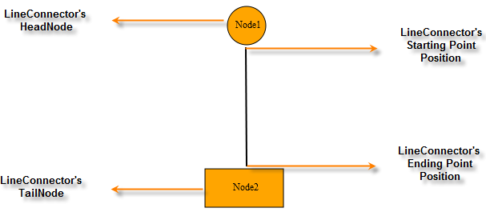

::: {style="DISPLAY: none"}
{#d2h_url_template}{#d2h_package_url style="WIDTH: 0px; DISPLAY: none; HEIGHT: 0px"}
:::

::::: {#nsbanner .d2h_main_nsbanner style="BORDER-BOTTOM: #999999 1px solid; POSITION: relative; PADDING-BOTTOM: 0px; BACKGROUND-COLOR: transparent; PADDING-LEFT: 0px; PADDING-RIGHT: 0px; DISPLAY: none; BORDER-TOP: #999999 1px solid; PADDING-TOP: 0px; LEFT: 0px"}
:::: {#TitleRow .d2h_main_titlerow style="PADDING-BOTTOM: 4px; BACKGROUND-COLOR: transparent; PADDING-LEFT: 22px; WIDTH: 100%; PADDING-RIGHT: 10px; DISPLAY: none; PADDING-TOP: 4px"}
::: {#ienav .d2h_main_ienav style="DISPLAY: none"}
{#D2HPrevious .D2HPreviousEnabled}  {#D2HNext .D2HNextEnabled}
:::
::::
:::::

:::: {#nstext .d2h_main_nstext style="PADDING-BOTTOM: 10px; BACKGROUND-COLOR: transparent; PADDING-LEFT: 22px; PADDING-RIGHT: 10px; HEIGHT: 100%; OVERFLOW: auto; PADDING-TOP: 5px" hasuserbackground="true" valign="bottom"}
::: {#d2h_breadcrumbs .d2h_breadcrumbs}
[Essential Studio User Guide Documentation](ms-xhelp:///?Id=12457748-09e3-4d74-a240-8e049cedf030){.d2h_breadcrumbsNormal}[ \> ]{.d2h_breadcrumbsLinkSeparator}[User Interface Edition](ms-xhelp:///?Id=c29296b7-531c-413b-a0ec-488ca1f7f669){.d2h_breadcrumbsNormal}[ \> ]{.d2h_breadcrumbsLinkSeparator}[Essential ASP.NET MVC](ms-xhelp:///?Id=4b14e7d1-65c4-4f67-b1aa-2c37709905a5){.d2h_breadcrumbsNormal}[ \> ]{.d2h_breadcrumbsLinkSeparator}[Essential Diagram]{.d2h_breadcrumbsContentsOnly}[ \> ]{.d2h_breadcrumbsLinkSeparator}[Concepts and Features](ms-xhelp:///?Id=04839cdf-94fc-4d24-9f6b-119fdbd7bbfb){.d2h_breadcrumbsNormal}
:::

## Line Connector {#line-connector style="tab-stops: 0pt"}

Connectors are objects that are used to create a link between two nodes. Each connector has two ends whose positions can be specified as points or directly connected to the node. One end of the connector can be defined using the **Start Point Position** or **Head Node** and the other end can be defined using **End Point Position** or **Tail Node**.

 

{border="0"}

Figure 51: Connector End Points Illustrated

 

[]{#p39}Properties

+---------------+-----------------------------------------------------------------------------------------------------------------+----------------------+--------------------------+--------------------------------------------------+
| Property      | Description                                                                                                     | Type of the Property | Value it Accepts         | Any Other Dependencies/Sub-Properties Associated |
+===============+=================================================================================================================+======================+==========================+==================================================+
| Name          | Used to uniquely identify the connector.                                                                        | Dependency property  | String                   | No                                               |
+---------------+-----------------------------------------------------------------------------------------------------------------+----------------------+--------------------------+--------------------------------------------------+
| ConnectorType | Gets or sets the connector type to be used.                                                                     | Dependency property  | ConnectorType.Orthogonal | No                                               |
|               |                                                                                                                 |                      |                          |                                                  |
|               | Three values, namely Orthogonal, Straight, and Bezier can be specified. Default Value: ConnectorType.Orthogonal |                      | ConnectorType.Bezier     |                                                  |
|               |                                                                                                                 |                      |                          |                                                  |
|               |                                                                                                                 |                      | ConnectorType.Straight   |                                                  |
+---------------+-----------------------------------------------------------------------------------------------------------------+----------------------+--------------------------+--------------------------------------------------+
| HeadNode      | Gets or sets the head node of the connection. Default value: null                                               | Dependency property  | IShape                   | No                                               |
+---------------+-----------------------------------------------------------------------------------------------------------------+----------------------+--------------------------+--------------------------------------------------+
| TailNode      | Gets or sets the tail node of the connection. Default value: null                                               | Dependency property  | IShape                   | No                                               |
+---------------+-----------------------------------------------------------------------------------------------------------------+----------------------+--------------------------+--------------------------------------------------+
| LineColor     | Gets or sets the color of the line. The default value is Black.                                                 | Dependency property  | string                   | No                                               |
+---------------+-----------------------------------------------------------------------------------------------------------------+----------------------+--------------------------+--------------------------------------------------+
| LineWidth     | Gets or sets the width of the line connector. The default value is Black.                                       | Dependency property  | double                   | No                                               |
+---------------+-----------------------------------------------------------------------------------------------------------------+----------------------+--------------------------+--------------------------------------------------+

 

More:

[ ]{#related-topics}

[{border="0" align="absMiddle"}Creating a Line Connector](ms-xhelp:///?Id=96e2036f-9152-447a-834b-bc72bf7e0252){style="TEXT-DECORATION: none"}

[{border="0" align="absMiddle"}Connector Types](ms-xhelp:///?Id=81b3685c-ce4c-405f-b87f-bf4829a1fda8){style="TEXT-DECORATION: none"}

[{border="0" align="absMiddle"}Polyline](ms-xhelp:///?Id=29629b8c-0c8c-4d62-9094-083e587abeb7){style="TEXT-DECORATION: none"}

[{border="0" align="absMiddle"}Decorator Shapes](ms-xhelp:///?Id=2efad9c4-86c6-4575-95fc-27a4efd5ed1f){style="TEXT-DECORATION: none"}

[{border="0" align="absMiddle"}Customizing Line Connectors](ms-xhelp:///?Id=73e26f6a-3bdf-43e6-88cd-9fb33a66ea7f){style="TEXT-DECORATION: none"}

[{border="0" align="absMiddle"}Connector Selection](ms-xhelp:///?Id=b2900d5f-8af7-4302-a684-671792f47f60){style="TEXT-DECORATION: none"}

[{border="0" align="absMiddle"}Connector Drag](ms-xhelp:///?Id=01b16c70-920b-4d26-9971-5b4ce9b2a2db){style="TEXT-DECORATION: none"}

[{border="0" align="absMiddle"}Connector Deletion](ms-xhelp:///?Id=2b9c0a87-baad-4f4f-beb7-3efe417f09b0){style="TEXT-DECORATION: none"}

[{border="0" align="absMiddle"}Line Connector Label](ms-xhelp:///?Id=4d97c0ec-3280-443d-902d-427b26c85a63){style="TEXT-DECORATION: none"}

[{border="0" align="absMiddle"}Customize Label for the Connectors](ms-xhelp:///?Id=068e4cc7-1f64-4b30-874b-93cae1f956c2){style="TEXT-DECORATION: none"}
::::
