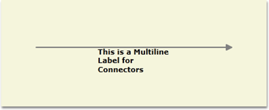
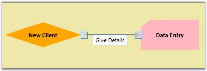
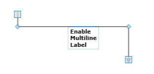

::: {style="DISPLAY: none"}
{#d2h_url_template}{#d2h_package_url style="WIDTH: 0px; DISPLAY: none; HEIGHT: 0px"}
:::

::::: {#nsbanner .d2h_main_nsbanner style="BORDER-BOTTOM: #999999 1px solid; POSITION: relative; PADDING-BOTTOM: 0px; BACKGROUND-COLOR: transparent; PADDING-LEFT: 0px; PADDING-RIGHT: 0px; DISPLAY: none; BORDER-TOP: #999999 1px solid; PADDING-TOP: 0px; LEFT: 0px"}
:::: {#TitleRow .d2h_main_titlerow style="PADDING-BOTTOM: 4px; BACKGROUND-COLOR: transparent; PADDING-LEFT: 22px; WIDTH: 100%; PADDING-RIGHT: 10px; DISPLAY: none; PADDING-TOP: 4px"}
::: {#ienav .d2h_main_ienav style="DISPLAY: none"}
{#D2HPrevious .D2HPreviousEnabled}  {#D2HNext .D2HNextEnabled}
:::
::::
:::::

::::::: {#nstext .d2h_main_nstext style="PADDING-BOTTOM: 10px; BACKGROUND-COLOR: transparent; PADDING-LEFT: 22px; PADDING-RIGHT: 10px; HEIGHT: 100%; OVERFLOW: auto; PADDING-TOP: 5px" hasuserbackground="true" valign="bottom"}
::: {#d2h_breadcrumbs .d2h_breadcrumbs}
[Essential Studio User Guide Documentation](ms-xhelp:///?Id=12457748-09e3-4d74-a240-8e049cedf030){.d2h_breadcrumbsNormal}[ \> ]{.d2h_breadcrumbsLinkSeparator}[User Interface Edition](ms-xhelp:///?Id=c29296b7-531c-413b-a0ec-488ca1f7f669){.d2h_breadcrumbsNormal}[ \> ]{.d2h_breadcrumbsLinkSeparator}[Essential WPF](ms-xhelp:///?Id=7f4f82c5-151c-4262-94d0-75c4626c77bc){.d2h_breadcrumbsNormal}[ \> ]{.d2h_breadcrumbsLinkSeparator}[Essential Diagram]{.d2h_breadcrumbsContentsOnly}[ \> ]{.d2h_breadcrumbsLinkSeparator}[Concepts and Features](ms-xhelp:///?Id=8625d466-6e21-495a-b811-4ecee754da81){.d2h_breadcrumbsNormal}[ \> ]{.d2h_breadcrumbsLinkSeparator}[Line Connectors](ms-xhelp:///?Id=aa573b6b-29bb-4c85-aa22-7ebc69ffbdcc){.d2h_breadcrumbsNormal}
:::

### Line Connector Label {#line-connector-label style="tab-stops: 0pt"}

Label is a single line or multiline text that is displayed over the Node. This Label is used to textually represent a LineConnector with a string that can be edited in run time, there are many properties that can be used to change the alignment and appearance settings. Label can be represented as multiline text using the **TextWrapping** property.

 

Table 39: Property Table

+--------------------------+------------------------------------------------------------------------------------------------------------+----------------------+--------------------------------+---------------------------------------------------+
| Property                 | Description                                                                                                | Type of the property | Value it accepts               | Any other dependencies/ sub properties associated |
+--------------------------+------------------------------------------------------------------------------------------------------------+----------------------+--------------------------------+---------------------------------------------------+
| IsLabelEditable          | Gets or sets a value indicating whether line's label that can be edited or not. Default valueis True.      | Dependency property  | Boolean (true/ false)          | No                                                |
+--------------------------+------------------------------------------------------------------------------------------------------------+----------------------+--------------------------------+---------------------------------------------------+
| Label                    | Gets or sets the line\'s label. Default value is Empty String.                                             | Dependency property  | String                         | No                                                |
+--------------------------+------------------------------------------------------------------------------------------------------------+----------------------+--------------------------------+---------------------------------------------------+
| LabelTemplate            | Gets or sets a template for the label. Default value is null.                                              | Dependency property  | DataTemplate                   | No                                                |
+--------------------------+------------------------------------------------------------------------------------------------------------+----------------------+--------------------------------+---------------------------------------------------+
| LabelVisibility          | Gets or sets the label visibility. Default value is Visibility.Visible                                     | Dependency property  | Visibility.Hidden              | No                                                |
|                          |                                                                                                            |                      |                                |                                                   |
|                          |                                                                                                            |                      | Visibility.Collapsed           |                                                   |
|                          |                                                                                                            |                      |                                |                                                   |
|                          |                                                                                                            |                      | Visibility.Visible             |                                                   |
+--------------------------+------------------------------------------------------------------------------------------------------------+----------------------+--------------------------------+---------------------------------------------------+
| LabelHorizontalAlignment | Gets or sets the node's label horizontal Alignment. Default value isHorizontalAlignment.Center             | Dependency property  | HorizontalAlignment.Center     | No                                                |
|                          |                                                                                                            |                      |                                |                                                   |
|                          |                                                                                                            |                      | HorizontalAlignment.Left       |                                                   |
|                          |                                                                                                            |                      |                                |                                                   |
|                          |                                                                                                            |                      | HorizontalAlignment.Right      |                                                   |
|                          |                                                                                                            |                      |                                |                                                   |
|                          |                                                                                                            |                      | HorizontalAlignment.Stretch    |                                                   |
+--------------------------+------------------------------------------------------------------------------------------------------------+----------------------+--------------------------------+---------------------------------------------------+
| LabelTextTrimming        | Gets or sets the text trimming style . Default value is CharacterEllipsis.                                 | Dependency property  | TextTrimming.CharacterEllipsis | No                                                |
|                          |                                                                                                            |                      |                                |                                                   |
|                          |                                                                                                            |                      | TextTrimming.None              |                                                   |
|                          |                                                                                                            |                      |                                |                                                   |
|                          |                                                                                                            |                      | TextTrimming.WordEllipsis      |                                                   |
+--------------------------+------------------------------------------------------------------------------------------------------------+----------------------+--------------------------------+---------------------------------------------------+
| LabelForeground          | Gets or sets the label foreground. Default value is Black.                                                 | Dependency property  | Brush                          | No                                                |
+--------------------------+------------------------------------------------------------------------------------------------------------+----------------------+--------------------------------+---------------------------------------------------+
| LabelBackground          | Gets or sets the label background. Default value is White.                                                 | Dependency property  | Brush                          | No                                                |
+--------------------------+------------------------------------------------------------------------------------------------------------+----------------------+--------------------------------+---------------------------------------------------+
| LabelFontStyle           | Gets or sets the label background. Default value is White.                                                 | Dependency property  | FontStyle                      | No                                                |
+--------------------------+------------------------------------------------------------------------------------------------------------+----------------------+--------------------------------+---------------------------------------------------+
| LabelFontFamily          | Gets or sets the label font family. Default value is Arial.                                                | Dependency property  | FontFamily                     | No                                                |
+--------------------------+------------------------------------------------------------------------------------------------------------+----------------------+--------------------------------+---------------------------------------------------+
| LabelTextAlignment       | Gets or sets the label text alignment. Default value is Center.                                            | Dependency property  | TextAlignment.Center           | No                                                |
|                          |                                                                                                            |                      |                                |                                                   |
|                          |                                                                                                            |                      | TextAlignment.Justify          |                                                   |
|                          |                                                                                                            |                      |                                |                                                   |
|                          |                                                                                                            |                      | TextAlignment.Left             |                                                   |
|                          |                                                                                                            |                      |                                |                                                   |
|                          |                                                                                                            |                      | TextAlignment.Right            |                                                   |
+--------------------------+------------------------------------------------------------------------------------------------------------+----------------------+--------------------------------+---------------------------------------------------+
| LabelFontSize            | Gets or sets the label font size. Default value is 11.                                                     | Dependency property  | Double                         | No                                                |
+--------------------------+------------------------------------------------------------------------------------------------------------+----------------------+--------------------------------+---------------------------------------------------+
| LabelFontWeight          | Gets or sets the label font weight. Default value is SemiBold.                                             | Dependency property  | FontWeight                     | No                                                |
+--------------------------+------------------------------------------------------------------------------------------------------------+----------------------+--------------------------------+---------------------------------------------------+
| LabelTextWrapping        | Gets or sets the label text wrapping. Default value is NoWrap.                                             | Dependency property  | TextWrapping.NoWrap            | No                                                |
|                          |                                                                                                            |                      |                                |                                                   |
|                          |                                                                                                            |                      | TextWrapping.Wrap              |                                                   |
|                          |                                                                                                            |                      |                                |                                                   |
|                          |                                                                                                            |                      | TextWrapping.WrapWithOverflow  |                                                   |
+--------------------------+------------------------------------------------------------------------------------------------------------+----------------------+--------------------------------+---------------------------------------------------+
| LabelWidth               | Gets or sets the label width. Default value is line's width.                                               | Dependency property  | Double                         | No                                                |
+--------------------------+------------------------------------------------------------------------------------------------------------+----------------------+--------------------------------+---------------------------------------------------+
| EnableMultilineLabel     | Gets or sets a value indicating whether the   label line  can be multiline or not. Default value is False. | Dependency Property  | Boolean (True / False)         | No                                                |
|                          |                                                                                                            |                      |                                |                                                   |
|                          |                                                                                                            |                      |                                |                                                   |
+--------------------------+------------------------------------------------------------------------------------------------------------+----------------------+--------------------------------+---------------------------------------------------+

 

A connector can be specified with a label, similar to node, using the **Label** property. The default value is an empty string. By default, the label starts at the center point of the connector.

[]{style="FONT-FAMILY: 'Trebuchet MS','sans-serif'; COLOR: #15428b; FONT-SIZE: 9pt"} 

+--------------------------------------------------------------------------------------------------------------------------------------------------------------------------------------+
| **[\[C#\]]{style="FONT-FAMILY: 'Courier New'; COLOR: black"}**                                                                                                                       |
|                                                                                                                                                                                      |
| []{style="FONT-FAMILY: 'Courier New'"}                                                                                                                                               |
|                                                                                                                                                                                      |
| [LineConnector]{style="FONT-FAMILY: 'Courier New'; COLOR: #2b91af"}[ l1 = [new]{style="COLOR: blue"} [LineConnector]{style="COLOR: #2b91af"}();]{style="FONT-FAMILY: 'Courier New'"} |
|                                                                                                                                                                                      |
| [l1.HeadNode = n1;]{style="FONT-FAMILY: 'Courier New'"}                                                                                                                              |
|                                                                                                                                                                                      |
| [l1.TailNode = n2;]{style="FONT-FAMILY: 'Courier New'"}                                                                                                                              |
|                                                                                                                                                                                      |
| [l1.ConnecorType = [ConnectorType]{style="COLOR: #2b91af"}.Bezier;]{style="FONT-FAMILY: 'Courier New'"}                                                                              |
|                                                                                                                                                                                      |
| [l1.Label = [\"Connect\"]{style="COLOR: #a31515"};]{style="FONT-FAMILY: 'Courier New'"}                                                                                              |
|                                                                                                                                                                                      |
| [diagramModel.Connections.Add(l1);]{style="FONT-FAMILY: 'Courier New'"}                                                                                                              |
+--------------------------------------------------------------------------------------------------------------------------------------------------------------------------------------+

[]{style="FONT-FAMILY: 'Trebuchet MS','sans-serif'; COLOR: #15428b; FONT-SIZE: 9pt"} 

+------------------------------------------------------------------------------------------------------------------------------------------------------------------------------------------------+
| **[\[VB\]]{style="FONT-FAMILY: 'Courier New'; COLOR: black"}**                                                                                                                                 |
|                                                                                                                                                                                                |
| []{style="FONT-FAMILY: 'Courier New'"}                                                                                                                                                         |
|                                                                                                                                                                                                |
| [Dim]{style="FONT-FAMILY: 'Courier New'; COLOR: blue"}[ l1 [As]{style="COLOR: blue"} [New]{style="COLOR: blue"} [LineConnector]{style="COLOR: #2b91af"}()]{style="FONT-FAMILY: 'Courier New'"} |
|                                                                                                                                                                                                |
| [l1.HeadNode = n1]{style="FONT-FAMILY: 'Courier New'"}                                                                                                                                         |
|                                                                                                                                                                                                |
| [l1.TailNode = n2]{style="FONT-FAMILY: 'Courier New'"}                                                                                                                                         |
|                                                                                                                                                                                                |
| [l1.ConnecorType = ConnectorType.Bezier]{style="FONT-FAMILY: 'Courier New'"}                                                                                                                   |
|                                                                                                                                                                                                |
| [l1.Label = \"Connect\"]{style="FONT-FAMILY: 'Courier New'"}                                                                                                                                   |
|                                                                                                                                                                                                |
| [diagramModel.Connections.Add(l1)]{style="FONT-FAMILY: 'Courier New'"}[]{style="FONT-FAMILY: 'Courier New'"}                                                                                   |
+------------------------------------------------------------------------------------------------------------------------------------------------------------------------------------------------+

[]{style="FONT-FAMILY: 'Trebuchet MS','sans-serif'; COLOR: #15428b; FONT-SIZE: 9pt"} 

{border="0"}

Figure 84: Connector\'s Label

 

[]{#p45}[]{#_How_to_specify_16}Label Template

[]{style="FONT-FAMILY: 'Trebuchet MS','sans-serif'; COLOR: #15428b; FONT-SIZE: 9pt"} 

You can set a custom template for the labels. The following code shows how to set a label template. First create a control template and then add the resource "text.png" to your application.          

[]{style="FONT-FAMILY: 'Trebuchet MS','sans-serif'; COLOR: #15428b; FONT-SIZE: 9pt"} 

+------------------------------------------------------------------------------------------------------------------------------------------------------------------------------------------------------------------------------------------------------------------------------------------------------------------------------------------------+
| **[\[XAML\]]{style="FONT-FAMILY: 'Courier New'; COLOR: black"}**                                                                                                                                                                                                                                                                               |
|                                                                                                                                                                                                                                                                                                                                                |
| []{style="FONT-FAMILY: 'Courier New'"}                                                                                                                                                                                                                                                                                                         |
|                                                                                                                                                                                                                                                                                                                                                |
| [\<]{style="FONT-FAMILY: 'Courier New'; COLOR: blue"}[ControlTemplate]{style="FONT-FAMILY: 'Courier New'; COLOR: maroon"}[ [x]{style="COLOR: maroon"}[:]{style="COLOR: blue"}[Key]{style="COLOR: red"}[=\"LabelCustomTemplate\"\>]{style="COLOR: blue"}]{style="FONT-FAMILY: 'Courier New'"}                                                   |
|                                                                                                                                                                                                                                                                                                                                                |
| [\<]{style="FONT-FAMILY: 'Courier New'; COLOR: blue"}[StackPanel]{style="FONT-FAMILY: 'Courier New'; COLOR: maroon"}[ [Orientation]{style="COLOR: red"}[=\"Horizontal\"\>]{style="COLOR: blue"}]{style="FONT-FAMILY: 'Courier New'"}                                                                                                           |
|                                                                                                                                                                                                                                                                                                                                                |
| [\<]{style="FONT-FAMILY: 'Courier New'; COLOR: blue"}[Image]{style="FONT-FAMILY: 'Courier New'; COLOR: maroon"}[ [Source]{style="COLOR: red"}[=\"text.png\"]{style="COLOR: blue"} [Width]{style="COLOR: red"}[=\"20\"]{style="COLOR: blue"} [Height]{style="COLOR: red"}[=\"20\"/\>]{style="COLOR: blue"}]{style="FONT-FAMILY: 'Courier New'"} |
|                                                                                                                                                                                                                                                                                                                                                |
| [\<]{style="FONT-FAMILY: 'Courier New'; COLOR: blue"}[Border]{style="FONT-FAMILY: 'Courier New'; COLOR: maroon"}[ [Background]{style="COLOR: red"}[=\"AliceBlue\"\>]{style="COLOR: blue"}]{style="FONT-FAMILY: 'Courier New'"}                                                                                                                 |
|                                                                                                                                                                                                                                                                                                                                                |
| [\<]{style="FONT-FAMILY: 'Courier New'; COLOR: blue"}[TextBlock]{style="FONT-FAMILY: 'Courier New'; COLOR: maroon"}[ [Text]{style="COLOR: red"}[=\"Hello\"/\>]{style="COLOR: blue"}]{style="FONT-FAMILY: 'Courier New'"}                                                                                                                       |
|                                                                                                                                                                                                                                                                                                                                                |
| [\</]{style="FONT-FAMILY: 'Courier New'; COLOR: blue"}[Border]{style="FONT-FAMILY: 'Courier New'; COLOR: maroon"}[\>]{style="FONT-FAMILY: 'Courier New'; COLOR: blue"}                                                                                                                                                                         |
|                                                                                                                                                                                                                                                                                                                                                |
| [\</]{style="FONT-FAMILY: 'Courier New'; COLOR: blue"}[StackPanel]{style="FONT-FAMILY: 'Courier New'; COLOR: maroon"}[\>]{style="FONT-FAMILY: 'Courier New'; COLOR: blue"}                                                                                                                                                                     |
|                                                                                                                                                                                                                                                                                                                                                |
| [\</]{style="FONT-FAMILY: 'Courier New'; COLOR: blue"}[ControlTemplate]{style="FONT-FAMILY: 'Courier New'; COLOR: maroon"}[\>]{style="FONT-FAMILY: 'Courier New'; COLOR: blue"}                                                                                                                                                                |
+------------------------------------------------------------------------------------------------------------------------------------------------------------------------------------------------------------------------------------------------------------------------------------------------------------------------------------------------+

[]{style="FONT-FAMILY: 'Trebuchet MS','sans-serif'; COLOR: #15428b; FONT-SIZE: 9pt"} 

The template can then be applied to the connector as follows.

[]{style="FONT-FAMILY: 'Trebuchet MS','sans-serif'; COLOR: #15428b; FONT-SIZE: 9pt"} 

+--------------------------------------------------------------------------------------------------------------------------------------------------------------------------------------+
| **[\[C#\]]{style="FONT-FAMILY: 'Courier New'; COLOR: black"}**                                                                                                                       |
|                                                                                                                                                                                      |
| []{style="FONT-FAMILY: 'Courier New'"}                                                                                                                                               |
|                                                                                                                                                                                      |
| [LineConnector]{style="FONT-FAMILY: 'Courier New'; COLOR: #2b91af"}[ l1 = [new]{style="COLOR: blue"} [LineConnector]{style="COLOR: #2b91af"}();]{style="FONT-FAMILY: 'Courier New'"} |
|                                                                                                                                                                                      |
| [l1.HeadNode = n1;]{style="FONT-FAMILY: 'Courier New'"}                                                                                                                              |
|                                                                                                                                                                                      |
| [l1.TailNode = n2;]{style="FONT-FAMILY: 'Courier New'"}                                                                                                                              |
|                                                                                                                                                                                      |
| [l1.ConnectorType = [ConnectorType]{style="COLOR: #2b91af"}.Bezier;]{style="FONT-FAMILY: 'Courier New'"}                                                                             |
|                                                                                                                                                                                      |
| [l1.LabelTemplate = ([ControlTemplate]{style="COLOR: #2b91af"})FindResource([\"LabelCustomTemplate\"]{style="COLOR: #a31515"});]{style="FONT-FAMILY: 'Courier New'"}                 |
|                                                                                                                                                                                      |
| [diagramModel.Connections.Add(l1);]{style="FONT-FAMILY: 'Courier New'"}                                                                                                              |
+--------------------------------------------------------------------------------------------------------------------------------------------------------------------------------------+

 

+------------------------------------------------------------------------------------------------------------------------------------------------------------------------------------------------+
| **[\[VB\]]{style="FONT-FAMILY: 'Courier New'; COLOR: black"}**                                                                                                                                 |
|                                                                                                                                                                                                |
| []{style="FONT-FAMILY: 'Courier New'"}                                                                                                                                                         |
|                                                                                                                                                                                                |
| [Dim]{style="FONT-FAMILY: 'Courier New'; COLOR: blue"}[ l1 [As]{style="COLOR: blue"} [New]{style="COLOR: blue"} [LineConnector]{style="COLOR: #2b91af"}()]{style="FONT-FAMILY: 'Courier New'"} |
|                                                                                                                                                                                                |
| [l1.HeadNode = n1]{style="FONT-FAMILY: 'Courier New'"}                                                                                                                                         |
|                                                                                                                                                                                                |
| [l1.TailNode = n2]{style="FONT-FAMILY: 'Courier New'"}                                                                                                                                         |
|                                                                                                                                                                                                |
| [l1.ConnectorType = ConnectorType.Bezier]{style="FONT-FAMILY: 'Courier New'"}                                                                                                                  |
|                                                                                                                                                                                                |
| [l1.LabelTemplate = [CType]{style="COLOR: blue"}(FindResource(\"LabelCustomTemplate\"), ControlTemplate)]{style="FONT-FAMILY: 'Courier New'"}                                                  |
|                                                                                                                                                                                                |
| [diagramModel.Connections.Add(l1)]{style="FONT-FAMILY: 'Courier New'"}[]{style="FONT-FAMILY: 'Courier New'"}                                                                                   |
+------------------------------------------------------------------------------------------------------------------------------------------------------------------------------------------------+

 

This displays the text \"Hello\" on an Alice Blue background with an image on the left.

 

{border="0"}

Figure 85: LabelTemplate

 

[]{#p46}Multi line label

**[]{style="FONT-FAMILY: 'Trebuchet MS','sans-serif'; COLOR: #15428b"}** 

Label text can be displayed in multiple lines using **LabelTextWrapping** property set to Wrap. If there is no enough space for the text to get displayed within connector in a single line then text will get wrapped within connector boundaries or LabelWidth and starts to display the label in multiple lines.

[]{style="FONT-FAMILY: 'Trebuchet MS','sans-serif'; COLOR: #15428b; FONT-SIZE: 9pt"} 

+-------------------------------------------------------------------------------------------------------------------------------------------------------------------------------------+
| **[\[C#\]]{style="FONT-FAMILY: 'Courier New'; COLOR: black"}**                                                                                                                      |
|                                                                                                                                                                                     |
| []{style="FONT-FAMILY: 'Courier New'; COLOR: black"}                                                                                                                                |
|                                                                                                                                                                                     |
| [LineConnector]{style="FONT-FAMILY: 'Courier New'; COLOR: #2b91af"}[ l = [new]{style="COLOR: blue"} [LineConnector]{style="COLOR: #2b91af"}();]{style="FONT-FAMILY: 'Courier New'"} |
|                                                                                                                                                                                     |
| [l.Label = [\"This is a Multiline Label for Connectors\"]{style="COLOR: #a31515"};]{style="FONT-FAMILY: 'Courier New'"}                                                             |
|                                                                                                                                                                                     |
| [l.LabelHeight = 110;]{style="FONT-FAMILY: 'Courier New'"}                                                                                                                          |
|                                                                                                                                                                                     |
| [l.LabelTextWrapping = [TextWrapping]{style="COLOR: #2b91af"}.Wrap;]{style="FONT-FAMILY: 'Courier New'"}                                                                            |
|                                                                                                                                                                                     |
| [l.IsLabelEditable = [true]{style="COLOR: blue"};]{style="FONT-FAMILY: 'Courier New'"}                                                                                              |
+-------------------------------------------------------------------------------------------------------------------------------------------------------------------------------------+

 

+-----------------------------------------------------------------------------------------------------------------------------------------------------------------------------------------------+
| **[\[VB\]]{style="FONT-FAMILY: 'Courier New'; COLOR: black"}**                                                                                                                                |
|                                                                                                                                                                                               |
| []{style="FONT-FAMILY: 'Courier New'; COLOR: black"}                                                                                                                                          |
|                                                                                                                                                                                               |
| [Dim]{style="FONT-FAMILY: 'Courier New'; COLOR: blue"}[ l [As]{style="COLOR: blue"} [New]{style="COLOR: blue"} [LineConnector]{style="COLOR: #2b91af"}()]{style="FONT-FAMILY: 'Courier New'"} |
|                                                                                                                                                                                               |
| [l.Label = \"This [is]{style="COLOR: blue"} a Multiline Label [for]{style="COLOR: blue"} Connectors\"]{style="FONT-FAMILY: 'Courier New'"}                                                    |
|                                                                                                                                                                                               |
| [l.LabelHeight = 110]{style="FONT-FAMILY: 'Courier New'"}                                                                                                                                     |
|                                                                                                                                                                                               |
| [l.LabelTextWrapping = TextWrapping.Wrap]{style="FONT-FAMILY: 'Courier New'"}                                                                                                                 |
|                                                                                                                                                                                               |
| [l.IsLabelEditable = [True]{style="COLOR: blue"}]{style="FONT-FAMILY: 'Courier New'"}[]{style="FONT-FAMILY: 'Courier New'"}                                                                   |
+-----------------------------------------------------------------------------------------------------------------------------------------------------------------------------------------------+

 

{border="0"}

Figure 86: Multi line Lable

 

[]{#_How_to_edit_1}Label Editing

[]{style="FONT-FAMILY: 'Trebuchet MS','sans-serif'; COLOR: #15428b; FONT-SIZE: 9pt"} 

A connector\'s label can be edited at run time by setting **IsLabelEditable** to True. The following code shows how it can be done.

[]{style="FONT-FAMILY: 'Trebuchet MS','sans-serif'; COLOR: #15428b; FONT-SIZE: 9pt"} 

+--------------------------------------------------------------------------------------------------------------------------------------------------------------------------------------+
| **[\[C#\]]{style="FONT-FAMILY: 'Courier New'; COLOR: black"}**                                                                                                                       |
|                                                                                                                                                                                      |
| []{style="FONT-FAMILY: 'Courier New'"}                                                                                                                                               |
|                                                                                                                                                                                      |
| [LineConnector]{style="FONT-FAMILY: 'Courier New'; COLOR: #2b91af"}[ l1 = [new]{style="COLOR: blue"} [LineConnector]{style="COLOR: #2b91af"}();]{style="FONT-FAMILY: 'Courier New'"} |
|                                                                                                                                                                                      |
| [l1.Shape = [Shapes]{style="COLOR: #2b91af"}.RoundedRectangle;]{style="FONT-FAMILY: 'Courier New'"}                                                                                  |
|                                                                                                                                                                                      |
| [l1.IsLabelEditable = [true]{style="COLOR: blue"};]{style="FONT-FAMILY: 'Courier New'"}                                                                                              |
+--------------------------------------------------------------------------------------------------------------------------------------------------------------------------------------+

[]{style="FONT-FAMILY: 'Trebuchet MS','sans-serif'; COLOR: #15428b; FONT-SIZE: 9pt"} 

+------------------------------------------------------------------------------------------------------------------------------------------------------------------------------------------------+
| **[\[VB\]]{style="FONT-FAMILY: 'Courier New'; COLOR: black"}**                                                                                                                                 |
|                                                                                                                                                                                                |
| []{style="FONT-FAMILY: 'Courier New'"}                                                                                                                                                         |
|                                                                                                                                                                                                |
| [Dim]{style="FONT-FAMILY: 'Courier New'; COLOR: blue"}[ l1 [As]{style="COLOR: blue"} [New]{style="COLOR: blue"} [LineConnector]{style="COLOR: #2b91af"}()]{style="FONT-FAMILY: 'Courier New'"} |
|                                                                                                                                                                                                |
| [l1.Shape = Shapes.RoundedRectangle]{style="FONT-FAMILY: 'Courier New'"}                                                                                                                       |
|                                                                                                                                                                                                |
| [l1.IsLabelEditable = [True]{style="COLOR: blue"}]{style="FONT-FAMILY: 'Courier New'"}[]{style="FONT-FAMILY: 'Courier New'"}                                                                   |
+------------------------------------------------------------------------------------------------------------------------------------------------------------------------------------------------+

[]{style="FONT-FAMILY: 'Trebuchet MS','sans-serif'; COLOR: #15428b; FONT-SIZE: 9pt"} 

You can specify a label at run time by following the below mentioned steps.

[]{style="FONT-FAMILY: 'Trebuchet MS','sans-serif'; COLOR: #15428b; FONT-SIZE: 9pt"} 

[·      ]{style="FONT-FAMILY: Symbol"}Double click the left mouse button on any part of the connector. A text box will appear with the cursor at the beginning.

[·      ]{style="FONT-FAMILY: Symbol"}Now type the label name and press ENTER. The label will be displayed on the connector. Press ESC key if you do not want to apply the new label value.

[]{style="FONT-FAMILY: 'Trebuchet MS','sans-serif'; COLOR: #15428b; FONT-SIZE: 9pt"} 

{border="0"}

Figure 87: Connector Label

 

[]{#p47} 

[]{#_How_to_specify_17}Label Visibility

[]{style="FONT-FAMILY: 'Trebuchet MS','sans-serif'; COLOR: #15428b; FONT-SIZE: 9pt"} 

A label\'s visibility can be changed using the **LabelVisibility** property. The default value is visible.

[]{style="FONT-FAMILY: 'Trebuchet MS','sans-serif'; COLOR: #15428b; FONT-SIZE: 9pt"} 

+--------------------------------------------------------------------------------------------------------------------------------------------------------------------------------------+
| **[\[C#\]]{style="FONT-FAMILY: 'Courier New'; COLOR: black"}**                                                                                                                       |
|                                                                                                                                                                                      |
| []{style="FONT-FAMILY: 'Courier New'"}                                                                                                                                               |
|                                                                                                                                                                                      |
| [LineConnector]{style="FONT-FAMILY: 'Courier New'; COLOR: #2b91af"}[ l1 = [new]{style="COLOR: blue"} [LineConnector]{style="COLOR: #2b91af"}();]{style="FONT-FAMILY: 'Courier New'"} |
|                                                                                                                                                                                      |
| [l1.LabelVisibility = [Visibility]{style="COLOR: #2b91af"}.Hidden;]{style="FONT-FAMILY: 'Courier New'"}                                                                              |
+--------------------------------------------------------------------------------------------------------------------------------------------------------------------------------------+

[]{style="FONT-FAMILY: 'Trebuchet MS','sans-serif'; COLOR: #15428b; FONT-SIZE: 9pt"} 

+------------------------------------------------------------------------------------------------------------------------------------------------------------------------------------------------+
| **[\[VB\]]{style="FONT-FAMILY: 'Courier New'; COLOR: black"}**                                                                                                                                 |
|                                                                                                                                                                                                |
| []{style="FONT-FAMILY: 'Courier New'"}                                                                                                                                                         |
|                                                                                                                                                                                                |
| [Dim]{style="FONT-FAMILY: 'Courier New'; COLOR: blue"}[ l1 [As]{style="COLOR: blue"} [New]{style="COLOR: blue"} [LineConnector]{style="COLOR: #2b91af"}()]{style="FONT-FAMILY: 'Courier New'"} |
|                                                                                                                                                                                                |
| [l1.LabelVisibility = Visibility.Hidden]{style="FONT-FAMILY: 'Courier New'"}[]{style="FONT-FAMILY: 'Courier New'"}                                                                             |
+------------------------------------------------------------------------------------------------------------------------------------------------------------------------------------------------+

[]{style="FONT-FAMILY: 'Trebuchet MS','sans-serif'; COLOR: #15428b; FONT-SIZE: 9pt"} 

The label will not get displayed.

 

Multiline Label Support for LabelEditor:

LineConnector's Label can be set as Multiline Label by setting the EnableMultiline property as True. The default Value is False.

        

+-----------------------------------------------------------------------------------------------------------------------------------------------------------------------------------------------------------------------------------------------------------------------------------------------------------------------------------------------------------------------------------------------------------------------------------------------------------------------------------------------------------------------------------------------------------------------------------------------------------------------------------------------------------------------------------------------------------------------------------------------------------------------------------------+
| **[\[XAML\]]{style="FONT-FAMILY: 'Courier New'; COLOR: black"}**                                                                                                                                                                                                                                                                                                                                                                                                                                                                                                                                                                                                                                                                                                                        |
|                                                                                                                                                                                                                                                                                                                                                                                                                                                                                                                                                                                                                                                                                                                                                                                         |
|                                                                                                                                                                                                                                                                                                                                                                                                                                                                                                                                                                                                                                                                                                                                                                                         |
|                                                                                                                                                                                                                                                                                                                                                                                                                                                                                                                                                                                                                                                                                                                                                                                         |
| [\<]{style="FONT-FAMILY: 'Courier New'; COLOR: blue"}[syncfusion]{style="FONT-FAMILY: 'Courier New'; COLOR: #a31515"}[:]{style="FONT-FAMILY: 'Courier New'; COLOR: blue"}[LineConnector]{style="FONT-FAMILY: 'Courier New'; COLOR: #a31515"}[ ConnectorType]{style="FONT-FAMILY: 'Courier New'; COLOR: red"}[=\"Straight\"]{style="FONT-FAMILY: 'Courier New'; COLOR: blue"}[ [ Label]{style="COLOR: red"}[=\"Line1\"]{style="COLOR: blue"}[ IsSelected]{style="COLOR: red"}[=\"True\"]{style="COLOR: blue"}[      StartPointPosition]{style="COLOR: red"}[=\"100,400\"]{style="COLOR: blue"}[ EndPointPosition]{style="COLOR: red"}[=\"100,500\"]{style="COLOR: blue"}[ EnableMultilineLabel]{style="COLOR: red"}[=\"True\"]{style="COLOR: blue"}]{style="FONT-FAMILY: 'Courier New'"} |
|                                                                                                                                                                                                                                                                                                                                                                                                                                                                                                                                                                                                                                                                                                                                                                                         |
| [/\>]{style="FONT-FAMILY: 'Courier New'; COLOR: blue"}                                                                                                                                                                                                                                                                                                                                                                                                                                                                                                                                                                                                                                                                                                                                  |
+-----------------------------------------------------------------------------------------------------------------------------------------------------------------------------------------------------------------------------------------------------------------------------------------------------------------------------------------------------------------------------------------------------------------------------------------------------------------------------------------------------------------------------------------------------------------------------------------------------------------------------------------------------------------------------------------------------------------------------------------------------------------------------------------+

 

+-----------------------------------------------------------------------------------------------------------------------------------------------------------------------------------------+
| **[\[C#\]]{style="FONT-FAMILY: 'Courier New'; COLOR: black"}**                                                                                                                          |
|                                                                                                                                                                                         |
| []{style="FONT-FAMILY: 'Courier New'"}                                                                                                                                                  |
|                                                                                                                                                                                         |
| [LineConnector]{style="FONT-FAMILY: 'Courier New'; COLOR: #2b91af"}[ line1 = [new]{style="COLOR: blue"} [LineConnector]{style="COLOR: #2b91af"}();]{style="FONT-FAMILY: 'Courier New'"} |
|                                                                                                                                                                                         |
| [line1.ConnectorType = [ConnectorType]{style="COLOR: #2b91af"}.Orthogonal;]{style="FONT-FAMILY: 'Courier New'"}                                                                         |
|                                                                                                                                                                                         |
| [line1.StartPointPosition = [new]{style="COLOR: blue"} [Point]{style="COLOR: #2b91af"}(100, 100);]{style="FONT-FAMILY: 'Courier New'"}                                                  |
|                                                                                                                                                                                         |
| [line1.EndPointPosition = [new]{style="COLOR: blue"} [Point]{style="COLOR: #2b91af"}(200, 200);]{style="FONT-FAMILY: 'Courier New'"}                                                    |
|                                                                                                                                                                                         |
| [line1.EnableMultilineLabel = [true]{style="COLOR: blue"};]{style="FONT-FAMILY: 'Courier New'"}                                                                                         |
|                                                                                                                                                                                         |
| [diagramModel.Connections.Add(line1);]{style="FONT-FAMILY: 'Courier New'"}[ ]{style="FONT-FAMILY: 'Courier New'"}                                                                       |
+-----------------------------------------------------------------------------------------------------------------------------------------------------------------------------------------+

 

+---------------------------------------------------------------------------------------------------------------------------------------------------------------------------------------------------+
| **[\[VB\]]{style="FONT-FAMILY: 'Courier New'; COLOR: black"}**                                                                                                                                    |
|                                                                                                                                                                                                   |
| []{style="FONT-FAMILY: 'Courier New'"}                                                                                                                                                            |
|                                                                                                                                                                                                   |
| [Dim]{style="FONT-FAMILY: 'Courier New'; COLOR: blue"}[ line1 [As]{style="COLOR: blue"} [New]{style="COLOR: blue"} [LineConnector]{style="COLOR: #2b91af"}()]{style="FONT-FAMILY: 'Courier New'"} |
|                                                                                                                                                                                                   |
| [line1.ConnectorType = [ConnectorType]{style="COLOR: #2b91af"}.Orthogonal]{style="FONT-FAMILY: 'Courier New'"}                                                                                    |
|                                                                                                                                                                                                   |
| [line1.StartPointPosition = [New]{style="COLOR: blue"} [Point]{style="COLOR: #2b91af"}(100, 100)]{style="FONT-FAMILY: 'Courier New'"}                                                             |
|                                                                                                                                                                                                   |
| [line1.EndPointPosition = [New]{style="COLOR: blue"} [Point]{style="COLOR: #2b91af"}(200, 200)]{style="FONT-FAMILY: 'Courier New'"}                                                               |
|                                                                                                                                                                                                   |
| [line1.EnableMultilineLabel = [True]{style="COLOR: blue"}]{style="FONT-FAMILY: 'Courier New'"}                                                                                                    |
|                                                                                                                                                                                                   |
| [diagramModel.Connections.Add(line1)]{style="FONT-FAMILY: 'Courier New'"}[ ]{style="FONT-FAMILY: 'Courier New'"}                                                                                  |
+---------------------------------------------------------------------------------------------------------------------------------------------------------------------------------------------------+

 

{border="0"}

Figure 88: MultilineLabel for LineConnector

Custom Label Support for LineConnector

This feature enables you to customize the Label Position of the LineConnector. The **CustomLabelPosition** property for LineConnector are Auto, Drag and Custom.

[·      ]{style="FONT-FAMILY: Symbol"}**Drag**: The label can be dragged

[·      ]{style="FONT-FAMILY: Symbol"}**Auto:** Label position and angle will be updated internally based on the position of the LineConnector. This is a default value.

[·      ]{style="FONT-FAMILY: Symbol"}**Custom:** You can customize the Label position

 We can also set the Label Position using LabelPosition property of the LineConnector.

 

Table 40: Properties Table

+---------------------+------------------------------------------------------------------------------+----------------------+-----------------------------+---------------------------+---------------------------------------------------+
| Property            | Description                                                                  | Type                 | Value It Accepts            | Default Values            | Any other dependencies/ sub properties associated |
+---------------------+------------------------------------------------------------------------------+----------------------+-----------------------------+---------------------------+---------------------------------------------------+
| **LabelPosition**   | Gets or sets the Position of the LineConnector's Label from the DiagramPage. | Dependency  property | Point                       | Point(0,0)                | No                                                |
|                     |                                                                              |                      |                             |                           |                                                   |
|                     |                                                                              |                      |                             |                           |                                                   |
+---------------------+------------------------------------------------------------------------------+----------------------+-----------------------------+---------------------------+---------------------------------------------------+
| CustomLabelPosition | Gets or sets the Label of the LineConnector to be Dragged or Not.            | Dependency  property | Enum.                       | CustomLabelPositions.Auto | No                                                |
|                     |                                                                              |                      |                             |                           |                                                   |
|                     |                                                                              |                      | CustomLabelPositions.Auto   |                           |                                                   |
|                     |                                                                              |                      |                             |                           |                                                   |
|                     |                                                                              |                      | CustomLabelPositions.Custom |                           |                                                   |
|                     |                                                                              |                      |                             |                           |                                                   |
|                     |                                                                              |                      | CustomLabelPositions.Drag   |                           |                                                   |
+---------------------+------------------------------------------------------------------------------+----------------------+-----------------------------+---------------------------+---------------------------------------------------+
| LabelAngle          | Gets or sets the angle of the Label of LineConnector.                        | Dependency  property | double                      | 0                         | No                                                |
+---------------------+------------------------------------------------------------------------------+----------------------+-----------------------------+---------------------------+---------------------------------------------------+

[]{style="FONT-FAMILY: 'Calibri','sans-serif'; COLOR: black"} 

Adding Custom Label Enhancements for LineConnector to an Application

**[]{style="FONT-SIZE: 12pt"}** 

Label Dragging support for LineConnector

The Label can be dragged from the Line Connector.

::: {align="center"}
+--------------------------------------------------------------------------------------------------------------------------------------------------------------------------------------------------------------------------------------------------------+
| **[\[C#\]]{style="FONT-FAMILY: 'Courier New'"}**                                                                                                                                                                                                       |
|                                                                                                                                                                                                                                                        |
| [       ]{style="FONT-FAMILY: 'Courier New'; COLOR: #2b91af"}[(line [as]{style="COLOR: blue"} [LineConnector]{style="COLOR: #2b91af"}).CustomLabelPosition = [CustomLabelPositions]{style="COLOR: #2b91af"}.Drag;]{style="FONT-FAMILY: 'Courier New'"} |
|                                                                                                                                                                                                                                                        |
| []{style="FONT-FAMILY: 'Courier New'"}                                                                                                                                                                                                                 |
+--------------------------------------------------------------------------------------------------------------------------------------------------------------------------------------------------------------------------------------------------------+
:::

**[]{style="FONT-SIZE: 12pt"}** 

Set the LabelPosition for LineConnector

When the values are given the position of the label will be exactly at the point of the specified values.

::: {align="center"}
+------------------------------------------------------------------------------------------------------------------------------------------------------------------------------------------------------------------------------------------------------------------+
| **[\[C#\]]{style="FONT-FAMILY: 'Courier New'"}**                                                                                                                                                                                                                 |
|                                                                                                                                                                                                                                                                  |
| [       ]{style="FONT-FAMILY: 'Courier New'; COLOR: #2b91af"}[(line [as]{style="COLOR: blue"} [LineConnector]{style="COLOR: #2b91af"}).LabelPosition = [new]{style="COLOR: blue"} [Point]{style="COLOR: #2b91af"}(100,100);]{style="FONT-FAMILY: 'Courier New'"} |
|                                                                                                                                                                                                                                                                  |
| []{style="FONT-FAMILY: 'Courier New'"}                                                                                                                                                                                                                           |
|                                                                                                                                                                                                                                                                  |
| []{style="FONT-FAMILY: 'Courier New'"}                                                                                                                                                                                                                           |
+------------------------------------------------------------------------------------------------------------------------------------------------------------------------------------------------------------------------------------------------------------------+
:::

**[]{style="FONT-SIZE: 12pt"}** 

Set the LabelAngle for LineConnector

The labels rotate when values are given for the lable angle.

::: {align="center"}
+----------------------------------------------------------------------------------------------------------------------------------------------------------------------------------------------+
| **[\[C#\]]{style="FONT-FAMILY: 'Courier New'"}**                                                                                                                                             |
|                                                                                                                                                                                              |
| [       ]{style="FONT-FAMILY: 'Courier New'; COLOR: #2b91af"}[(line [as]{style="COLOR: blue"} [LineConnector]{style="COLOR: #2b91af"}).LabelAngle = 45;]{style="FONT-FAMILY: 'Courier New'"} |
|                                                                                                                                                                                              |
| []{style="FONT-FAMILY: 'Courier New'"}                                                                                                                                                       |
|                                                                                                                                                                                              |
| []{style="FONT-FAMILY: 'Courier New'"}                                                                                                                                                       |
+----------------------------------------------------------------------------------------------------------------------------------------------------------------------------------------------+
:::

 

More:

[ ]{#related-topics}

[{border="0" align="absMiddle"}Label Orientation](ms-xhelp:///?Id=5f5b6f58-3612-4081-b7ab-9d8fe603d9d7){style="TEXT-DECORATION: none"}
:::::::
