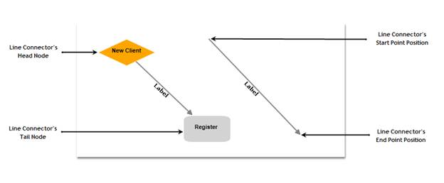

::: {style="DISPLAY: none"}
{#d2h_url_template}{#d2h_package_url style="WIDTH: 0px; DISPLAY: none; HEIGHT: 0px"}
:::

::::: {#nsbanner .d2h_main_nsbanner style="BORDER-BOTTOM: #999999 1px solid; POSITION: relative; PADDING-BOTTOM: 0px; BACKGROUND-COLOR: transparent; PADDING-LEFT: 0px; PADDING-RIGHT: 0px; DISPLAY: none; BORDER-TOP: #999999 1px solid; PADDING-TOP: 0px; LEFT: 0px"}
:::: {#TitleRow .d2h_main_titlerow style="PADDING-BOTTOM: 4px; BACKGROUND-COLOR: transparent; PADDING-LEFT: 22px; WIDTH: 100%; PADDING-RIGHT: 10px; DISPLAY: none; PADDING-TOP: 4px"}
::: {#ienav .d2h_main_ienav style="DISPLAY: none"}
{#D2HPrevious .D2HPreviousEnabled}  {#D2HNext .D2HNextEnabled}
:::
::::
:::::

:::: {#nstext .d2h_main_nstext style="PADDING-BOTTOM: 10px; BACKGROUND-COLOR: transparent; PADDING-LEFT: 22px; PADDING-RIGHT: 10px; HEIGHT: 100%; OVERFLOW: auto; PADDING-TOP: 5px" hasuserbackground="true" valign="bottom"}
::: {#d2h_breadcrumbs .d2h_breadcrumbs}
[Essential Studio User Guide Documentation](ms-xhelp:///?Id=12457748-09e3-4d74-a240-8e049cedf030){.d2h_breadcrumbsNormal}[ \> ]{.d2h_breadcrumbsLinkSeparator}[User Interface Edition](ms-xhelp:///?Id=c29296b7-531c-413b-a0ec-488ca1f7f669){.d2h_breadcrumbsNormal}[ \> ]{.d2h_breadcrumbsLinkSeparator}[Essential Silverlight](ms-xhelp:///?Id=66221bd1-ba2e-43c2-94a7-618f50e01d24){.d2h_breadcrumbsNormal}[ \> ]{.d2h_breadcrumbsLinkSeparator}[Essential Diagram]{.d2h_breadcrumbsContentsOnly}[ \> ]{.d2h_breadcrumbsLinkSeparator}[Concepts and Features](ms-xhelp:///?Id=d592a058-dcc0-44a4-994e-e7901da8db52){.d2h_breadcrumbsNormal}
:::

## Line Connectors {#line-connectors style="tab-stops: 0pt"}

[]{style="FONT-FAMILY: 'Trebuchet MS','sans-serif'; COLOR: #15428b; FONT-SIZE: 9pt"} 

Connectors are objects that are used to create a link between two nodes. Each connector has two ends whose position can be specified as point or directly connected to the Node. One end of the connector can be defined using the 'Start Point Position' or 'Head Node 'and  the other end can be defined using 'End Point Position' or 'Tail Node'.

 

{border="0"}

Figure 46: Connector End Points Illustrated**[]{style="FONT-STYLE: normal; FONT-FAMILY: 'Trebuchet MS','sans-serif'; COLOR: #15428b"}**

**[]{style="FONT-FAMILY: 'Trebuchet MS','sans-serif'; COLOR: #15428b"}** 

Properties

[]{style="FONT-FAMILY: 'Trebuchet MS','sans-serif'; COLOR: #15428b; FONT-SIZE: 9pt"} 

+--------------------------+---------------------------------------------------------------------------------------------------------------+----------------------+-------------------------------+---------------------------------------------------+
| Property                 | Description                                                                                                   | Type of the property | Value it accepts              | Any other dependencies/ sub properties associated |
+==========================+===============================================================================================================+======================+===============================+===================================================+
| EnableConnection         | Gets or sets a value indicating whether \[enable connection\].                                                | Dependency property  | Boolean (true/ false)         | No                                                |
+--------------------------+---------------------------------------------------------------------------------------------------------------+----------------------+-------------------------------+---------------------------------------------------+
| IsLabelEditable          | Gets or sets a value indicating whether the line's label can be edited or not. Default value: True            | Dependency property  | Boolean (true/ false)         | No                                                |
+--------------------------+---------------------------------------------------------------------------------------------------------------+----------------------+-------------------------------+---------------------------------------------------+
| Label                    | Gets or sets the line\'s label. Default value: Empty String                                                   | Dependency property  | String                        | No                                                |
+--------------------------+---------------------------------------------------------------------------------------------------------------+----------------------+-------------------------------+---------------------------------------------------+
| LabelTemplate            | Gets or sets a template for the label. Default value: null                                                    | Dependency property  | DataTemplate                  | No                                                |
+--------------------------+---------------------------------------------------------------------------------------------------------------+----------------------+-------------------------------+---------------------------------------------------+
| LabelVisibility          | Gets or sets the label visibility. Default value: Visibility.Visible                                          | Dependency property  | Visibility.Hidden             | No                                                |
|                          |                                                                                                               |                      |                               |                                                   |
|                          |                                                                                                               |                      | Visibility.Collapsed          |                                                   |
|                          |                                                                                                               |                      |                               |                                                   |
|                          |                                                                                                               |                      | Visibility.Visible            |                                                   |
+--------------------------+---------------------------------------------------------------------------------------------------------------+----------------------+-------------------------------+---------------------------------------------------+
| LabelHorizontalAlignment | Gets or sets the node's label horizontal Alignment. Default value: HorizontalAlignment.Center                 | Dependency property  | HorizontalAlignment.Center    | No                                                |
|                          |                                                                                                               |                      |                               |                                                   |
|                          |                                                                                                               |                      | HorizontalAlignment.Left      |                                                   |
|                          |                                                                                                               |                      |                               |                                                   |
|                          |                                                                                                               |                      | HorizontalAlignment.Right     |                                                   |
|                          |                                                                                                               |                      |                               |                                                   |
|                          |                                                                                                               |                      | HorizontalAlignment.Stretch   |                                                   |
+--------------------------+---------------------------------------------------------------------------------------------------------------+----------------------+-------------------------------+---------------------------------------------------+
| ConnectionEndSpace       | Gets or sets the distance between the connector end position and the node. Default Value: 6                   | CLR Property         | Double                        | No                                                |
+--------------------------+---------------------------------------------------------------------------------------------------------------+----------------------+-------------------------------+---------------------------------------------------+
| ConnectorType            | Gets or sets the connector type to be used.                                                                   | Dependency property  | ConnectorType.Orthogonal      | No                                                |
|                          |                                                                                                               |                      |                               |                                                   |
|                          | Three values namely Orthogonal, Straight and Bezier can be specified. Default Value: ConnectorType.Orthogonal |                      | ConnectorType.Bezier          |                                                   |
|                          |                                                                                                               |                      |                               |                                                   |
|                          |                                                                                                               |                      | ConnectorType.Straight        |                                                   |
+--------------------------+---------------------------------------------------------------------------------------------------------------+----------------------+-------------------------------+---------------------------------------------------+
| HeadNode                 | Gets or sets the head node of the connection. Default value: null                                             | Dependency property  | IShape                        | No                                                |
+--------------------------+---------------------------------------------------------------------------------------------------------------+----------------------+-------------------------------+---------------------------------------------------+
| TailNode                 | Gets or sets the tail node of the connection. Default value: null                                             | Dependency property  | IShape                        | No                                                |
+--------------------------+---------------------------------------------------------------------------------------------------------------+----------------------+-------------------------------+---------------------------------------------------+
| HeadDecoratorShape       | Gets or sets the head decorator shape of the connection.                                                      | CLR Property         | DecoratorShape.None           | No                                                |
|                          |                                                                                                               |                      |                               |                                                   |
|                          | Four values namely None, Arrow, Diamond and Circle can be specified.                                          |                      | DecoratorShape.Arrow          |                                                   |
|                          |                                                                                                               |                      |                               |                                                   |
|                          | Default value: HeadDecoratorShape.None                                                                        |                      | DecoratorShape.Diamond        |                                                   |
|                          |                                                                                                               |                      |                               |                                                   |
|                          |                                                                                                               |                      | DecoratorShape.Circle         |                                                   |
+--------------------------+---------------------------------------------------------------------------------------------------------------+----------------------+-------------------------------+---------------------------------------------------+
| TailDecoratorShape       | Gets or sets the head decorator shape of the connection.                                                      | CLR Property         | DecoratorShape.None           | No                                                |
|                          |                                                                                                               |                      |                               |                                                   |
|                          | Four values namely None, Arrow, Diamond and Circle can be specified.                                          |                      | DecoratorShape.Arrow          |                                                   |
|                          |                                                                                                               |                      |                               |                                                   |
|                          | Default value: TailDecoratorShape.Arrow                                                                       |                      | DecoratorShape.Diamond        |                                                   |
|                          |                                                                                                               |                      |                               |                                                   |
|                          |                                                                                                               |                      | DecoratorShape.Circle         |                                                   |
+--------------------------+---------------------------------------------------------------------------------------------------------------+----------------------+-------------------------------+---------------------------------------------------+
| HeadDecoratorStyle       | Provides customization option for the head decorator shape.                                                   | CLR Property         | DecoratorStyle                | No                                                |
+--------------------------+---------------------------------------------------------------------------------------------------------------+----------------------+-------------------------------+---------------------------------------------------+
| TailDecoratorStyle       | Provides customization option for the tail decorator shape.                                                   | CLR Property         | DecoratorStyle                | No                                                |
+--------------------------+---------------------------------------------------------------------------------------------------------------+----------------------+-------------------------------+---------------------------------------------------+
| LineStyle                | Provides customization option for the line connector.                                                         | CLR Property         | LineStyle                     | No                                                |
+--------------------------+---------------------------------------------------------------------------------------------------------------+----------------------+-------------------------------+---------------------------------------------------+
| LabelForeground          | Gets or sets the label foreground. The default value is Black.                                                | Dependency property  | Brush                         | No                                                |
+--------------------------+---------------------------------------------------------------------------------------------------------------+----------------------+-------------------------------+---------------------------------------------------+
| LabelBackground          | Gets or sets the label background. The default value is White.                                                | Dependency property  | Brush                         | No                                                |
+--------------------------+---------------------------------------------------------------------------------------------------------------+----------------------+-------------------------------+---------------------------------------------------+
| LabelFontStyle           | Gets or sets the label background. The default value is White.                                                | Dependency property  | FontStyle                     | No                                                |
+--------------------------+---------------------------------------------------------------------------------------------------------------+----------------------+-------------------------------+---------------------------------------------------+
| LabelFontFamily          | Gets or sets the label font family. The default value is Arial.                                               | Dependency property  | FontFamily                    | No                                                |
+--------------------------+---------------------------------------------------------------------------------------------------------------+----------------------+-------------------------------+---------------------------------------------------+
| LabelFontSize            | Gets or sets the label font size. The default value is 11.                                                    | Dependency property  | Double                        | No                                                |
+--------------------------+---------------------------------------------------------------------------------------------------------------+----------------------+-------------------------------+---------------------------------------------------+
| LabelFontWeight          | Gets or sets the label font weight. The default value is SemiBold.                                            | Dependency property  | FontWeight                    | No                                                |
+--------------------------+---------------------------------------------------------------------------------------------------------------+----------------------+-------------------------------+---------------------------------------------------+
| LabelTextWrapping        | Gets or sets the label text wrapping. The default value is NoWrap.                                            | Dependency property  | TextWrapping.NoWrap           | No                                                |
|                          |                                                                                                               |                      |                               |                                                   |
|                          |                                                                                                               |                      | TextWrapping.Wrap             |                                                   |
|                          |                                                                                                               |                      |                               |                                                   |
|                          |                                                                                                               |                      | TextWrapping.WrapWithOverflow |                                                   |
+--------------------------+---------------------------------------------------------------------------------------------------------------+----------------------+-------------------------------+---------------------------------------------------+
| LabelWidth               | Gets or sets the label width. The default value is the line's width.                                          | Dependency property  | Double                        | No                                                |
+--------------------------+---------------------------------------------------------------------------------------------------------------+----------------------+-------------------------------+---------------------------------------------------+

**[]{style="FONT-FAMILY: 'Trebuchet MS','sans-serif'; COLOR: #15428b"}** 

See Also

[]{style="FONT-FAMILY: 'Trebuchet MS','sans-serif'; COLOR: #15428b; FONT-SIZE: 9pt"} 

[[• ]{style="FONT-FAMILY: 'Arial Black','sans-serif'; COLOR: navy; FONT-SIZE: 12pt; TEXT-DECORATION: none; text-underline: none"}]{.UGHyperlink}[ConnectorType]{.UGHyperlink}[]{.UGHyperlink}

[[• ]{style="FONT-FAMILY: 'Arial Black','sans-serif'; COLOR: navy; FONT-SIZE: 12pt; TEXT-DECORATION: none; text-underline: none"}]{.UGHyperlink}[Decorator Shapes]{.UGHyperlink}[]{.UGHyperlink}

[[• ]{style="FONT-FAMILY: 'Arial Black','sans-serif'; COLOR: navy; FONT-SIZE: 12pt; TEXT-DECORATION: none; text-underline: none"}]{.UGHyperlink}[Customize Line Connectors]{.UGHyperlink}[]{.UGHyperlink}

[[• ]{style="FONT-FAMILY: 'Arial Black','sans-serif'; COLOR: navy; FONT-SIZE: 12pt; TEXT-DECORATION: none; text-underline: none"}]{.UGHyperlink}[Line Connector Label]{.UGHyperlink}[]{.UGHyperlink}

[[• ]{style="FONT-FAMILY: 'Arial Black','sans-serif'; COLOR: navy; FONT-SIZE: 12pt; TEXT-DECORATION: none; text-underline: none"}]{.UGHyperlink}[Label Template]{.UGHyperlink}[]{.UGHyperlink}

[[• ]{style="FONT-FAMILY: 'Arial Black','sans-serif'; COLOR: navy; FONT-SIZE: 12pt; TEXT-DECORATION: none; text-underline: none"}]{.UGHyperlink}[Label Editing]{.UGHyperlink}[]{.UGHyperlink}

[[• ]{style="FONT-FAMILY: 'Arial Black','sans-serif'; COLOR: navy; FONT-SIZE: 12pt; TEXT-DECORATION: none; text-underline: none"}]{.UGHyperlink}[Label Visibility]{.UGHyperlink}[]{.UGHyperlink}

[[• ]{style="FONT-FAMILY: 'Arial Black','sans-serif'; COLOR: navy; FONT-SIZE: 12pt; TEXT-DECORATION: none; text-underline: none"}]{.UGHyperlink}[Customize the label of Nodes and LineConnectors]{.UGHyperlink}[]{.UGHyperlink}

 

More:

[ ]{#related-topics}

[{border="0" align="absMiddle"}Creating a Line Connector](ms-xhelp:///?Id=4e34b14c-379a-4250-bb10-c41fde1b970b){style="TEXT-DECORATION: none"}

[{border="0" align="absMiddle"}ConnectorType](ms-xhelp:///?Id=59a0e694-8eab-46b3-9428-166ae18195d5){style="TEXT-DECORATION: none"}

[{border="0" align="absMiddle"}Polyline](ms-xhelp:///?Id=c3d0c15c-3d15-466e-bdec-6bea27693514){style="TEXT-DECORATION: none"}

[{border="0" align="absMiddle"}Decorator Shapes](ms-xhelp:///?Id=e2036c16-3213-4dcf-9a4e-efed5df4b943){style="TEXT-DECORATION: none"}

[{border="0" align="absMiddle"}Customizing Line Connectors](ms-xhelp:///?Id=2f5db9fb-4753-4909-a212-41d68b2d2c35){style="TEXT-DECORATION: none"}

[{border="0" align="absMiddle"}Line Connector Label](ms-xhelp:///?Id=ff05d554-a760-49a7-aa19-5f068383b5f2){style="TEXT-DECORATION: none"}

[{border="0" align="absMiddle"}Line bridging support for Diagram Silverlight](ms-xhelp:///?Id=05e971fd-d57e-4065-9bd1-9f4f1f498c95){style="TEXT-DECORATION: none"}

[{border="0" align="absMiddle"}Customizing the Label for LineConnector](ms-xhelp:///?Id=78b99820-b16d-43ce-90f8-777fd4cb2153){style="TEXT-DECORATION: none"}

[{border="0" align="absMiddle"}Line Routing](ms-xhelp:///?Id=1e27f91a-a23c-44ea-b788-d2ff60d711f9){style="TEXT-DECORATION: none"}
::::
