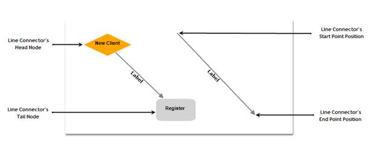
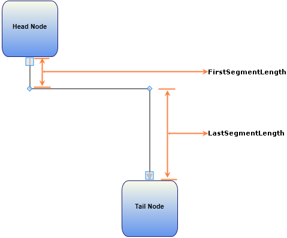

::: {style="DISPLAY: none"}
{#d2h_url_template}{#d2h_package_url style="WIDTH: 0px; DISPLAY: none; HEIGHT: 0px"}
:::

::::: {#nsbanner .d2h_main_nsbanner style="BORDER-BOTTOM: #999999 1px solid; POSITION: relative; PADDING-BOTTOM: 0px; BACKGROUND-COLOR: transparent; PADDING-LEFT: 0px; PADDING-RIGHT: 0px; DISPLAY: none; BORDER-TOP: #999999 1px solid; PADDING-TOP: 0px; LEFT: 0px"}
:::: {#TitleRow .d2h_main_titlerow style="PADDING-BOTTOM: 4px; BACKGROUND-COLOR: transparent; PADDING-LEFT: 22px; WIDTH: 100%; PADDING-RIGHT: 10px; DISPLAY: none; PADDING-TOP: 4px"}
::: {#ienav .d2h_main_ienav style="DISPLAY: none"}
{#D2HPrevious .D2HPreviousEnabled}  {#D2HNext .D2HNextEnabled}
:::
::::
:::::

:::: {#nstext .d2h_main_nstext style="PADDING-BOTTOM: 10px; BACKGROUND-COLOR: transparent; PADDING-LEFT: 22px; PADDING-RIGHT: 10px; HEIGHT: 100%; OVERFLOW: auto; PADDING-TOP: 5px" hasuserbackground="true" valign="bottom"}
::: {#d2h_breadcrumbs .d2h_breadcrumbs}
[Essential Studio User Guide Documentation](ms-xhelp:///?Id=12457748-09e3-4d74-a240-8e049cedf030){.d2h_breadcrumbsNormal}[ \> ]{.d2h_breadcrumbsLinkSeparator}[User Interface Edition](ms-xhelp:///?Id=c29296b7-531c-413b-a0ec-488ca1f7f669){.d2h_breadcrumbsNormal}[ \> ]{.d2h_breadcrumbsLinkSeparator}[Essential WPF](ms-xhelp:///?Id=7f4f82c5-151c-4262-94d0-75c4626c77bc){.d2h_breadcrumbsNormal}[ \> ]{.d2h_breadcrumbsLinkSeparator}[Essential Diagram]{.d2h_breadcrumbsContentsOnly}[ \> ]{.d2h_breadcrumbsLinkSeparator}[Concepts and Features](ms-xhelp:///?Id=8625d466-6e21-495a-b811-4ecee754da81){.d2h_breadcrumbsNormal}
:::

## Line Connectors {#line-connectors style="tab-stops: 0pt"}

Connectors are objects that are used to create a link between two nodes. Each connector has two ends whose position can be specified as point or directly connected to Node. One end of the connector can be defined either by using the 'Start Point Position' or 'Head Node', similarly other end can be defined using 'End Point Position' or 'Tail Node'.

 

{border="0"}

Figure 50: Connector End Points Illustrated

 

[]{#p39}Table 28: Property Table[]{style="FONT-FAMILY: 'Trebuchet MS','sans-serif'; COLOR: #15428b"}

+--------------------------+--------------------------------------------------------------------------------------------------------------+----------------------------------------+--------------------------------+---------------------------------------------------+
| Property                 | Description                                                                                                  | Type of the property                   | Value it accepts               | Any other dependencies/ sub properties associated |
+--------------------------+--------------------------------------------------------------------------------------------------------------+----------------------------------------+--------------------------------+---------------------------------------------------+
| EnableConnection         | Gets or sets a value indicating whether  connection is enabled or not.                                       | Dependency property                    | Boolean (true/ false)          | No                                                |
+--------------------------+--------------------------------------------------------------------------------------------------------------+----------------------------------------+--------------------------------+---------------------------------------------------+
| IsLabelEditable          | Gets or sets a value indicating whether line's label can be edited or not. Default value: True               | Dependency property                    | Boolean (true/ false)          | No                                                |
+--------------------------+--------------------------------------------------------------------------------------------------------------+----------------------------------------+--------------------------------+---------------------------------------------------+
| IntermediatePoints       | Gets or sets the intermediate points.                                                                        | Dependency property                    | List\<Point\>                  | No                                                |
+--------------------------+--------------------------------------------------------------------------------------------------------------+----------------------------------------+--------------------------------+---------------------------------------------------+
| Label                    | Gets or sets the line\'s label. Default value: Empty String.                                                 | Dependency property                    | String                         | No                                                |
+--------------------------+--------------------------------------------------------------------------------------------------------------+----------------------------------------+--------------------------------+---------------------------------------------------+
| LabelTemplate            | Gets or sets a template for the label. Default value: null.                                                  | Dependency property                    | DataTemplate                   | No                                                |
+--------------------------+--------------------------------------------------------------------------------------------------------------+----------------------------------------+--------------------------------+---------------------------------------------------+
| LabelVisibility          | Gets or sets the label visibility. Default value: Visibility.Visible                                         | Dependency property                    | Visibility.Hidden              | No                                                |
|                          |                                                                                                              |                                        |                                |                                                   |
|                          |                                                                                                              |                                        | Visibility.Collapsed           |                                                   |
|                          |                                                                                                              |                                        |                                |                                                   |
|                          |                                                                                                              |                                        | Visibility.Visible             |                                                   |
+--------------------------+--------------------------------------------------------------------------------------------------------------+----------------------------------------+--------------------------------+---------------------------------------------------+
| LabelHorizontalAlignment | Gets or sets the node's label horizontal Alignment. Default value: HorizontalAlignment.Center                | Dependency property                    | HorizontalAlignment.Center     | No                                                |
|                          |                                                                                                              |                                        |                                |                                                   |
|                          |                                                                                                              |                                        | HorizontalAlignment.Left       |                                                   |
|                          |                                                                                                              |                                        |                                |                                                   |
|                          |                                                                                                              |                                        | HorizontalAlignment.Right      |                                                   |
|                          |                                                                                                              |                                        |                                |                                                   |
|                          |                                                                                                              |                                        | HorizontalAlignment.Stretch    |                                                   |
+--------------------------+--------------------------------------------------------------------------------------------------------------+----------------------------------------+--------------------------------+---------------------------------------------------+
| ConnectionEndSpace       | Gets or sets the distance between the connector end position and the node. Default Value: 6                  | CLR [property]{style="COLOR: #1f497d"} | Double                         | No                                                |
+--------------------------+--------------------------------------------------------------------------------------------------------------+----------------------------------------+--------------------------------+---------------------------------------------------+
| ConnectorType            | Gets or sets the connector type to be used.                                                                  | Dependency property                    | ConnectorType.Orthogonal       | No                                                |
|                          |                                                                                                              |                                        |                                |                                                   |
|                          | Three values namely Othogonal, Straight and Bezier can be specified. Default Value: ConnectorType.Orthogonal |                                        | ConnectorType.Bezier           |                                                   |
|                          |                                                                                                              |                                        |                                |                                                   |
|                          |                                                                                                              |                                        | ConnectorType.Straight         |                                                   |
+--------------------------+--------------------------------------------------------------------------------------------------------------+----------------------------------------+--------------------------------+---------------------------------------------------+
| HeadNode                 | Gets or sets the head node of the connection. Default value: null.                                           | Dependency property                    | IShape                         | No                                                |
+--------------------------+--------------------------------------------------------------------------------------------------------------+----------------------------------------+--------------------------------+---------------------------------------------------+
| TailNode                 | Gets or sets the tail node of the connection. Default value: null.                                           | Dependency property                    | IShape                         | No                                                |
+--------------------------+--------------------------------------------------------------------------------------------------------------+----------------------------------------+--------------------------------+---------------------------------------------------+
| HeadDecoratorShape       | Gets or sets the head decorator shape of the connection.                                                     | CLR [property]{style="COLOR: #1f497d"} | DecoratorShape.None            | No                                                |
|                          |                                                                                                              |                                        |                                |                                                   |
|                          | Four values namely None, Arrow , Diamond and Circle can be specified.                                        |                                        | DecoratorShape.Arrow           |                                                   |
|                          |                                                                                                              |                                        |                                |                                                   |
|                          | Default value: HeadDecoratorShape.None                                                                       |                                        | DecoratorShape.Diamond         |                                                   |
|                          |                                                                                                              |                                        |                                |                                                   |
|                          |                                                                                                              |                                        | DecoratorShape.Circle          |                                                   |
+--------------------------+--------------------------------------------------------------------------------------------------------------+----------------------------------------+--------------------------------+---------------------------------------------------+
| TailDecoratorShape       | Gets or sets the head decorator shape of the connection.                                                     | CLR [property]{style="COLOR: #1f497d"} | DecoratorShape.None            | No                                                |
|                          |                                                                                                              |                                        |                                |                                                   |
|                          | Four values namely None, Arrow , Diamond and Circle can be specified.                                        |                                        | DecoratorShape.Arrow           |                                                   |
|                          |                                                                                                              |                                        |                                |                                                   |
|                          | Default value: TailDecoratorShape.Arrow                                                                      |                                        | DecoratorShape.Diamond         |                                                   |
|                          |                                                                                                              |                                        |                                |                                                   |
|                          |                                                                                                              |                                        | DecoratorShape.Circle          |                                                   |
+--------------------------+--------------------------------------------------------------------------------------------------------------+----------------------------------------+--------------------------------+---------------------------------------------------+
| HeadDecoratorStyle       | Provides customization option for the head decorator shape.                                                  | CLR [property]{style="COLOR: #1f497d"} | DecoratorStyle                 | No                                                |
+--------------------------+--------------------------------------------------------------------------------------------------------------+----------------------------------------+--------------------------------+---------------------------------------------------+
| TailDecoratorStyle       | Provides customization option for the tail decorator shape.                                                  | CLR [property]{style="COLOR: #1f497d"} | DecoratorStyle                 | No                                                |
+--------------------------+--------------------------------------------------------------------------------------------------------------+----------------------------------------+--------------------------------+---------------------------------------------------+
| LineStyle                | Provides customization option for the line connector.                                                        | CLR [property]{style="COLOR: #1f497d"} | LineStyle                      | No                                                |
+--------------------------+--------------------------------------------------------------------------------------------------------------+----------------------------------------+--------------------------------+---------------------------------------------------+
| LabelTextTrimming        | Gets or sets the text trimming style. Default value is CharacterEllipsis.                                    | Dependency property                    | TextTrimming.CharacterEllipsis | No                                                |
|                          |                                                                                                              |                                        |                                |                                                   |
|                          |                                                                                                              |                                        | TextTrimming.None              |                                                   |
|                          |                                                                                                              |                                        |                                |                                                   |
|                          |                                                                                                              |                                        | TextTrimming.WordEllipsis      |                                                   |
+--------------------------+--------------------------------------------------------------------------------------------------------------+----------------------------------------+--------------------------------+---------------------------------------------------+
| LabelForeground          | Gets or sets the label foreground. Default value is Black.                                                   | Dependency property                    | Brush                          | No                                                |
+--------------------------+--------------------------------------------------------------------------------------------------------------+----------------------------------------+--------------------------------+---------------------------------------------------+
| LabelBackground          | Gets or sets the label background. Default value is White.                                                   | Dependency property                    | Brush                          | No                                                |
+--------------------------+--------------------------------------------------------------------------------------------------------------+----------------------------------------+--------------------------------+---------------------------------------------------+
| LabelFontStyle           | Gets or sets the label background. Default value is White.                                                   | Dependency property                    | FontStyle                      | No                                                |
+--------------------------+--------------------------------------------------------------------------------------------------------------+----------------------------------------+--------------------------------+---------------------------------------------------+
| LabelFontFamily          | Gets or sets the label font family. Default value is Arial.                                                  | Dependency property                    | FontFamily                     | No                                                |
+--------------------------+--------------------------------------------------------------------------------------------------------------+----------------------------------------+--------------------------------+---------------------------------------------------+
| LabelTextAlignment       | Gets or sets the label text alignment. Default value is Center.                                              | Dependency property                    | TextAlignment.Center           | No                                                |
|                          |                                                                                                              |                                        |                                |                                                   |
|                          |                                                                                                              |                                        | TextAlignment.Justify          |                                                   |
|                          |                                                                                                              |                                        |                                |                                                   |
|                          |                                                                                                              |                                        | TextAlignment.Left             |                                                   |
|                          |                                                                                                              |                                        |                                |                                                   |
|                          |                                                                                                              |                                        | TextAlignment.Right            |                                                   |
+--------------------------+--------------------------------------------------------------------------------------------------------------+----------------------------------------+--------------------------------+---------------------------------------------------+
| LabelFontSize            | Gets or sets the label font size. Default value is 11.                                                       | Dependency property                    | Double                         | No                                                |
+--------------------------+--------------------------------------------------------------------------------------------------------------+----------------------------------------+--------------------------------+---------------------------------------------------+
| LabelFontWeight          | Gets or sets the label font weight. Default value is SemiBold.                                               | Dependency property                    | FontWeight                     | No                                                |
+--------------------------+--------------------------------------------------------------------------------------------------------------+----------------------------------------+--------------------------------+---------------------------------------------------+
| LabelTextWrapping        | Gets or sets the label text wrapping. Default value is NoWrap.                                               | Dependency property                    | TextWrapping.NoWrap            | No                                                |
|                          |                                                                                                              |                                        |                                |                                                   |
|                          |                                                                                                              |                                        | TextWrapping.Wrap              |                                                   |
|                          |                                                                                                              |                                        |                                |                                                   |
|                          |                                                                                                              |                                        | TextWrapping.WrapWithOverflow  |                                                   |
+--------------------------+--------------------------------------------------------------------------------------------------------------+----------------------------------------+--------------------------------+---------------------------------------------------+
| LabelWidth               | Gets or sets the label width. Default value is line's width.                                                 | Dependency property                    | Double                         | No                                                |
+--------------------------+--------------------------------------------------------------------------------------------------------------+----------------------------------------+--------------------------------+---------------------------------------------------+
| LineBridgingEnabled      | Gets or sets a value indicating whether line bridging is enabled.                                            | Dependency property                    | Boolean (true/ false)          | No                                                |
+--------------------------+--------------------------------------------------------------------------------------------------------------+----------------------------------------+--------------------------------+---------------------------------------------------+
| FirstSegmentLength       | Gets or sets the FirstSegmentLength of the Orthogonal Lineconnector                                          | Dependency Property                    | double                         | No                                                |
+--------------------------+--------------------------------------------------------------------------------------------------------------+----------------------------------------+--------------------------------+---------------------------------------------------+
| LastSegmentLength        | Gets or sets FirstSegmentLength of the Orthogonal Lineconnector                                              | Dependency Property                    | double                         | No                                                |
+--------------------------+--------------------------------------------------------------------------------------------------------------+----------------------------------------+--------------------------------+---------------------------------------------------+
| AutoAdjustPoints         | Gets or sets AutoAdjustPoints of Orthogonal LineConnector.                                                   | Dependency Property                    | Boolean(True/False)            | No                                                |
+--------------------------+--------------------------------------------------------------------------------------------------------------+----------------------------------------+--------------------------------+---------------------------------------------------+
| LabelPosition            | Gets or sets the Position of the LineConnector's Label from the DiagramPage.                                 | Dependency  property                   | Point                          | Point(0,0)                                        |
|                          |                                                                                                              |                                        |                                |                                                   |
|                          |                                                                                                              |                                        |                                |                                                   |
+--------------------------+--------------------------------------------------------------------------------------------------------------+----------------------------------------+--------------------------------+---------------------------------------------------+
| CustomLabelPosition      | Gets or sets the Label of LineConnector is Dragging or Not.                                                  | Dependency  property                   | Enum.                          | CustomLabelPositions.Auto                         |
|                          |                                                                                                              |                                        |                                |                                                   |
|                          |                                                                                                              |                                        | CustomLabelPositions.Auto      |                                                   |
|                          |                                                                                                              |                                        |                                |                                                   |
|                          |                                                                                                              |                                        | CustomLabelPositions.Custom    |                                                   |
|                          |                                                                                                              |                                        |                                |                                                   |
|                          |                                                                                                              |                                        | CustomLabelPositions.Drag      |                                                   |
+--------------------------+--------------------------------------------------------------------------------------------------------------+----------------------------------------+--------------------------------+---------------------------------------------------+
| LabelAngle               | Gets or sets the angle of the Label of LineConnector.                                                        | Dependency  property                   | double                         | 0                                                 |
+--------------------------+--------------------------------------------------------------------------------------------------------------+----------------------------------------+--------------------------------+---------------------------------------------------+

**[]{style="FONT-FAMILY: 'Trebuchet MS','sans-serif'; COLOR: #15428b"}** 

 

FirstSegmentLength:

 

FirstSegmentLength defines the distance between StartPointPosition and the first IntermediatePoint. This property is applicable only for Orthogonal LineConnector whose end points are connected to ports.

 

 

LastSegmentLength:

 

LastSegmentLength defines the distance between the EndPointPosition and the last IntermediatePoint. This property is applicable only for Orthogonal LineConnector whose end points are connected to ports.

 

AutoAdjustPoints:

 

AutoAdjustPoints enables the Orthogonal LineConnector to adjust the intermediate points (add, remove, or modify intermediate points) depending upon the ports to which it is connected. This property is applicable only for Orthogonal LineConnector whose end points are connected to ports. 

 

 

{border="0"}

Figure 51: FirstSegmentLength and LastSegmentLength

 

                                             

The following is a code snippet that connects two Nodes with a LineConnector with FirstSegmentLength and LastSegmentLength.

 

+------------------------------------------------------------------------------------------------------------------------------------------------------------------------------------------------------------------------------------------------------------------------+
| **[\[C#\]]{style="FONT-FAMILY: 'Courier New'; COLOR: black"}**[ ]{style="FONT-FAMILY: 'Courier New'; COLOR: #2b91af"}                                                                                                                                                  |
|                                                                                                                                                                                                                                                                        |
| []{style="FONT-FAMILY: 'Courier New'; COLOR: #2b91af"}                                                                                                                                                                                                                 |
|                                                                                                                                                                                                                                                                        |
| [Node]{style="FONT-FAMILY: 'Courier New'; COLOR: #2b91af"}[ headnode = [new]{style="COLOR: blue"} [Node]{style="COLOR: #2b91af"}();]{style="FONT-FAMILY: 'Courier New'"}                                                                                               |
|                                                                                                                                                                                                                                                                        |
| [headnode.Shape = [Shapes]{style="COLOR: #2b91af"}.RoundedRectangle;]{style="FONT-FAMILY: 'Courier New'"}                                                                                                                                                              |
|                                                                                                                                                                                                                                                                        |
| [headnode.Label = [\"Head Node\"]{style="COLOR: #a31515"};]{style="FONT-FAMILY: 'Courier New'"}                                                                                                                                                                        |
|                                                                                                                                                                                                                                                                        |
| [headnode.Height = 100;]{style="FONT-FAMILY: 'Courier New'"}                                                                                                                                                                                                           |
|                                                                                                                                                                                                                                                                        |
| [headnode.Width = 100;]{style="FONT-FAMILY: 'Courier New'"}                                                                                                                                                                                                            |
|                                                                                                                                                                                                                                                                        |
| [headnode.OffsetX = 200;]{style="FONT-FAMILY: 'Courier New'"}                                                                                                                                                                                                          |
|                                                                                                                                                                                                                                                                        |
| [headnode.OffsetY = 200;]{style="FONT-FAMILY: 'Courier New'"}                                                                                                                                                                                                          |
|                                                                                                                                                                                                                                                                        |
| [diagramModel.Nodes.Add(headnode);]{style="FONT-FAMILY: 'Courier New'"}                                                                                                                                                                                                |
|                                                                                                                                                                                                                                                                        |
| []{style="FONT-FAMILY: 'Courier New'"}                                                                                                                                                                                                                                 |
|                                                                                                                                                                                                                                                                        |
| [Node]{style="FONT-FAMILY: 'Courier New'; COLOR: #2b91af"}[ tailnode = [new]{style="COLOR: blue"} [Node]{style="COLOR: #2b91af"}();]{style="FONT-FAMILY: 'Courier New'"}                                                                                               |
|                                                                                                                                                                                                                                                                        |
| [tailnode.Shape = [Shapes]{style="COLOR: #2b91af"}.RoundedRectangle;]{style="FONT-FAMILY: 'Courier New'"}                                                                                                                                                              |
|                                                                                                                                                                                                                                                                        |
| [tailnode.Label = [\"Tail Node\"]{style="COLOR: #a31515"};]{style="FONT-FAMILY: 'Courier New'"}                                                                                                                                                                        |
|                                                                                                                                                                                                                                                                        |
| [tailnode.Height = 100;]{style="FONT-FAMILY: 'Courier New'"}                                                                                                                                                                                                           |
|                                                                                                                                                                                                                                                                        |
| [tailnode.Width = 100;]{style="FONT-FAMILY: 'Courier New'"}                                                                                                                                                                                                            |
|                                                                                                                                                                                                                                                                        |
| [tailnode.OffsetX = 400;]{style="FONT-FAMILY: 'Courier New'"}                                                                                                                                                                                                          |
|                                                                                                                                                                                                                                                                        |
| [tailnode.OffsetY = 500;]{style="FONT-FAMILY: 'Courier New'"}                                                                                                                                                                                                          |
|                                                                                                                                                                                                                                                                        |
| [diagramModel.Nodes.Add(tailnode);]{style="FONT-FAMILY: 'Courier New'"}                                                                                                                                                                                                |
|                                                                                                                                                                                                                                                                        |
| []{style="FONT-FAMILY: 'Courier New'"}                                                                                                                                                                                                                                 |
|                                                                                                                                                                                                                                                                        |
| [ConnectionPort]{style="FONT-FAMILY: 'Courier New'; COLOR: #2b91af"}[ port1 = [new]{style="COLOR: blue"} [ConnectionPort]{style="COLOR: #2b91af"}(headnode, [new]{style="COLOR: blue"} [Point]{style="COLOR: #2b91af"}(50, 100));]{style="FONT-FAMILY: 'Courier New'"} |
|                                                                                                                                                                                                                                                                        |
| [port1.Width = 10;]{style="FONT-FAMILY: 'Courier New'"}                                                                                                                                                                                                                |
|                                                                                                                                                                                                                                                                        |
| [port1.Height = 10;]{style="FONT-FAMILY: 'Courier New'"}                                                                                                                                                                                                               |
|                                                                                                                                                                                                                                                                        |
| [port1.PortShape = [PortShapes]{style="COLOR: #2b91af"}.Circle;]{style="FONT-FAMILY: 'Courier New'"}                                                                                                                                                                   |
|                                                                                                                                                                                                                                                                        |
| [headnode.Ports.Add(port1);]{style="FONT-FAMILY: 'Courier New'"}                                                                                                                                                                                                       |
|                                                                                                                                                                                                                                                                        |
| []{style="FONT-FAMILY: 'Courier New'"}                                                                                                                                                                                                                                 |
|                                                                                                                                                                                                                                                                        |
| [ConnectionPort]{style="FONT-FAMILY: 'Courier New'; COLOR: #2b91af"}[ port2 = [new]{style="COLOR: blue"} [ConnectionPort]{style="COLOR: #2b91af"}(tailnode, [new]{style="COLOR: blue"} [Point]{style="COLOR: #2b91af"}(50, 0));]{style="FONT-FAMILY: 'Courier New'"}   |
|                                                                                                                                                                                                                                                                        |
| [port2.Width = 10;]{style="FONT-FAMILY: 'Courier New'"}                                                                                                                                                                                                                |
|                                                                                                                                                                                                                                                                        |
| [port2.Height = 10;]{style="FONT-FAMILY: 'Courier New'"}                                                                                                                                                                                                               |
|                                                                                                                                                                                                                                                                        |
| [port2.PortShape = [PortShapes]{style="COLOR: #2b91af"}.Diamond;]{style="FONT-FAMILY: 'Courier New'"}                                                                                                                                                                  |
|                                                                                                                                                                                                                                                                        |
| [tailnode.Ports.Add(port2);]{style="FONT-FAMILY: 'Courier New'"}                                                                                                                                                                                                       |
|                                                                                                                                                                                                                                                                        |
| []{style="FONT-FAMILY: 'Courier New'"}                                                                                                                                                                                                                                 |
|                                                                                                                                                                                                                                                                        |
| [LineConnector]{style="FONT-FAMILY: 'Courier New'; COLOR: #2b91af"}[ line = [new]{style="COLOR: blue"} [LineConnector]{style="COLOR: #2b91af"}();]{style="FONT-FAMILY: 'Courier New'"}                                                                                 |
|                                                                                                                                                                                                                                                                        |
| [line.ConnectorType = [ConnectorType]{style="COLOR: #2b91af"}.Orthogonal;]{style="FONT-FAMILY: 'Courier New'"}                                                                                                                                                         |
|                                                                                                                                                                                                                                                                        |
| [line.HeadNode = headnode;]{style="FONT-FAMILY: 'Courier New'"}                                                                                                                                                                                                        |
|                                                                                                                                                                                                                                                                        |
| [line.TailNode = tailnode;]{style="FONT-FAMILY: 'Courier New'"}                                                                                                                                                                                                        |
|                                                                                                                                                                                                                                                                        |
| [line.ConnectionHeadPort = port1;]{style="FONT-FAMILY: 'Courier New'"}                                                                                                                                                                                                 |
|                                                                                                                                                                                                                                                                        |
| [line.ConnectionTailPort = port2;]{style="FONT-FAMILY: 'Courier New'"}                                                                                                                                                                                                 |
|                                                                                                                                                                                                                                                                        |
| [line.FirstSegmentLength = 50;]{style="FONT-FAMILY: 'Courier New'"}                                                                                                                                                                                                    |
|                                                                                                                                                                                                                                                                        |
| [line.LastSegmentLength =100;]{style="FONT-FAMILY: 'Courier New'"}                                                                                                                                                                                                     |
|                                                                                                                                                                                                                                                                        |
| [line.AutoAdjustPoints = [true]{style="COLOR: blue"};]{style="FONT-FAMILY: 'Courier New'"}                                                                                                                                                                             |
|                                                                                                                                                                                                                                                                        |
| [diagramModel.Connections.Add(line);]{style="FONT-FAMILY: 'Courier New'"}[ ]{style="FONT-FAMILY: 'Courier New'"}                                                                                                                                                       |
+------------------------------------------------------------------------------------------------------------------------------------------------------------------------------------------------------------------------------------------------------------------------+

 

+---------------------------------------------------------------------------------------------------------------------------------------------------------------------------------------------------------------------------------------------------------------------------------+
| **[\[VB\]]{style="FONT-FAMILY: 'Courier New'; COLOR: black"}**                                                                                                                                                                                                                  |
|                                                                                                                                                                                                                                                                                 |
| []{style="FONT-FAMILY: 'Courier New'"}                                                                                                                                                                                                                                          |
|                                                                                                                                                                                                                                                                                 |
| [Dim]{style="FONT-FAMILY: 'Courier New'; COLOR: blue"}[ headnode [As]{style="COLOR: blue"} [New]{style="COLOR: blue"} [Node]{style="COLOR: #2b91af"}()]{style="FONT-FAMILY: 'Courier New'"}                                                                                     |
|                                                                                                                                                                                                                                                                                 |
| [headnode.Shape = [Shapes]{style="COLOR: #2b91af"}.RoundedRectangle]{style="FONT-FAMILY: 'Courier New'"}                                                                                                                                                                        |
|                                                                                                                                                                                                                                                                                 |
| [headnode.Label = [\"Head Node\"]{style="COLOR: #a31515"}]{style="FONT-FAMILY: 'Courier New'"}                                                                                                                                                                                  |
|                                                                                                                                                                                                                                                                                 |
| [headnode.Height = 100]{style="FONT-FAMILY: 'Courier New'"}                                                                                                                                                                                                                     |
|                                                                                                                                                                                                                                                                                 |
| [headnode.Width = 100]{style="FONT-FAMILY: 'Courier New'"}                                                                                                                                                                                                                      |
|                                                                                                                                                                                                                                                                                 |
| [headnode.OffsetX = 200]{style="FONT-FAMILY: 'Courier New'"}                                                                                                                                                                                                                    |
|                                                                                                                                                                                                                                                                                 |
| [headnode.OffsetY = 200]{style="FONT-FAMILY: 'Courier New'"}                                                                                                                                                                                                                    |
|                                                                                                                                                                                                                                                                                 |
| [diagramModel.Nodes.Add(headnode)]{style="FONT-FAMILY: 'Courier New'"}                                                                                                                                                                                                          |
|                                                                                                                                                                                                                                                                                 |
| []{style="FONT-FAMILY: 'Courier New'"}                                                                                                                                                                                                                                          |
|                                                                                                                                                                                                                                                                                 |
| [Dim]{style="FONT-FAMILY: 'Courier New'; COLOR: blue"}[ tailnode [As]{style="COLOR: blue"} [New]{style="COLOR: blue"} [Node]{style="COLOR: #2b91af"}()]{style="FONT-FAMILY: 'Courier New'"}                                                                                     |
|                                                                                                                                                                                                                                                                                 |
| [tailnode.Shape = [Shapes]{style="COLOR: #2b91af"}.RoundedRectangle]{style="FONT-FAMILY: 'Courier New'"}                                                                                                                                                                        |
|                                                                                                                                                                                                                                                                                 |
| [tailnode.Label = [\"Tail Node\"]{style="COLOR: #a31515"}]{style="FONT-FAMILY: 'Courier New'"}                                                                                                                                                                                  |
|                                                                                                                                                                                                                                                                                 |
| [tailnode.Height = 100]{style="FONT-FAMILY: 'Courier New'"}                                                                                                                                                                                                                     |
|                                                                                                                                                                                                                                                                                 |
| [tailnode.Width = 100]{style="FONT-FAMILY: 'Courier New'"}                                                                                                                                                                                                                      |
|                                                                                                                                                                                                                                                                                 |
| [tailnode.OffsetX = 400]{style="FONT-FAMILY: 'Courier New'"}                                                                                                                                                                                                                    |
|                                                                                                                                                                                                                                                                                 |
| [tailnode.OffsetY = 50]{style="FONT-FAMILY: 'Courier New'"}                                                                                                                                                                                                                     |
|                                                                                                                                                                                                                                                                                 |
| [diagramModel.Nodes.Add(tailnode)]{style="FONT-FAMILY: 'Courier New'"}                                                                                                                                                                                                          |
|                                                                                                                                                                                                                                                                                 |
| []{style="FONT-FAMILY: 'Courier New'"}                                                                                                                                                                                                                                          |
|                                                                                                                                                                                                                                                                                 |
| [Dim]{style="FONT-FAMILY: 'Courier New'; COLOR: blue"}[ port1 [As]{style="COLOR: blue"} [New]{style="COLOR: blue"} [ConnectionPort]{style="COLOR: #2b91af"}(headnode, [New]{style="COLOR: blue"} [Point]{style="COLOR: #2b91af"}(50, 100))]{style="FONT-FAMILY: 'Courier New'"} |
|                                                                                                                                                                                                                                                                                 |
| [port1.Width = 10]{style="FONT-FAMILY: 'Courier New'"}                                                                                                                                                                                                                          |
|                                                                                                                                                                                                                                                                                 |
| [port1.Height = 10]{style="FONT-FAMILY: 'Courier New'"}                                                                                                                                                                                                                         |
|                                                                                                                                                                                                                                                                                 |
| [port1.PortShape = [PortShapes]{style="COLOR: #2b91af"}.Circle]{style="FONT-FAMILY: 'Courier New'"}                                                                                                                                                                             |
|                                                                                                                                                                                                                                                                                 |
| [headnode.Ports.Add(port1)]{style="FONT-FAMILY: 'Courier New'"}                                                                                                                                                                                                                 |
|                                                                                                                                                                                                                                                                                 |
| []{style="FONT-FAMILY: 'Courier New'"}                                                                                                                                                                                                                                          |
|                                                                                                                                                                                                                                                                                 |
| [Dim]{style="FONT-FAMILY: 'Courier New'; COLOR: blue"}[ port2 [As]{style="COLOR: blue"} [New]{style="COLOR: blue"} [ConnectionPort]{style="COLOR: #2b91af"}(tailnode, [New]{style="COLOR: blue"} [Point]{style="COLOR: #2b91af"}(50, 0))]{style="FONT-FAMILY: 'Courier New'"}   |
|                                                                                                                                                                                                                                                                                 |
| [port2.Width = 10]{style="FONT-FAMILY: 'Courier New'"}                                                                                                                                                                                                                          |
|                                                                                                                                                                                                                                                                                 |
| [port2.Height = 10]{style="FONT-FAMILY: 'Courier New'"}                                                                                                                                                                                                                         |
|                                                                                                                                                                                                                                                                                 |
| [port2.PortShape = [PortShapes]{style="COLOR: #2b91af"}.Diamond]{style="FONT-FAMILY: 'Courier New'"}                                                                                                                                                                            |
|                                                                                                                                                                                                                                                                                 |
| [tailnode.Ports.Add(port2)]{style="FONT-FAMILY: 'Courier New'"}                                                                                                                                                                                                                 |
|                                                                                                                                                                                                                                                                                 |
| []{style="FONT-FAMILY: 'Courier New'"}                                                                                                                                                                                                                                          |
|                                                                                                                                                                                                                                                                                 |
| [Dim]{style="FONT-FAMILY: 'Courier New'; COLOR: blue"}[ line [As]{style="COLOR: blue"} [New]{style="COLOR: blue"} [LineConnector]{style="COLOR: #2b91af"}()]{style="FONT-FAMILY: 'Courier New'"}                                                                                |
|                                                                                                                                                                                                                                                                                 |
| [line.ConnectorType = [ConnectorType]{style="COLOR: #2b91af"}.Orthogonal]{style="FONT-FAMILY: 'Courier New'"}                                                                                                                                                                   |
|                                                                                                                                                                                                                                                                                 |
| [line.HeadNode = headnode]{style="FONT-FAMILY: 'Courier New'"}                                                                                                                                                                                                                  |
|                                                                                                                                                                                                                                                                                 |
| [line.TailNode = tailnode]{style="FONT-FAMILY: 'Courier New'"}                                                                                                                                                                                                                  |
|                                                                                                                                                                                                                                                                                 |
| [line.ConnectionHeadPort = port1]{style="FONT-FAMILY: 'Courier New'"}                                                                                                                                                                                                           |
|                                                                                                                                                                                                                                                                                 |
| [line.ConnectionTailPort = port2]{style="FONT-FAMILY: 'Courier New'"}                                                                                                                                                                                                           |
|                                                                                                                                                                                                                                                                                 |
| [line.FirstSegmentLength = 50]{style="FONT-FAMILY: 'Courier New'"}                                                                                                                                                                                                              |
|                                                                                                                                                                                                                                                                                 |
| [line.LastSegmentLength = 100]{style="FONT-FAMILY: 'Courier New'"}                                                                                                                                                                                                              |
|                                                                                                                                                                                                                                                                                 |
| [line.AutoAdjustPoints = [True]{style="COLOR: blue"}]{style="FONT-FAMILY: 'Courier New'"}                                                                                                                                                                                       |
|                                                                                                                                                                                                                                                                                 |
| [diagramModel.Connections.Add(line)]{style="FONT-FAMILY: 'Courier New'"}[ ]{style="FONT-FAMILY: 'Courier New'"}                                                                                                                                                                 |
+---------------------------------------------------------------------------------------------------------------------------------------------------------------------------------------------------------------------------------------------------------------------------------+

 

 

 

See Also

[]{style="FONT-FAMILY: 'Trebuchet MS','sans-serif'; COLOR: #15428b; FONT-SIZE: 9pt"} 

[·      ]{style="FONT-FAMILY: Symbol"}[[ConnectorType]{.UGHyperlink}](ms-xhelp:///?Id=bc95822c-acf4-47a6-86e2-d0c73d627036) Refer **Concepts and Features -\> Line Connector -\>** **ConnectorType**

[·    ]{style="FONT-FAMILY: Symbol; FONT-SIZE: 12pt"}[[Decorator Shapes]{.UGHyperlink}](ms-xhelp:///?Id=37fda0d5-9aa2-456b-9659-6bcac3f4867e) Refer **Concepts and Features -\> Line Connector -\>** **Decorator Shapes**[]{style="FONT-SIZE: 12pt"}

[·    ]{style="FONT-FAMILY: Symbol; FONT-SIZE: 12pt"}[[Customize Line Connectors]{.UGHyperlink}](ms-xhelp:///?Id=d359de50-303b-4e64-8719-d38a990637e6) Refer **Concepts and Features -\> Line Connector -\>** **Customize Line Connectors**[]{style="FONT-SIZE: 12pt"}

[·    ]{style="FONT-FAMILY: Symbol; FONT-SIZE: 12pt"}[[Line Connector Label]{.UGHyperlink}](ms-xhelp:///?Id=c111f00f-e4ff-45d1-8880-98e48508c086) Refer **Concepts and Features -\> Line Connector -\>** **Line Connector Label**[]{style="FONT-SIZE: 12pt"}

[·    ]{style="FONT-FAMILY: Symbol; FONT-SIZE: 12pt"}[[Customize the label of Nodes and LineConnectors]{.UGHyperlink}](ms-xhelp:///?Id=242aa4ae-54f6-42c2-8299-69ded39e148f) Refer **Concepts and Features -\> General -\> Customize the label of Nodes and LineConnectors**[]{style="FONT-SIZE: 12pt"}

[·    ]{style="FONT-FAMILY: Symbol; FONT-SIZE: 12pt"}[[Customize the ContextMenu of Nodes and LineConnectors]{.UGHyperlink}](ms-xhelp:///?Id=b8a5a54e-e0fe-4994-8640-d78f5fc633f2) Refer **Concepts and Features -\> General -\> Customize the contextMenu of Nodes and LineConnectors**[]{style="FONT-SIZE: 12pt"}

[·    ]{style="FONT-FAMILY: Symbol; FONT-SIZE: 12pt"}[[LineBridging]{.UGHyperlink}](ms-xhelp:///?Id=91fcabe2-ca5a-4756-90f3-ff2791ae106f) Refer **Concepts and Features -\> Line Connector -\> Line Bridging**[]{style="FONT-SIZE: 12pt"}

 

More:

[ ]{#related-topics}

[{border="0" align="absMiddle"}Create Line Connector](ms-xhelp:///?Id=ca54345e-a15f-4a71-9cc4-8860d522475c){style="TEXT-DECORATION: none"}

[{border="0" align="absMiddle"}Connector Type](ms-xhelp:///?Id=8a533cdc-395c-4682-a954-eaf991d31703){style="TEXT-DECORATION: none"}

[{border="0" align="absMiddle"}Polyline](ms-xhelp:///?Id=521a291d-5543-4027-954d-772181ae538e){style="TEXT-DECORATION: none"}

[{border="0" align="absMiddle"}Decorator Shapes](ms-xhelp:///?Id=5110ceb2-6d33-4d78-a38e-bc4f398f7b5b){style="TEXT-DECORATION: none"}

[{border="0" align="absMiddle"}Customize Line Connectors](ms-xhelp:///?Id=65e97511-c770-4f5a-840d-660a96e35df6){style="TEXT-DECORATION: none"}

[{border="0" align="absMiddle"}Line Connector Label](ms-xhelp:///?Id=65c98284-3da2-4e19-b127-6e0533a47f7b){style="TEXT-DECORATION: none"}

[{border="0" align="absMiddle"}Line Bridging](ms-xhelp:///?Id=18c03d1c-852f-4bc3-b8d1-a5a793bcf6ad){style="TEXT-DECORATION: none"}

[{border="0" align="absMiddle"}Line Routing](ms-xhelp:///?Id=5e0006f2-2d67-467b-9496-a65b58a01a86){style="TEXT-DECORATION: none"}

[{border="0" align="absMiddle"}Select, Move, Delete LineConnector](ms-xhelp:///?Id=8cd5fd99-70bc-4fd2-88af-a93e43552c96){style="TEXT-DECORATION: none"}

[{border="0" align="absMiddle"}Customize the Label, Context Menu for LineConnector](ms-xhelp:///?Id=65ab0770-da90-4ef6-aec2-62cc65aaec75){style="TEXT-DECORATION: none"}
::::
