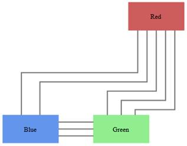

::: {style="DISPLAY: none"}
{#d2h_url_template}{#d2h_package_url style="WIDTH: 0px; DISPLAY: none; HEIGHT: 0px"}
:::

::: {.d2h_secondary_topic style="PADDING-BOTTOM: 10pt; MARGIN: 0pt; PADDING-LEFT: 0pt; PADDING-RIGHT: 0pt; PADDING-TOP: 0pt"}
##### Line Distributing {#line-distributing style="tab-stops: 0pt"}

When a link is drawn between two nodes, by enabling the **LineDistributingEnabled** property of that link, and if any other line exists or is drawn in the nodes, the line will be automatically distributed from those nodes.

{border="0"}

Figure 70: Line Distributing

 

Enable Line Distributing for Line Connectors

Line distributing for a line connector can be enabled using the **LineDistributingEnabled** property.

By default this property will be set to **False**.

+--------------------------------------------------------------------------------------------------------------------------------------------------------------------------------------+
| **[Controller]{style="FONT-FAMILY: 'Courier New'; COLOR: black"}**                                                                                                                   |
|                                                                                                                                                                                      |
|                                                                                                                                                                                      |
|                                                                                                                                                                                      |
| [LineConnector]{style="FONT-FAMILY: 'Courier New'; COLOR: #2b91af"}[ lc = [new]{style="COLOR: blue"} [LineConnector]{style="COLOR: #2b91af"}();]{style="FONT-FAMILY: 'Courier New'"} |
|                                                                                                                                                                                      |
| [lc.ConnectorType = [ConnectorType]{style="COLOR: #2b91af"}.Orthogonal;]{style="FONT-FAMILY: 'Courier New'"}                                                                         |
|                                                                                                                                                                                      |
| [lc.LineDistributingEnabled]{style="FONT-FAMILY: 'Courier New'"} [= [true]{style="COLOR: blue"};]{style="FONT-FAMILY: 'Courier New'"}                                                |
+--------------------------------------------------------------------------------------------------------------------------------------------------------------------------------------+

[]{style="DISPLAY: none; FONT-FAMILY: 'Times New Roman','serif'; FONT-SIZE: 12pt"} 

The code sample above enables the line distributing feature.

***[]{style="FONT-SIZE: 9pt"}*** 

{border="0"}***[Note: Only orthogonal connector type supports line distributing.]{style="FONT-SIZE: 9pt"}***

 

[]{#related-topics}
:::
