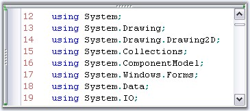
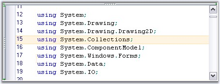

::: {style="DISPLAY: none"}
{#d2h_url_template}{#d2h_package_url style="WIDTH: 0px; DISPLAY: none; HEIGHT: 0px"}
:::

::::: {#nsbanner .d2h_main_nsbanner style="BORDER-BOTTOM: #999999 1px solid; POSITION: relative; PADDING-BOTTOM: 0px; BACKGROUND-COLOR: transparent; PADDING-LEFT: 0px; PADDING-RIGHT: 0px; DISPLAY: none; BORDER-TOP: #999999 1px solid; PADDING-TOP: 0px; LEFT: 0px"}
:::: {#TitleRow .d2h_main_titlerow style="PADDING-BOTTOM: 4px; BACKGROUND-COLOR: transparent; PADDING-LEFT: 22px; WIDTH: 100%; PADDING-RIGHT: 10px; DISPLAY: none; PADDING-TOP: 4px"}
::: {#ienav .d2h_main_ienav style="DISPLAY: none"}
{#D2HPrevious .D2HPreviousEnabled}  {#D2HNext .D2HNextEnabled}
:::
::::
:::::

::::::: {#nstext .d2h_main_nstext style="PADDING-BOTTOM: 10px; BACKGROUND-COLOR: transparent; PADDING-LEFT: 22px; PADDING-RIGHT: 10px; HEIGHT: 100%; OVERFLOW: auto; PADDING-TOP: 5px" hasuserbackground="true" valign="bottom"}
::: {#d2h_breadcrumbs .d2h_breadcrumbs}
[Essential Studio User Guide Documentation](ms-xhelp:///?Id=12457748-09e3-4d74-a240-8e049cedf030){.d2h_breadcrumbsNormal}[ \> ]{.d2h_breadcrumbsLinkSeparator}[User Interface Edition](ms-xhelp:///?Id=c29296b7-531c-413b-a0ec-488ca1f7f669){.d2h_breadcrumbsNormal}[ \> ]{.d2h_breadcrumbsLinkSeparator}[Essential Windows](ms-xhelp:///?Id=e60759d8-47a4-4570-9d7a-16a68d63f2ea){.d2h_breadcrumbsNormal}[ \> ]{.d2h_breadcrumbsLinkSeparator}[Essential Edit]{.d2h_breadcrumbsContentsOnly}[ \> ]{.d2h_breadcrumbsLinkSeparator}[Concepts And Features](ms-xhelp:///?Id=7c39cee6-8434-4711-a18e-efaba8ac85c0){.d2h_breadcrumbsNormal}[ \> ]{.d2h_breadcrumbsLinkSeparator}[Text Visualization](ms-xhelp:///?Id=03937960-0195-4ded-b842-e48212f822d3){.d2h_breadcrumbsNormal}
:::

### Line Numbers and Current Line Highlighting {#line-numbers-and-current-line-highlighting style="tab-stops: 0pt"}

 

Line Numbers can be automatically assigned to the contents of the Edit Control by enabling its **ShowLineNumbers** property.

 

The number of lines in the Edit Control can be obtained by using the **PhysicalLineCount** property. This property returns the actual number of lines in the Edit Control, without considering the lines that maybe hidden because of a collapsed outlining block or new lines that maybe added because of wordwrap.

 

::: {align="center"}
  ----------------------- --------------------------------------------------------------------
  Edit Control Property   Description
  ShowLineNumbers         Gets / sets value indicating whether line numbers should be shown.
  PhysicalLineCount       Gets the count of lines in the files.
  ----------------------- --------------------------------------------------------------------
:::

[]{style="FONT-FAMILY: 'Trebuchet MS','sans-serif'; COLOR: #15428b; FONT-SIZE: 9pt"} 

+----------------------------------------------------------------------------------------------------------------------------------------------------------------------------+
| **[\[C#\]]{style="FONT-FAMILY: 'Courier New'; COLOR: black"}**                                                                                                             |
|                                                                                                                                                                            |
| []{style="FONT-FAMILY: 'Courier New'; COLOR: black"}                                                                                                                       |
|                                                                                                                                                                            |
| [// Assigning Line Numbers to the contents of the Edit Control.]{style="FONT-FAMILY: 'Courier New'; COLOR: green"}                                                         |
|                                                                                                                                                                            |
| [this]{style="FONT-FAMILY: 'Courier New'; COLOR: blue"}[.editControl1.ShowLineNumbers = [true]{style="COLOR: blue"};]{style="FONT-FAMILY: 'Courier New'"}                  |
|                                                                                                                                                                            |
| []{style="FONT-FAMILY: 'Courier New'; COLOR: black"}                                                                                                                       |
|                                                                                                                                                                            |
| [// Gets the number of lines in the Edit Control.]{style="FONT-FAMILY: 'Courier New'; COLOR: green"}                                                                       |
|                                                                                                                                                                            |
| [int]{style="FONT-FAMILY: 'Courier New'; COLOR: blue"}[ actualLineCount = [this]{style="COLOR: blue"}.editControl1.PhysicalLineCount;]{style="FONT-FAMILY: 'Courier New'"} |
+----------------------------------------------------------------------------------------------------------------------------------------------------------------------------+

[]{style="FONT-FAMILY: 'Trebuchet MS','sans-serif'; COLOR: #15428b; FONT-SIZE: 9pt"} 

+----------------------------------------------------------------------------------------------------------------------------------------------------------------------------------------------------------------------------------+
| **[\[VB.NET\]]{style="FONT-FAMILY: 'Courier New'; COLOR: black"}**                                                                                                                                                               |
|                                                                                                                                                                                                                                  |
| []{style="FONT-FAMILY: 'Courier New'; COLOR: black"}                                                                                                                                                                             |
|                                                                                                                                                                                                                                  |
| [\' Assigning Line Numbers to the contents of the Edit Control.]{style="FONT-FAMILY: 'Courier New'; COLOR: green"}                                                                                                               |
|                                                                                                                                                                                                                                  |
| [Me]{style="FONT-FAMILY: 'Courier New'; COLOR: blue"}[.editControl1.ShowLineNumbers = [True]{style="COLOR: blue"}]{style="FONT-FAMILY: 'Courier New'"}                                                                           |
|                                                                                                                                                                                                                                  |
| []{style="FONT-FAMILY: 'Courier New'; COLOR: black"}                                                                                                                                                                             |
|                                                                                                                                                                                                                                  |
| [\' Gets the number of lines in the Edit Control.]{style="FONT-FAMILY: 'Courier New'; COLOR: green"}                                                                                                                             |
|                                                                                                                                                                                                                                  |
| [Dim]{style="FONT-FAMILY: 'Courier New'; COLOR: blue"}[ actualLineCount [As]{style="COLOR: blue"} [Integer]{style="COLOR: blue"} = [Me]{style="COLOR: blue"}.editControl1.PhysicalLineCount]{style="FONT-FAMILY: 'Courier New'"} |
+----------------------------------------------------------------------------------------------------------------------------------------------------------------------------------------------------------------------------------+

 

Line numbers can be customized by using the below given Edit Control properties.

 

::: {align="center"}
+-----------------------------------+--------------------------------------------------------------------------------+
| Edit Control Property             | Description                                                                    |
+-----------------------------------+--------------------------------------------------------------------------------+
| LineNumbersAlignment              | Specifies the alignment of line numbers. The options provided are              |
|                                   |                                                                                |
|                                   | *[]{style="FONT-FAMILY: 'Segoe UI','sans-serif'"}*                             |
|                                   |                                                                                |
|                                   | *Left*                                                                         |
|                                   |                                                                                |
|                                   | *Right*                                                                        |
+-----------------------------------+--------------------------------------------------------------------------------+
| LineNumbersColor                  | Specifies the color of line numbers.                                           |
+-----------------------------------+--------------------------------------------------------------------------------+
| LineNumbersFont                   | Specifies the font of line numbers.                                            |
+-----------------------------------+--------------------------------------------------------------------------------+
| SelectOnLineNumberClick           | Gets / sets value indicating whether click on line numbers performs selection. |
+-----------------------------------+--------------------------------------------------------------------------------+
:::

[]{style="FONT-FAMILY: 'Trebuchet MS','sans-serif'; COLOR: #15428b; FONT-SIZE: 9pt"} 

+-------------------------------------------------------------------------------------------------------------------------------------------------------------------------------------------------------------------------------+
| **[\[C#\]]{style="FONT-FAMILY: 'Courier New'; COLOR: black"}**                                                                                                                                                                |
|                                                                                                                                                                                                                               |
| []{style="FONT-FAMILY: 'Courier New'; COLOR: black"}                                                                                                                                                                          |
|                                                                                                                                                                                                                               |
| [// Specify the alignment of line numbers.]{style="FONT-FAMILY: 'Courier New'; COLOR: green"}                                                                                                                                 |
|                                                                                                                                                                                                                               |
| [this]{style="FONT-FAMILY: 'Courier New'; COLOR: blue"}[.editControl1.LineNumbersAlignment = Syncfusion.Windows.Forms.Edit.Enums.[LineNumberAlignment]{style="COLOR: teal"}.Right;]{style="FONT-FAMILY: 'Courier New'"}       |
|                                                                                                                                                                                                                               |
| []{style="FONT-FAMILY: 'Courier New'; COLOR: black"}                                                                                                                                                                          |
|                                                                                                                                                                                                                               |
| [// Assign any color to the line numbers.]{style="FONT-FAMILY: 'Courier New'; COLOR: green"}                                                                                                                                  |
|                                                                                                                                                                                                                               |
| [this]{style="FONT-FAMILY: 'Courier New'; COLOR: blue"}[.editControl1.LineNumbersColor = [Color]{style="COLOR: teal"}.IndianRed;]{style="FONT-FAMILY: 'Courier New'"}                                                         |
|                                                                                                                                                                                                                               |
| []{style="FONT-FAMILY: 'Courier New'"}                                                                                                                                                                                        |
|                                                                                                                                                                                                                               |
| [// Assign any font to the line numbers.]{style="FONT-FAMILY: 'Courier New'; COLOR: green"}                                                                                                                                   |
|                                                                                                                                                                                                                               |
| [this]{style="FONT-FAMILY: 'Courier New'; COLOR: blue"}[.editControl1.LineNumbersFont = [new]{style="COLOR: blue"} [Font]{style="COLOR: teal"}([\"Verdana\"]{style="COLOR: maroon"}, 9);]{style="FONT-FAMILY: 'Courier New'"} |
|                                                                                                                                                                                                                               |
| []{style="FONT-FAMILY: 'Courier New'"}                                                                                                                                                                                        |
|                                                                                                                                                                                                                               |
| [// Enabling SelectOnLineNumberClick property to perform selection on clicking the line numbers. ]{style="FONT-FAMILY: 'Courier New'; COLOR: green"}                                                                          |
|                                                                                                                                                                                                                               |
| [this]{style="FONT-FAMILY: 'Courier New'; COLOR: blue"}[.editControl1.SelectOnLineNumberClick = [true]{style="COLOR: blue"};]{style="FONT-FAMILY: 'Courier New'"}                                                             |
+-------------------------------------------------------------------------------------------------------------------------------------------------------------------------------------------------------------------------------+

[]{style="FONT-FAMILY: 'Trebuchet MS','sans-serif'; COLOR: #15428b; FONT-SIZE: 9pt"} 

+-----------------------------------------------------------------------------------------------------------------------------------------------------------------------------------------------------+
| **[\[VB.NET\]]{style="FONT-FAMILY: 'Courier New'; COLOR: black"}**                                                                                                                                  |
|                                                                                                                                                                                                     |
| []{style="FONT-FAMILY: 'Courier New'; COLOR: black"}                                                                                                                                                |
|                                                                                                                                                                                                     |
| [\' Specify the alignment of line numbers.]{style="FONT-FAMILY: 'Courier New'; COLOR: green"}                                                                                                       |
|                                                                                                                                                                                                     |
| [Me]{style="FONT-FAMILY: 'Courier New'; COLOR: blue"}[.editControl1.LineNumbersAlignment = Syncfusion.Windows.Forms.Edit.Enums.LineNumberAlignment.Right]{style="FONT-FAMILY: 'Courier New'"}       |
|                                                                                                                                                                                                     |
| []{style="FONT-FAMILY: 'Courier New'; COLOR: black"}                                                                                                                                                |
|                                                                                                                                                                                                     |
| [\' Assign any color to the line numbers.]{style="FONT-FAMILY: 'Courier New'; COLOR: green"}                                                                                                        |
|                                                                                                                                                                                                     |
| [Me]{style="FONT-FAMILY: 'Courier New'; COLOR: blue"}[.editControl1.LineNumbersColor = Color.IndianRed]{style="FONT-FAMILY: 'Courier New'"}                                                         |
|                                                                                                                                                                                                     |
| []{style="FONT-FAMILY: 'Courier New'"}                                                                                                                                                              |
|                                                                                                                                                                                                     |
| [\' Assign any font to the line numbers.]{style="FONT-FAMILY: 'Courier New'; COLOR: green"}                                                                                                         |
|                                                                                                                                                                                                     |
| [Me]{style="FONT-FAMILY: 'Courier New'; COLOR: blue"}[.editControl1.LineNumbersFont = [new]{style="COLOR: blue"} Font([\"Verdana\"]{style="COLOR: maroon"}, 9)]{style="FONT-FAMILY: 'Courier New'"} |
|                                                                                                                                                                                                     |
| []{style="FONT-FAMILY: 'Courier New'"}                                                                                                                                                              |
|                                                                                                                                                                                                     |
| [\' Enabling SelectOnLineNumberClick property to perform selection on clicking the line numbers. ]{style="FONT-FAMILY: 'Courier New'; COLOR: green"}                                                |
|                                                                                                                                                                                                     |
| [Me]{style="FONT-FAMILY: 'Courier New'; COLOR: blue"}[.editControl1.SelectOnLineNumberClick = [True]{style="COLOR: blue"}]{style="FONT-FAMILY: 'Courier New'"}                                      |
+-----------------------------------------------------------------------------------------------------------------------------------------------------------------------------------------------------+

[]{style="FONT-FAMILY: 'Trebuchet MS','sans-serif'; COLOR: #15428b; FONT-SIZE: 9pt"} 

[{border="0"}]{style="FONT-FAMILY: 'Trebuchet MS','sans-serif'; COLOR: #15428b; FONT-SIZE: 9pt"}[]{style="FONT-FAMILY: 'Trebuchet MS','sans-serif'; COLOR: #15428b; FONT-SIZE: 9pt"}

Figure 22: IndianRed Color Line Numbers with FontSize = \"9\", FontStyle = \"Verdana\"

[]{style="COLOR: red; FONT-SIZE: 8pt"} 

Highlighting Current Line at Run Time

[]{style="FONT-FAMILY: 'Trebuchet MS','sans-serif'; COLOR: #15428b; FONT-SIZE: 9pt"} 

You can highlight the current line where the mouse pointer is present by setting the **HighlightCurrentLine** property of the Edit Control to **True**. Set the color for the highlighted line by using the **CurrentLineHighlightColor** property.

[]{style="FONT-FAMILY: 'Trebuchet MS','sans-serif'; COLOR: #15428b; FONT-SIZE: 9pt"} 

::: {align="center"}
  --------------------------- --------------------------------------------------------------------------
  Edit Control Property       Description
  HighlightCurrentLine        Gets / sets value indicating whether current line should be highlighted.
  CurrentLineHighlightColor   Gets / sets color of current line highlight.
  --------------------------- --------------------------------------------------------------------------
:::

[]{style="FONT-FAMILY: 'Trebuchet MS','sans-serif'; COLOR: #15428b; FONT-SIZE: 9pt"} 

+-----------------------------------------------------------------------------------------------------------------------------------------------------------------------------+
| **[\[C#\]]{style="FONT-FAMILY: 'Courier New'; COLOR: black"}**                                                                                                              |
|                                                                                                                                                                             |
| []{style="FONT-FAMILY: 'Courier New'; COLOR: black"}                                                                                                                        |
|                                                                                                                                                                             |
| [this]{style="FONT-FAMILY: 'Courier New'; COLOR: blue"}[.editControl1.HighlightCurrentLine = [true]{style="COLOR: blue"};]{style="FONT-FAMILY: 'Courier New'"}              |
|                                                                                                                                                                             |
| [this]{style="FONT-FAMILY: 'Courier New'; COLOR: blue"}[.editControl1.CurrentLineHighlightColor = [Color]{style="COLOR: teal"}.Orange;]{style="FONT-FAMILY: 'Courier New'"} |
+-----------------------------------------------------------------------------------------------------------------------------------------------------------------------------+

[]{style="FONT-FAMILY: 'Trebuchet MS','sans-serif'; COLOR: #15428b; FONT-SIZE: 9pt"} 

+-------------------------------------------------------------------------------------------------------------------------------------------------------------+
| **[\[VB.NET\]]{style="FONT-FAMILY: 'Courier New'; COLOR: black"}**                                                                                          |
|                                                                                                                                                             |
| []{style="FONT-FAMILY: 'Courier New'; COLOR: black"}                                                                                                        |
|                                                                                                                                                             |
| [Me]{style="FONT-FAMILY: 'Courier New'; COLOR: blue"}[.editControl1.HighlightCurrentLine = [true]{style="COLOR: blue"}]{style="FONT-FAMILY: 'Courier New'"} |
|                                                                                                                                                             |
| [Me]{style="FONT-FAMILY: 'Courier New'; COLOR: blue"}[.editControl1.CurrentLineHighlightColor = Color.Orange]{style="FONT-FAMILY: 'Courier New'"}           |
+-------------------------------------------------------------------------------------------------------------------------------------------------------------+

[]{style="FONT-FAMILY: 'Trebuchet MS','sans-serif'; COLOR: #15428b; FONT-SIZE: 9pt"} 

{border="0"}

Figure 23: CurrentLineHighlightColor = \"Orange\"

 

You can also highlight the selected text by using the Text Highlighting feature discussed in Background Settings.

 

[]{#p42} 

[]{#related-topics}
:::::::
