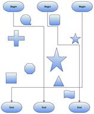

::: {style="DISPLAY: none"}
{#d2h_url_template}{#d2h_package_url style="WIDTH: 0px; DISPLAY: none; HEIGHT: 0px"}
:::

::::: {#nsbanner .d2h_main_nsbanner style="BORDER-BOTTOM: #999999 1px solid; POSITION: relative; PADDING-BOTTOM: 0px; BACKGROUND-COLOR: transparent; PADDING-LEFT: 0px; PADDING-RIGHT: 0px; DISPLAY: none; BORDER-TOP: #999999 1px solid; PADDING-TOP: 0px; LEFT: 0px"}
:::: {#TitleRow .d2h_main_titlerow style="PADDING-BOTTOM: 4px; BACKGROUND-COLOR: transparent; PADDING-LEFT: 22px; WIDTH: 100%; PADDING-RIGHT: 10px; DISPLAY: none; PADDING-TOP: 4px"}
::: {#ienav .d2h_main_ienav style="DISPLAY: none"}
{#D2HPrevious .D2HPreviousEnabled}  {#D2HNext .D2HNextEnabled}
:::
::::
:::::

:::::: {#nstext .d2h_main_nstext style="PADDING-BOTTOM: 10px; BACKGROUND-COLOR: transparent; PADDING-LEFT: 22px; PADDING-RIGHT: 10px; HEIGHT: 100%; OVERFLOW: auto; PADDING-TOP: 5px" hasuserbackground="true" valign="bottom"}
::: {#d2h_breadcrumbs .d2h_breadcrumbs}
[Essential Studio User Guide Documentation](ms-xhelp:///?Id=12457748-09e3-4d74-a240-8e049cedf030){.d2h_breadcrumbsNormal}[ \> ]{.d2h_breadcrumbsLinkSeparator}[User Interface Edition](ms-xhelp:///?Id=c29296b7-531c-413b-a0ec-488ca1f7f669){.d2h_breadcrumbsNormal}[ \> ]{.d2h_breadcrumbsLinkSeparator}[Essential Silverlight](ms-xhelp:///?Id=66221bd1-ba2e-43c2-94a7-618f50e01d24){.d2h_breadcrumbsNormal}[ \> ]{.d2h_breadcrumbsLinkSeparator}[Essential Diagram]{.d2h_breadcrumbsContentsOnly}[ \> ]{.d2h_breadcrumbsLinkSeparator}[Concepts and Features](ms-xhelp:///?Id=d592a058-dcc0-44a4-994e-e7901da8db52){.d2h_breadcrumbsNormal}[ \> ]{.d2h_breadcrumbsLinkSeparator}[Line Connectors](ms-xhelp:///?Id=c0725ce8-38f1-496a-8a8e-c6602250e6b6){.d2h_breadcrumbsNormal}
:::

### [[Line Routing]{style="COLOR: #4e84c4; FONT-SIZE: 14pt; TEXT-DECORATION: none; text-underline: none"}]{.UGHyperlink} {#line-routing style="tab-stops: 0pt"}

When a link is drawn between two nodes, by enabling the **LineRoutingEnabled** property of that link and the diagram view, and if any other node is found in between them, the line will be automatically re-routed around those nodes.

{border="0"}

Figure 72: Line Routing

**Properties**

::: {align="center"}
+------------------------+--------------------------------------------------------------------------------------------------------+-------------+-------------+-----------------+
| Property               | Description                                                                                            | Type        | Datatype    | Reference links |
+------------------------+--------------------------------------------------------------------------------------------------------+-------------+-------------+-----------------+
| **LineRoutingEnabled** | Specifies whether the links must be re-routed when nodes are found in the path. Default value is True. | Dependency  | Boolean     | NA              |
|                        |                                                                                                        |             |             |                 |
|                        |                                                                                                        |             |             |                 |
+------------------------+--------------------------------------------------------------------------------------------------------+-------------+-------------+-----------------+
:::

 

Disable Line Routing for LineConnector

Line Routing for a line connector can be disabled using the **LineRoutingEnabled** property.

By default this property will be set to True.

+--------------------------------------------------------------------------------------------------------------------------------------------------------------------------------------+
| **[\[C#\]]{style="FONT-FAMILY: 'Courier New'; COLOR: black"}**                                                                                                                       |
|                                                                                                                                                                                      |
| [LineConnector]{style="FONT-FAMILY: 'Courier New'; COLOR: #2b91af"}[ lc = [new]{style="COLOR: blue"} [LineConnector]{style="COLOR: #2b91af"}();]{style="FONT-FAMILY: 'Courier New'"} |
|                                                                                                                                                                                      |
| [lc.ConnectorType = [ConnectorType]{style="COLOR: #2b91af"}.Orthogonal;]{style="FONT-FAMILY: 'Courier New'"}                                                                         |
|                                                                                                                                                                                      |
| [lc.LineBridgingEnabled = [false]{style="COLOR: blue"};]{style="FONT-FAMILY: 'Courier New'"}                                                                                         |
+--------------------------------------------------------------------------------------------------------------------------------------------------------------------------------------+

 

+------------------------------------------------------------------------------------------------------------------------------------------------------------------------------------------------+
| **[\[VB\]]{style="FONT-FAMILY: 'Courier New'; COLOR: black"}**                                                                                                                                 |
|                                                                                                                                                                                                |
| [Dim]{style="FONT-FAMILY: 'Courier New'; COLOR: blue"}[ lc [As]{style="COLOR: blue"} [New]{style="COLOR: blue"} [LineConnector]{style="COLOR: #2b91af"}()]{style="FONT-FAMILY: 'Courier New'"} |
|                                                                                                                                                                                                |
| [lc.ConnectorType = ConnectorType.Orthogonal]{style="FONT-FAMILY: 'Courier New'"}                                                                                                              |
|                                                                                                                                                                                                |
| [lc.LineBridgingEnabled = [False]{style="COLOR: blue"}]{style="FONT-FAMILY: 'Courier New'"}                                                                                                    |
+------------------------------------------------------------------------------------------------------------------------------------------------------------------------------------------------+

 

The Line Routing is disabled.

[]{style="FONT-FAMILY: 'Calibri','sans-serif'; FONT-SIZE: 11pt"} 

Enable LineRouting from DiagramView

When LineRouting for DiagramView is enabled, LineRouting for all the lines will be enabled. You can change this binding by specifying a value for an individual LineConnector.

+-------------------------------------------------------------------------------------------------------------------------------------------------------------------------------------+
| **[\[C#\]]{style="FONT-FAMILY: 'Courier New'; COLOR: black"}**                                                                                                                      |
|                                                                                                                                                                                     |
| [DiagramView]{style="FONT-FAMILY: 'Courier New'; COLOR: #2b91af"}[ view = [new]{style="COLOR: blue"} [DiagramView]{style="COLOR: #2b91af"} ();]{style="FONT-FAMILY: 'Courier New'"} |
|                                                                                                                                                                                     |
| [view.LineRoutingEnabled = [true]{style="COLOR: blue"}]{style="FONT-FAMILY: 'Courier New'"}                                                                                         |
+-------------------------------------------------------------------------------------------------------------------------------------------------------------------------------------+

 

+-------------------------------------------------------------------------------------------------------------------------------------------------------------------------------------------------+
| **[\[VB\]]{style="FONT-FAMILY: 'Courier New'; COLOR: black"}**                                                                                                                                  |
|                                                                                                                                                                                                 |
| [Dim]{style="FONT-FAMILY: 'Courier New'; COLOR: blue"}[ view [As]{style="COLOR: blue"} [New]{style="COLOR: blue"} [DiagramView ]{style="COLOR: #2b91af"}()]{style="FONT-FAMILY: 'Courier New'"} |
|                                                                                                                                                                                                 |
| [view.LineRoutingEnabled = [True]{style="COLOR: blue"}]{style="FONT-FAMILY: 'Courier New'"}                                                                                                     |
+-------------------------------------------------------------------------------------------------------------------------------------------------------------------------------------------------+

 

The Line Routing is enabled completely.

::: {style="BORDER-BOTTOM: windowtext 1pt solid; BORDER-LEFT: medium none; PADDING-BOTTOM: 1pt; MARGIN-TOP: 9pt; PADDING-LEFT: 0pt; PADDING-RIGHT: 0pt; MARGIN-BOTTOM: 9pt; BORDER-TOP: windowtext 1pt solid; BORDER-RIGHT: medium none; PADDING-TOP: 1pt"}
Note: Only Orthogonal Connector type supports Line Routing.
:::

Node settings

By default, **TreatAsObstacle** property of the Node is set to true to avoid the lines overlapping them. If not set for a Node, then it will not be considered as an obstacle and the line might overlap on them.

+----------------------------------------------------------------------------------+-------------------------------------------------------------------------------------+-------------+-------------+-----------------+
| Property                                                                         | Description                                                                         | Type        | Datatype    | Reference links |
+----------------------------------------------------------------------------------+-------------------------------------------------------------------------------------+-------------+-------------+-----------------+
| **TreatAsObstacle[]{style="FONT-FAMILY: 'Calibri','sans-serif'; COLOR: black"}** | Gets or sets a value indicating whether the node treats as Obstacle.                | Dependency  | Boolean     | NA              |
|                                                                                  |                                                                                     |             |             |                 |
|                                                                                  | Default value is True.[]{style="FONT-FAMILY: 'Calibri','sans-serif'; COLOR: black"} |             |             |                 |
+----------------------------------------------------------------------------------+-------------------------------------------------------------------------------------+-------------+-------------+-----------------+

 

[]{#related-topics}
::::::
