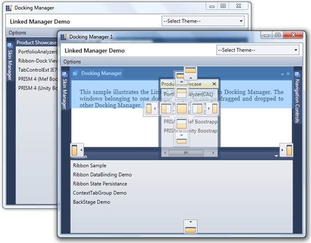

::: {style="DISPLAY: none"}
{#d2h_url_template}{#d2h_package_url style="WIDTH: 0px; DISPLAY: none; HEIGHT: 0px"}
:::

::: {.d2h_secondary_topic style="PADDING-BOTTOM: 10pt; MARGIN: 0pt; PADDING-LEFT: 0pt; PADDING-RIGHT: 0pt; PADDING-TOP: 0pt"}
#### Linked Manager Support {#linked-manager-support style="tab-stops: 0pt"}

Linked Manager Support is an important feature that helps to drag and drop windows from one docking manager to any other docking manager.

Use Case Scenario

[·      ]{style="FONT-FAMILY: Symbol"}This Drag and Drop support will enhance the Linked Manager functionality between Docking Managers.

[·      ]{style="FONT-FAMILY: Symbol"}It permits the user to have better usability of any windows residing in any Docking Manager.

{border="0"}

Figure 365: Linked Manager Support

More:

[ ]{#related-topics}

[{border="0" align="absMiddle"}Getting started](ms-xhelp:///?Id=445d2c21-3c07-4872-b932-0d4484776880){style="TEXT-DECORATION: none"}

[{border="0" align="absMiddle"}Properties, Methods and Events tables](ms-xhelp:///?Id=6274d633-b0fb-495d-893d-fb51dd22aa8a){style="TEXT-DECORATION: none"}

[{border="0" align="absMiddle"}Features of Linked Manager Support](ms-xhelp:///?Id=ace9a9ae-4664-4dc8-a3ef-324c08a061f1){style="TEXT-DECORATION: none"}
:::
