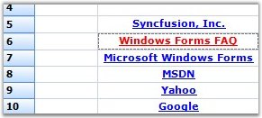

::: {style="DISPLAY: none"}
{#d2h_url_template}{#d2h_package_url style="WIDTH: 0px; DISPLAY: none; HEIGHT: 0px"}
:::

::: {.d2h_secondary_topic style="PADDING-BOTTOM: 10pt; MARGIN: 0pt; PADDING-LEFT: 0pt; PADDING-RIGHT: 0pt; PADDING-TOP: 0pt"}
##### Link Label Cell {#link-label-cell style="tab-stops: 0pt"}

[]{style="FONT-FAMILY: 'Trebuchet MS','sans-serif'; COLOR: #15428b; FONT-SIZE: 9pt"} 

The Link Label Cell cell type holds the link that has been provided in the **Tag** property. This displays ordinary text in the cell which links to the specified location.

 

The following code examples illustrate how to set the cell type to LinkLabelCell.

[]{style="FONT-FAMILY: 'Trebuchet MS','sans-serif'; COLOR: #15428b; FONT-SIZE: 9pt"} 

1.   Using C#

[]{style="FONT-FAMILY: 'Trebuchet MS','sans-serif'; COLOR: #15428b; FONT-SIZE: 9pt"} 

+----------------------------------------------------------------------------------------------------------------------------------------------------------------------------------------------------+
| **[\[C#\]]{style="FONT-FAMILY: 'Courier New'; COLOR: black"}**                                                                                                                                     |
|                                                                                                                                                                                                    |
| []{style="FONT-FAMILY: 'Courier New'; COLOR: black"}                                                                                                                                               |
|                                                                                                                                                                                                    |
| [RegisterCellModel]{style="FONT-FAMILY: 'Courier New'; COLOR: #2b91af"}[.GridCellType(gridControl1, [CustomCellTypes]{style="COLOR: #2b91af"}.LinkLabelCell);]{style="FONT-FAMILY: 'Courier New'"} |
|                                                                                                                                                                                                    |
| [int]{style="FONT-FAMILY: 'Courier New'; COLOR: blue"}[ rowIndex = 5;]{style="FONT-FAMILY: 'Courier New'"}                                                                                         |
|                                                                                                                                                                                                    |
| [gridControl1\[rowIndex, 2\].CellType = [CustomCellTypes]{style="COLOR: #2b91af"}.LinkLabelCell.ToString();]{style="FONT-FAMILY: 'Courier New'"}                                                   |
|                                                                                                                                                                                                    |
| [gridControl1\[rowIndex, 2\].Text = [\"Syncfusion, Inc.\"]{style="COLOR: #a31515"};]{style="FONT-FAMILY: 'Courier New'"}                                                                           |
|                                                                                                                                                                                                    |
| [gridControl1\[rowIndex, 2\].Font.Bold = [true]{style="COLOR: blue"};]{style="FONT-FAMILY: 'Courier New'"}                                                                                         |
|                                                                                                                                                                                                    |
| [gridControl1\[rowIndex, 2\].Tag = [\"http://www.syncfusion.com\"]{style="COLOR: #a31515"};]{style="FONT-FAMILY: 'Courier New'"}                                                                   |
+----------------------------------------------------------------------------------------------------------------------------------------------------------------------------------------------------+

[]{style="FONT-FAMILY: 'Trebuchet MS','sans-serif'; COLOR: #15428b; FONT-SIZE: 9pt"} 

2.   Using VB.NET

[]{style="FONT-FAMILY: 'Trebuchet MS','sans-serif'; COLOR: #15428b; FONT-SIZE: 9pt"} 

+--------------------------------------------------------------------------------------------------------------------------------------------------------------------+
| **[\[VB.NET\]]{style="FONT-FAMILY: 'Courier New'; COLOR: black"}**                                                                                                 |
|                                                                                                                                                                    |
| []{style="FONT-FAMILY: 'Courier New'; COLOR: black"}                                                                                                               |
|                                                                                                                                                                    |
| [RegisterCellModel.GridCellType(gridControl1, CustomCellTypes.LinkLabelCell)]{style="FONT-FAMILY: 'Courier New'"}                                                  |
|                                                                                                                                                                    |
| [Dim]{style="FONT-FAMILY: 'Courier New'; COLOR: blue"}[ rowIndex [As]{style="COLOR: blue"} [Integer]{style="COLOR: blue"} = 5]{style="FONT-FAMILY: 'Courier New'"} |
|                                                                                                                                                                    |
| [gridControl1(rowIndex, 2).CellType = CustomCellTypes.LinkLabelCell.ToString()]{style="FONT-FAMILY: 'Courier New'"}                                                |
|                                                                                                                                                                    |
| [gridControl1(rowIndex, 2).Text = [\"Syncfusion, Inc.\"]{style="COLOR: #a31515"}]{style="FONT-FAMILY: 'Courier New'"}                                              |
|                                                                                                                                                                    |
| [gridControl1(rowIndex, 2).Font.Bold = [True]{style="COLOR: blue"}]{style="FONT-FAMILY: 'Courier New'"}                                                            |
|                                                                                                                                                                    |
| [gridControl1(rowIndex, 2).Tag = [\"http://www.syncfusion.com\"]{style="COLOR: #a31515"}]{style="FONT-FAMILY: 'Courier New'"}                                      |
+--------------------------------------------------------------------------------------------------------------------------------------------------------------------+

[]{style="FONT-FAMILY: 'Trebuchet MS','sans-serif'; COLOR: #15428b; FONT-SIZE: 9pt"} 

{border="0"}

[]{style="FONT-FAMILY: 'Trebuchet MS','sans-serif'; COLOR: #15428b; FONT-SIZE: 9pt"} 

*[Figure ]{style="FONT-SIZE: 9pt"}[111]{style="FONT-SIZE: 9pt"}[: \"Link Label Cell\" Cells]{style="FONT-SIZE: 9pt"}*

 

[]{#p100} 

 

[]{#related-topics}
:::
