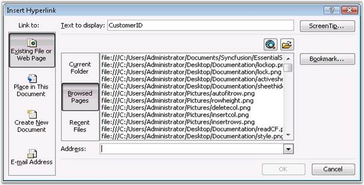
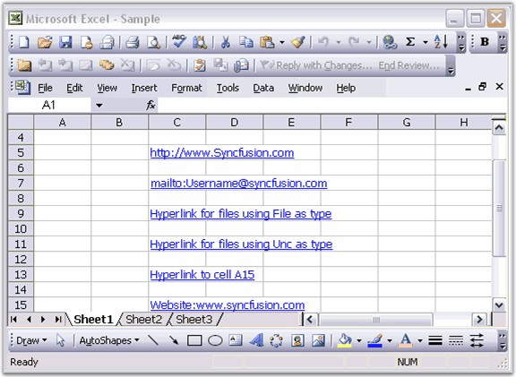

::: {style="DISPLAY: none"}
{#d2h_url_template}{#d2h_package_url style="WIDTH: 0px; DISPLAY: none; HEIGHT: 0px"}
:::

::::: {#nsbanner .d2h_main_nsbanner style="BORDER-BOTTOM: #999999 1px solid; POSITION: relative; PADDING-BOTTOM: 0px; BACKGROUND-COLOR: transparent; PADDING-LEFT: 0px; PADDING-RIGHT: 0px; DISPLAY: none; BORDER-TOP: #999999 1px solid; PADDING-TOP: 0px; LEFT: 0px"}
:::: {#TitleRow .d2h_main_titlerow style="PADDING-BOTTOM: 4px; BACKGROUND-COLOR: transparent; PADDING-LEFT: 22px; WIDTH: 100%; PADDING-RIGHT: 10px; DISPLAY: none; PADDING-TOP: 4px"}
::: {#ienav .d2h_main_ienav style="DISPLAY: none"}
{#D2HPrevious .D2HPreviousEnabled}  {#D2HNext .D2HNextEnabled}
:::
::::
:::::

:::: {#nstext .d2h_main_nstext style="PADDING-BOTTOM: 10px; BACKGROUND-COLOR: transparent; PADDING-LEFT: 22px; PADDING-RIGHT: 10px; HEIGHT: 100%; OVERFLOW: auto; PADDING-TOP: 5px" hasuserbackground="true" valign="bottom"}
::: {#d2h_breadcrumbs .d2h_breadcrumbs}
[Essential Studio User Guide Documentation](ms-xhelp:///?Id=12457748-09e3-4d74-a240-8e049cedf030){.d2h_breadcrumbsNormal}[ \> ]{.d2h_breadcrumbsLinkSeparator}[Reporting Edition](ms-xhelp:///?Id=027aa5b6-6676-4f93-ad23-c20e8c45792e){.d2h_breadcrumbsNormal}[ \> ]{.d2h_breadcrumbsLinkSeparator}[Essential XlsIO](ms-xhelp:///?Id=b01a1b50-1d7d-40c0-bc83-af67e57c9005){.d2h_breadcrumbsNormal}[ \> ]{.d2h_breadcrumbsLinkSeparator}[Concepts and Features](ms-xhelp:///?Id=21b26556-5905-4ad9-90b4-40320db25faf){.d2h_breadcrumbsNormal}[ \> ]{.d2h_breadcrumbsLinkSeparator}[Insert](ms-xhelp:///?Id=3b5c8a38-7946-47f2-a4af-0711da3daaa8){.d2h_breadcrumbsNormal}
:::

### Links {#links style="tab-stops: 0pt"}

[]{style="FONT-FAMILY: 'Trebuchet MS','sans-serif'; COLOR: #15428b; FONT-SIZE: 9pt"} 

A hyperlink is a convenient way to allow the user of a workbook to instantly access another place in the workbook, or another workbook, or a file associated with another application. A hyperlink can be inserted in a cell or a shape in Excel. Select the cell or shape, and select Hyperlink from the **Insert** menu, or right-click anywhere in the cell or shape, and then select **Hyperlink** from the pop-up menu. You can enter a cell reference in the current workbook, browse to another workbook, a different file, or a web page, and even enter an email address and subject line. You can also edit the text for a hyperlink in a cell.

[]{style="FONT-FAMILY: 'Trebuchet MS','sans-serif'; COLOR: #15428b; FONT-SIZE: 9pt"} 

Following is the **Insert Hyperlink** dialog box of MS Excel that allows to set various hyperlinks.

[]{style="FONT-FAMILY: 'Trebuchet MS','sans-serif'; COLOR: #15428b; FONT-SIZE: 9pt"} 

{border="0"}

Figure 82: Inserting Hyperlink[]{style="FONT-FAMILY: 'Trebuchet MS','sans-serif'; COLOR: #15428b"}

 

XlsIO provides support to set the following types of hyperlinks with the **Type** and **Address** properties of the **IHyperlink** interface.

 

[·      ]{style="FONT-FAMILY: Symbol"}Hyperlink to a Worksheet Range

[·      ]{style="FONT-FAMILY: Symbol"}Hyperlink to Website

[·      ]{style="FONT-FAMILY: Symbol"}Hyperlink to e-mail

[·      ]{style="FONT-FAMILY: Symbol"}Hyperlink to external files

[]{style="FONT-FAMILY: 'Trebuchet MS','sans-serif'; COLOR: #15428b; FONT-SIZE: 9pt"} 

You can also set the text to be displayed in a hyperlink, and a tooltip that shows the purpose of the link, by using the **TextToDisplay** and **ScreenTip** properties.

[]{style="FONT-FAMILY: 'Trebuchet MS','sans-serif'; COLOR: #15428b; FONT-SIZE: 9pt"} 

Following code example illustrates how to insert various hyperlinks.

[]{style="FONT-FAMILY: 'Trebuchet MS','sans-serif'; COLOR: #15428b; FONT-SIZE: 9pt"} 

+---------------------------------------------------------------------------------------------------------------------------------------------------------------------------------------------+
| **[\[C#\]]{style="FONT-FAMILY: 'Courier New'"}**                                                                                                                                            |
|                                                                                                                                                                                             |
| **[]{style="FONT-FAMILY: 'Courier New'"}**                                                                                                                                                  |
|                                                                                                                                                                                             |
| [// Creating a Hyperlink for a Website.]{style="FONT-FAMILY: 'Courier New'; COLOR: green"}                                                                                                  |
|                                                                                                                                                                                             |
| [IHyperLink]{style="FONT-FAMILY: 'Courier New'; COLOR: #2b91af"}[ hyperlink = sheet.HyperLinks.Add(sheet.Range\[[\"C5\"]{style="COLOR: #a31515"}\]);]{style="FONT-FAMILY: 'Courier New'"}   |
|                                                                                                                                                                                             |
| [hyperlink.Type = [ExcelHyperLinkType]{style="COLOR: #2b91af"}.Url;]{style="FONT-FAMILY: 'Courier New'"}                                                                                    |
|                                                                                                                                                                                             |
| [hyperlink.Address = [\"http://www.syncfusion.com\"]{style="COLOR: #a31515"};]{style="FONT-FAMILY: 'Courier New'"}                                                                          |
|                                                                                                                                                                                             |
| [hyperlink.ScreenTip = [\"To know more About SYNCFUSION PRODUCTS go through this link\"]{style="COLOR: #a31515"};]{style="FONT-FAMILY: 'Courier New'"}                                      |
|                                                                                                                                                                                             |
| []{style="FONT-FAMILY: 'Courier New'"}                                                                                                                                                      |
|                                                                                                                                                                                             |
| [// Creating a Hyperlink for e-mail.]{style="FONT-FAMILY: 'Courier New'; COLOR: green"}                                                                                                     |
|                                                                                                                                                                                             |
| [IHyperLink]{style="FONT-FAMILY: 'Courier New'; COLOR: #2b91af"}[ hyperlink1 = sheet.HyperLinks.Add(sheet.Range\[[\"C7\"]{style="COLOR: #a31515"}\]);]{style="FONT-FAMILY: 'Courier New'"}  |
|                                                                                                                                                                                             |
| [hyperlink1.Type = [ExcelHyperLinkType]{style="COLOR: #2b91af"}.Url;]{style="FONT-FAMILY: 'Courier New'"}                                                                                   |
|                                                                                                                                                                                             |
| [hyperlink1.Address = [\"mailto:Username@syncfusion.com\"]{style="COLOR: #a31515"};]{style="FONT-FAMILY: 'Courier New'"}                                                                    |
|                                                                                                                                                                                             |
| [hyperlink1.ScreenTip = [\"Send Mail\"]{style="COLOR: #a31515"};]{style="FONT-FAMILY: 'Courier New'"}                                                                                       |
|                                                                                                                                                                                             |
| []{style="FONT-FAMILY: 'Courier New'"}                                                                                                                                                      |
|                                                                                                                                                                                             |
| [// Creating a Hyperlink for Opening Files using type as File.]{style="FONT-FAMILY: 'Courier New'; COLOR: green"}                                                                           |
|                                                                                                                                                                                             |
| [IHyperLink]{style="FONT-FAMILY: 'Courier New'; COLOR: #2b91af"}[ hyperlink2 = sheet.HyperLinks.Add(sheet.Range\[[\"C9\"]{style="COLOR: #a31515"}\]);]{style="FONT-FAMILY: 'Courier New'"}  |
|                                                                                                                                                                                             |
| [hyperlink2.Type = [ExcelHyperLinkType]{style="COLOR: #2b91af"}.File;]{style="FONT-FAMILY: 'Courier New'"}                                                                                  |
|                                                                                                                                                                                             |
| [hyperlink2.Address = [@\"C:\\Program files\"]{style="COLOR: #a31515"};]{style="FONT-FAMILY: 'Courier New'"}                                                                                |
|                                                                                                                                                                                             |
| [hyperlink2.ScreenTip = [\"File path\"]{style="COLOR: #a31515"};]{style="FONT-FAMILY: 'Courier New'"}                                                                                       |
|                                                                                                                                                                                             |
| [hyperlink2.TextToDisplay = [\"Hyperlink for files using File as type\"]{style="COLOR: #a31515"};]{style="FONT-FAMILY: 'Courier New'"}                                                      |
|                                                                                                                                                                                             |
| []{style="FONT-FAMILY: 'Courier New'"}                                                                                                                                                      |
|                                                                                                                                                                                             |
| [// Creating a Hyperlink for Opening Files using type as Unc.]{style="FONT-FAMILY: 'Courier New'; COLOR: green"}                                                                            |
|                                                                                                                                                                                             |
| [IHyperLink]{style="FONT-FAMILY: 'Courier New'; COLOR: #2b91af"}[ hyperlink3 = sheet.HyperLinks.Add(sheet.Range\[[\"C11\"]{style="COLOR: #a31515"}\]);]{style="FONT-FAMILY: 'Courier New'"} |
|                                                                                                                                                                                             |
| [hyperlink3.Type = [ExcelHyperLinkType]{style="COLOR: #2b91af"}.Unc;]{style="FONT-FAMILY: 'Courier New'"}                                                                                   |
|                                                                                                                                                                                             |
| [hyperlink3.Address = [@\"C:\\Documents and Settings\"]{style="COLOR: #a31515"};]{style="FONT-FAMILY: 'Courier New'"}                                                                       |
|                                                                                                                                                                                             |
| [hyperlink3.ScreenTip = [\"Click here for files\"]{style="COLOR: #a31515"};]{style="FONT-FAMILY: 'Courier New'"}                                                                            |
|                                                                                                                                                                                             |
| [hyperlink3.TextToDisplay = [\"Hyperlink for files using Unc as type\"]{style="COLOR: #a31515"};]{style="FONT-FAMILY: 'Courier New'"}                                                       |
|                                                                                                                                                                                             |
| []{style="FONT-FAMILY: 'Courier New'"}                                                                                                                                                      |
|                                                                                                                                                                                             |
| [// Creating a Hyperlink to another cell using type as Workbook.]{style="FONT-FAMILY: 'Courier New'; COLOR: green"}                                                                         |
|                                                                                                                                                                                             |
| [IHyperLink]{style="FONT-FAMILY: 'Courier New'; COLOR: #2b91af"}[ hyperlink4 = sheet.HyperLinks.Add(sheet.Range\[[\"C13\"]{style="COLOR: #a31515"}\]);]{style="FONT-FAMILY: 'Courier New'"} |
|                                                                                                                                                                                             |
| [hyperlink4.Type = [ExcelHyperLinkType]{style="COLOR: #2b91af"}.Workbook;]{style="FONT-FAMILY: 'Courier New'"}                                                                              |
|                                                                                                                                                                                             |
| [hyperlink4.Address = [\"Sheet1!A15\"]{style="COLOR: #a31515"};]{style="FONT-FAMILY: 'Courier New'"}                                                                                        |
|                                                                                                                                                                                             |
| [hyperlink4.ScreenTip = [\"Click here\"]{style="COLOR: #a31515"};]{style="FONT-FAMILY: 'Courier New'"}                                                                                      |
|                                                                                                                                                                                             |
| [hyperlink4.TextToDisplay = [\"Hyperlink to cell A15\"]{style="COLOR: #a31515"};]{style="FONT-FAMILY: 'Courier New'"}                                                                       |
+---------------------------------------------------------------------------------------------------------------------------------------------------------------------------------------------+

[]{style="FONT-FAMILY: 'Trebuchet MS','sans-serif'; COLOR: #15428b; FONT-SIZE: 9pt"} 

+--------------------------------------------------------------------------------------------------------------------------------------------------------------------------------------------------------------------+
| **[\[VB.NET\]]{style="FONT-FAMILY: 'Courier New'"}**                                                                                                                                                               |
|                                                                                                                                                                                                                    |
| **[]{style="FONT-FAMILY: 'Courier New'"}**                                                                                                                                                                         |
|                                                                                                                                                                                                                    |
| [\' Creating a Hyperlink for a Website.]{style="FONT-FAMILY: 'Courier New'; COLOR: green"}                                                                                                                         |
|                                                                                                                                                                                                                    |
| [Dim]{style="FONT-FAMILY: 'Courier New'; COLOR: blue"}[ hyperlink [As]{style="COLOR: blue"} IHyperLink = sheet.HyperLinks.Add(sheet.Range([\"C5\"]{style="COLOR: maroon"}))]{style="FONT-FAMILY: 'Courier New'"}   |
|                                                                                                                                                                                                                    |
| [hyperlink.Type = ExcelHyperLinkType.Url]{style="FONT-FAMILY: 'Courier New'"}                                                                                                                                      |
|                                                                                                                                                                                                                    |
| [hyperlink.Address = [\"http://www.Syncfusion.com\"]{style="COLOR: maroon"}]{style="FONT-FAMILY: 'Courier New'"}                                                                                                   |
|                                                                                                                                                                                                                    |
| [hyperlink.ScreenTip = [\"To know more About SYNCFUSION PRODUCTS go through this link\"]{style="COLOR: maroon"}]{style="FONT-FAMILY: 'Courier New'"}                                                               |
|                                                                                                                                                                                                                    |
| []{style="FONT-FAMILY: 'Courier New'; COLOR: maroon"}                                                                                                                                                              |
|                                                                                                                                                                                                                    |
| [\' Creating a Hyperlink for e-mail.]{style="FONT-FAMILY: 'Courier New'; COLOR: green"}                                                                                                                            |
|                                                                                                                                                                                                                    |
| [Dim]{style="FONT-FAMILY: 'Courier New'; COLOR: blue"}[ hyperlink1 [As]{style="COLOR: blue"} IHyperLink = sheet.HyperLinks.Add(sheet.Range([\"C7\"]{style="COLOR: maroon"}))]{style="FONT-FAMILY: 'Courier New'"}  |
|                                                                                                                                                                                                                    |
| [hyperlink1.Type = ExcelHyperLinkType.Url]{style="FONT-FAMILY: 'Courier New'"}                                                                                                                                     |
|                                                                                                                                                                                                                    |
| [hyperlink1.Address = [\"mailto:Username@syncfusion.com\"]{style="COLOR: maroon"}]{style="FONT-FAMILY: 'Courier New'"}                                                                                             |
|                                                                                                                                                                                                                    |
| [hyperlink1.ScreenTip = [\"Send Mail\"]{style="COLOR: maroon"}]{style="FONT-FAMILY: 'Courier New'"}                                                                                                                |
|                                                                                                                                                                                                                    |
| []{style="FONT-FAMILY: 'Courier New'; COLOR: maroon"}                                                                                                                                                              |
|                                                                                                                                                                                                                    |
| [\' Creating a Hyperlink for Opening Files using type as File.]{style="FONT-FAMILY: 'Courier New'; COLOR: green"}                                                                                                  |
|                                                                                                                                                                                                                    |
| [Dim]{style="FONT-FAMILY: 'Courier New'; COLOR: blue"}[ hyperlink2 [As]{style="COLOR: blue"} IHyperLink = sheet.HyperLinks.Add(sheet.Range([\"C9\"]{style="COLOR: maroon"}))]{style="FONT-FAMILY: 'Courier New'"}  |
|                                                                                                                                                                                                                    |
| [hyperlink2.Type = ExcelHyperLinkType.File]{style="FONT-FAMILY: 'Courier New'"}                                                                                                                                    |
|                                                                                                                                                                                                                    |
| [hyperlink2.Address = [\"C:\\Program files\"]{style="COLOR: maroon"}]{style="FONT-FAMILY: 'Courier New'"}                                                                                                          |
|                                                                                                                                                                                                                    |
| [hyperlink2.ScreenTip = [\"File path\"]{style="COLOR: maroon"}]{style="FONT-FAMILY: 'Courier New'"}                                                                                                                |
|                                                                                                                                                                                                                    |
| [hyperlink2.TextToDisplay = [\"Hyperlink for files using File as type\"]{style="COLOR: maroon"}]{style="FONT-FAMILY: 'Courier New'"}                                                                               |
|                                                                                                                                                                                                                    |
| []{style="FONT-FAMILY: 'Courier New'; COLOR: maroon"}                                                                                                                                                              |
|                                                                                                                                                                                                                    |
| [\' Creating a Hyperlink for Opening Files using type as Unc.]{style="FONT-FAMILY: 'Courier New'; COLOR: green"}                                                                                                   |
|                                                                                                                                                                                                                    |
| [Dim]{style="FONT-FAMILY: 'Courier New'; COLOR: blue"}[ hyperlink3 [As]{style="COLOR: blue"} IHyperLink = sheet.HyperLinks.Add(sheet.Range([\"C11\"]{style="COLOR: maroon"}))]{style="FONT-FAMILY: 'Courier New'"} |
|                                                                                                                                                                                                                    |
| [hyperlink3.Type = ExcelHyperLinkType.Unc]{style="FONT-FAMILY: 'Courier New'"}                                                                                                                                     |
|                                                                                                                                                                                                                    |
| [hyperlink3.Address = [\"C:\\Documents and Settings\"]{style="COLOR: maroon"}]{style="FONT-FAMILY: 'Courier New'"}                                                                                                 |
|                                                                                                                                                                                                                    |
| [hyperlink3.ScreenTip = [\"Click here for files\"]{style="COLOR: maroon"}]{style="FONT-FAMILY: 'Courier New'"}                                                                                                     |
|                                                                                                                                                                                                                    |
| [hyperlink3.TextToDisplay = [\"Hyperlink for files using Unc as type\"]{style="COLOR: maroon"}]{style="FONT-FAMILY: 'Courier New'"}                                                                                |
|                                                                                                                                                                                                                    |
| []{style="FONT-FAMILY: 'Courier New'; COLOR: maroon"}                                                                                                                                                              |
|                                                                                                                                                                                                                    |
| [\' Creating a Hyperlink to another cell using type as Workbook.]{style="FONT-FAMILY: 'Courier New'; COLOR: green"}                                                                                                |
|                                                                                                                                                                                                                    |
| [Dim]{style="FONT-FAMILY: 'Courier New'; COLOR: blue"}[ hyperlink4 [As]{style="COLOR: blue"} IHyperLink = sheet.HyperLinks.Add(sheet.Range([\"C13\"]{style="COLOR: maroon"}))]{style="FONT-FAMILY: 'Courier New'"} |
|                                                                                                                                                                                                                    |
| [hyperlink4.Type = ExcelHyperLinkType.Workbook]{style="FONT-FAMILY: 'Courier New'"}                                                                                                                                |
|                                                                                                                                                                                                                    |
| [hyperlink4.Address = [\"Sheet1!A15\"]{style="COLOR: maroon"}]{style="FONT-FAMILY: 'Courier New'"}                                                                                                                 |
|                                                                                                                                                                                                                    |
| [hyperlink4.ScreenTip = [\"Click here\"]{style="COLOR: maroon"}]{style="FONT-FAMILY: 'Courier New'"}                                                                                                               |
|                                                                                                                                                                                                                    |
| [hyperlink4.TextToDisplay = [\"Hyperlink to cell A15\"]{style="COLOR: maroon"}]{style="FONT-FAMILY: 'Courier New'"}                                                                                                |
+--------------------------------------------------------------------------------------------------------------------------------------------------------------------------------------------------------------------+

[]{style="FONT-FAMILY: 'Trebuchet MS','sans-serif'; COLOR: #15428b; FONT-SIZE: 9pt"} 

{border="0"}

Figure 83: XlsIO with Hyperlinks[]{style="FONT-FAMILY: 'Trebuchet MS','sans-serif'; COLOR: #15428b"}

 

[]{#related-topics}
::::
