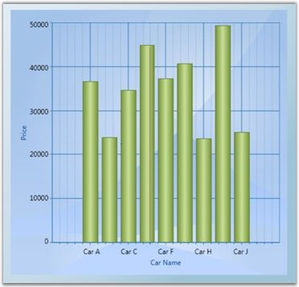

::: {style="DISPLAY: none"}
{#d2h_url_template}{#d2h_package_url style="WIDTH: 0px; DISPLAY: none; HEIGHT: 0px"}
:::

::: {.d2h_secondary_topic style="PADDING-BOTTOM: 10pt; MARGIN: 0pt; PADDING-LEFT: 0pt; PADDING-RIGHT: 0pt; PADDING-TOP: 0pt"}
##### LINQ Data Source {#linq-data-source style="tab-stops: 0pt"}

Chart lets you to directly bind **LINQ results** as the Data Source for a Chart Series. The following code illustrates how to bind LINQ results as the data source for the Chart Series.

[]{style="FONT-FAMILY: 'Trebuchet MS','sans-serif'; COLOR: #15428b; FONT-SIZE: 9pt"} 

+-------------------------------------------------------------------------------------------------------------------------------------------------------------------------------------------------------------------------------------------------------------+
| **[\[C#\]]{style="FONT-FAMILY: 'Courier New'; COLOR: black"}**                                                                                                                                                                                              |
|                                                                                                                                                                                                                                                             |
| []{style="FONT-FAMILY: 'Courier New'; COLOR: black"}                                                                                                                                                                                                        |
|                                                                                                                                                                                                                                                             |
| [// Namespace to be included for XDocument.]{style="FONT-FAMILY: 'Courier New'; COLOR: green"}                                                                                                                                                              |
|                                                                                                                                                                                                                                                             |
| [using]{style="FONT-FAMILY: 'Courier New'; COLOR: blue"}[ System.Xml.Linq;]{style="FONT-FAMILY: 'Courier New'"}                                                                                                                                             |
|                                                                                                                                                                                                                                                             |
| []{style="FONT-FAMILY: 'Courier New'"}                                                                                                                                                                                                                      |
|                                                                                                                                                                                                                                                             |
| [public]{style="FONT-FAMILY: 'Courier New'; COLOR: blue"}[ [partial]{style="COLOR: blue"} [class]{style="COLOR: blue"} [Window1]{style="COLOR: #2b91af"} : [Window]{style="COLOR: #2b91af"}]{style="FONT-FAMILY: 'Courier New'"}                            |
|                                                                                                                                                                                                                                                             |
| [{]{style="FONT-FAMILY: 'Courier New'"}                                                                                                                                                                                                                     |
|                                                                                                                                                                                                                                                             |
| [public]{style="FONT-FAMILY: 'Courier New'; COLOR: blue"}[ Window1()]{style="FONT-FAMILY: 'Courier New'"}                                                                                                                                                   |
|                                                                                                                                                                                                                                                             |
| [{]{style="FONT-FAMILY: 'Courier New'"}                                                                                                                                                                                                                     |
|                                                                                                                                                                                                                                                             |
| [InitializeComponent();]{style="FONT-FAMILY: 'Courier New'"}                                                                                                                                                                                                |
|                                                                                                                                                                                                                                                             |
| []{style="FONT-FAMILY: 'Courier New'"}                                                                                                                                                                                                                      |
|                                                                                                                                                                                                                                                             |
| [// Create Data to associate with the series.]{style="FONT-FAMILY: 'Courier New'; COLOR: green"}                                                                                                                                                            |
|                                                                                                                                                                                                                                                             |
| [CreateDataToSeries();]{style="FONT-FAMILY: 'Courier New'"}                                                                                                                                                                                                 |
|                                                                                                                                                                                                                                                             |
| []{style="FONT-FAMILY: 'Courier New'"}                                                                                                                                                                                                                      |
|                                                                                                                                                                                                                                                             |
| [// Add Data Source with the series. Queries Price value more than 30,000.]{style="FONT-FAMILY: 'Courier New'; COLOR: green"}                                                                                                                               |
|                                                                                                                                                                                                                                                             |
| [this]{style="FONT-FAMILY: 'Courier New'; COLOR: blue"}[.SetDataSource(carlist.Where(s =\> s.Price \> 30000).ToList());           ]{style="FONT-FAMILY: 'Courier New'"}                                                                                     |
|                                                                                                                                                                                                                                                             |
| [}]{style="FONT-FAMILY: 'Courier New'"}                                                                                                                                                                                                                     |
|                                                                                                                                                                                                                                                             |
| []{style="FONT-FAMILY: 'Courier New'"}                                                                                                                                                                                                                      |
|                                                                                                                                                                                                                                                             |
| [// Add Data Source with the series.]{style="FONT-FAMILY: 'Courier New'; COLOR: green"}                                                                                                                                                                     |
|                                                                                                                                                                                                                                                             |
| [private]{style="FONT-FAMILY: 'Courier New'; COLOR: blue"}[ [void]{style="COLOR: blue"} SetDataSource(IList source)]{style="FONT-FAMILY: 'Courier New'"}                                                                                                    |
|                                                                                                                                                                                                                                                             |
| [{]{style="FONT-FAMILY: 'Courier New'"}                                                                                                                                                                                                                     |
|                                                                                                                                                                                                                                                             |
| [Chart1.Areas\[0\].Series.Clear();]{style="FONT-FAMILY: 'Courier New'"}                                                                                                                                                                                     |
|                                                                                                                                                                                                                                                             |
| [ChartSeries]{style="FONT-FAMILY: 'Courier New'; COLOR: #2b91af"}[ series = [new]{style="COLOR: blue"} [ChartSeries]{style="COLOR: #2b91af"}();]{style="FONT-FAMILY: 'Courier New'"}                                                                        |
|                                                                                                                                                                                                                                                             |
| []{style="FONT-FAMILY: 'Courier New'"}                                                                                                                                                                                                                      |
|                                                                                                                                                                                                                                                             |
| [// Data Source for series 1.]{style="FONT-FAMILY: 'Courier New'; COLOR: green"}                                                                                                                                                                            |
|                                                                                                                                                                                                                                                             |
| [series.DataSource = source;]{style="FONT-FAMILY: 'Courier New'"}                                                                                                                                                                                           |
|                                                                                                                                                                                                                                                             |
| []{style="FONT-FAMILY: 'Courier New'"}                                                                                                                                                                                                                      |
|                                                                                                                                                                                                                                                             |
| [// Binding X with Name.]{style="FONT-FAMILY: 'Courier New'; COLOR: green"}                                                                                                                                                                                 |
|                                                                                                                                                                                                                                                             |
| [series.BindingPathX = [\"Name\"]{style="COLOR: #a31515"};]{style="FONT-FAMILY: 'Courier New'"}                                                                                                                                                             |
|                                                                                                                                                                                                                                                             |
| []{style="FONT-FAMILY: 'Courier New'"}                                                                                                                                                                                                                      |
|                                                                                                                                                                                                                                                             |
| [// Binding Y with Price.]{style="FONT-FAMILY: 'Courier New'; COLOR: green"}                                                                                                                                                                                |
|                                                                                                                                                                                                                                                             |
| [series.BindingPathsY = [new]{style="COLOR: blue"} [string]{style="COLOR: blue"}\[\] {[\"Price\"]{style="COLOR: #a31515"}};]{style="FONT-FAMILY: 'Courier New'"}                                                                                            |
|                                                                                                                                                                                                                                                             |
| []{style="FONT-FAMILY: 'Courier New'"}                                                                                                                                                                                                                      |
|                                                                                                                                                                                                                                                             |
| [// Add series to Chart.]{style="FONT-FAMILY: 'Courier New'; COLOR: green"}                                                                                                                                                                                 |
|                                                                                                                                                                                                                                                             |
| [Chart1.Areas\[0\].Series.Add(series);]{style="FONT-FAMILY: 'Courier New'"}                                                                                                                                                                                 |
|                                                                                                                                                                                                                                                             |
| [}]{style="FONT-FAMILY: 'Courier New'"}                                                                                                                                                                                                                     |
|                                                                                                                                                                                                                                                             |
| []{style="FONT-FAMILY: 'Courier New'"}                                                                                                                                                                                                                      |
|                                                                                                                                                                                                                                                             |
| [// Create Data to associate with the series.]{style="FONT-FAMILY: 'Courier New'; COLOR: green"}                                                                                                                                                            |
|                                                                                                                                                                                                                                                             |
| [IList]{style="FONT-FAMILY: 'Courier New'; COLOR: #2b91af"}[\<[Car]{style="COLOR: #2b91af"}\> carlist;]{style="FONT-FAMILY: 'Courier New'"}                                                                                                                 |
|                                                                                                                                                                                                                                                             |
| [private]{style="FONT-FAMILY: 'Courier New'; COLOR: blue"}[ [IList]{style="COLOR: #2b91af"}\<[Car]{style="COLOR: #2b91af"}\> CreateDataToSeries()]{style="FONT-FAMILY: 'Courier New'"}                                                                      |
|                                                                                                                                                                                                                                                             |
| [{]{style="FONT-FAMILY: 'Courier New'"}                                                                                                                                                                                                                     |
|                                                                                                                                                                                                                                                             |
| [carlist = [new]{style="COLOR: blue"} [List]{style="COLOR: #2b91af"}\<[Car]{style="COLOR: #2b91af"}\>();]{style="FONT-FAMILY: 'Courier New'"}                                                                                                               |
|                                                                                                                                                                                                                                                             |
| [carlist.Add([new]{style="COLOR: blue"} [Car]{style="COLOR: #2b91af"}([\"Car A\"]{style="COLOR: #a31515"}, 36700, 200, 28));]{style="FONT-FAMILY: 'Courier New'"}                                                                                           |
|                                                                                                                                                                                                                                                             |
| [carlist.Add([new]{style="COLOR: blue"} [Car]{style="COLOR: #2b91af"}([\"Car B\"]{style="COLOR: #a31515"}, 23970, 170, 23));]{style="FONT-FAMILY: 'Courier New'"}                                                                                           |
|                                                                                                                                                                                                                                                             |
| [carlist.Add([new]{style="COLOR: blue"} [Car]{style="COLOR: #2b91af"}([\"Car C\"]{style="COLOR: #a31515"}, 34675, 160, 22));]{style="FONT-FAMILY: 'Courier New'"}                                                                                           |
|                                                                                                                                                                                                                                                             |
| [carlist.Add([new]{style="COLOR: blue"} [Car]{style="COLOR: #2b91af"}([\"Car D\"]{style="COLOR: #a31515"}, 44950, 180, 36));]{style="FONT-FAMILY: 'Courier New'"}                                                                                           |
|                                                                                                                                                                                                                                                             |
| [carlist.Add([new]{style="COLOR: blue"} [Car]{style="COLOR: #2b91af"}([\"Car E\"]{style="COLOR: #a31515"}, 74950, 150, 18));]{style="FONT-FAMILY: 'Courier New'"}                                                                                           |
|                                                                                                                                                                                                                                                             |
| [carlist.Add([new]{style="COLOR: blue"} [Car]{style="COLOR: #2b91af"}([\"Car F\"]{style="COLOR: #a31515"}, 37300, 190, 25));]{style="FONT-FAMILY: 'Courier New'"}                                                                                           |
|                                                                                                                                                                                                                                                             |
| [carlist.Add([new]{style="COLOR: blue"} [Car]{style="COLOR: #2b91af"}([\"Car G\"]{style="COLOR: #a31515"}, 40765, 200, 26));]{style="FONT-FAMILY: 'Courier New'"}                                                                                           |
|                                                                                                                                                                                                                                                             |
| [carlist.Add([new]{style="COLOR: blue"} [Car]{style="COLOR: #2b91af"}([\"Car H\"]{style="COLOR: #a31515"}, 23799, 150, 22));]{style="FONT-FAMILY: 'Courier New'"}                                                                                           |
|                                                                                                                                                                                                                                                             |
| [carlist.Add([new]{style="COLOR: blue"} [Car]{style="COLOR: #2b91af"}([\"Car I\"]{style="COLOR: #a31515"}, 49400, 160, 29));]{style="FONT-FAMILY: 'Courier New'"}                                                                                           |
|                                                                                                                                                                                                                                                             |
| [carlist.Add([new]{style="COLOR: blue"} [Car]{style="COLOR: #2b91af"}([\"Car J\"]{style="COLOR: #a31515"}, 25149, 200, 22));]{style="FONT-FAMILY: 'Courier New'"}                                                                                           |
|                                                                                                                                                                                                                                                             |
| [return]{style="FONT-FAMILY: 'Courier New'; COLOR: blue"}[ carlist;]{style="FONT-FAMILY: 'Courier New'"}                                                                                                                                                    |
|                                                                                                                                                                                                                                                             |
| [}]{style="FONT-FAMILY: 'Courier New'"}                                                                                                                                                                                                                     |
|                                                                                                                                                                                                                                                             |
| [switch]{style="FONT-FAMILY: 'Courier New'; COLOR: blue"}[ (queryby)]{style="FONT-FAMILY: 'Courier New'"}                                                                                                                                                   |
|                                                                                                                                                                                                                                                             |
| [{]{style="FONT-FAMILY: 'Courier New'"}                                                                                                                                                                                                                     |
|                                                                                                                                                                                                                                                             |
| [      case]{style="FONT-FAMILY: 'Courier New'; COLOR: blue"}[ [\"Price\"]{style="COLOR: #a31515"}:]{style="FONT-FAMILY: 'Courier New'"}                                                                                                                    |
|                                                                                                                                                                                                                                                             |
| [      [this]{style="COLOR: blue"}.SetDataSource(carlist.Where(s =\> s.Price \< [double]{style="COLOR: blue"}.Parse(value)).ToList());]{style="FONT-FAMILY: 'Courier New'"}                                                                                 |
|                                                                                                                                                                                                                                                             |
| [      [break]{style="COLOR: blue"};]{style="FONT-FAMILY: 'Courier New'"}                                                                                                                                                                                   |
|                                                                                                                                                                                                                                                             |
| [      [case]{style="COLOR: blue"} [\"MaximumSpeed\"]{style="COLOR: #a31515"}:]{style="FONT-FAMILY: 'Courier New'"}                                                                                                                                         |
|                                                                                                                                                                                                                                                             |
| [      [this]{style="COLOR: blue"}.SetDataSource(carlist.Where(s =\> s.MaximumSpeed \< [double]{style="COLOR: blue"}.Parse(value)).ToList());]{style="FONT-FAMILY: 'Courier New'"}                                                                          |
|                                                                                                                                                                                                                                                             |
| [      [break]{style="COLOR: blue"};]{style="FONT-FAMILY: 'Courier New'"}                                                                                                                                                                                   |
|                                                                                                                                                                                                                                                             |
| [      [case]{style="COLOR: blue"} [\"Mileage\"]{style="COLOR: #a31515"}:]{style="FONT-FAMILY: 'Courier New'"}                                                                                                                                              |
|                                                                                                                                                                                                                                                             |
| [      [this]{style="COLOR: blue"}.SetDataSource(carlist.Where(s =\> s.Mileage \< [double]{style="COLOR: blue"}.Parse(value)).ToList());]{style="FONT-FAMILY: 'Courier New'"}                                                                               |
|                                                                                                                                                                                                                                                             |
| [      [break]{style="COLOR: blue"};]{style="FONT-FAMILY: 'Courier New'"}                                                                                                                                                                                   |
|                                                                                                                                                                                                                                                             |
| [}]{style="FONT-FAMILY: 'Courier New'"}                                                                                                                                                                                                                     |
|                                                                                                                                                                                                                                                             |
| [}]{style="FONT-FAMILY: 'Courier New'"}                                                                                                                                                                                                                     |
|                                                                                                                                                                                                                                                             |
| []{style="FONT-FAMILY: 'Courier New'"}                                                                                                                                                                                                                      |
|                                                                                                                                                                                                                                                             |
| [// Add class Car.]{style="FONT-FAMILY: 'Courier New'; COLOR: green"}                                                                                                                                                                                       |
|                                                                                                                                                                                                                                                             |
| [class]{style="FONT-FAMILY: 'Courier New'; COLOR: blue"}[ [Car]{style="COLOR: #2b91af"}]{style="FONT-FAMILY: 'Courier New'"}                                                                                                                                |
|                                                                                                                                                                                                                                                             |
| [{]{style="FONT-FAMILY: 'Courier New'"}                                                                                                                                                                                                                     |
|                                                                                                                                                                                                                                                             |
| [public]{style="FONT-FAMILY: 'Courier New'; COLOR: blue"}[ [string]{style="COLOR: blue"} Name { [get]{style="COLOR: blue"}; [set]{style="COLOR: blue"}; }]{style="FONT-FAMILY: 'Courier New'"}                                                              |
|                                                                                                                                                                                                                                                             |
| [public]{style="FONT-FAMILY: 'Courier New'; COLOR: blue"}[ [double]{style="COLOR: blue"} Price { [get]{style="COLOR: blue"}; [set]{style="COLOR: blue"}; }]{style="FONT-FAMILY: 'Courier New'"}                                                             |
|                                                                                                                                                                                                                                                             |
| [public]{style="FONT-FAMILY: 'Courier New'; COLOR: blue"}[ [double]{style="COLOR: blue"} MaximumSpeed { [get]{style="COLOR: blue"}; [set]{style="COLOR: blue"}; }]{style="FONT-FAMILY: 'Courier New'"}                                                      |
|                                                                                                                                                                                                                                                             |
| [public]{style="FONT-FAMILY: 'Courier New'; COLOR: blue"}[ [double]{style="COLOR: blue"} Mileage { [get]{style="COLOR: blue"}; [set]{style="COLOR: blue"}; }]{style="FONT-FAMILY: 'Courier New'"}                                                           |
|                                                                                                                                                                                                                                                             |
| []{style="FONT-FAMILY: 'Courier New'"}                                                                                                                                                                                                                      |
|                                                                                                                                                                                                                                                             |
| [public]{style="FONT-FAMILY: 'Courier New'; COLOR: blue"}[ Car([string]{style="COLOR: blue"} name, [double]{style="COLOR: blue"} price, [double]{style="COLOR: blue"} maxspeed, [double]{style="COLOR: blue"} mileage)]{style="FONT-FAMILY: 'Courier New'"} |
|                                                                                                                                                                                                                                                             |
| [{]{style="FONT-FAMILY: 'Courier New'"}                                                                                                                                                                                                                     |
|                                                                                                                                                                                                                                                             |
| [this]{style="FONT-FAMILY: 'Courier New'; COLOR: blue"}[.Name = name;]{style="FONT-FAMILY: 'Courier New'"}                                                                                                                                                  |
|                                                                                                                                                                                                                                                             |
| [this]{style="FONT-FAMILY: 'Courier New'; COLOR: blue"}[.Price = price;]{style="FONT-FAMILY: 'Courier New'"}                                                                                                                                                |
|                                                                                                                                                                                                                                                             |
| [this]{style="FONT-FAMILY: 'Courier New'; COLOR: blue"}[.MaximumSpeed = maxspeed;]{style="FONT-FAMILY: 'Courier New'"}                                                                                                                                      |
|                                                                                                                                                                                                                                                             |
| [this]{style="FONT-FAMILY: 'Courier New'; COLOR: blue"}[.Mileage = mileage;]{style="FONT-FAMILY: 'Courier New'"}                                                                                                                                            |
|                                                                                                                                                                                                                                                             |
| [}]{style="FONT-FAMILY: 'Courier New'"}                                                                                                                                                                                                                     |
|                                                                                                                                                                                                                                                             |
| [}]{style="FONT-FAMILY: 'Courier New'"}                                                                                                                                                                                                                     |
+-------------------------------------------------------------------------------------------------------------------------------------------------------------------------------------------------------------------------------------------------------------+

[]{style="FONT-FAMILY: 'Trebuchet MS','sans-serif'; COLOR: #15428b; FONT-SIZE: 9pt"} 

The following screen shot illustrates how a Chart Series is associated to the Chart by using LINQ results.

[]{style="FONT-FAMILY: 'Trebuchet MS','sans-serif'; COLOR: #15428b; FONT-SIZE: 9pt"} 

{border="0"}

Figure 59: Chart Series with LINQ results - Price more than 30,000 is Queried

[]{style="FONT-FAMILY: 'Trebuchet MS','sans-serif'; COLOR: #15428b; FONT-SIZE: 9pt"} 

See Also

[]{style="FONT-FAMILY: 'Trebuchet MS','sans-serif'; COLOR: #15428b; FONT-SIZE: 9pt"} 

[IList Data Source]{.UGHyperlink}

[[XML Data Source]{.UGHyperlink}](ms-xhelp:///?Id=02c48029-8edc-423d-82e0-b41ed27cc680)[]{.UGHyperlink}

[[ObservableCollection Data Source]{.UGHyperlink}](ms-xhelp:///?Id=3a8c90d1-1f38-4064-8f29-b1c63b9f1a07)[]{.UGHyperlink}

[[IList Data Source]{.UGHyperlink}](ms-xhelp:///?Id=4ede39a6-fb75-46ef-bd31-dd13a418807a)[]{.UGHyperlink}

[[Data Binding for Child Level Properties]{.UGHyperlink}](ms-xhelp:///?Id=137e357f-58c1-463b-9fb1-c42a058a7844)[]{.UGHyperlink}

[[CollectionViewSource Data Source]{.UGHyperlink}](ms-xhelp:///?Id=137e357f-58c1-463b-9fb1-c42a058a7844)[ ]{style="FONT-FAMILY: 'Trebuchet MS','sans-serif'; COLOR: #15428b; FONT-SIZE: 9pt"}

 

[]{#p30} 

 

[]{#related-topics}
:::
