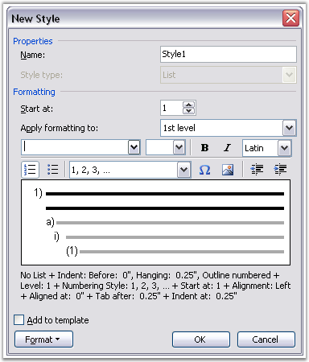
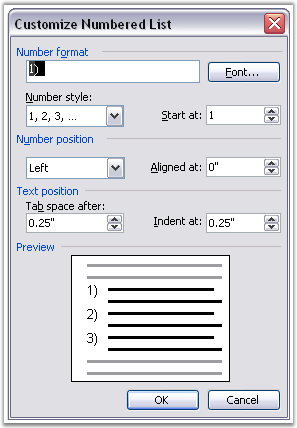
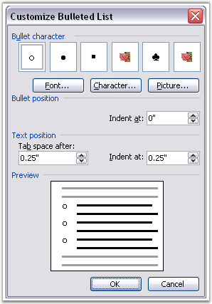

::: {style="DISPLAY: none"}
{#d2h_url_template}{#d2h_package_url style="WIDTH: 0px; DISPLAY: none; HEIGHT: 0px"}
:::

:::::::: {.d2h_secondary_topic style="PADDING-BOTTOM: 10pt; MARGIN: 0pt; PADDING-LEFT: 0pt; PADDING-RIGHT: 0pt; PADDING-TOP: 0pt"}
#### Lists {#lists style="tab-stops: 0pt"}

 

**ListStyle** class represents list properties in the Word paragraph style. Collection of list styles is accessible through the **WordDocument.ListStyles** property.

 

You can create your own list style. To add a list style by using DocIO, use the **WordDocument.AddListStyle** method. Every list style has its own name. You can use the **Name** property to access the style name. There are list styles of two types.

 

[·      ]{style="FONT-FAMILY: Symbol"}Numbered

[·      ]{style="FONT-FAMILY: Symbol"}Bulleted

 

You can specify the type of the list style by using the **ListType** property. Every ListStyle object contains the collection of list levels. This collection can contain from one to nine levels (maximum number of list levels). Collection of list levels is accessible through the **Levels** property. This property returns the ListLevelCollection object. List Level Collection (ListLevelCollection class) contains objects of the WListLevel class.

 

List Styles in MS Word

 

{border="0"}

Figure 74[: Create New Custom List Style]{style="FONT-STYLE: normal"}

 

**** 

{border="0"}

Figure 75[: Numbered List Style]{style="FONT-STYLE: normal"}

[]{#p71} 

{border="0"}

Figure 76: Bulleted List Style

 

**** 

Public Properties

 

::: {align="center"}
  ----------------------------------------------- ----------------------------------------------------
  Name                                            Description
  Levels                                          Gets list levels collection.  
  ListType                                        Gets or sets list type.  
  Name                                            Gets style name.  
  StyleType                                       Gets the type of the style.  
  ListStyle.ListStyle (IWordDocument, ListType)   Initializes a new instance of the ListStyle class.
  ----------------------------------------------- ----------------------------------------------------
:::

 

Public Methods

 

::: {align="center"}
  ---------------------- ------------------------------------------
  Name                   Description
  Clone                  Clones current style object.  
  CreateEmptyListStyle   Static method. Creates empty list style.
  ---------------------- ------------------------------------------
:::

 

**WListLevel** class represents list level in the Word document. By using the WListLevel class, you can customize the list level options.

 

**Public Constructor**

**[]{style="FONT-FAMILY: 'Verdana','sans-serif'; COLOR: #4a5c8c"}** 

::: {align="center"}
  ----------------------------------- -----------------------------------------------
  Name                                Description
  WListLevel.WListLevel (ListStyle)   Initializes new instance of WListLevel class.
  ----------------------------------- -----------------------------------------------
:::

**[]{style="COLOR: #4a5c8c"}** 

Public Methods

**[]{style="COLOR: #4a5c8c"}** 

::: {align="center"}
  ----------------- --------------------------------------------
  Name              Description
  Clone             Clones this instance.  
  GetListItemText   Gets list symbol for specified item index.
  ----------------- --------------------------------------------
:::

**[]{style="COLOR: #4a5c8c"}** 

Public Properties

**[]{style="COLOR: #4a5c8c"}** 

::: {align="center"}
  ----------------------- ---------------------------------------------------------------------------------------------------------------------------------------------------------
  Name                    Description
  BulletCharacter         Gets or sets bullet pattern.  
  CharacterFormat         Gets or sets character formats of list symbol.  
  FollowCharacter         Gets or sets the type of character following the number text for the paragraph.  
  IsLegalStyleNumbering   Gets or sets ArabicNumberFormat property ( true if the level turns all inherited numbers to arabic, false if it preserves their number format code ).  
  NoRestartByHigher       True if the level\'s number sequence is not restarted by higher (more significant) levels in the list.  
  NumberAlignment         Gets or sets alignment (left, right, or centered) of the paragraph number.  
  NumberPosition          Gets or sets the number / bullet position for current listlevel (in points).
  NumberPrefix            Gets or sets prefix pattern for numbered level.  
  NumberSuffix            Gets or sets suffix pattern for numbered level.  
  ParagraphFormat         Gets or sets paragraph format of list level.  
  PatternType             Gets or sets list numbering type.  
  StartAt                 Gets or sets start at value.  
  TabSpaceAfter           Gets or sets spacing after list level\'s number or bullet ( tab position if follow character is tab ).  
  TextPosition            Gets or sets the left listlevel indent (in points).
  UsePrevLevelPattern     When true, number generated will include previous levels (used for legal numbering).  
  ----------------------- ---------------------------------------------------------------------------------------------------------------------------------------------------------
:::

 

The following example illustrates how to create user-defined list styles and apply it to the paragraph.

 

+---------------------------------------------------------------------------------------------------------------------------------------------------------------------------------------------------------------------+
| **[\[C#\]]{style="FONT-FAMILY: 'Courier New'; COLOR: black"}**                                                                                                                                                      |
|                                                                                                                                                                                                                     |
| []{style="FONT-FAMILY: 'Courier New'; COLOR: black"}                                                                                                                                                                |
|                                                                                                                                                                                                                     |
| [//User bullet list style]{style="FONT-FAMILY: 'Courier New'; COLOR: green"}                                                                                                                                        |
|                                                                                                                                                                                                                     |
| [ListStyle]{style="FONT-FAMILY: 'Courier New'; COLOR: teal"}[ bulStyle = doc.AddListStyle([ListType]{style="COLOR: teal"}.Bulleted, [\"BulletStyle\"]{style="COLOR: maroon"});]{style="FONT-FAMILY: 'Courier New'"} |
|                                                                                                                                                                                                                     |
| [WListLevel]{style="FONT-FAMILY: 'Courier New'; COLOR: teal"}[ bulLevel1 = bulStyle.Levels\[0\];]{style="FONT-FAMILY: 'Courier New'"}                                                                               |
|                                                                                                                                                                                                                     |
| [bulLevel1.FollowCharacter = [FollowCharacterType]{style="COLOR: teal"}.Space;]{style="FONT-FAMILY: 'Courier New'"}                                                                                                 |
|                                                                                                                                                                                                                     |
| [bulLevel1.TextPosition = 40f;]{style="FONT-FAMILY: 'Courier New'"}                                                                                                                                                 |
|                                                                                                                                                                                                                     |
| [bulLevel1.NumberAlignment = [ListNumberAlignment]{style="COLOR: teal"}.Right;]{style="FONT-FAMILY: 'Courier New'"}                                                                                                 |
|                                                                                                                                                                                                                     |
| []{style="FONT-FAMILY: 'Courier New'"}                                                                                                                                                                              |
|                                                                                                                                                                                                                     |
| [WListLevel]{style="FONT-FAMILY: 'Courier New'; COLOR: teal"}[ bulLevel2 = bulStyle.Levels\[1\];]{style="FONT-FAMILY: 'Courier New'"}                                                                               |
|                                                                                                                                                                                                                     |
| [bulLevel2.FollowCharacter = [FollowCharacterType]{style="COLOR: teal"}.Space;]{style="FONT-FAMILY: 'Courier New'"}                                                                                                 |
|                                                                                                                                                                                                                     |
| [bulLevel2.TextPosition = 60f;]{style="FONT-FAMILY: 'Courier New'"}                                                                                                                                                 |
|                                                                                                                                                                                                                     |
| [bulLevel2.NumberAlignment = [ListNumberAlignment]{style="COLOR: teal"}.Right;]{style="FONT-FAMILY: 'Courier New'"}                                                                                                 |
|                                                                                                                                                                                                                     |
| [bulLevel2.TabSpaceAfter = 40f;]{style="FONT-FAMILY: 'Courier New'"}                                                                                                                                                |
|                                                                                                                                                                                                                     |
| []{style="FONT-FAMILY: 'Courier New'"}                                                                                                                                                                              |
|                                                                                                                                                                                                                     |
| [paragraph = section.AddParagraph();]{style="FONT-FAMILY: 'Courier New'"}                                                                                                                                           |
|                                                                                                                                                                                                                     |
| [paragraph.AppendText([\"First bulleted ( level 0 )\"]{style="COLOR: maroon"});]{style="FONT-FAMILY: 'Courier New'"}                                                                                                |
|                                                                                                                                                                                                                     |
| [paragraph.ListFormat.ApplyStyle([\"BulletStyle\"]{style="COLOR: maroon"});]{style="FONT-FAMILY: 'Courier New'"}                                                                                                    |
|                                                                                                                                                                                                                     |
| []{style="FONT-FAMILY: 'Courier New'"}                                                                                                                                                                              |
|                                                                                                                                                                                                                     |
| [paragraph = section.AddParagraph();]{style="FONT-FAMILY: 'Courier New'"}                                                                                                                                           |
|                                                                                                                                                                                                                     |
| [paragraph.AppendText([\"Level 1\"]{style="COLOR: maroon"});]{style="FONT-FAMILY: 'Courier New'"}                                                                                                                   |
|                                                                                                                                                                                                                     |
| [paragraph.ListFormat.ContinueListNumbering();]{style="FONT-FAMILY: 'Courier New'"}                                                                                                                                 |
|                                                                                                                                                                                                                     |
| [paragraph.ListFormat.IncreaseIndentLevel();]{style="FONT-FAMILY: 'Courier New'"}                                                                                                                                   |
|                                                                                                                                                                                                                     |
| []{style="FONT-FAMILY: 'Courier New'"}                                                                                                                                                                              |
|                                                                                                                                                                                                                     |
| []{style="FONT-FAMILY: 'Courier New'"}                                                                                                                                                                              |
|                                                                                                                                                                                                                     |
| [paragraph = section.AddParagraph();]{style="FONT-FAMILY: 'Courier New'"}                                                                                                                                           |
|                                                                                                                                                                                                                     |
| [paragraph.AppendText([\"Level 0\"]{style="COLOR: maroon"});]{style="FONT-FAMILY: 'Courier New'"}                                                                                                                   |
|                                                                                                                                                                                                                     |
| [paragraph.ListFormat.ContinueListNumbering();]{style="FONT-FAMILY: 'Courier New'"}                                                                                                                                 |
|                                                                                                                                                                                                                     |
| [paragraph.ListFormat.DecreaseIndentLevel();]{style="FONT-FAMILY: 'Courier New'"}                                                                                                                                   |
|                                                                                                                                                                                                                     |
| []{style="FONT-FAMILY: 'Courier New'"}                                                                                                                                                                              |
|                                                                                                                                                                                                                     |
| [//User numbered list style]{style="FONT-FAMILY: 'Courier New'; COLOR: green"}                                                                                                                                      |
|                                                                                                                                                                                                                     |
| [ListStyle]{style="FONT-FAMILY: 'Courier New'; COLOR: teal"}[ newStyle = doc.AddListStyle([ListType]{style="COLOR: teal"}.Numbered, [\"NewStyle\"]{style="COLOR: maroon"});]{style="FONT-FAMILY: 'Courier New'"}    |
|                                                                                                                                                                                                                     |
| [WListLevel]{style="FONT-FAMILY: 'Courier New'; COLOR: teal"}[ listLevelNew = newStyle.Levels\[0\];]{style="FONT-FAMILY: 'Courier New'"}                                                                            |
|                                                                                                                                                                                                                     |
| [listLevelNew.FollowCharacter = [FollowCharacterType]{style="COLOR: teal"}.Tab;]{style="FONT-FAMILY: 'Courier New'"}                                                                                                |
|                                                                                                                                                                                                                     |
| [listLevelNew.TextPosition = 80f;]{style="FONT-FAMILY: 'Courier New'"}                                                                                                                                              |
|                                                                                                                                                                                                                     |
| [listLevelNew.NumberAlignment = [ListNumberAlignment]{style="COLOR: teal"}.Right;]{style="FONT-FAMILY: 'Courier New'"}                                                                                              |
|                                                                                                                                                                                                                     |
| [listLevelNew.TabSpaceAfter = 40f;]{style="FONT-FAMILY: 'Courier New'"}                                                                                                                                             |
|                                                                                                                                                                                                                     |
| [listLevelNew.StartAt = 2;]{style="FONT-FAMILY: 'Courier New'"}                                                                                                                                                     |
|                                                                                                                                                                                                                     |
| [listLevelNew.NumberPrefix = [\"\>\>\"]{style="COLOR: maroon"};]{style="FONT-FAMILY: 'Courier New'"}                                                                                                                |
|                                                                                                                                                                                                                     |
| [listLevelNew.NumberSufix = [\"\<\<\"]{style="COLOR: maroon"};]{style="FONT-FAMILY: 'Courier New'"}                                                                                                                 |
|                                                                                                                                                                                                                     |
| [listLevelNew.CharacterFormat.FontSize = 15;]{style="FONT-FAMILY: 'Courier New'"}                                                                                                                                   |
|                                                                                                                                                                                                                     |
| [listLevelNew.CharacterFormat.TextColor = [Color]{style="COLOR: teal"}.Blue;]{style="FONT-FAMILY: 'Courier New'"}                                                                                                   |
|                                                                                                                                                                                                                     |
| []{style="FONT-FAMILY: 'Courier New'"}                                                                                                                                                                              |
|                                                                                                                                                                                                                     |
| [WListLevel]{style="FONT-FAMILY: 'Courier New'; COLOR: teal"}[ listLevelNew1 = newStyle.Levels\[1\];]{style="FONT-FAMILY: 'Courier New'"}                                                                           |
|                                                                                                                                                                                                                     |
| [listLevelNew1.IsLegalStyleNumbering = [true]{style="COLOR: blue"};]{style="FONT-FAMILY: 'Courier New'"}                                                                                                            |
|                                                                                                                                                                                                                     |
| []{style="FONT-FAMILY: 'Courier New'"}                                                                                                                                                                              |
|                                                                                                                                                                                                                     |
| [WListLevel]{style="FONT-FAMILY: 'Courier New'; COLOR: teal"}[ listLevelNew2 = newStyle.Levels\[2\];]{style="FONT-FAMILY: 'Courier New'"}                                                                           |
|                                                                                                                                                                                                                     |
| [listLevelNew1.NoRestartByHigher = [true]{style="COLOR: blue"};]{style="FONT-FAMILY: 'Courier New'"}                                                                                                                |
|                                                                                                                                                                                                                     |
| []{style="FONT-FAMILY: 'Courier New'"}                                                                                                                                                                              |
|                                                                                                                                                                                                                     |
| [paragraph = section.AddParagraph();]{style="FONT-FAMILY: 'Courier New'"}                                                                                                                                           |
|                                                                                                                                                                                                                     |
| [paragraph.AppendText([\"First Numbered ( level 0 )\"]{style="COLOR: maroon"});]{style="FONT-FAMILY: 'Courier New'"}                                                                                                |
|                                                                                                                                                                                                                     |
| [paragraph.ListFormat.ApplyStyle([\"NewStyle\"]{style="COLOR: maroon"});]{style="FONT-FAMILY: 'Courier New'"}                                                                                                       |
|                                                                                                                                                                                                                     |
| []{style="FONT-FAMILY: 'Courier New'"}                                                                                                                                                                              |
|                                                                                                                                                                                                                     |
| [paragraph = section.AddParagraph();]{style="FONT-FAMILY: 'Courier New'"}                                                                                                                                           |
|                                                                                                                                                                                                                     |
| [paragraph.AppendText([\"Level 1\"]{style="COLOR: maroon"});]{style="FONT-FAMILY: 'Courier New'"}                                                                                                                   |
|                                                                                                                                                                                                                     |
| [paragraph.ListFormat.ContinueListNumbering();]{style="FONT-FAMILY: 'Courier New'"}                                                                                                                                 |
|                                                                                                                                                                                                                     |
| [paragraph.ListFormat.IncreaseIndentLevel();]{style="FONT-FAMILY: 'Courier New'"}                                                                                                                                   |
|                                                                                                                                                                                                                     |
| []{style="FONT-FAMILY: 'Courier New'"}                                                                                                                                                                              |
|                                                                                                                                                                                                                     |
| [paragraph = section.AddParagraph();]{style="FONT-FAMILY: 'Courier New'"}                                                                                                                                           |
|                                                                                                                                                                                                                     |
| [paragraph.AppendText([\"Level 0\"]{style="COLOR: maroon"});]{style="FONT-FAMILY: 'Courier New'"}                                                                                                                   |
|                                                                                                                                                                                                                     |
| [paragraph.ListFormat.ContinueListNumbering();]{style="FONT-FAMILY: 'Courier New'"}                                                                                                                                 |
|                                                                                                                                                                                                                     |
| [paragraph.ListFormat.ListLevelNumber = 0;]{style="FONT-FAMILY: 'Courier New'"}                                                                                                                                     |
+---------------------------------------------------------------------------------------------------------------------------------------------------------------------------------------------------------------------+

 

+---------------------------------------------------------------------------------------------------------------------------------------------------------------------------------------------------------------------------+
| **[\[VB.NET\]]{style="FONT-FAMILY: 'Courier New'; COLOR: black"}**                                                                                                                                                        |
|                                                                                                                                                                                                                           |
| []{style="FONT-FAMILY: 'Courier New'; COLOR: black"}                                                                                                                                                                      |
|                                                                                                                                                                                                                           |
| [\'User bullet list style]{style="FONT-FAMILY: 'Courier New'; COLOR: green"}                                                                                                                                              |
|                                                                                                                                                                                                                           |
| [Dim]{style="FONT-FAMILY: 'Courier New'; COLOR: blue"}[ bulStyle [As]{style="COLOR: blue"} ListStyle = doc.AddListStyle(ListType.Bulleted, [\"BulletStyle\"]{style="COLOR: maroon"})]{style="FONT-FAMILY: 'Courier New'"} |
|                                                                                                                                                                                                                           |
| [Dim]{style="FONT-FAMILY: 'Courier New'; COLOR: blue"}[ bulLevel1 [As]{style="COLOR: blue"} WListLevel = bulStyle.Levels(0)]{style="FONT-FAMILY: 'Courier New'"}                                                          |
|                                                                                                                                                                                                                           |
| [bulLevel1.FollowCharacter = FollowCharacterType.Space]{style="FONT-FAMILY: 'Courier New'"}                                                                                                                               |
|                                                                                                                                                                                                                           |
| [bulLevel1.TextPosition = 40f]{style="FONT-FAMILY: 'Courier New'"}                                                                                                                                                        |
|                                                                                                                                                                                                                           |
| [bulLevel1.NumberAlignment = ListNumberAlignment.Right]{style="FONT-FAMILY: 'Courier New'"}                                                                                                                               |
|                                                                                                                                                                                                                           |
| []{style="FONT-FAMILY: 'Courier New'"}                                                                                                                                                                                    |
|                                                                                                                                                                                                                           |
| [Dim]{style="FONT-FAMILY: 'Courier New'; COLOR: blue"}[ bulLevel2 [As]{style="COLOR: blue"} WListLevel = bulStyle.Levels(1)]{style="FONT-FAMILY: 'Courier New'"}                                                          |
|                                                                                                                                                                                                                           |
| [bulLevel2.FollowCharacter = FollowCharacterType.Space]{style="FONT-FAMILY: 'Courier New'"}                                                                                                                               |
|                                                                                                                                                                                                                           |
| [bulLevel2.TextPosition = 60f]{style="FONT-FAMILY: 'Courier New'"}                                                                                                                                                        |
|                                                                                                                                                                                                                           |
| [bulLevel2.NumberAlignment = ListNumberAlignment.Right]{style="FONT-FAMILY: 'Courier New'"}                                                                                                                               |
|                                                                                                                                                                                                                           |
| [bulLevel2.TabSpaceAfter = 40f]{style="FONT-FAMILY: 'Courier New'"}                                                                                                                                                       |
|                                                                                                                                                                                                                           |
| []{style="FONT-FAMILY: 'Courier New'"}                                                                                                                                                                                    |
|                                                                                                                                                                                                                           |
| [paragraph = section.AddParagraph()]{style="FONT-FAMILY: 'Courier New'"}                                                                                                                                                  |
|                                                                                                                                                                                                                           |
| [paragraph.AppendText([\"First bulleted ( level 0 )\"]{style="COLOR: maroon"})]{style="FONT-FAMILY: 'Courier New'"}                                                                                                       |
|                                                                                                                                                                                                                           |
| [paragraph.ListFormat.ApplyStyle([\"BulletStyle\"]{style="COLOR: maroon"})]{style="FONT-FAMILY: 'Courier New'"}                                                                                                           |
|                                                                                                                                                                                                                           |
| []{style="FONT-FAMILY: 'Courier New'"}                                                                                                                                                                                    |
|                                                                                                                                                                                                                           |
| [paragraph = section.AddParagraph()]{style="FONT-FAMILY: 'Courier New'"}                                                                                                                                                  |
|                                                                                                                                                                                                                           |
| [paragraph.AppendText([\"Level 1\"]{style="COLOR: maroon"})]{style="FONT-FAMILY: 'Courier New'"}                                                                                                                          |
|                                                                                                                                                                                                                           |
| [paragraph.ListFormat.ContinueListNumbering()]{style="FONT-FAMILY: 'Courier New'"}                                                                                                                                        |
|                                                                                                                                                                                                                           |
| [paragraph.ListFormat.IncreaseIndentLevel()]{style="FONT-FAMILY: 'Courier New'"}                                                                                                                                          |
|                                                                                                                                                                                                                           |
| []{style="FONT-FAMILY: 'Courier New'"}                                                                                                                                                                                    |
|                                                                                                                                                                                                                           |
| []{style="FONT-FAMILY: 'Courier New'"}                                                                                                                                                                                    |
|                                                                                                                                                                                                                           |
| [paragraph = section.AddParagraph()]{style="FONT-FAMILY: 'Courier New'"}                                                                                                                                                  |
|                                                                                                                                                                                                                           |
| [paragraph.AppendText([\"Level 0\"]{style="COLOR: maroon"})]{style="FONT-FAMILY: 'Courier New'"}                                                                                                                          |
|                                                                                                                                                                                                                           |
| [paragraph.ListFormat.ContinueListNumbering()]{style="FONT-FAMILY: 'Courier New'"}                                                                                                                                        |
|                                                                                                                                                                                                                           |
| [paragraph.ListFormat.DecreaseIndentLevel()]{style="FONT-FAMILY: 'Courier New'"}                                                                                                                                          |
|                                                                                                                                                                                                                           |
| []{style="FONT-FAMILY: 'Courier New'"}                                                                                                                                                                                    |
|                                                                                                                                                                                                                           |
| [\'User numbered list style]{style="FONT-FAMILY: 'Courier New'; COLOR: green"}                                                                                                                                            |
|                                                                                                                                                                                                                           |
| [Dim]{style="FONT-FAMILY: 'Courier New'; COLOR: blue"}[ newStyle [As]{style="COLOR: blue"} ListStyle = doc.AddListStyle(ListType.Numbered, [\"NewStyle\"]{style="COLOR: maroon"})]{style="FONT-FAMILY: 'Courier New'"}    |
|                                                                                                                                                                                                                           |
| [Dim]{style="FONT-FAMILY: 'Courier New'; COLOR: blue"}[ listLevelNew [As]{style="COLOR: blue"} WListLevel = newStyle.Levels(0)]{style="FONT-FAMILY: 'Courier New'"}                                                       |
|                                                                                                                                                                                                                           |
| [listLevelNew.FollowCharacter = FollowCharacterType.Tab]{style="FONT-FAMILY: 'Courier New'"}                                                                                                                              |
|                                                                                                                                                                                                                           |
| [listLevelNew.TextPosition = 80f]{style="FONT-FAMILY: 'Courier New'"}                                                                                                                                                     |
|                                                                                                                                                                                                                           |
| [listLevelNew.NumberAlignment = ListNumberAlignment.Right]{style="FONT-FAMILY: 'Courier New'"}                                                                                                                            |
|                                                                                                                                                                                                                           |
| [listLevelNew.TabSpaceAfter = 40f]{style="FONT-FAMILY: 'Courier New'"}                                                                                                                                                    |
|                                                                                                                                                                                                                           |
| [listLevelNew.StartAt = 2]{style="FONT-FAMILY: 'Courier New'"}                                                                                                                                                            |
|                                                                                                                                                                                                                           |
| [listLevelNew.NumberPrefix = [\"\>\>\"]{style="COLOR: maroon"}]{style="FONT-FAMILY: 'Courier New'"}                                                                                                                       |
|                                                                                                                                                                                                                           |
| [listLevelNew.NumberSufix = [\"\<\<\"]{style="COLOR: maroon"}]{style="FONT-FAMILY: 'Courier New'"}                                                                                                                        |
|                                                                                                                                                                                                                           |
| [listLevelNew.CharacterFormat.FontSize = 15]{style="FONT-FAMILY: 'Courier New'"}                                                                                                                                          |
|                                                                                                                                                                                                                           |
| [listLevelNew.CharacterFormat.TextColor = Color.Blue]{style="FONT-FAMILY: 'Courier New'"}                                                                                                                                 |
|                                                                                                                                                                                                                           |
| []{style="FONT-FAMILY: 'Courier New'"}                                                                                                                                                                                    |
|                                                                                                                                                                                                                           |
| [listLevelNew1 [As]{style="COLOR: blue"} WListLevel = newStyle.Levels(1)]{style="FONT-FAMILY: 'Courier New'"}                                                                                                             |
|                                                                                                                                                                                                                           |
| [listLevelNew1.IsLegalStyleNumbering = [True]{style="COLOR: blue"}]{style="FONT-FAMILY: 'Courier New'"}                                                                                                                   |
|                                                                                                                                                                                                                           |
| []{style="FONT-FAMILY: 'Courier New'; COLOR: blue"}                                                                                                                                                                       |
|                                                                                                                                                                                                                           |
| [listLevelNew2 [As]{style="COLOR: blue"} WListLevel = newStyle.Levels(2)]{style="FONT-FAMILY: 'Courier New'"}                                                                                                             |
|                                                                                                                                                                                                                           |
| [listLevelNew1.NoRestartByHigher = [True]{style="COLOR: blue"}]{style="FONT-FAMILY: 'Courier New'"}                                                                                                                       |
|                                                                                                                                                                                                                           |
| []{style="FONT-FAMILY: 'Courier New'; COLOR: blue"}                                                                                                                                                                       |
|                                                                                                                                                                                                                           |
| [paragraph = section.AddParagraph()]{style="FONT-FAMILY: 'Courier New'"}                                                                                                                                                  |
|                                                                                                                                                                                                                           |
| [paragraph.AppendText([\"First Numbered ( level 0 )\"]{style="COLOR: maroon"})]{style="FONT-FAMILY: 'Courier New'"}                                                                                                       |
|                                                                                                                                                                                                                           |
| [paragraph.ListFormat.ApplyStyle([\"NewStyle\"]{style="COLOR: maroon"})]{style="FONT-FAMILY: 'Courier New'"}                                                                                                              |
|                                                                                                                                                                                                                           |
| []{style="FONT-FAMILY: 'Courier New'"}                                                                                                                                                                                    |
|                                                                                                                                                                                                                           |
| [paragraph = section.AddParagraph()]{style="FONT-FAMILY: 'Courier New'"}                                                                                                                                                  |
|                                                                                                                                                                                                                           |
| [paragraph.AppendText([\"Level 1\"]{style="COLOR: maroon"})]{style="FONT-FAMILY: 'Courier New'"}                                                                                                                          |
|                                                                                                                                                                                                                           |
| [paragraph.ListFormat.ContinueListNumbering()]{style="FONT-FAMILY: 'Courier New'"}                                                                                                                                        |
|                                                                                                                                                                                                                           |
| [paragraph.ListFormat.IncreaseIndentLevel()]{style="FONT-FAMILY: 'Courier New'"}                                                                                                                                          |
|                                                                                                                                                                                                                           |
| []{style="FONT-FAMILY: 'Courier New'"}                                                                                                                                                                                    |
|                                                                                                                                                                                                                           |
| [paragraph = section.AddParagraph()]{style="FONT-FAMILY: 'Courier New'"}                                                                                                                                                  |
|                                                                                                                                                                                                                           |
| [paragraph.AppendText([\"Level 0\"]{style="COLOR: maroon"})]{style="FONT-FAMILY: 'Courier New'"}                                                                                                                          |
|                                                                                                                                                                                                                           |
| [paragraph.ListFormat.ContinueListNumbering()]{style="FONT-FAMILY: 'Courier New'"}                                                                                                                                        |
|                                                                                                                                                                                                                           |
| [paragraph.ListFormat.ListLevelNumber = 0]{style="FONT-FAMILY: 'Courier New'"}                                                                                                                                            |
+---------------------------------------------------------------------------------------------------------------------------------------------------------------------------------------------------------------------------+

More:

[ ]{#related-topics}

[{border="0" align="absMiddle"}List Format](ms-xhelp:///?Id=b817a5ed-ca59-40d5-b3e0-a3a354a4fd05){style="TEXT-DECORATION: none"}
::::::::
