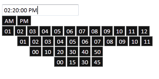

::: {style="DISPLAY: none"}
{#d2h_url_template}{#d2h_package_url style="WIDTH: 0px; DISPLAY: none; HEIGHT: 0px"}
:::

::: {.d2h_secondary_topic style="PADDING-BOTTOM: 10pt; MARGIN: 0pt; PADDING-LEFT: 0pt; PADDING-RIGHT: 0pt; PADDING-TOP: 0pt"}
#### Live Update {#live-update style="tab-stops: 0pt"}

The TimePicker control allows you to update the time value in the time picker on mouseover.

 

**Properties**

+-----------------------+-----------------------+----------------------------------------------------------------------------------------+
| **Name**              | **Type**              | **Description**                                                                        |
+-----------------------+-----------------------+----------------------------------------------------------------------------------------+
| LiveUpdate            | Boolean               | Gets/sets the Boolean value indicating whether to update the value on mouseover event. |
|                       |                       |                                                                                        |
|                       | Default: true         |                                                                                        |
+-----------------------+-----------------------+----------------------------------------------------------------------------------------+

 

You can enable this property in the following two ways:

 

**[Using Builder]{style="COLOR: black"}**

[The following steps guide you in configuring the live update feature through Builder.]{style="COLOR: black"}

[1.   In the **view**, invoke the **TimePicker** helper with the time picker ID as the first argument and enable the **LiveUpdate** method with the desired option as an argument.]{style="COLOR: black"}

 

+-----------------------------------------------------------------------------------------------------------------------------------------------------------------------------------------------------------------------------------------------------------------------------------------------------------------------------------------------------------------------+
| **[\[ASPX\]]{style="FONT-FAMILY: 'Courier New'"}**[]{style="FONT-FAMILY: 'Courier New'"}                                                                                                                                                                                                                                                                              |
|                                                                                                                                                                                                                                                                                                                                                                       |
|                                                                                                                                                                                                                                                                                                                                                                       |
|                                                                                                                                                                                                                                                                                                                                                                       |
| [\<%]{style="FONT-FAMILY: Consolas; BACKGROUND: yellow; FONT-SIZE: 9.5pt"}[=]{style="FONT-FAMILY: Consolas; COLOR: blue; FONT-SIZE: 9.5pt"}[Html.Syncfusion().TimePicker([\"TimePicker\"]{style="COLOR: #a31515"})]{style="FONT-FAMILY: Consolas; FONT-SIZE: 9.5pt"}[.Value([\"10:10:10\"]{style="COLOR: #a31515"})]{style="FONT-FAMILY: Consolas; FONT-SIZE: 9.5pt"} |
|                                                                                                                                                                                                                                                                                                                                                                       |
| [.Format([\"hh:mm:ss tt\"]{style="COLOR: #a31515"}).**LiveUpdate**([true]{style="COLOR: blue"}).AutoFormat([Skins]{style="COLOR: #4bacc6"}.Midnight)]{style="FONT-FAMILY: Consolas; FONT-SIZE: 9.5pt"}                                                                                                                                                                |
|                                                                                                                                                                                                                                                                                                                                                                       |
| [ [ %\>]{style="BACKGROUND: yellow"}]{style="FONT-FAMILY: Consolas; FONT-SIZE: 9.5pt"}                                                                                                                                                                                                                                                                                |
|                                                                                                                                                                                                                                                                                                                                                                       |
| [   ]{style="FONT-FAMILY: 'Courier New'; FONT-SIZE: 12pt"}[]{style="FONT-FAMILY: Consolas; BACKGROUND: yellow; FONT-SIZE: 9.5pt"}                                                                                                                                                                                                                                     |
+-----------------------------------------------------------------------------------------------------------------------------------------------------------------------------------------------------------------------------------------------------------------------------------------------------------------------------------------------------------------------+

[]{style="COLOR: black"}[]{style="FONT-FAMILY: 'Times New Roman','serif'; COLOR: black; FONT-SIZE: 12pt"} 

+-------------------------------------------------------------------------------------------------------------------------------------------------------------------------------------+
| **[\[Razor\]]{style="FONT-FAMILY: 'Courier New'"}**[ ]{style="FONT-FAMILY: 'Courier New'"}                                                                                          |
|                                                                                                                                                                                     |
| [@(]{style="FONT-FAMILY: 'Courier New'; BACKGROUND: yellow"}[Html.Syncfusion().TimePicker([\"TimePicker)]{style="COLOR: #a31515"}]{style="FONT-FAMILY: Consolas; FONT-SIZE: 9.5pt"} |
|                                                                                                                                                                                     |
| [.Format([\"hh:mm:ss tt\"]{style="COLOR: #a31515"}).AutoFormat([Skins]{style="COLOR: #4bacc6"}.Midnight)]{style="FONT-FAMILY: Consolas; FONT-SIZE: 9.5pt"}                          |
|                                                                                                                                                                                     |
| [.**LiveUpdate**([true]{style="COLOR: blue"})]{style="FONT-FAMILY: Consolas; FONT-SIZE: 9.5pt"}[)]{style="FONT-FAMILY: 'Courier New'; BACKGROUND: yellow"}                          |
|                                                                                                                                                                                     |
| []{style="FONT-FAMILY: 'Courier New'"}                                                                                                                                              |
|                                                                                                                                                                                     |
| [   ]{style="FONT-FAMILY: 'Courier New'"}                                                                                                                                           |
+-------------------------------------------------------------------------------------------------------------------------------------------------------------------------------------+

[]{style="COLOR: black"} 

[2.   Run the application.]{style="COLOR: black"}

**[]{style="COLOR: black"}** 

**[Using Properties Model]{style="COLOR: black"}**

[The following steps will guide you in setting the **LiveUpdate** property through the properties model.]{style="COLOR: black"}

[1.   In the **controller**, create an instance of **TimePickerModel**, define the **LiveUpdate** property and pass the instance through **view-specific data** to the **view** as given below.]{style="COLOR: black"}

 

+---------------------------------------------------------------------------------------------------------------------------------------------------------------------------------------------------------------------------------------------------------------------------------------------------------------------------+
| **[Controller]{style="FONT-FAMILY: 'Courier New'"}**[]{style="FONT-FAMILY: 'Courier New'"}                                                                                                                                                                                                                                |
|                                                                                                                                                                                                                                                                                                                           |
|                                                                                                                                                                                                                                                                                                                           |
|                                                                                                                                                                                                                                                                                                                           |
| [public]{style="FONT-FAMILY: 'Courier New'; COLOR: blue"}[ [ActionResult]{style="COLOR: #2b91af"} Index()]{style="FONT-FAMILY: 'Courier New'"}                                                                                                                                                                            |
|                                                                                                                                                                                                                                                                                                                           |
| [        {]{style="FONT-FAMILY: 'Courier New'"}                                                                                                                                                                                                                                                                           |
|                                                                                                                                                                                                                                                                                                                           |
| [            [TimePickerModel]{style="COLOR: #2b91af"} myModel = [new]{style="COLOR: blue"} [TimePickerModel]{style="COLOR: #2b91af"}();]{style="FONT-FAMILY: 'Courier New'"}                                                                                                                                             |
|                                                                                                                                                                                                                                                                                                                           |
| [            myModel**.**Value **=**]{style="FONT-FAMILY: 'Courier New'"}[ ]{style="FONT-FAMILY: Consolas; COLOR: blue; FONT-SIZE: 9.5pt"}[new]{style="FONT-FAMILY: Consolas; COLOR: blue; FONT-SIZE: 9.5pt"}[ [DateTime]{style="COLOR: #2b91af"}(2012,01,01,10,10,10);]{style="FONT-FAMILY: Consolas; FONT-SIZE: 9.5pt"} |
|                                                                                                                                                                                                                                                                                                                           |
| [              myModel.Format= [\"hh:mm:ss tt\"]{style="COLOR: #a31515"};]{style="FONT-FAMILY: Consolas; FONT-SIZE: 9.5pt"}                                                                                                                                                                                               |
|                                                                                                                                                                                                                                                                                                                           |
|                         [myModel.AutoFormat=[Skins]{style="COLOR: #4bacc6"}.Midnight;]{style="FONT-FAMILY: Consolas; FONT-SIZE: 9.5pt"}                                                                                                                                                                                   |
|                                                                                                                                                                                                                                                                                                                           |
|                         [myModel.**LiveUpdate**= [true]{style="COLOR: blue"};]{style="FONT-FAMILY: Consolas; FONT-SIZE: 9.5pt"}                                                                                                                                                                                           |
|                                                                                                                                                                                                                                                                                                                           |
| [            ViewData\[[\"myTimePickerModel\"]{style="COLOR: #a31515"}\] = myModel;]{style="FONT-FAMILY: 'Courier New'"}                                                                                                                                                                                                  |
|                                                                                                                                                                                                                                                                                                                           |
| [            [return]{style="COLOR: blue"} View();]{style="FONT-FAMILY: 'Courier New'"}                                                                                                                                                                                                                                   |
|                                                                                                                                                                                                                                                                                                                           |
| [        }]{style="FONT-FAMILY: 'Courier New'"}                                                                                                                                                                                                                                                                           |
|                                                                                                                                                                                                                                                                                                                           |
| []{style="FONT-FAMILY: 'Times New Roman','serif'; FONT-SIZE: 12pt"}                                                                                                                                                                                                                                                       |
+---------------------------------------------------------------------------------------------------------------------------------------------------------------------------------------------------------------------------------------------------------------------------------------------------------------------------+

[]{style="COLOR: black"} 

[2.   In the **view**, invoke the **TimePicker** helper with the time picker ID as the first argument and view data key as the second argument. ]{style="COLOR: black"}

[]{style="FONT-FAMILY: 'Times New Roman','serif'; COLOR: black; FONT-SIZE: 12pt"} 

+----------------------------------------------------------------------------------------------------------------------------------------------------------------------------------------------------------------------------------------------------------------------------------------------------------------+
| **[\[ASPX\]]{style="FONT-FAMILY: 'Courier New'"}**[]{style="FONT-FAMILY: 'Courier New'; FONT-SIZE: 9.5pt"}                                                                                                                                                                                                     |
|                                                                                                                                                                                                                                                                                                                |
| []{style="FONT-FAMILY: Consolas; COLOR: blue; FONT-SIZE: 9.5pt"}                                                                                                                                                                                                                                               |
|                                                                                                                                                                                                                                                                                                                |
| [\<%]{style="FONT-FAMILY: 'Courier New'; BACKGROUND: yellow"}[=]{style="FONT-FAMILY: 'Courier New'; COLOR: blue"}[Html.Syncfusion().TimePicker([\"TimePicker\"]{style="COLOR: #a31515"},[\"myTimePickerModel\"]{style="COLOR: #a31515"})[%\>]{style="BACKGROUND: yellow"}]{style="FONT-FAMILY: 'Courier New'"} |
|                                                                                                                                                                                                                                                                                                                |
| []{style="FONT-FAMILY: 'Times New Roman','serif'; FONT-SIZE: 12pt"}                                                                                                                                                                                                                                            |
+----------------------------------------------------------------------------------------------------------------------------------------------------------------------------------------------------------------------------------------------------------------------------------------------------------------+

***[{border="0"}]{style="COLOR: black; FONT-SIZE: 9pt"}**[Note: The second argument of the above TimePicker helper should match the view data key from the controller to fetch the properties.]{style="COLOR: black; FONT-SIZE: 9pt"}***

[3.   Run the application.]{style="COLOR: black"}

 

{border="0"}

Figure 286: LiveUpdate Property Applied to a Time Picker

 

 

[]{#related-topics}
:::
