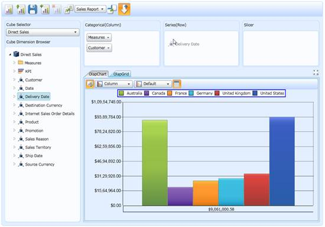
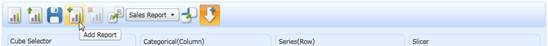
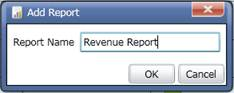
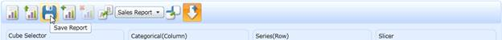
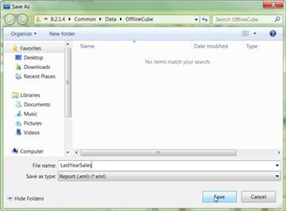
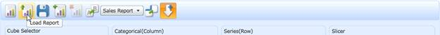
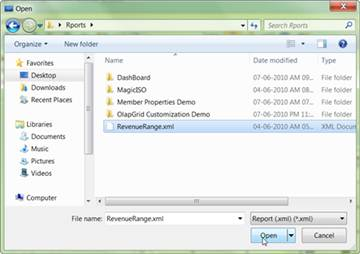

::: {style="DISPLAY: none"}
{#d2h_url_template}{#d2h_package_url style="WIDTH: 0px; DISPLAY: none; HEIGHT: 0px"}
:::

::::: {#nsbanner .d2h_main_nsbanner style="BORDER-BOTTOM: #999999 1px solid; POSITION: relative; PADDING-BOTTOM: 0px; BACKGROUND-COLOR: transparent; PADDING-LEFT: 0px; PADDING-RIGHT: 0px; DISPLAY: none; BORDER-TOP: #999999 1px solid; PADDING-TOP: 0px; LEFT: 0px"}
:::: {#TitleRow .d2h_main_titlerow style="PADDING-BOTTOM: 4px; BACKGROUND-COLOR: transparent; PADDING-LEFT: 22px; WIDTH: 100%; PADDING-RIGHT: 10px; DISPLAY: none; PADDING-TOP: 4px"}
::: {#ienav .d2h_main_ienav style="DISPLAY: none"}
{#D2HPrevious .D2HPreviousEnabled}  {#D2HNext .D2HNextEnabled}
:::
::::
:::::

:::: {#nstext .d2h_main_nstext style="PADDING-BOTTOM: 10px; BACKGROUND-COLOR: transparent; PADDING-LEFT: 22px; PADDING-RIGHT: 10px; HEIGHT: 100%; OVERFLOW: auto; PADDING-TOP: 5px" hasuserbackground="true" valign="bottom"}
::: {#d2h_breadcrumbs .d2h_breadcrumbs}
[Essential Studio User Guide Documentation](ms-xhelp:///?Id=12457748-09e3-4d74-a240-8e049cedf030){.d2h_breadcrumbsNormal}[ \> ]{.d2h_breadcrumbsLinkSeparator}[Business Intelligence Edition](ms-xhelp:///?Id=fdf33dd8-62b2-47b9-ad7b-fc50e590bca5){.d2h_breadcrumbsNormal}[ \> ]{.d2h_breadcrumbsLinkSeparator}[Essential BI Silverlight](ms-xhelp:///?Id=c006b39c-6aa2-4637-b7de-3e7b6cb3f9f9){.d2h_breadcrumbsNormal}[ \> ]{.d2h_breadcrumbsLinkSeparator}[Essential BI Client]{.d2h_breadcrumbsContentsOnly}[ \> ]{.d2h_breadcrumbsLinkSeparator}[Features](ms-xhelp:///?Id=4ae10797-e3a8-4270-b8ba-34441d2e1a3d){.d2h_breadcrumbsNormal}[ \> ]{.d2h_breadcrumbsLinkSeparator}[OlapReport Serialization](ms-xhelp:///?Id=a63ed5b9-eec8-4d34-97f0-d0b10e84ef01){.d2h_breadcrumbsNormal}
:::

### Load and Save report {#load-and-save-report style="tab-stops: 0pt"}

OLAP Client will allow us to create multiple reports and store them as XML files containing all the reports. Each XML file may contain any number of reports. Also, you can store the reports in Stream.

Steps to save and load a newly created report:

1.   Click New session to create a new session, else add a new report by clicking Add Report.

2.   Drag and drop the required elements in the required axis. By this axis, the element will be added to the current report. You can drag and drop any number of elements in any axis.

{border="0"}

 

Figure 21: Dragging and Dropping Elements from the Cube Dimension Browser to the Axis

3.   Once you finish the drag and drop of elements, save the current session.

4.   You can add any number of reports to the current report set.

5.   To add a report, click Add Report and provide a name for the new report.

 

{border="0"}

 

Figure 22: Adding a New Report to the Current Report Set

 

{border="0"}

 

Figure 23: Entering the Name for the New Report

 

6.   After creating the reports, save the current report set as an XML file by clicking the Save button in the OLAP Client toolbar.

 

{border="0"}

 

Figure 24: Saving the Created report Set as an XML File

{border="0"}

 

Figure 25: Saving the Report Set as an XML File by Providing the Name of the File

 

7.   To load a report, click the Load button in the OLAP Client toolbar. A file dialog window will appear. Choose the stored xml file to view.

 

{border="0"}

 

Figure 26: Loading the Existing Report Set (XML File)

 

 

{border="0"}

 

Figure 27: Loading the reports from the Saved XML File

 

 

{border="0"}

 

Figure 28: Loading the Existing Report Set (XML File)

 

 

{border="0"}

 

Figure 29: Loading the reports from the Saved XML File

 

Code snippet

Loading a Report from the file:

 

+------------------------------------------------------------------------------+
| **[\[C#\]]{style="FONT-FAMILY: 'Courier New'"}**                             |
|                                                                              |
| [//// To load xml report file\                                               |
| this.OlapClient.LoadReportDefinition();]{style="FONT-FAMILY: 'Courier New'"} |
|                                                                              |
| []{style="FONT-FAMILY: 'Courier New'"}                                       |
+------------------------------------------------------------------------------+

 

+----------------------------------------------------------------------------+
| **[\[VB\]]{style="FONT-FAMILY: 'Courier New'"}**                           |
|                                                                            |
| [  \' To load xml report file]{style="FONT-FAMILY: 'Courier New'"}         |
|                                                                            |
| [Me.OlapClient.LoadReportDefinition()]{style="FONT-FAMILY: 'Courier New'"} |
|                                                                            |
| []{style="FONT-FAMILY: 'Courier New'"}                                     |
+----------------------------------------------------------------------------+

 

Saving the Report:

 

+-----------------------------------------------------------------------+
| **[\[C#\]]{style="FONT-FAMILY: 'Courier New'"}**                      |
|                                                                       |
| [//// To save the current session as an Xml file\                     |
| this.OlapClient.SaveReport();]{style="FONT-FAMILY: 'Courier New'"}    |
|                                                                       |
| []{style="FONT-FAMILY: 'Courier New'"}                                |
+-----------------------------------------------------------------------+

 

+------------------------------------------------------------------------------------+
| **[\[VB\]]{style="FONT-FAMILY: 'Courier New'"}**                                   |
|                                                                                    |
| [\'To save the current session as an Xml file]{style="FONT-FAMILY: 'Courier New'"} |
|                                                                                    |
| [Me.OlapClient.SaveReport()]{style="FONT-FAMILY: 'Courier New'"}                   |
|                                                                                    |
| []{style="FONT-FAMILY: 'Courier New'"}                                             |
+------------------------------------------------------------------------------------+

 

Use Case Scenarios

Users can create a report and save it as an XML file for use in future. In an IT scenario, a user can create and save the report in some location and another user can load it and view it.

 

[]{#related-topics}
::::
