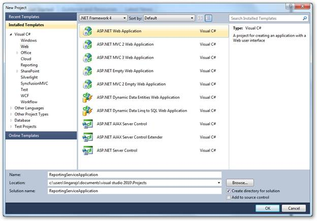
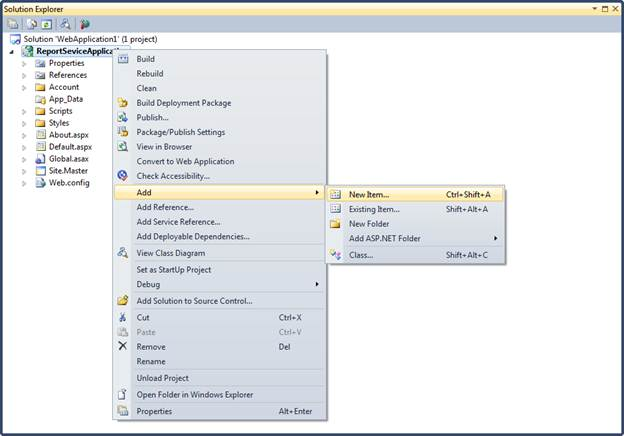
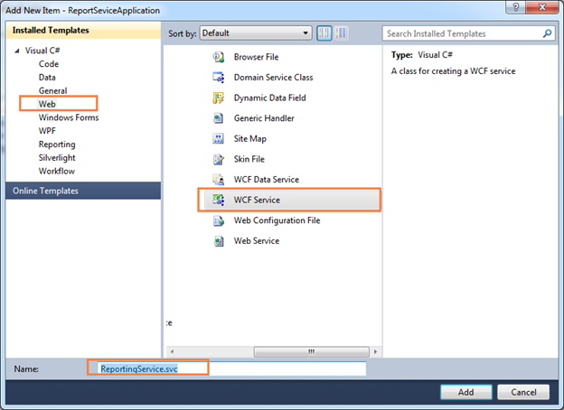
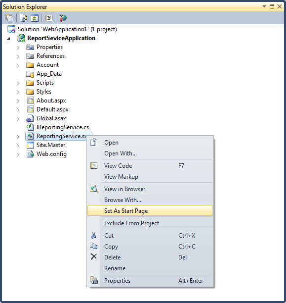
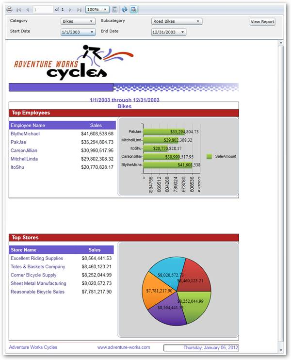

::: {style="DISPLAY: none"}
[](ms-xhelp:///?Id=d2h_url_template){#d2h_url_template}{#d2h_package_url style="WIDTH: 0px; DISPLAY: none; HEIGHT: 0px"}
:::

::::: {#nsbanner .d2h_main_nsbanner style="BORDER-BOTTOM: #999999 1px solid; POSITION: relative; PADDING-BOTTOM: 0px; BACKGROUND-COLOR: transparent; PADDING-LEFT: 0px; PADDING-RIGHT: 0px; DISPLAY: none; BORDER-TOP: #999999 1px solid; PADDING-TOP: 0px; LEFT: 0px"}
:::: {#TitleRow .d2h_main_titlerow style="PADDING-BOTTOM: 4px; BACKGROUND-COLOR: transparent; PADDING-LEFT: 22px; WIDTH: 100%; PADDING-RIGHT: 10px; DISPLAY: none; PADDING-TOP: 4px"}
::: {#ienav .d2h_main_ienav style="DISPLAY: none"}
[](ms-xhelp:///?Id=b58768fe-6e35-4e1f-83e7-1f67d670f31c){#D2HPrevious .D2HPreviousEnabled}  [](ms-xhelp:///?Id=944478dd-2c05-46c1-836f-4b0fbcb6849e){#D2HNext .D2HNextEnabled}
:::
::::
:::::

:::::: {#nstext .d2h_main_nstext style="PADDING-BOTTOM: 10px; BACKGROUND-COLOR: transparent; PADDING-LEFT: 22px; PADDING-RIGHT: 10px; HEIGHT: 100%; OVERFLOW: auto; PADDING-TOP: 5px" hasuserbackground="true" valign="bottom"}
::: {#d2h_breadcrumbs .d2h_breadcrumbs}
[Essential Studio User Guide Documentation](ms-xhelp:///?Id=12457748-09e3-4d74-a240-8e049cedf030){.d2h_breadcrumbsNormal}[ \> ]{.d2h_breadcrumbsLinkSeparator}[Reporting Edition](ms-xhelp:///?Id=027aa5b6-6676-4f93-ad23-c20e8c45792e){.d2h_breadcrumbsNormal}[ \> ]{.d2h_breadcrumbsLinkSeparator}[Essential Report Viewer](ms-xhelp:///?Id=35081cc7-4b81-4ef5-97d2-894ad584b907){.d2h_breadcrumbsNormal}[ \> ]{.d2h_breadcrumbsLinkSeparator}[Report Viewer Silverlight]{.d2h_breadcrumbsContentsOnly}[ \> ]{.d2h_breadcrumbsLinkSeparator}[Concepts and Features](ms-xhelp:///?Id=e1f4aeae-2289-4b26-b9dd-38e72df239b2){.d2h_breadcrumbsNormal}
:::

## Loading SSRS Report in Report Viewer {#loading-ssrs-report-in-report-viewer style="TEXT-ALIGN: justify; tab-stops: 0pt"}

 

You can also show SSRS reports in Report Viewer using the following steps.

 

1.   Create a new web application in VS2010.

 

{border="0"}

Figure 30: Adding New Application

 

2.   On the **Solution** Explorer, right-click **References** folder, and then click **Add Reference**.

 

{border="0"}

Figure 31: Adding References

 

::: {style="BORDER-BOTTOM: windowtext 1pt solid; BORDER-LEFT: medium none; PADDING-BOTTOM: 1pt; MARGIN-TOP: 9pt; PADDING-LEFT: 0pt; PADDING-RIGHT: 0pt; MARGIN-BOTTOM: 9pt; BORDER-TOP: windowtext 1pt solid; BORDER-RIGHT: medium none; PADDING-TOP: 1pt"}
{border="0"}Note: The added references will appear under the References folder
:::

 

{border="0"}

Figure 32: Added References

 

3.   To add a new WCF service file in the web application, right-click on the newly added web application under **Solution Explorer** dialog.

 

{border="0"}

Figure 33: Adding New Item

 

4.   Click **Add** and select **New Item**. The **Add New Item** dialog will open.

 

{border="0"}

Figure 34: Adding New WCF Service

 

5.   Click **Web** under **Visual C#**.

6.   Click **WCF Service,** and then click **Add**.

7.   Update the following changes in the auto generated WCF service file.

 

+-----------------------------------------------------------------------------+
| ``` {style="BACKGROUND: #f0f0f0"}                                           |
|                                                                             |
| ```                                                                         |
|                                                                             |
| ``` {style="BACKGROUND: #f0f0f0"}                                           |
| using System;                                                               |
| ```                                                                         |
|                                                                             |
| ``` {style="BACKGROUND: #f0f0f0"}                                           |
| using System.Collections.Generic;                                           |
| ```                                                                         |
|                                                                             |
| ``` {style="BACKGROUND: #f0f0f0"}                                           |
| using System.Linq;                                                          |
| ```                                                                         |
|                                                                             |
| ``` {style="BACKGROUND: #f0f0f0"}                                           |
| using System.Runtime.Serialization;                                         |
| ```                                                                         |
|                                                                             |
| ``` {style="BACKGROUND: #f0f0f0"}                                           |
| using System.ServiceModel;                                                  |
| ```                                                                         |
|                                                                             |
| ``` {style="BACKGROUND: #f0f0f0"}                                           |
| using System.Text;                                                          |
| ```                                                                         |
|                                                                             |
| ``` {style="BACKGROUND: #f0f0f0"}                                           |
|                                                                             |
| ```                                                                         |
|                                                                             |
| ``` {style="BACKGROUND: #f0f0f0"}                                           |
| namespace ReportingServiceApplication                                       |
| ```                                                                         |
|                                                                             |
| ``` {style="BACKGROUND: #f0f0f0"}                                           |
| {                                                                           |
| ```                                                                         |
|                                                                             |
| ``` {style="BACKGROUND: #f0f0f0"}                                           |
|     public class ReportingService : Syncfusion.Reports.Server.ReportService |
| ```                                                                         |
|                                                                             |
| ``` {style="BACKGROUND: #f0f0f0"}                                           |
|     {                                                                       |
| ```                                                                         |
|                                                                             |
| ``` {style="BACKGROUND: #f0f0f0"}                                           |
|     }                                                                       |
| ```                                                                         |
|                                                                             |
| ``` {style="BACKGROUND: #f0f0f0"}                                           |
| }                                                                           |
| ```                                                                         |
+-----------------------------------------------------------------------------+

 

::: {style="BORDER-BOTTOM: windowtext 1pt solid; BORDER-LEFT: medium none; PADDING-BOTTOM: 1pt; MARGIN-TOP: 9pt; PADDING-LEFT: 0pt; PADDING-RIGHT: 0pt; MARGIN-BOTTOM: 9pt; BORDER-TOP: windowtext 1pt solid; BORDER-RIGHT: medium none; PADDING-TOP: 1pt"}
{border="0"}Note: The added WCF service file will appear under the created web application
:::

 

{border="0"}

Figure 35: Set As Start Page option in Solution Explorer

 

8.   Right-click on the newly added WCF service file and select **Set As Start Page**.

9.   Run the service application. The service information is displayed.

 

{border="0"}

Figure 36: Created Service

 

10.  Create a new Silverlight application in VS2010.

11.  Add Report Viewer and related references to the newly created Silverlight application.

12.  To load SSRS report from a SQL Reporting Server to Report Viewer, initialize ReportViewer control, and set the **ReportPath** and the **ReportingServiceUrl**.

 

+--------------------------------------------------------------------------------------+
| ``` {style="BACKGROUND: #f0f0f0"}                                                    |
| public partial class MainPage : UserControl                                          |
| ```                                                                                  |
|                                                                                      |
| ``` {style="BACKGROUND: #f0f0f0"}                                                    |
|     {                                                                                |
| ```                                                                                  |
|                                                                                      |
| ``` {style="BACKGROUND: #f0f0f0"}                                                    |
|         public MainPage()                                                            |
| ```                                                                                  |
|                                                                                      |
| ``` {style="BACKGROUND: #f0f0f0"}                                                    |
|         {                                                                            |
| ```                                                                                  |
|                                                                                      |
| ``` {style="BACKGROUND: #f0f0f0"}                                                    |
|             InitializeComponent();                                                   |
| ```                                                                                  |
|                                                                                      |
| ``` {style="BACKGROUND: #f0f0f0"}                                                    |
|                                                                                      |
| ```                                                                                  |
|                                                                                      |
| ``` {style="BACKGROUND: #f0f0f0"}                                                    |
|             // ReportViewer control initialization                                   |
| ```                                                                                  |
|                                                                                      |
| ``` {style="BACKGROUND: #f0f0f0"}                                                    |
|             Syncfusion.Windows.Reports.Viewer.ReportViewer reportViewer1 = new Syncf |
| ```                                                                                  |
|                                                                                      |
| ``` {style="BACKGROUND: #f0f0f0"}                                                    |
| usion.Windows.Reports.Viewer.ReportViewer();                                         |
| ```                                                                                  |
|                                                                                      |
| ``` {style="BACKGROUND: #f0f0f0"}                                                    |
|                                                                                      |
| ```                                                                                  |
|                                                                                      |
| ``` {style="BACKGROUND: #f0f0f0"}                                                    |
|             // Set ProcessingMode for ReportViewer. To load and process the DataSour |
| ```                                                                                  |
|                                                                                      |
| ``` {style="BACKGROUND: #f0f0f0"}                                                    |
| ce information from server                                                           |
| ```                                                                                  |
|                                                                                      |
| ``` {style="BACKGROUND: #f0f0f0"}                                                    |
|             reportViewer1.ProcessingMode = Syncfusion.Windows.Reports.Viewer.Process |
| ```                                                                                  |
|                                                                                      |
| ``` {style="BACKGROUND: #f0f0f0"}                                                    |
| ingMode.Remote;                                                                      |
| ```                                                                                  |
|                                                                                      |
| ``` {style="BACKGROUND: #f0f0f0"}                                                    |
|                                                                                      |
| ```                                                                                  |
|                                                                                      |
| ``` {style="BACKGROUND: #f0f0f0"}                                                    |
|            // SQL ReportingService url.                                              |
| ```                                                                                  |
|                                                                                      |
| ``` {style="BACKGROUND: #f0f0f0"}                                                    |
|             reportViewer1.ReportServerUrl = @"http://<<SERVER NAME>>/ReportServer";  |
| ```                                                                                  |
|                                                                                      |
| ``` {style="BACKGROUND: #f0f0f0"}                                                    |
|                                                                                      |
| ```                                                                                  |
|                                                                                      |
| ``` {style="BACKGROUND: #f0f0f0"}                                                    |
|                                                                                      |
| ```                                                                                  |
|                                                                                      |
| ``` {style="BACKGROUND: #f0f0f0"}                                                    |
|             // SQL ReportingService hosted Reportpath.                               |
| ```                                                                                  |
|                                                                                      |
| ``` {style="BACKGROUND: #f0f0f0"}                                                    |
|             reportViewer1.ReportPath =@"/MSFT Reports/Product Line Sales";           |
| ```                                                                                  |
|                                                                                      |
| ``` {style="BACKGROUND: #f0f0f0"}                                                    |
|             // Set ReportServer credential to access ReportingServer.                |
| ```                                                                                  |
|                                                                                      |
| ``` {style="BACKGROUND: #f0f0f0"}                                                    |
|             reportViewer1.ReportServerCredential = new System.Net.NetworkCredential( |
| ```                                                                                  |
|                                                                                      |
| ``` {style="BACKGROUND: #f0f0f0"}                                                    |
| "username", "passowrd", "domain");                                                   |
| ```                                                                                  |
|                                                                                      |
| ``` {style="BACKGROUND: #f0f0f0"}                                                    |
|                                                                                      |
| ```                                                                                  |
|                                                                                      |
| ``` {style="BACKGROUND: #f0f0f0"}                                                    |
|             // Set ReportServiceUrl to retrive data from hosted service              |
| ```                                                                                  |
|                                                                                      |
| ``` {style="BACKGROUND: #f0f0f0"}                                                    |
|             reportViewer1.ReportServiceURL = @"http://localhost:50774/ReportingServi |
| ```                                                                                  |
|                                                                                      |
| ``` {style="BACKGROUND: #f0f0f0"}                                                    |
| ce.svc";                                                                             |
| ```                                                                                  |
|                                                                                      |
| ``` {style="BACKGROUND: #f0f0f0"}                                                    |
|                                                                                      |
| ```                                                                                  |
|                                                                                      |
| ``` {style="BACKGROUND: #f0f0f0"}                                                    |
|             // Add ReportViewer in MainWindow grid                                   |
| ```                                                                                  |
|                                                                                      |
| ``` {style="BACKGROUND: #f0f0f0"}                                                    |
|             this.LayoutRoot.Children.Add(reportViewer1);                             |
| ```                                                                                  |
|                                                                                      |
| ``` {style="BACKGROUND: #f0f0f0"}                                                    |
|                                                                                      |
| ```                                                                                  |
|                                                                                      |
| ``` {style="BACKGROUND: #f0f0f0"}                                                    |
|             this.Loaded += (sender, arg) =>                                          |
| ```                                                                                  |
|                                                                                      |
| ``` {style="BACKGROUND: #f0f0f0"}                                                    |
|             {                                                                        |
| ```                                                                                  |
|                                                                                      |
| ``` {style="BACKGROUND: #f0f0f0"}                                                    |
|                 // To Render the Report in ReportViewer.                             |
| ```                                                                                  |
|                                                                                      |
| ``` {style="BACKGROUND: #f0f0f0"}                                                    |
|                 reportViewer1.RefreshReport();                                       |
| ```                                                                                  |
|                                                                                      |
| ``` {style="BACKGROUND: #f0f0f0"}                                                    |
|             };                                                                       |
| ```                                                                                  |
|                                                                                      |
| ``` {style="BACKGROUND: #f0f0f0"}                                                    |
|         }                                                                            |
| ```                                                                                  |
|                                                                                      |
| ``` {style="BACKGROUND: #f0f0f0"}                                                    |
|     }                                                                                |
| ```                                                                                  |
+--------------------------------------------------------------------------------------+

 

13.  Run the application. The following output displays.

 

{border="0"}

Figure 37: ReportViewer with SSRS reports

 

 

[]{#related-topics}
::::::
