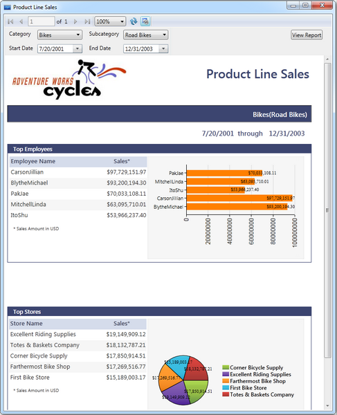

::: {style="DISPLAY: none"}
{#d2h_url_template}{#d2h_package_url style="WIDTH: 0px; DISPLAY: none; HEIGHT: 0px"}
:::

::::: {#nsbanner .d2h_main_nsbanner style="BORDER-BOTTOM: #999999 1px solid; POSITION: relative; PADDING-BOTTOM: 0px; BACKGROUND-COLOR: transparent; PADDING-LEFT: 0px; PADDING-RIGHT: 0px; DISPLAY: none; BORDER-TOP: #999999 1px solid; PADDING-TOP: 0px; LEFT: 0px"}
:::: {#TitleRow .d2h_main_titlerow style="PADDING-BOTTOM: 4px; BACKGROUND-COLOR: transparent; PADDING-LEFT: 22px; WIDTH: 100%; PADDING-RIGHT: 10px; DISPLAY: none; PADDING-TOP: 4px"}
::: {#ienav .d2h_main_ienav style="DISPLAY: none"}
{#D2HPrevious .D2HPreviousEnabled}  {#D2HNext .D2HNextEnabled}
:::
::::
:::::

:::: {#nstext .d2h_main_nstext style="PADDING-BOTTOM: 10px; BACKGROUND-COLOR: transparent; PADDING-LEFT: 22px; PADDING-RIGHT: 10px; HEIGHT: 100%; OVERFLOW: auto; PADDING-TOP: 5px" hasuserbackground="true" valign="bottom"}
::: {#d2h_breadcrumbs .d2h_breadcrumbs}
[Essential Studio User Guide Documentation](ms-xhelp:///?Id=12457748-09e3-4d74-a240-8e049cedf030){.d2h_breadcrumbsNormal}[ \> ]{.d2h_breadcrumbsLinkSeparator}[Reporting Edition](ms-xhelp:///?Id=027aa5b6-6676-4f93-ad23-c20e8c45792e){.d2h_breadcrumbsNormal}[ \> ]{.d2h_breadcrumbsLinkSeparator}[Essential Report Viewer](ms-xhelp:///?Id=35081cc7-4b81-4ef5-97d2-894ad584b907){.d2h_breadcrumbsNormal}[ \> ]{.d2h_breadcrumbsLinkSeparator}[Report Viewer WPF]{.d2h_breadcrumbsContentsOnly}[ \> ]{.d2h_breadcrumbsLinkSeparator}[Concepts and Features](ms-xhelp:///?Id=b461284e-0215-4894-9001-224c2b5575b7){.d2h_breadcrumbsNormal}
:::

## Loading SSRS Reports in Report Viewer {#loading-ssrs-reports-in-report-viewer style="tab-stops: 0pt"}

 

You can also show SSRS reports in Report Viewer by using the following steps.

 

1.   To load SSRS reports from SQL Reporting Server, initialize Report Viewer control and set the **ReportPath** and SQL **ReportingService URL**.

 

+-------------------------------------------------------------------------------------------------------------------------------------------------------------------------------+
| [// ReportViewer control initialization.]{style="FONT-FAMILY: 'Courier New'; COLOR: blue"}                                                                                    |
|                                                                                                                                                                               |
| [Syncfusion.Windows.Reports.Viewer.ReportViewer reportViewer1 = new Syncfusion.Windows.Reports.Viewer.ReportViewer();]{style="FONT-FAMILY: 'Courier New'; COLOR: blue"}       |
|                                                                                                                                                                               |
| []{style="FONT-FAMILY: 'Courier New'; COLOR: blue"}                                                                                                                           |
|                                                                                                                                                                               |
| [// SQL ReportingService url.]{style="FONT-FAMILY: 'Courier New'; COLOR: blue"}                                                                                               |
|                                                                                                                                                                               |
| [reportViewer1.ReportServerUrl = @\"http://\<\<SERVER NAME\>\>/ReportServer\";]{style="FONT-FAMILY: 'Courier New'; COLOR: blue"}                                              |
|                                                                                                                                                                               |
| []{style="FONT-FAMILY: 'Courier New'; COLOR: blue"}                                                                                                                           |
|                                                                                                                                                                               |
| [// SQL ReportingService hosted Reportpath.]{style="FONT-FAMILY: 'Courier New'; COLOR: blue"}                                                                                 |
|                                                                                                                                                                               |
| [reportViewer1.ReportPath=@\"/MSFT Reports/Product Line Sales\";]{style="FONT-FAMILY: 'Courier New'; COLOR: blue"}                                                            |
|                                                                                                                                                                               |
| []{style="FONT-FAMILY: 'Courier New'; COLOR: blue"}                                                                                                                           |
|                                                                                                                                                                               |
| [// Set ReportServer credential to access ReportingServer.]{style="FONT-FAMILY: 'Courier New'; COLOR: blue"}                                                                  |
|                                                                                                                                                                               |
| [reportViewer1.ReportServerCredential = new System.Net.NetworkCredential(\"username\",\"passowrd\",\"domain\");            ]{style="FONT-FAMILY: 'Courier New'; COLOR: blue"} |
|                                                                                                                                                                               |
| []{style="FONT-FAMILY: 'Courier New'; COLOR: blue"}                                                                                                                           |
|                                                                                                                                                                               |
| [// Add ReportViewer in MainWindow grid]{style="FONT-FAMILY: 'Courier New'; COLOR: blue"}                                                                                     |
|                                                                                                                                                                               |
| [this.grid1.Children.Add(reportViewer1);]{style="FONT-FAMILY: 'Courier New'; COLOR: blue"}                                                                                    |
|                                                                                                                                                                               |
| []{style="FONT-FAMILY: 'Courier New'; COLOR: blue"}                                                                                                                           |
|                                                                                                                                                                               |
| [this.Loaded += (sender, arg) =\>]{style="FONT-FAMILY: 'Courier New'; COLOR: blue"}                                                                                           |
|                                                                                                                                                                               |
| [{]{style="FONT-FAMILY: 'Courier New'; COLOR: blue"}                                                                                                                          |
|                                                                                                                                                                               |
| [  // To Render the Report in ReportViewer.]{style="FONT-FAMILY: 'Courier New'; COLOR: blue"}                                                                                 |
|                                                                                                                                                                               |
| [   reportViewer1.RefreshReport();]{style="FONT-FAMILY: 'Courier New'; COLOR: blue"}                                                                                          |
|                                                                                                                                                                               |
| [};]{style="FONT-FAMILY: 'Courier New'; COLOR: blue"}[]{style="FONT-FAMILY: 'Courier New'"}                                                                                   |
+-------------------------------------------------------------------------------------------------------------------------------------------------------------------------------+

 

2.   Run the application. The following output displays.

 

{border="0"}

Figure 17: ReportViewer Sample

 

 

[]{#related-topics}
::::
