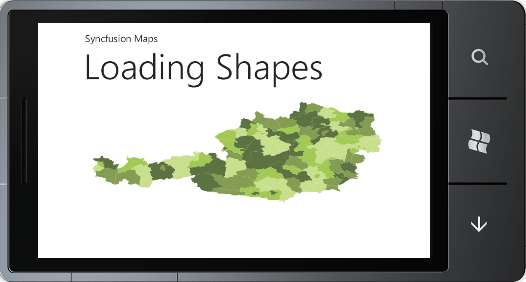

::: {style="DISPLAY: none"}
{#d2h_url_template}{#d2h_package_url style="WIDTH: 0px; DISPLAY: none; HEIGHT: 0px"}
:::

::: {.d2h_secondary_topic style="PADDING-BOTTOM: 10pt; MARGIN: 0pt; PADDING-LEFT: 0pt; PADDING-RIGHT: 0pt; PADDING-TOP: 0pt"}
#### Loading with Uniform Resource Identifier (URI) Property {#loading-with-uniform-resource-identifier-uri-property style="tab-stops: 0pt"}

 

Uri is the string that provides the location of the *ShapeFile* in the resource. In order to load the shape files with Uri property, the *ShapeFile* should be added as the *EmbeddedResource*.

 

Structure of Uri property:

Uri property contains the following information:

[·      ]{style="FONT-FAMILY: Symbol"}Namespace

[·      ]{style="FONT-FAMILY: Symbol"}Subfolder names

[·      ]{style="FONT-FAMILY: Symbol"}ShapeFilename.shp

 

For Example:

 

+------------------------------------------------------------------------------------------------------------------------------------------------------------------------------------------------------------------------------------------------------------------------------------------------------------------------------------------------------------------------------------------------------------------------------------------------------------------------------------------------------------------------------------------------------------------------------------------------------------------------------------------------------------------------------------------------------------------------------------------------------------------------------------------------------------------------------------------------------------------------------------------------------------------------------------------------+
| [\[XAML\]]{style="FONT-FAMILY: 'Courier New'"}                                                                                                                                                                                                                                                                                                                                                                                                                                                                                                                                                                                                                                                                                                                                                                                                                                                                                                 |
|                                                                                                                                                                                                                                                                                                                                                                                                                                                                                                                                                                                                                                                                                                                                                                                                                                                                                                                                                |
| [        ]{style="FONT-FAMILY: 'Courier New'; COLOR: #a31515"}[\<]{style="FONT-FAMILY: 'Courier New'; COLOR: blue"}[maps]{style="FONT-FAMILY: 'Courier New'; COLOR: #a31515"}[:]{style="FONT-FAMILY: 'Courier New'; COLOR: blue"}[ShapeFileLayer]{style="FONT-FAMILY: 'Courier New'; COLOR: #a31515"}[ Uri]{style="FONT-FAMILY: 'Courier New'; COLOR: red"}[="WindowsPhoneApplication1.ShapeFiles.wv.shp" ]{style="FONT-FAMILY: 'Courier New'; COLOR: blue"}[TranslateZoomFactor]{style="FONT-FAMILY: 'Courier New'; COLOR: red"}[=\"1\"]{style="FONT-FAMILY: 'Courier New'; COLOR: blue"}[ x]{style="FONT-FAMILY: 'Courier New'; COLOR: red"}[:]{style="FONT-FAMILY: 'Courier New'; COLOR: blue"}[Name]{style="FONT-FAMILY: 'Courier New'; COLOR: red"}[=\"shapeControl\"]{style="FONT-FAMILY: 'Courier New'; COLOR: blue"}[ [ EnableColorPalette]{style="COLOR: red"}[=\"True\"\>]{style="COLOR: blue"}]{style="FONT-FAMILY: 'Courier New'"} |
|                                                                                                                                                                                                                                                                                                                                                                                                                                                                                                                                                                                                                                                                                                                                                                                                                                                                                                                                                |
| [        ]{style="FONT-FAMILY: 'Courier New'; COLOR: #a31515"}[\</]{style="FONT-FAMILY: 'Courier New'; COLOR: blue"}[maps]{style="FONT-FAMILY: 'Courier New'; COLOR: #a31515"}[:]{style="FONT-FAMILY: 'Courier New'; COLOR: blue"}[ShapeFileLayer]{style="FONT-FAMILY: 'Courier New'; COLOR: #a31515"}[\>]{style="FONT-FAMILY: 'Courier New'; COLOR: blue"}[]{style="FONT-FAMILY: 'Courier New'"}                                                                                                                                                                                                                                                                                                                                                                                                                                                                                                                                              |
+------------------------------------------------------------------------------------------------------------------------------------------------------------------------------------------------------------------------------------------------------------------------------------------------------------------------------------------------------------------------------------------------------------------------------------------------------------------------------------------------------------------------------------------------------------------------------------------------------------------------------------------------------------------------------------------------------------------------------------------------------------------------------------------------------------------------------------------------------------------------------------------------------------------------------------------------+

 

 

+-------------------------------------------------------------------------------------------------------------------------------------------------------------------------------------+
| [\[C#\]]{style="FONT-FAMILY: 'Courier New'"}[           ]{style="FONT-FAMILY: 'Courier New'; COLOR: #2b91af"}[]{style="FONT-FAMILY: 'Courier New'"}                                 |
|                                                                                                                                                                                     |
| [            [ShapeFileLayer]{style="COLOR: #2b91af"} shapeLayer = [new]{style="COLOR: blue"} [ShapeFileLayer]{style="COLOR: #2b91af"}();]{style="FONT-FAMILY: 'Courier New'"}      |
|                                                                                                                                                                                     |
| [            shapeLayer.Uri = [\"WindowsPhoneApplication1.ShapeFiles.wv.shp\"]{style="COLOR: #a31515"};]{style="FONT-FAMILY: 'Courier New'"}[ ]{style="FONT-FAMILY: 'Courier New'"} |
+-------------------------------------------------------------------------------------------------------------------------------------------------------------------------------------+

 

Where, *WindowsPhoneApplication1* is the namespace of the application, *ShapeFile* is the subfolder name, and *wv.shp* is the name of the shapefile.

 

{border="0"}

Figure 13: Load ShapeFile Using Uri Property

 

 

[]{#related-topics}
:::
