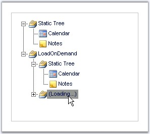

::: {style="DISPLAY: none"}
{#d2h_url_template}{#d2h_package_url style="WIDTH: 0px; DISPLAY: none; HEIGHT: 0px"}
:::

::: {.d2h_secondary_topic style="PADDING-BOTTOM: 10pt; MARGIN: 0pt; PADDING-LEFT: 0pt; PADDING-RIGHT: 0pt; PADDING-TOP: 0pt"}
##### Load On Demand {#load-on-demand style="tab-stops: 0pt"}

[]{style="FONT-FAMILY: 'Trebuchet MS','sans-serif'; COLOR: #15428b; FONT-SIZE: 9pt"} 

TreeView nodes can be loaded on demand that enables to load the tree nodes only when required. This helps to reduce the round trip time by loading only the required nodes.

Load on demand feature allows the data to be retrieved only on some user action by considerably reducing the downtime/round trip by avoiding postbacks and improve the performance of the application.

[]{style="FONT-FAMILY: 'Trebuchet MS','sans-serif'; COLOR: #15428b; FONT-SIZE: 9pt"} 

{border="0"}

 

Figure 187

 

To add nodes on demand, the following sample code behind file illustrates the feature.

 

When a node is clicked, postback is avoided and the nodes are built by calling the **BuildTree** method, which creates the tree structure by loading the nodes on demand.

[]{style="FONT-FAMILY: 'Trebuchet MS','sans-serif'; COLOR: #15428b; FONT-SIZE: 9pt"} 

+-----------------------------------------------------------------------------------------------------------------------------------------------------------------------------------------------------------------------------------------------------------------------------------------------------------------+
| **[\[C#\]]{style="FONT-FAMILY: 'Courier New'; FONT-SIZE: 9pt"}**                                                                                                                                                                                                                                                |
|                                                                                                                                                                                                                                                                                                                 |
| []{style="FONT-FAMILY: 'Courier New'; COLOR: blue; FONT-SIZE: 9pt"}                                                                                                                                                                                                                                             |
|                                                                                                                                                                                                                                                                                                                 |
| [protected]{style="FONT-FAMILY: 'Courier New'; COLOR: blue; FONT-SIZE: 9pt"}[ [void]{style="COLOR: blue"} Page_Load([object]{style="COLOR: blue"} sender, [EventArgs]{style="COLOR: teal"} e)]{style="FONT-FAMILY: 'Courier New'; FONT-SIZE: 9pt"}                                                              |
|                                                                                                                                                                                                                                                                                                                 |
| [{]{style="FONT-FAMILY: 'Courier New'; FONT-SIZE: 9pt"}                                                                                                                                                                                                                                                         |
|                                                                                                                                                                                                                                                                                                                 |
| [    [if]{style="COLOR: blue"} (!IsPostBack)]{style="FONT-FAMILY: 'Courier New'; FONT-SIZE: 9pt"}                                                                                                                                                                                                               |
|                                                                                                                                                                                                                                                                                                                 |
| [    {]{style="FONT-FAMILY: 'Courier New'; FONT-SIZE: 9pt"}                                                                                                                                                                                                                                                     |
|                                                                                                                                                                                                                                                                                                                 |
| [        tview = TreeView1;]{style="FONT-FAMILY: 'Courier New'; FONT-SIZE: 9pt"}                                                                                                                                                                                                                                |
|                                                                                                                                                                                                                                                                                                                 |
| [        tview.Items.Add([this]{style="COLOR: blue"}.BuildTree());]{style="FONT-FAMILY: 'Courier New'; FONT-SIZE: 9pt"}                                                                                                                                                                                         |
|                                                                                                                                                                                                                                                                                                                 |
| [        [TreeViewNode]{style="COLOR: teal"} node = [new]{style="COLOR: blue"} [TreeViewNode]{style="COLOR: teal"}();]{style="FONT-FAMILY: 'Courier New'; FONT-SIZE: 9pt"}                                                                                                                                      |
|                                                                                                                                                                                                                                                                                                                 |
| [        node.Text = [\"LoadOnDemand\"]{style="COLOR: maroon"};]{style="FONT-FAMILY: 'Courier New'; FONT-SIZE: 9pt"}                                                                                                                                                                                            |
|                                                                                                                                                                                                                                                                                                                 |
| [        node.ImagePath = [\"folders.gif\"]{style="COLOR: maroon"};]{style="FONT-FAMILY: 'Courier New'; FONT-SIZE: 9pt"}                                                                                                                                                                                        |
|                                                                                                                                                                                                                                                                                                                 |
| [        node.ExpandMode = [TreeViewNodeExpandMode]{style="COLOR: teal"}.ServerSideCallback;]{style="FONT-FAMILY: 'Courier New'; FONT-SIZE: 9pt"}                                                                                                                                                               |
|                                                                                                                                                                                                                                                                                                                 |
| [        tview.Items.Add(node);]{style="FONT-FAMILY: 'Courier New'; FONT-SIZE: 9pt"}                                                                                                                                                                                                                            |
|                                                                                                                                                                                                                                                                                                                 |
| [    }]{style="FONT-FAMILY: 'Courier New'; FONT-SIZE: 9pt"}                                                                                                                                                                                                                                                     |
|                                                                                                                                                                                                                                                                                                                 |
| [}]{style="FONT-FAMILY: 'Courier New'; FONT-SIZE: 9pt"}                                                                                                                                                                                                                                                         |
|                                                                                                                                                                                                                                                                                                                 |
| []{style="FONT-FAMILY: 'Courier New'; FONT-SIZE: 9pt"}                                                                                                                                                                                                                                                          |
|                                                                                                                                                                                                                                                                                                                 |
| [protected]{style="FONT-FAMILY: 'Courier New'; COLOR: blue; FONT-SIZE: 9pt"}[ [void]{style="COLOR: blue"} TreeView1_NodeExpanded([object]{style="COLOR: blue"} sender, Syncfusion.Web.UI.WebControls.Tools.[TreeViewNodeEventArgs]{style="COLOR: teal"} e)]{style="FONT-FAMILY: 'Courier New'; FONT-SIZE: 9pt"} |
|                                                                                                                                                                                                                                                                                                                 |
| [{]{style="FONT-FAMILY: 'Courier New'; FONT-SIZE: 9pt"}                                                                                                                                                                                                                                                         |
|                                                                                                                                                                                                                                                                                                                 |
| [    e.Node.Items.Add([this]{style="COLOR: blue"}.BuildTree());]{style="FONT-FAMILY: 'Courier New'; FONT-SIZE: 9pt"}                                                                                                                                                                                            |
|                                                                                                                                                                                                                                                                                                                 |
| [    [TreeViewNode]{style="COLOR: teal"} node = [new]{style="COLOR: blue"} [TreeViewNode]{style="COLOR: teal"}();]{style="FONT-FAMILY: 'Courier New'; FONT-SIZE: 9pt"}                                                                                                                                          |
|                                                                                                                                                                                                                                                                                                                 |
| [    node.Text = [\"LoadOnDemand\"]{style="COLOR: maroon"};]{style="FONT-FAMILY: 'Courier New'; FONT-SIZE: 9pt"}                                                                                                                                                                                                |
|                                                                                                                                                                                                                                                                                                                 |
| [    node.ImagePath = [\"folders.gif\"]{style="COLOR: maroon"};]{style="FONT-FAMILY: 'Courier New'; FONT-SIZE: 9pt"}                                                                                                                                                                                            |
|                                                                                                                                                                                                                                                                                                                 |
| [    node.ExpandMode = [TreeViewNodeExpandMode]{style="COLOR: teal"}.ServerSideCallback;]{style="FONT-FAMILY: 'Courier New'; FONT-SIZE: 9pt"}                                                                                                                                                                   |
|                                                                                                                                                                                                                                                                                                                 |
| [    e.Node.Items.Add(node);]{style="FONT-FAMILY: 'Courier New'; FONT-SIZE: 9pt"}                                                                                                                                                                                                                               |
|                                                                                                                                                                                                                                                                                                                 |
| [}]{style="FONT-FAMILY: 'Courier New'; FONT-SIZE: 9pt"}                                                                                                                                                                                                                                                         |
|                                                                                                                                                                                                                                                                                                                 |
| []{style="FONT-FAMILY: 'Courier New'; FONT-SIZE: 9pt"}                                                                                                                                                                                                                                                          |
|                                                                                                                                                                                                                                                                                                                 |
| [private]{style="FONT-FAMILY: 'Courier New'; COLOR: blue; FONT-SIZE: 9pt"}[ [TreeViewNode]{style="COLOR: teal"} BuildTree()]{style="FONT-FAMILY: 'Courier New'; FONT-SIZE: 9pt"}                                                                                                                                |
|                                                                                                                                                                                                                                                                                                                 |
| [{]{style="FONT-FAMILY: 'Courier New'; FONT-SIZE: 9pt"}                                                                                                                                                                                                                                                         |
|                                                                                                                                                                                                                                                                                                                 |
| []{style="FONT-FAMILY: 'Courier New'; FONT-SIZE: 9pt"}                                                                                                                                                                                                                                                          |
|                                                                                                                                                                                                                                                                                                                 |
| [    [TreeViewNode]{style="COLOR: teal"} node = [new]{style="COLOR: blue"} [TreeViewNode]{style="COLOR: teal"}();]{style="FONT-FAMILY: 'Courier New'; FONT-SIZE: 9pt"}                                                                                                                                          |
|                                                                                                                                                                                                                                                                                                                 |
| [    node.Text = [\"Static Tree\"]{style="COLOR: maroon"};]{style="FONT-FAMILY: 'Courier New'; FONT-SIZE: 9pt"}                                                                                                                                                                                                 |
|                                                                                                                                                                                                                                                                                                                 |
| [    node.ImagePath = [\"folders.gif\"]{style="COLOR: maroon"};]{style="FONT-FAMILY: 'Courier New'; FONT-SIZE: 9pt"}                                                                                                                                                                                            |
|                                                                                                                                                                                                                                                                                                                 |
| [    node.Expanded = [true]{style="COLOR: blue"};]{style="FONT-FAMILY: 'Courier New'; FONT-SIZE: 9pt"}                                                                                                                                                                                                          |
|                                                                                                                                                                                                                                                                                                                 |
| [    ]{style="FONT-FAMILY: 'Courier New'; FONT-SIZE: 9pt"}                                                                                                                                                                                                                                                      |
|                                                                                                                                                                                                                                                                                                                 |
| []{style="FONT-FAMILY: 'Courier New'; FONT-SIZE: 9pt"}                                                                                                                                                                                                                                                          |
|                                                                                                                                                                                                                                                                                                                 |
| [    [TreeViewNode]{style="COLOR: teal"} childNode = [new]{style="COLOR: blue"} [TreeViewNode]{style="COLOR: teal"}();]{style="FONT-FAMILY: 'Courier New'; FONT-SIZE: 9pt"}                                                                                                                                     |
|                                                                                                                                                                                                                                                                                                                 |
| [    childNode.Text = [\"Calendar\"]{style="COLOR: maroon"};]{style="FONT-FAMILY: 'Courier New'; FONT-SIZE: 9pt"}                                                                                                                                                                                               |
|                                                                                                                                                                                                                                                                                                                 |
| [    childNode.ImagePath = [\"calendar.gif\"]{style="COLOR: maroon"};]{style="FONT-FAMILY: 'Courier New'; FONT-SIZE: 9pt"}                                                                                                                                                                                      |
|                                                                                                                                                                                                                                                                                                                 |
| []{style="FONT-FAMILY: 'Courier New'; FONT-SIZE: 9pt"}                                                                                                                                                                                                                                                          |
|                                                                                                                                                                                                                                                                                                                 |
| [    node.Items.Add(childNode);]{style="FONT-FAMILY: 'Courier New'; FONT-SIZE: 9pt"}                                                                                                                                                                                                                            |
|                                                                                                                                                                                                                                                                                                                 |
| []{style="FONT-FAMILY: 'Courier New'; FONT-SIZE: 9pt"}                                                                                                                                                                                                                                                          |
|                                                                                                                                                                                                                                                                                                                 |
| [    childNode = [new]{style="COLOR: blue"} [TreeViewNode]{style="COLOR: teal"}();]{style="FONT-FAMILY: 'Courier New'; FONT-SIZE: 9pt"}                                                                                                                                                                         |
|                                                                                                                                                                                                                                                                                                                 |
| [    childNode.Text = [\"Notes\"]{style="COLOR: maroon"};]{style="FONT-FAMILY: 'Courier New'; FONT-SIZE: 9pt"}                                                                                                                                                                                                  |
|                                                                                                                                                                                                                                                                                                                 |
| [    childNode.ImagePath = [\"notes.gif\"]{style="COLOR: maroon"};]{style="FONT-FAMILY: 'Courier New'; FONT-SIZE: 9pt"}                                                                                                                                                                                         |
|                                                                                                                                                                                                                                                                                                                 |
| []{style="FONT-FAMILY: 'Courier New'; FONT-SIZE: 9pt"}                                                                                                                                                                                                                                                          |
|                                                                                                                                                                                                                                                                                                                 |
| [    node.Items.Add(childNode);]{style="FONT-FAMILY: 'Courier New'; FONT-SIZE: 9pt"}                                                                                                                                                                                                                            |
|                                                                                                                                                                                                                                                                                                                 |
| [    [return]{style="COLOR: blue"} node;]{style="FONT-FAMILY: 'Courier New'; FONT-SIZE: 9pt"}                                                                                                                                                                                                                   |
|                                                                                                                                                                                                                                                                                                                 |
| [}]{style="FONT-FAMILY: 'Courier New'; FONT-SIZE: 9pt"}                                                                                                                                                                                                                                                         |
+-----------------------------------------------------------------------------------------------------------------------------------------------------------------------------------------------------------------------------------------------------------------------------------------------------------------+

[]{style="FONT-FAMILY: 'Trebuchet MS','sans-serif'; COLOR: #15428b; FONT-SIZE: 9pt"} 

+-------------------------------------------------------------------------------------------------------------------------------------------------------------------------------------------------------------------------------------------------------------------------------------------------------------+
| **[\[VB\]]{style="FONT-FAMILY: 'Courier New'; FONT-SIZE: 9pt"}**                                                                                                                                                                                                                                            |
|                                                                                                                                                                                                                                                                                                             |
| []{style="FONT-FAMILY: 'Courier New'; COLOR: blue; FONT-SIZE: 9pt"}                                                                                                                                                                                                                                         |
|                                                                                                                                                                                                                                                                                                             |
| [Protected [Sub]{style="COLOR: blue"} Page_Load([ByVal]{style="COLOR: blue"} sender [As]{style="COLOR: blue"} Object, [ByVal]{style="COLOR: blue"} e [As]{style="COLOR: blue"} EventArgs)]{style="FONT-FAMILY: 'Courier New'; FONT-SIZE: 9pt"}                                                              |
|                                                                                                                                                                                                                                                                                                             |
| [       [If]{style="COLOR: blue"} ([Not]{style="COLOR: blue"} IsPostBack) [Then]{style="COLOR: blue"}]{style="FONT-FAMILY: 'Courier New'; FONT-SIZE: 9pt"}                                                                                                                                                  |
|                                                                                                                                                                                                                                                                                                             |
| [              tview = TreeView1]{style="FONT-FAMILY: 'Courier New'; FONT-SIZE: 9pt"}                                                                                                                                                                                                                       |
|                                                                                                                                                                                                                                                                                                             |
| [              tview.Items.Add([Me]{style="COLOR: blue"}.BuildTree())]{style="FONT-FAMILY: 'Courier New'; FONT-SIZE: 9pt"}                                                                                                                                                                                  |
|                                                                                                                                                                                                                                                                                                             |
| [              [Dim]{style="COLOR: blue"} node [As]{style="COLOR: blue"} TreeViewNode = [New]{style="COLOR: blue"} TreeViewNode()]{style="FONT-FAMILY: 'Courier New'; FONT-SIZE: 9pt"}                                                                                                                      |
|                                                                                                                                                                                                                                                                                                             |
| [              node.Text = [\"LoadOnDemand\"]{style="COLOR: maroon"}]{style="FONT-FAMILY: 'Courier New'; FONT-SIZE: 9pt"}                                                                                                                                                                                   |
|                                                                                                                                                                                                                                                                                                             |
| [              node.ImagePath = [\"folders.gif\"]{style="COLOR: maroon"}]{style="FONT-FAMILY: 'Courier New'; FONT-SIZE: 9pt"}                                                                                                                                                                               |
|                                                                                                                                                                                                                                                                                                             |
| [              node.ExpandMode = TreeViewNodeExpandMode.ServerSideCallback]{style="FONT-FAMILY: 'Courier New'; FONT-SIZE: 9pt"}                                                                                                                                                                             |
|                                                                                                                                                                                                                                                                                                             |
| [              tview.Items.Add(node)]{style="FONT-FAMILY: 'Courier New'; FONT-SIZE: 9pt"}                                                                                                                                                                                                                   |
|                                                                                                                                                                                                                                                                                                             |
| [       [End]{style="COLOR: blue"} [If]{style="COLOR: blue"}]{style="FONT-FAMILY: 'Courier New'; FONT-SIZE: 9pt"}                                                                                                                                                                                           |
|                                                                                                                                                                                                                                                                                                             |
| [End]{style="FONT-FAMILY: 'Courier New'; COLOR: blue; FONT-SIZE: 9pt"}[ [Sub]{style="COLOR: blue"}]{style="FONT-FAMILY: 'Courier New'; FONT-SIZE: 9pt"}                                                                                                                                                     |
|                                                                                                                                                                                                                                                                                                             |
| []{style="FONT-FAMILY: 'Courier New'; COLOR: blue; FONT-SIZE: 9pt"}                                                                                                                                                                                                                                         |
|                                                                                                                                                                                                                                                                                                             |
| [Protected [Sub]{style="COLOR: blue"} TreeView1_NodeExpanded([ByVal]{style="COLOR: blue"} sender [As]{style="COLOR: blue"} Object, [ByVal]{style="COLOR: blue"} e [As]{style="COLOR: blue"} Syncfusion.Web.UI.WebControls.Tools.TreeViewNodeEventArgs)]{style="FONT-FAMILY: 'Courier New'; FONT-SIZE: 9pt"} |
|                                                                                                                                                                                                                                                                                                             |
| [       e.Node.Items.Add([Me]{style="COLOR: blue"}.BuildTree())]{style="FONT-FAMILY: 'Courier New'; FONT-SIZE: 9pt"}                                                                                                                                                                                        |
|                                                                                                                                                                                                                                                                                                             |
| [       [Dim]{style="COLOR: blue"} node [As]{style="COLOR: blue"} TreeViewNode = [New]{style="COLOR: blue"} TreeViewNode()]{style="FONT-FAMILY: 'Courier New'; FONT-SIZE: 9pt"}                                                                                                                             |
|                                                                                                                                                                                                                                                                                                             |
| [       node.Text = [\"LoadOnDemand\"]{style="COLOR: maroon"}]{style="FONT-FAMILY: 'Courier New'; FONT-SIZE: 9pt"}                                                                                                                                                                                          |
|                                                                                                                                                                                                                                                                                                             |
| [       node.ImagePath = [\"folders.gif\"]{style="COLOR: maroon"}]{style="FONT-FAMILY: 'Courier New'; FONT-SIZE: 9pt"}                                                                                                                                                                                      |
|                                                                                                                                                                                                                                                                                                             |
| [       node.ExpandMode = TreeViewNodeExpandMode.ServerSideCallback]{style="FONT-FAMILY: 'Courier New'; FONT-SIZE: 9pt"}                                                                                                                                                                                    |
|                                                                                                                                                                                                                                                                                                             |
| [       e.Node.Items.Add(node)]{style="FONT-FAMILY: 'Courier New'; FONT-SIZE: 9pt"}                                                                                                                                                                                                                         |
|                                                                                                                                                                                                                                                                                                             |
| [End]{style="FONT-FAMILY: 'Courier New'; COLOR: blue; FONT-SIZE: 9pt"}[ [Sub]{style="COLOR: blue"}]{style="FONT-FAMILY: 'Courier New'; FONT-SIZE: 9pt"}                                                                                                                                                     |
|                                                                                                                                                                                                                                                                                                             |
| []{style="FONT-FAMILY: 'Courier New'; COLOR: blue; FONT-SIZE: 9pt"}                                                                                                                                                                                                                                         |
|                                                                                                                                                                                                                                                                                                             |
| [Private]{style="FONT-FAMILY: 'Courier New'; COLOR: blue; FONT-SIZE: 9pt"}[ [Function]{style="COLOR: blue"} BuildTree() [As]{style="COLOR: blue"} TreeViewNode]{style="FONT-FAMILY: 'Courier New'; FONT-SIZE: 9pt"}                                                                                         |
|                                                                                                                                                                                                                                                                                                             |
| []{style="FONT-FAMILY: 'Courier New'; FONT-SIZE: 9pt"}                                                                                                                                                                                                                                                      |
|                                                                                                                                                                                                                                                                                                             |
| [       [Dim]{style="COLOR: blue"} node [As]{style="COLOR: blue"} TreeViewNode = [New]{style="COLOR: blue"} TreeViewNode()]{style="FONT-FAMILY: 'Courier New'; FONT-SIZE: 9pt"}                                                                                                                             |
|                                                                                                                                                                                                                                                                                                             |
| [       node.Text = [\"Static Tree\"]{style="COLOR: maroon"}]{style="FONT-FAMILY: 'Courier New'; FONT-SIZE: 9pt"}                                                                                                                                                                                           |
|                                                                                                                                                                                                                                                                                                             |
| [       node.ImagePath = [\"folders.gif\"]{style="COLOR: maroon"}]{style="FONT-FAMILY: 'Courier New'; FONT-SIZE: 9pt"}                                                                                                                                                                                      |
|                                                                                                                                                                                                                                                                                                             |
| [       node.Expanded = [True]{style="COLOR: blue"}]{style="FONT-FAMILY: 'Courier New'; FONT-SIZE: 9pt"}                                                                                                                                                                                                    |
|                                                                                                                                                                                                                                                                                                             |
| []{style="FONT-FAMILY: 'Courier New'; COLOR: blue; FONT-SIZE: 9pt"}                                                                                                                                                                                                                                         |
|                                                                                                                                                                                                                                                                                                             |
| []{style="FONT-FAMILY: 'Courier New'; COLOR: blue; FONT-SIZE: 9pt"}                                                                                                                                                                                                                                         |
|                                                                                                                                                                                                                                                                                                             |
| [       [Dim]{style="COLOR: blue"} childNode [As]{style="COLOR: blue"} TreeViewNode = [New]{style="COLOR: blue"} TreeViewNode()]{style="FONT-FAMILY: 'Courier New'; FONT-SIZE: 9pt"}                                                                                                                        |
|                                                                                                                                                                                                                                                                                                             |
| [       childNode.Text = [\"Calendar\"]{style="COLOR: maroon"}]{style="FONT-FAMILY: 'Courier New'; FONT-SIZE: 9pt"}                                                                                                                                                                                         |
|                                                                                                                                                                                                                                                                                                             |
| [       childNode.ImagePath = [\"calendar.gif\"]{style="COLOR: maroon"}]{style="FONT-FAMILY: 'Courier New'; FONT-SIZE: 9pt"}                                                                                                                                                                                |
|                                                                                                                                                                                                                                                                                                             |
| []{style="FONT-FAMILY: 'Courier New'; COLOR: maroon; FONT-SIZE: 9pt"}                                                                                                                                                                                                                                       |
|                                                                                                                                                                                                                                                                                                             |
| [       node.Items.Add(childNode)]{style="FONT-FAMILY: 'Courier New'; FONT-SIZE: 9pt"}                                                                                                                                                                                                                      |
|                                                                                                                                                                                                                                                                                                             |
| []{style="FONT-FAMILY: 'Courier New'; FONT-SIZE: 9pt"}                                                                                                                                                                                                                                                      |
|                                                                                                                                                                                                                                                                                                             |
| [       childNode = [New]{style="COLOR: blue"} TreeViewNode()]{style="FONT-FAMILY: 'Courier New'; FONT-SIZE: 9pt"}                                                                                                                                                                                          |
|                                                                                                                                                                                                                                                                                                             |
| [       childNode.Text = [\"Notes\"]{style="COLOR: maroon"}]{style="FONT-FAMILY: 'Courier New'; FONT-SIZE: 9pt"}                                                                                                                                                                                            |
|                                                                                                                                                                                                                                                                                                             |
| [       childNode.ImagePath = [\"notes.gif\"]{style="COLOR: maroon"}]{style="FONT-FAMILY: 'Courier New'; FONT-SIZE: 9pt"}                                                                                                                                                                                   |
|                                                                                                                                                                                                                                                                                                             |
| []{style="FONT-FAMILY: 'Courier New'; COLOR: maroon; FONT-SIZE: 9pt"}                                                                                                                                                                                                                                       |
|                                                                                                                                                                                                                                                                                                             |
| [       node.Items.Add(childNode)]{style="FONT-FAMILY: 'Courier New'; FONT-SIZE: 9pt"}                                                                                                                                                                                                                      |
|                                                                                                                                                                                                                                                                                                             |
| [       [Return]{style="COLOR: blue"} node]{style="FONT-FAMILY: 'Courier New'; FONT-SIZE: 9pt"}                                                                                                                                                                                                             |
|                                                                                                                                                                                                                                                                                                             |
| [End]{style="FONT-FAMILY: 'Courier New'; COLOR: blue; FONT-SIZE: 9pt"}[ [Function]{style="COLOR: blue"}]{style="FONT-FAMILY: 'Courier New'; FONT-SIZE: 9pt"}                                                                                                                                                |
+-------------------------------------------------------------------------------------------------------------------------------------------------------------------------------------------------------------------------------------------------------------------------------------------------------------+

 

[]{#related-topics}
:::
