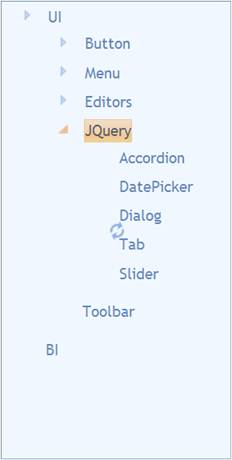

::: {style="DISPLAY: none"}
{#d2h_url_template}{#d2h_package_url style="WIDTH: 0px; DISPLAY: none; HEIGHT: 0px"}
:::

::::::: {.d2h_secondary_topic style="PADDING-BOTTOM: 10pt; MARGIN: 0pt; PADDING-LEFT: 0pt; PADDING-RIGHT: 0pt; PADDING-TOP: 0pt"}
#### LoadOnDemand {#loadondemand style="tab-stops: 0pt"}

LoadOnDemand can load TreeView nodes on demand by using Ajax requests. The TreeView control populates its child nodes on demand by using Ajax. All root items and child nodes are loaded by clicking the Expand icon. You can enable LoadOnDemand in TreeView by using the LoadOnDemand property.

 

Use Case Scenarios

The LoadOnDemand feature is designed to improve the performance of TreeView.

 

Adding LoadOnDemand[ ]{style="COLOR: red"}to an Application

LoadOnDemand in TreeView can be customized by using two ways, namely:

[·      ]{style="FONT-FAMILY: Symbol"}TreeViewBuilder

[·      ]{style="FONT-FAMILY: Symbol"}TreeViewModel

 

Using TreeViewBuilder

To customize LoadOnDemand in TreeView by using TreeViewBuilder:

1.   In the **Controller**, pass the data to the **View** page.

 

+----------------------------------------------------------------------------------------------------------------------------------------------------------------------------------------------------------------------------------+
| **[\[Controller\]]{style="FONT-FAMILY: 'Courier New'"}**                                                                                                                                                                         |
|                                                                                                                                                                                                                                  |
| [public]{style="FONT-FAMILY: 'Courier New'; COLOR: blue"}[ [ActionResult]{style="COLOR: #2b91af"} ]{style="FONT-FAMILY: 'Courier New'"}[Databinding]{style="FONT-FAMILY: 'Courier New'"}[()]{style="FONT-FAMILY: 'Courier New'"} |
|                                                                                                                                                                                                                                  |
| [        {]{style="FONT-FAMILY: 'Courier New'"}                                                                                                                                                                                  |
|                                                                                                                                                                                                                                  |
| [            [Northwind]{style="COLOR: #2b91af"} data = SqlCE;]{style="FONT-FAMILY: 'Courier New'"}                                                                                                                              |
|                                                                                                                                                                                                                                  |
| [            [// Passing the data to the View.]{style="COLOR: green"}]{style="FONT-FAMILY: 'Courier New'"}                                                                                                                       |
|                                                                                                                                                                                                                                  |
| [            [return]{style="COLOR: blue"} View(data.]{style="FONT-FAMILY: 'Courier New'"}[ ]{style="FONT-FAMILY: 'Courier New'"}[TreeDatabinding);]{style="FONT-FAMILY: 'Courier New'"}                                         |
|                                                                                                                                                                                                                                  |
| [  }   ]{style="FONT-FAMILY: 'Courier New'"}                                                                                                                                                                                     |
+----------------------------------------------------------------------------------------------------------------------------------------------------------------------------------------------------------------------------------+

 

2.   In the **Controller**, define the post action.

3.   Get the child nodes from the data source by using the expanded parent node ID.

 

+----------------------------------------------------------------------------------------------------------------------------------------------------------------------------------------------------------------------------------+
| **[\[Controller\]]{style="FONT-FAMILY: 'Courier New'"}**                                                                                                                                                                         |
|                                                                                                                                                                                                                                  |
| [        \[[AcceptVerbs]{style="COLOR: #2b91af"}([HttpVerbs]{style="COLOR: #2b91af"}.Post)\]]{style="FONT-FAMILY: 'Courier New'"}                                                                                                |
|                                                                                                                                                                                                                                  |
| [        [public]{style="COLOR: blue"} [ActionResult]{style="COLOR: #2b91af"} LoadOnDemand([TreeViewModel]{style="COLOR: #2b91af"} treeViewModel, [TreeViewItem]{style="COLOR: #2b91af"} b)]{style="FONT-FAMILY: 'Courier New'"} |
|                                                                                                                                                                                                                                  |
| [        {]{style="FONT-FAMILY: 'Courier New'"}                                                                                                                                                                                  |
|                                                                                                                                                                                                                                  |
| [            [Northwind]{style="COLOR: #2b91af"} context = SqlCE;]{style="FONT-FAMILY: 'Courier New'"}                                                                                                                           |
|                                                                                                                                                                                                                                  |
| [            [var]{style="COLOR: blue"} subNodes = SqlCE.TreeDatabinding.Where(c =\> c.ParentId == [Convert]{style="COLOR: #2b91af"}.ToInt32(b.Value));]{style="FONT-FAMILY: 'Courier New'"}                                     |
|                                                                                                                                                                                                                                  |
| [            [return]{style="COLOR: blue"} [new]{style="COLOR: blue"} [JsonResult]{style="COLOR: #2b91af"} { Data = subNodes };]{style="FONT-FAMILY: 'Courier New'"}                                                             |
|                                                                                                                                                                                                                                  |
| [        }]{style="FONT-FAMILY: 'Courier New'"}                                                                                                                                                                                  |
|                                                                                                                                                                                                                                  |
| []{style="FONT-FAMILY: 'Courier New'"}                                                                                                                                                                                           |
+----------------------------------------------------------------------------------------------------------------------------------------------------------------------------------------------------------------------------------+

**[]{style="FONT-FAMILY: 'Calibri','sans-serif'"}** 

4.   Create a [Strongly Typed View]{.UGHyperlink}.

5.   In the **View**, invoke the **TreeView** helper with the control ID.

6.   Set the **DataSource**, **BindTo, RequestMapper**, and **LoadOnDemand** methods.

 

+-----------------------------------------------------------------------------------------------------------------------------------------------------------------------------------------------------------------------------+
| **[View \[ASPX\]]{style="FONT-FAMILY: 'Courier New'"}**                                                                                                                                                                     |
|                                                                                                                                                                                                                             |
| **[]{style="FONT-FAMILY: 'Courier New'"}**                                                                                                                                                                                  |
|                                                                                                                                                                                                                             |
| [\<%]{style="FONT-FAMILY: 'Courier New'; BACKGROUND: yellow"}[=]{style="FONT-FAMILY: 'Courier New'; COLOR: blue"}[Html.Syncfusion().Treeview([\"myTreeview\"]{style="COLOR: #a31515"})]{style="FONT-FAMILY: 'Courier New'"} |
|                                                                                                                                                                                                                             |
| [.**DataSource(Model)**]{style="FONT-FAMILY: 'Courier New'"}                                                                                                                                                                |
|                                                                                                                                                                                                                             |
| [.**LoadOnDemand(**]{style="FONT-FAMILY: 'Courier New'"}**[true]{style="FONT-FAMILY: 'Courier New'; COLOR: blue"}[)]{style="FONT-FAMILY: 'Courier New'"}**                                                                  |
|                                                                                                                                                                                                                             |
| [            **.RequestMapper([\"LoadOnDemand\"]{style="COLOR: #a31515"})**]{style="FONT-FAMILY: 'Courier New'"}                                                                                                            |
|                                                                                                                                                                                                                             |
| **[.BindTo(bind=\>]{style="FONT-FAMILY: 'Courier New'"}**                                                                                                                                                                   |
|                                                                                                                                                                                                                             |
| **[bind.Text([\"Title\"]{style="COLOR: #a31515"})]{style="FONT-FAMILY: 'Courier New'"}**                                                                                                                                    |
|                                                                                                                                                                                                                             |
| **[    .Id([\"TreeviewId\"]{style="COLOR: #a31515"})]{style="FONT-FAMILY: 'Courier New'"}**                                                                                                                                 |
|                                                                                                                                                                                                                             |
| **[    .ParentId([\"ParentId\"]{style="COLOR: #a31515"})]{style="FONT-FAMILY: 'Courier New'"}**                                                                                                                             |
|                                                                                                                                                                                                                             |
| **[    .SpriteCss([\"SpriteClass\"]{style="COLOR: #a31515"})]{style="FONT-FAMILY: 'Courier New'"}**                                                                                                                         |
|                                                                                                                                                                                                                             |
| **[    .ImageUrl([\"ImagePath\"]{style="COLOR: #a31515"})]{style="FONT-FAMILY: 'Courier New'"}**                                                                                                                            |
|                                                                                                                                                                                                                             |
| **[    .ImageAttributes([\"Imageattributes\"]{style="COLOR: #a31515"})]{style="FONT-FAMILY: 'Courier New'"}**[)[%\>]{style="BACKGROUND: yellow"}]{style="FONT-FAMILY: 'Courier New'"}                                       |
|                                                                                                                                                                                                                             |
| **[]{style="FONT-FAMILY: 'Courier New'"}**                                                                                                                                                                                  |
+-----------------------------------------------------------------------------------------------------------------------------------------------------------------------------------------------------------------------------+

[]{style="FONT-FAMILY: Consolas; BACKGROUND: yellow; FONT-SIZE: 9.5pt"} 

+-----------------------------------------------------------------------------------------------------------------------------------------------------------------------------------------------+
| **View\[cshtml\]**                                                                                                                                                                            |
|                                                                                                                                                                                               |
|                                                                                                                                                                                               |
|                                                                                                                                                                                               |
| [\@{]{style="FONT-FAMILY: 'Courier New'; BACKGROUND: yellow"}[ Html.Syncfusion().Treeview([\"myTreeview\"]{style="COLOR: #a31515"})]{style="FONT-FAMILY: 'Courier New'"}                      |
|                                                                                                                                                                                               |
| [.**DataSource(Model)**]{style="FONT-FAMILY: 'Courier New'"}                                                                                                                                  |
|                                                                                                                                                                                               |
| [.**LoadOnDemand(**]{style="FONT-FAMILY: 'Courier New'"}**[true]{style="FONT-FAMILY: 'Courier New'; COLOR: blue"}[)]{style="FONT-FAMILY: 'Courier New'"}**                                    |
|                                                                                                                                                                                               |
| [            **.RequestMapper([\"LoadOnDemand\"]{style="COLOR: #a31515"})**]{style="FONT-FAMILY: 'Courier New'"}                                                                              |
|                                                                                                                                                                                               |
| **[.BindTo(bind=\>]{style="FONT-FAMILY: 'Courier New'"}**                                                                                                                                     |
|                                                                                                                                                                                               |
| **[bind.Text([\"Title\"]{style="COLOR: #a31515"})]{style="FONT-FAMILY: 'Courier New'"}**                                                                                                      |
|                                                                                                                                                                                               |
| **[    .Id([\"TreeviewId\"]{style="COLOR: #a31515"})]{style="FONT-FAMILY: 'Courier New'"}**                                                                                                   |
|                                                                                                                                                                                               |
| **[    .ParentId([\"ParentId\"]{style="COLOR: #a31515"})]{style="FONT-FAMILY: 'Courier New'"}**                                                                                               |
|                                                                                                                                                                                               |
| **[    .SpriteCss([\"SpriteClass\"]{style="COLOR: #a31515"})]{style="FONT-FAMILY: 'Courier New'"}**                                                                                           |
|                                                                                                                                                                                               |
| **[    .ImageUrl([\"ImagePath\"]{style="COLOR: #a31515"})]{style="FONT-FAMILY: 'Courier New'"}**                                                                                              |
|                                                                                                                                                                                               |
| **[    .ImageAttributes([\"Imageattributes\"]{style="COLOR: #a31515"})]{style="FONT-FAMILY: 'Courier New'"}**[).Render();[}]{style="BACKGROUND: yellow"}]{style="FONT-FAMILY: 'Courier New'"} |
|                                                                                                                                                                                               |
| **[]{style="FONT-FAMILY: 'Courier New'"}**                                                                                                                                                    |
+-----------------------------------------------------------------------------------------------------------------------------------------------------------------------------------------------+

[]{style="FONT-FAMILY: Consolas; BACKGROUND: yellow; FONT-SIZE: 9.5pt"} 

7.   Build and run the application.

 

{border="0"}

Figure 317: TreeView - LoadOnDemand Using TreeViewBuilder

 

Using TreeViewModel

To customize Data Binding in TreeView by using TreeViewModel:

1.   In the **Controller**, create an object for the **TreeViewModel** class.

2.   Set the **DataSource**, **BindTo**, and **LoadOnDemand** properties.

3.   Pass the **TreeViewModel** class to the **ViewData**.

 

::: {align="center"}
+-----------------------------------------------------------------------------------------------------------------------------------------------------------------------------------+
| [      **\[Controller\]**]{style="FONT-FAMILY: 'Courier New'"}                                                                                                                    |
|                                                                                                                                                                                   |
| [        [public]{style="COLOR: blue"} [ActionResult]{style="COLOR: #2b91af"} Index()]{style="FONT-FAMILY: 'Courier New'"}                                                        |
|                                                                                                                                                                                   |
| [        {]{style="FONT-FAMILY: 'Courier New'"}                                                                                                                                   |
|                                                                                                                                                                                   |
| [            [Northwind]{style="COLOR: #2b91af"} context = SqlCE;]{style="FONT-FAMILY: 'Courier New'"}                                                                            |
|                                                                                                                                                                                   |
| [            [TreeViewFields]{style="COLOR: #2b91af"} treeViewFields = [new]{style="COLOR: blue"} [TreeViewFields]{style="COLOR: #2b91af"}()]{style="FONT-FAMILY: 'Courier New'"} |
|                                                                                                                                                                                   |
| [            {]{style="FONT-FAMILY: 'Courier New'"}                                                                                                                               |
|                                                                                                                                                                                   |
| [                Id = [\"Id\"]{style="COLOR: #a31515"},]{style="FONT-FAMILY: 'Courier New'"}                                                                                      |
|                                                                                                                                                                                   |
| [                ParentId = [\"ParentId\"]{style="COLOR: #a31515"},]{style="FONT-FAMILY: 'Courier New'"}                                                                          |
|                                                                                                                                                                                   |
| [                Text = [\"Text\"]{style="COLOR: #a31515"},]{style="FONT-FAMILY: 'Courier New'"}                                                                                  |
|                                                                                                                                                                                   |
| [                ImageUrl = [\"ImageUrl\"]{style="COLOR: #a31515"},]{style="FONT-FAMILY: 'Courier New'"}                                                                          |
|                                                                                                                                                                                   |
| [                SpriteCSS = [\"SpriteCSS\"]{style="COLOR: #a31515"}]{style="FONT-FAMILY: 'Courier New'"}                                                                         |
|                                                                                                                                                                                   |
| [            };]{style="FONT-FAMILY: 'Courier New'"}                                                                                                                              |
|                                                                                                                                                                                   |
| [            [TreeViewModel]{style="COLOR: #2b91af"} treeviewModel = [new]{style="COLOR: blue"} [TreeViewModel]{style="COLOR: #2b91af"}()]{style="FONT-FAMILY: 'Courier New'"}    |
|                                                                                                                                                                                   |
| [            {]{style="FONT-FAMILY: 'Courier New'"}                                                                                                                               |
|                                                                                                                                                                                   |
| [                DataSource = context.TreeDatabinding.ToList(),]{style="FONT-FAMILY: 'Courier New'"}                                                                              |
|                                                                                                                                                                                   |
| [                BindTo = treeViewFields,]{style="FONT-FAMILY: 'Courier New'"}                                                                                                    |
|                                                                                                                                                                                   |
| [                LoadOnDemand = [true]{style="COLOR: blue"},]{style="FONT-FAMILY: 'Courier New'"}                                                                                 |
|                                                                                                                                                                                   |
| [                RequestMapper = [\"LoadOnDemand\"]{style="COLOR: #a31515"}]{style="FONT-FAMILY: 'Courier New'"}                                                                  |
|                                                                                                                                                                                   |
| [            };]{style="FONT-FAMILY: 'Courier New'"}                                                                                                                              |
|                                                                                                                                                                                   |
| [            ViewData\[[\"myTreeViewModel\"]{style="COLOR: #a31515"}\] = treeviewModel;]{style="FONT-FAMILY: 'Courier New'"}                                                      |
|                                                                                                                                                                                   |
| [            [return]{style="COLOR: blue"} View();]{style="FONT-FAMILY: 'Courier New'"}                                                                                           |
|                                                                                                                                                                                   |
| [        }]{style="FONT-FAMILY: 'Courier New'"}                                                                                                                                   |
+-----------------------------------------------------------------------------------------------------------------------------------------------------------------------------------+
:::

 

4.   In the **Controller**, define the post action.

5.   Get the child nodes from the data source by using the expanded parent node ID.

 

::: {align="center"}
+----------------------------------------------------------------------------------------------------------------------------------------------------------------------------------------------------------------------------------+
| **[\[Controller\]]{style="FONT-FAMILY: 'Courier New'"}**                                                                                                                                                                         |
|                                                                                                                                                                                                                                  |
| [        \[[AcceptVerbs]{style="COLOR: #2b91af"}([HttpVerbs]{style="COLOR: #2b91af"}.Post)\]]{style="FONT-FAMILY: 'Courier New'"}                                                                                                |
|                                                                                                                                                                                                                                  |
| [        [public]{style="COLOR: blue"} [ActionResult]{style="COLOR: #2b91af"} LoadOnDemand([TreeViewModel]{style="COLOR: #2b91af"} treeViewModel, [TreeViewItem]{style="COLOR: #2b91af"} b)]{style="FONT-FAMILY: 'Courier New'"} |
|                                                                                                                                                                                                                                  |
| [        {]{style="FONT-FAMILY: 'Courier New'"}                                                                                                                                                                                  |
|                                                                                                                                                                                                                                  |
| [            [Northwind]{style="COLOR: #2b91af"} context = SqlCE;]{style="FONT-FAMILY: 'Courier New'"}                                                                                                                           |
|                                                                                                                                                                                                                                  |
| [            [var]{style="COLOR: blue"} subNodes = SqlCE.TreeDatabinding.Where(c =\> c.ParentId == [Convert]{style="COLOR: #2b91af"}.ToInt32(b.Value));]{style="FONT-FAMILY: 'Courier New'"}                                     |
|                                                                                                                                                                                                                                  |
| [            [return]{style="COLOR: blue"} [new]{style="COLOR: blue"} [JsonResult]{style="COLOR: #2b91af"} { Data = subNodes };]{style="FONT-FAMILY: 'Courier New'"}                                                             |
|                                                                                                                                                                                                                                  |
| [        }]{style="FONT-FAMILY: 'Courier New'"}                                                                                                                                                                                  |
|                                                                                                                                                                                                                                  |
| []{style="FONT-FAMILY: 'Courier New'"}                                                                                                                                                                                           |
+----------------------------------------------------------------------------------------------------------------------------------------------------------------------------------------------------------------------------------+
:::

**[]{style="FONT-FAMILY: 'Calibri','sans-serif'"}** 

6.   Create a **View**.

7.   In the **View**, invoke the **TreeView** helper with the control ID.

8.   From the **ViewData**, assign the **TreeViewModel** class to the **TreeView** helper.

 

::: {align="center"}
+-----------------------------------------------------------------------------------------------------------------------------------------------------------------------------------------------------------------------------------------------------------------------------------------------------------------------------------------------------------+
| **View\[ASPX\]**                                                                                                                                                                                                                                                                                                                                          |
|                                                                                                                                                                                                                                                                                                                                                           |
| **[]{style="FONT-FAMILY: 'Courier New'"}**                                                                                                                                                                                                                                                                                                                |
|                                                                                                                                                                                                                                                                                                                                                           |
| [        [\<%]{style="BACKGROUND: yellow"}[=]{style="COLOR: blue"}Html.Syncfusion().TreeView([\"MyTreeView\"]{style="COLOR: #a31515"}, [\"Databind\"]{style="COLOR: #a31515"}, ([TreeViewModel]{style="COLOR: #2b91af"})ViewData\[[\"myTreeViewModel\"]{style="COLOR: #a31515"}\]) [%\>]{style="BACKGROUND: yellow"}]{style="FONT-FAMILY: 'Courier New'"} |
+-----------------------------------------------------------------------------------------------------------------------------------------------------------------------------------------------------------------------------------------------------------------------------------------------------------------------------------------------------------+
:::

 

 

::: {align="center"}
+---------------------------------------------------------------------------------------------------------------------------------------------------------------------------------------------------------------------------------------------------------------------------------------------------------------------------------------------------------------------------------------------------------------------------+
| **View\[cshtml\]**                                                                                                                                                                                                                                                                                                                                                                                                        |
|                                                                                                                                                                                                                                                                                                                                                                                                                           |
| []{style="FONT-FAMILY: Consolas; FONT-SIZE: 9.5pt"}                                                                                                                                                                                                                                                                                                                                                                       |
|                                                                                                                                                                                                                                                                                                                                                                                                                           |
| [      [@(]{style="BACKGROUND: yellow"}[new]{style="COLOR: blue"} [HtmlString]{style="COLOR: #2b91af"}(Html.Syncfusion().TreeView([\"MyTreeView\"]{style="COLOR: #a31515"}, [\"Databind\"]{style="COLOR: #a31515"}, ([TreeViewModel]{style="COLOR: #2b91af"})ViewData\[[\"myTreeViewModel\"]{style="COLOR: #a31515"}\]).ToString())[)]{style="BACKGROUND: yellow"}     ]{style="FONT-FAMILY: Consolas; FONT-SIZE: 9.5pt"} |
|                                                                                                                                                                                                                                                                                                                                                                                                                           |
| []{style="FONT-FAMILY: 'Courier New'; BACKGROUND: yellow"}                                                                                                                                                                                                                                                                                                                                                                |
+---------------------------------------------------------------------------------------------------------------------------------------------------------------------------------------------------------------------------------------------------------------------------------------------------------------------------------------------------------------------------------------------------------------------------+
:::

[]{style="FONT-FAMILY: Consolas; BACKGROUND: yellow; FONT-SIZE: 9.5pt"} 

9.   Build and run the application.

 

 

{border="0"}

Figure 318: TreeView - LoadOnDemand Using TreeViewModel[]{style="COLOR: #c00000"}

 

Properties

The properties of the LoadOnDemand feature in TreeView are described in the following tabulation:

 

  --------------- ----------------------------------------------------- ------------- ----------- -----------------
  Name            Description                                           Type          Data Type   Reference links
  LoadOnDemand    Enables or disables LoadOnDemand in TreeView.         Server-side   Bool        Not applicable
  RequestMapper   Gets or sets the name for the post action function.   Server-side   String      Not applicable
  --------------- ----------------------------------------------------- ------------- ----------- -----------------

[]{style="COLOR: black"} 

[]{style="COLOR: black"} 

Events

The events of the LoadOnDemand feature in TreeView are described in the following tabulation:

 

 

+---------------------------+--------------------------------------------------------------------------------+--------------------+-------------+-----------------+
| Event                     | Description                                                                    | Arguments          | Type        | Reference links |
+---------------------------+--------------------------------------------------------------------------------+--------------------+-------------+-----------------+
| ClientSideOnBeforeRequest | Sets the function name to raise the event before the Ajax request.             | Instance and args. | Client-side | Not applicable  |
+---------------------------+--------------------------------------------------------------------------------+--------------------+-------------+-----------------+
| ClientSideOnSuccess       | Sets the function name to raise the event when the Ajax request is successful. | Instance and args. | Client-side | Not applicable  |
+---------------------------+--------------------------------------------------------------------------------+--------------------+-------------+-----------------+
| ClientSideOnFailure       | Sets the function name to raise the event when the Ajax request has failed.    | Instance and args. | Client-side | Not applicable  |
|                           |                                                                                |                    |             |                 |
|                           |                                                                                |                    |             |                 |
+---------------------------+--------------------------------------------------------------------------------+--------------------+-------------+-----------------+

[]{style="FONT-FAMILY: 'Calibri','sans-serif'; COLOR: black"}[]{style="COLOR: #c00000"} 

Sample Link

To view a sample:

1.   Open the Tools Sample Browser from the dashboard. (Refer to the Samples and Location chapter.)

2.   Navigate to **Tools.Mvc** -\> **TreeView** -\> **LoadOnDemand Demo**.

[]{style="FONT-FAMILY: 'Calibri','sans-serif'"} 

[]{#related-topics}
:::::::
