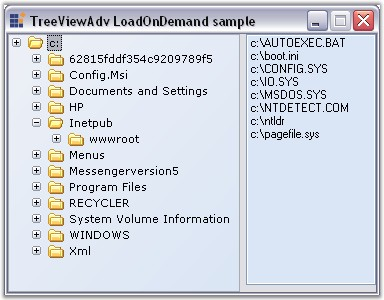

::: {style="DISPLAY: none"}
{#d2h_url_template}{#d2h_package_url style="WIDTH: 0px; DISPLAY: none; HEIGHT: 0px"}
:::

::::: {.d2h_secondary_topic style="PADDING-BOTTOM: 10pt; MARGIN: 0pt; PADDING-LEFT: 0pt; PADDING-RIGHT: 0pt; PADDING-TOP: 0pt"}
#### LoadOnDemand {#loadondemand style="MARGIN-LEFT: 18pt; tab-stops: 18.0pt"}

 

LoadOnDemand feature is to give a delay in loading a node in a Tree, before the user initiates a node to expand.

 

By setting **LoadOnDemand** property to true, the plus(+) and minus(-) of all the nodes will be visible in the beginning. By handling the **BeforeExpand** event of the nodes, subnodes can be added to the respective nodes. Now the tree will display or hide the plus or minus based on whether or not the children are added.

[]{style="COLOR: #15428b"} 

::: {align="center"}
  ------------------------ ------------------------------------------------------------------------------------------------------
  TreeViewAdv Properties   Description
  LoadOnDemand             Specifies if the tree should follow the LoadOnDemand paradigm.
  AddSeparatorAtEnd        Indicates if the TreeNodeAdv.GetPath method adds a separator at the end of the path string returned.
  ------------------------ ------------------------------------------------------------------------------------------------------
:::

 

::: {align="center"}
  --------------------- ---------------------------------------------------------------------
  TreeNodeAdv Methods   Description
  GetPath               Method which is used to derive the path string for a specific node.
  --------------------- ---------------------------------------------------------------------
:::

[]{style="COLOR: #15428b"} 

Retrieving Node Path

 

In the BeforeExpand event the user can retrieve the path string for a specific node using the TreeNodeAdv.GetPath method where the user can also specify the separator.

 

The vital thing in this sample is that the TreeViewAdv.AddSeparatorAtEnd property must be set to True to add a \"\\\\\" character at the end of the path of the node, when calling the Node.GetPath method.

[]{style="COLOR: #15428b"} 

+--------------------------------------------------------------------------------------------------------------------------------------------------------------------------------------------------------------------------------------------+
| **[\[C#\]]{style="FONT-FAMILY: 'Courier New'; COLOR: black"}**                                                                                                                                                                             |
|                                                                                                                                                                                                                                            |
| []{style="COLOR: #15428b"}                                                                                                                                                                                                                 |
|                                                                                                                                                                                                                                            |
| [this]{style="FONT-FAMILY: 'Courier New'; COLOR: blue"}[.treeViewAdv1.LoadOnDemand = [true]{style="COLOR: blue"};]{style="FONT-FAMILY: 'Courier New'"}                                                                                     |
|                                                                                                                                                                                                                                            |
| [this]{style="FONT-FAMILY: 'Courier New'; COLOR: blue"}[.treeViewAdv1.AddSeparatorAtEnd = [true]{style="COLOR: blue"};]{style="FONT-FAMILY: 'Courier New'"}                                                                                |
|                                                                                                                                                                                                                                            |
| []{style="FONT-FAMILY: 'Courier New'"}                                                                                                                                                                                                     |
|                                                                                                                                                                                                                                            |
| [private void]{style="FONT-FAMILY: 'Courier New'; COLOR: blue"}[ treeViewAdv1_BeforeExpand([object]{style="COLOR: blue"} sender, Syncfusion.Windows.Forms.Tools.TreeViewAdvCancelableNodeEventArgs e)]{style="FONT-FAMILY: 'Courier New'"} |
|                                                                                                                                                                                                                                            |
| [{]{style="FONT-FAMILY: 'Courier New'"}                                                                                                                                                                                                    |
|                                                                                                                                                                                                                                            |
| [    if]{style="FONT-FAMILY: 'Courier New'; COLOR: blue"}[(e.Node.ExpandedOnce) [return]{style="COLOR: blue"};]{style="FONT-FAMILY: 'Courier New'"}                                                                                        |
|                                                                                                                                                                                                                                            |
| [      // Retrieves the path for the specific node.]{style="FONT-FAMILY: 'Courier New'; COLOR: green"}                                                                                                                                     |
|                                                                                                                                                                                                                                            |
| [    //Get the Path of the node and AddSeparatorAtEnd Property set to true]{style="FONT-FAMILY: 'Courier New'; COLOR: green"}                                                                                                              |
|                                                                                                                                                                                                                                            |
| [    string]{style="FONT-FAMILY: 'Courier New'; COLOR: blue"}[ path = e.Node.GetPath(\"\\\\\");]{style="FONT-FAMILY: 'Courier New'"}                                                                                                       |
|                                                                                                                                                                                                                                            |
| [//Get an Array of Directories from the current directory path]{style="FONT-FAMILY: 'Courier New'; COLOR: green"}                                                                                                                          |
|                                                                                                                                                                                                                                            |
| [    ArrayList dirs = [new]{style="COLOR: blue"}  ArrayList(Directory.GetDirectories(path));]{style="FONT-FAMILY: 'Courier New'"}                                                                                                          |
|                                                                                                                                                                                                                                            |
| [    //Add the Directories as a node in ]{style="FONT-FAMILY: 'Courier New'; COLOR: green"}[TreeViewAdv]{style="FONT-FAMILY: 'Courier New'; COLOR: green"}[]{style="FONT-FAMILY: 'Courier New'; COLOR: green"}                             |
|                                                                                                                                                                                                                                            |
| [    for]{style="FONT-FAMILY: 'Courier New'; COLOR: blue"}[([int]{style="COLOR: blue"} i=0;i\<dirs.Count;i++)]{style="FONT-FAMILY: 'Courier New'"}                                                                                         |
|                                                                                                                                                                                                                                            |
| [    {]{style="FONT-FAMILY: 'Courier New'"}                                                                                                                                                                                                |
|                                                                                                                                                                                                                                            |
| [        string]{style="FONT-FAMILY: 'Courier New'; COLOR: blue"}[ dir = (string)dirs\[i\];]{style="FONT-FAMILY: 'Courier New'"}                                                                                                           |
|                                                                                                                                                                                                                                            |
| [        int]{style="FONT-FAMILY: 'Courier New'; COLOR: blue"}[ lastIndex = dir.LastIndexOf(\"\\\\\")+1;]{style="FONT-FAMILY: 'Courier New'"}                                                                                              |
|                                                                                                                                                                                                                                            |
| [        TreeNodeAdv node = [new]{style="COLOR: blue"} TreeNodeAdv(dir.Substring(lastIndex));]{style="FONT-FAMILY: 'Courier New'"}                                                                                                         |
|                                                                                                                                                                                                                                            |
| [        e.Node.Nodes.Add(node);]{style="FONT-FAMILY: 'Courier New'"}                                                                                                                                                                      |
|                                                                                                                                                                                                                                            |
| [    }]{style="FONT-FAMILY: 'Courier New'"}                                                                                                                                                                                                |
|                                                                                                                                                                                                                                            |
| [}]{style="FONT-FAMILY: 'Courier New'"}                                                                                                                                                                                                    |
|                                                                                                                                                                                                                                            |
| []{style="FONT-FAMILY: 'Courier New'"}                                                                                                                                                                                                     |
|                                                                                                                                                                                                                                            |
| [private]{style="FONT-FAMILY: 'Courier New'; COLOR: blue"}[ [void]{style="COLOR: blue"} treeViewAdv2_AfterSelect([object]{style="COLOR: blue"} sender, EventArgs e)]{style="FONT-FAMILY: 'Courier New'"}                                   |
|                                                                                                                                                                                                                                            |
| [{]{style="FONT-FAMILY: 'Courier New'"}                                                                                                                                                                                                    |
|                                                                                                                                                                                                                                            |
| [if]{style="FONT-FAMILY: 'Courier New'; COLOR: blue"}[([this]{style="COLOR: blue"}.treeViewAdv2.SelectedNode!=[null]{style="COLOR: blue"})]{style="FONT-FAMILY: 'Courier New'"}                                                            |
|                                                                                                                                                                                                                                            |
| [{]{style="FONT-FAMILY: 'Courier New'"}                                                                                                                                                                                                    |
|                                                                                                                                                                                                                                            |
| [Rectangle bounds = [this]{style="COLOR: blue"}.treeViewAdv2.SelectedNode.Bounds;]{style="FONT-FAMILY: 'Courier New'"}                                                                                                                     |
|                                                                                                                                                                                                                                            |
| [this]{style="FONT-FAMILY: 'Courier New'; COLOR: blue"}[.listBox1.Items.Clear();]{style="FONT-FAMILY: 'Courier New'"}                                                                                                                      |
|                                                                                                                                                                                                                                            |
| [try]{style="FONT-FAMILY: 'Courier New'; COLOR: blue"}                                                                                                                                                                                     |
|                                                                                                                                                                                                                                            |
| [{]{style="FONT-FAMILY: 'Courier New'"}                                                                                                                                                                                                    |
|                                                                                                                                                                                                                                            |
| [this]{style="FONT-FAMILY: 'Courier New'; COLOR: blue"}[.listBox1.Items.AddRange(Directory.GetFiles([this]{style="COLOR: blue"}.treeViewAdv2.SelectedNode.GetPath(\"\\\\\")));]{style="FONT-FAMILY: 'Courier New'"}                        |
|                                                                                                                                                                                                                                            |
| [}]{style="FONT-FAMILY: 'Courier New'"}                                                                                                                                                                                                    |
|                                                                                                                                                                                                                                            |
| [catch]{style="FONT-FAMILY: 'Courier New'; COLOR: blue"}[{}     [// Exception will be thrown in the user renamed the dirs and then selects them. Lose the exception.]{style="COLOR: green"}]{style="FONT-FAMILY: 'Courier New'"}           |
|                                                                                                                                                                                                                                            |
| [}]{style="FONT-FAMILY: 'Courier New'"}                                                                                                                                                                                                    |
|                                                                                                                                                                                                                                            |
| [}]{style="FONT-FAMILY: 'Courier New'"}[]{style="FONT-FAMILY: 'Courier New'"}                                                                                                                                                              |
+--------------------------------------------------------------------------------------------------------------------------------------------------------------------------------------------------------------------------------------------+

**[]{style="COLOR: #15428b"}** 

+-----------------------------------------------------------------------------------------------------------------------------------------------------------------------------------------------------------------------------------------------------------------------------------------------------------------------------------------------------------------------------------------------------------------------------------------+
| **[\[VB.NET\]]{style="FONT-FAMILY: 'Courier New'; COLOR: black"}**                                                                                                                                                                                                                                                                                                                                                                      |
|                                                                                                                                                                                                                                                                                                                                                                                                                                         |
| **[]{style="FONT-FAMILY: 'Courier New'; COLOR: black"}**                                                                                                                                                                                                                                                                                                                                                                                |
|                                                                                                                                                                                                                                                                                                                                                                                                                                         |
| [Me]{style="FONT-FAMILY: 'Courier New'; COLOR: blue"}[.treeViewAdv1.LoadOnDemand = [True]{style="COLOR: blue"}]{style="FONT-FAMILY: 'Courier New'"}                                                                                                                                                                                                                                                                                     |
|                                                                                                                                                                                                                                                                                                                                                                                                                                         |
| [Me]{style="FONT-FAMILY: 'Courier New'; COLOR: blue"}[.treeViewAdv1.AddSeparatorAtEnd = [True]{style="COLOR: blue"}]{style="FONT-FAMILY: 'Courier New'"}                                                                                                                                                                                                                                                                                |
|                                                                                                                                                                                                                                                                                                                                                                                                                                         |
| []{style="FONT-FAMILY: 'Courier New'; COLOR: blue"}                                                                                                                                                                                                                                                                                                                                                                                     |
|                                                                                                                                                                                                                                                                                                                                                                                                                                         |
| [Private]{style="FONT-FAMILY: 'Courier New'; COLOR: blue"}[ [Sub]{style="COLOR: blue"} treeViewAdv2_BeforeExpand([ByVal]{style="COLOR: blue"} sender [As]{style="COLOR: blue"} [Object]{style="COLOR: blue"}, [ByVal]{style="COLOR: blue"} e [As]{style="COLOR: blue"} Syncfusion.Windows.Forms.Tools.TreeViewAdvCancelableNodeEventArgs) [Handles]{style="COLOR: blue"} treeViewAdv2.BeforeExpand]{style="FONT-FAMILY: 'Courier New'"} |
|                                                                                                                                                                                                                                                                                                                                                                                                                                         |
| [\'Checking Whether]{style="FONT-FAMILY: 'Courier New'; COLOR: green"}[ the ]{style="FONT-FAMILY: 'Courier New'; COLOR: green"}[Node has been expanded atleast once]{style="FONT-FAMILY: 'Courier New'; COLOR: green"}                                                                                                                                                                                                                  |
|                                                                                                                                                                                                                                                                                                                                                                                                                                         |
| [If]{style="FONT-FAMILY: 'Courier New'; COLOR: blue"}[ e.Node.ExpandedOnce [Then]{style="COLOR: blue"}]{style="FONT-FAMILY: 'Courier New'"}                                                                                                                                                                                                                                                                                             |
|                                                                                                                                                                                                                                                                                                                                                                                                                                         |
| [Return]{style="FONT-FAMILY: 'Courier New'; COLOR: blue"}                                                                                                                                                                                                                                                                                                                                                                               |
|                                                                                                                                                                                                                                                                                                                                                                                                                                         |
| [End]{style="FONT-FAMILY: 'Courier New'; COLOR: blue"}[ [If]{style="COLOR: blue"}]{style="FONT-FAMILY: 'Courier New'"}                                                                                                                                                                                                                                                                                                                  |
|                                                                                                                                                                                                                                                                                                                                                                                                                                         |
| [\'Retrieves the path for the specific ]{style="FONT-FAMILY: 'Courier New'; COLOR: green"}[node]{style="FONT-FAMILY: 'Courier New'; COLOR: green"}[.]{style="FONT-FAMILY: 'Courier New'; COLOR: green"}                                                                                                                                                                                                                                 |
|                                                                                                                                                                                                                                                                                                                                                                                                                                         |
| [\'Get the Path of the node and AddSeparatorAtEnd Property set to true]{style="FONT-FAMILY: 'Courier New'; COLOR: green"}                                                                                                                                                                                                                                                                                                               |
|                                                                                                                                                                                                                                                                                                                                                                                                                                         |
| [Dim]{style="FONT-FAMILY: 'Courier New'; COLOR: blue"}[ path [As]{style="COLOR: blue"} [String]{style="COLOR: blue"} = e.Node.GetPath([\"\\\"]{style="COLOR: maroon"})]{style="FONT-FAMILY: 'Courier New'"}                                                                                                                                                                                                                             |
|                                                                                                                                                                                                                                                                                                                                                                                                                                         |
| [\'Get an Array of Directories from the current directory path]{style="FONT-FAMILY: 'Courier New'; COLOR: green"}                                                                                                                                                                                                                                                                                                                       |
|                                                                                                                                                                                                                                                                                                                                                                                                                                         |
| [Dim]{style="FONT-FAMILY: 'Courier New'; COLOR: blue"}[ dirs [As]{style="COLOR: blue"} ArrayList = [New]{style="COLOR: blue"} ArrayList(Directory.GetDirectories(path))]{style="FONT-FAMILY: 'Courier New'"}                                                                                                                                                                                                                            |
|                                                                                                                                                                                                                                                                                                                                                                                                                                         |
| [\'Add the Directories as a node in TreeViewAdv]{style="FONT-FAMILY: 'Courier New'; COLOR: green"}                                                                                                                                                                                                                                                                                                                                      |
|                                                                                                                                                                                                                                                                                                                                                                                                                                         |
| [Dim]{style="FONT-FAMILY: 'Courier New'; COLOR: blue"}[ i [As]{style="COLOR: blue"} [Integer]{style="COLOR: blue"} = 0]{style="FONT-FAMILY: 'Courier New'"}                                                                                                                                                                                                                                                                             |
|                                                                                                                                                                                                                                                                                                                                                                                                                                         |
| []{style="FONT-FAMILY: 'Courier New'; COLOR: green"}                                                                                                                                                                                                                                                                                                                                                                                    |
|                                                                                                                                                                                                                                                                                                                                                                                                                                         |
| [Do]{style="FONT-FAMILY: 'Courier New'; COLOR: blue"}[ [While]{style="COLOR: blue"} i \< dirs.Count]{style="FONT-FAMILY: 'Courier New'"}                                                                                                                                                                                                                                                                                                |
|                                                                                                                                                                                                                                                                                                                                                                                                                                         |
| [Dim]{style="FONT-FAMILY: 'Courier New'; COLOR: blue"}[ dir [As]{style="COLOR: blue"} [String]{style="COLOR: blue"} = [CStr]{style="COLOR: blue"}(dirs(i))]{style="FONT-FAMILY: 'Courier New'"}                                                                                                                                                                                                                                         |
|                                                                                                                                                                                                                                                                                                                                                                                                                                         |
| [Dim]{style="FONT-FAMILY: 'Courier New'; COLOR: blue"}[ lastIndex [As]{style="COLOR: blue"} [Integer]{style="COLOR: blue"} = dir.LastIndexOf([\"\\\"]{style="COLOR: maroon"}) + 1]{style="FONT-FAMILY: 'Courier New'"}                                                                                                                                                                                                                  |
|                                                                                                                                                                                                                                                                                                                                                                                                                                         |
| [Dim]{style="FONT-FAMILY: 'Courier New'; COLOR: blue"}[ node [As]{style="COLOR: blue"} TreeNodeAdv = [New]{style="COLOR: blue"} TreeNodeAdv(dir.Substring(lastIndex))]{style="FONT-FAMILY: 'Courier New'"}                                                                                                                                                                                                                              |
|                                                                                                                                                                                                                                                                                                                                                                                                                                         |
| [e.Node.Nodes.Add(node)]{style="FONT-FAMILY: 'Courier New'"}                                                                                                                                                                                                                                                                                                                                                                            |
|                                                                                                                                                                                                                                                                                                                                                                                                                                         |
| [i += 1]{style="FONT-FAMILY: 'Courier New'"}                                                                                                                                                                                                                                                                                                                                                                                            |
|                                                                                                                                                                                                                                                                                                                                                                                                                                         |
| [Loop]{style="FONT-FAMILY: 'Courier New'; COLOR: blue"}                                                                                                                                                                                                                                                                                                                                                                                 |
|                                                                                                                                                                                                                                                                                                                                                                                                                                         |
| [End]{style="FONT-FAMILY: 'Courier New'; COLOR: blue"}[ [Sub]{style="COLOR: blue"}]{style="FONT-FAMILY: 'Courier New'"}                                                                                                                                                                                                                                                                                                                 |
|                                                                                                                                                                                                                                                                                                                                                                                                                                         |
| []{style="FONT-FAMILY: 'Courier New'; COLOR: blue"}                                                                                                                                                                                                                                                                                                                                                                                     |
|                                                                                                                                                                                                                                                                                                                                                                                                                                         |
| [Private]{style="FONT-FAMILY: 'Courier New'; COLOR: blue"}[ [Sub]{style="COLOR: blue"} treeViewAdv2_AfterSelect([ByVal]{style="COLOR: blue"} sender [As]{style="COLOR: blue"} [Object]{style="COLOR: blue"}, [ByVal]{style="COLOR: blue"} e [As]{style="COLOR: blue"} EventArgs) [Handles]{style="COLOR: blue"} treeViewAdv2.AfterSelect]{style="FONT-FAMILY: 'Courier New'"}                                                           |
|                                                                                                                                                                                                                                                                                                                                                                                                                                         |
| [If]{style="FONT-FAMILY: 'Courier New'; COLOR: blue"}[ [Not]{style="COLOR: blue"} [Me]{style="COLOR: blue"}.treeViewAdv2.SelectedNode [Is]{style="COLOR: blue"} [Nothing]{style="COLOR: blue"} [Then]{style="COLOR: blue"}]{style="FONT-FAMILY: 'Courier New'"}                                                                                                                                                                         |
|                                                                                                                                                                                                                                                                                                                                                                                                                                         |
| [Dim]{style="FONT-FAMILY: 'Courier New'; COLOR: blue"}[ bounds [As]{style="COLOR: blue"} Rectangle = [Me]{style="COLOR: blue"}.treeViewAdv2.SelectedNode.Bounds]{style="FONT-FAMILY: 'Courier New'"}                                                                                                                                                                                                                                    |
|                                                                                                                                                                                                                                                                                                                                                                                                                                         |
| [Me]{style="FONT-FAMILY: 'Courier New'; COLOR: blue"}[.listBox1.Items.Clear()]{style="FONT-FAMILY: 'Courier New'"}                                                                                                                                                                                                                                                                                                                      |
|                                                                                                                                                                                                                                                                                                                                                                                                                                         |
| [Try]{style="FONT-FAMILY: 'Courier New'; COLOR: blue"}                                                                                                                                                                                                                                                                                                                                                                                  |
|                                                                                                                                                                                                                                                                                                                                                                                                                                         |
| [Me]{style="FONT-FAMILY: 'Courier New'; COLOR: blue"}[.listBox1.Items.AddRange(Directory.GetFiles([Me]{style="COLOR: blue"}.treeViewAdv2.SelectedNode.GetPath([\"\\\"]{style="COLOR: maroon"})))]{style="FONT-FAMILY: 'Courier New'"}                                                                                                                                                                                                   |
|                                                                                                                                                                                                                                                                                                                                                                                                                                         |
| [Catch]{style="FONT-FAMILY: 'Courier New'; COLOR: blue"}[ [\' Exception]{style="COLOR: green"}]{style="FONT-FAMILY: 'Courier New'"}[ will be ]{style="FONT-FAMILY: 'Courier New'; COLOR: green"}[thrown in the user renamed the dirs and then selects them. Lose the exception.]{style="FONT-FAMILY: 'Courier New'; COLOR: green"}                                                                                                      |
|                                                                                                                                                                                                                                                                                                                                                                                                                                         |
| [End]{style="FONT-FAMILY: 'Courier New'; COLOR: blue"}[ [Try]{style="COLOR: blue"}]{style="FONT-FAMILY: 'Courier New'"}                                                                                                                                                                                                                                                                                                                 |
|                                                                                                                                                                                                                                                                                                                                                                                                                                         |
| [End]{style="FONT-FAMILY: 'Courier New'; COLOR: blue"}[ [If]{style="COLOR: blue"}]{style="FONT-FAMILY: 'Courier New'"}                                                                                                                                                                                                                                                                                                                  |
|                                                                                                                                                                                                                                                                                                                                                                                                                                         |
| [End]{style="FONT-FAMILY: 'Courier New'; COLOR: blue"}[ [Sub]{style="COLOR: blue"}]{style="FONT-FAMILY: 'Courier New'"}[]{style="FONT-FAMILY: 'Courier New'; COLOR: blue"}                                                                                                                                                                                                                                                              |
+-----------------------------------------------------------------------------------------------------------------------------------------------------------------------------------------------------------------------------------------------------------------------------------------------------------------------------------------------------------------------------------------------------------------------------------------+

[]{style="COLOR: #15428b"} 

[{border="0"}]{style="COLOR: #15428b"}[]{style="COLOR: #15428b"}

[]{style="COLOR: #15428b"} 

Figure 1165: TreeViewAdv LoadOnDemand

**[]{style="COLOR: black; FONT-SIZE: 8pt"}** 

A sample demonstrating the LoadOnDemand feature in available in the below sample installation path.

**** 

***..\\My Documents\\Syncfusion\\EssentialStudio\\Version Number\\Windows\\Tools.Windows\\Samples\\2.0\\Tree Package\\TreeViewAdvLoadOnDemand***

**[]{style="COLOR: black; FONT-SIZE: 8pt"}** 

See Also

[]{style="COLOR: #15428b"} 

[[Plus Sign On ExpandMode]{.UGHyperlink}](../../../../../../../../Documents%20and%20Settings/sylviap/Desktop/Tools%20-%20Part%202.docx#_Plus_Sign_On)[]{style="COLOR: black"}

 

 

 

 

[]{#related-topics}
:::::
