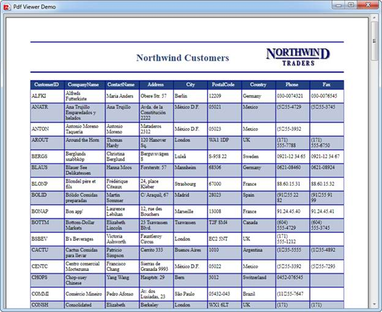

::: {style="DISPLAY: none"}
{#d2h_url_template}{#d2h_package_url style="WIDTH: 0px; DISPLAY: none; HEIGHT: 0px"}
:::

::::: {#nsbanner .d2h_main_nsbanner style="BORDER-BOTTOM: #999999 1px solid; POSITION: relative; PADDING-BOTTOM: 0px; BACKGROUND-COLOR: transparent; PADDING-LEFT: 0px; PADDING-RIGHT: 0px; DISPLAY: none; BORDER-TOP: #999999 1px solid; PADDING-TOP: 0px; LEFT: 0px"}
:::: {#TitleRow .d2h_main_titlerow style="PADDING-BOTTOM: 4px; BACKGROUND-COLOR: transparent; PADDING-LEFT: 22px; WIDTH: 100%; PADDING-RIGHT: 10px; DISPLAY: none; PADDING-TOP: 4px"}
::: {#ienav .d2h_main_ienav style="DISPLAY: none"}
{#D2HPrevious .D2HPreviousEnabled}  {#D2HNext .D2HNextEnabled}
:::
::::
:::::

:::: {#nstext .d2h_main_nstext style="PADDING-BOTTOM: 10px; BACKGROUND-COLOR: transparent; PADDING-LEFT: 22px; PADDING-RIGHT: 10px; HEIGHT: 100%; OVERFLOW: auto; PADDING-TOP: 5px" hasuserbackground="true" valign="bottom"}
::: {#d2h_breadcrumbs .d2h_breadcrumbs}
[Essential Studio User Guide Documentation](ms-xhelp:///?Id=12457748-09e3-4d74-a240-8e049cedf030){.d2h_breadcrumbsNormal}[ \> ]{.d2h_breadcrumbsLinkSeparator}[Reporting Edition](ms-xhelp:///?Id=027aa5b6-6676-4f93-ad23-c20e8c45792e){.d2h_breadcrumbsNormal}[ \> ]{.d2h_breadcrumbsLinkSeparator}[Essential PDF Viewer](ms-xhelp:///?Id=72561ebd-77ed-4f2a-94a7-2b4b635d1dd6){.d2h_breadcrumbsNormal}[ \> ]{.d2h_breadcrumbsLinkSeparator}[PDF Viewer WPF]{.d2h_breadcrumbsContentsOnly}[ \> ]{.d2h_breadcrumbsLinkSeparator}[How To](ms-xhelp:///?Id=6fd60ab1-1f09-45d5-a734-775d98ba6676){.d2h_breadcrumbsNormal}
:::

## Load PDF without ToolStrip in viewer? {#load-pdf-without-toolstrip-in-viewer style="tab-stops: 0pt"}

Inorder to view PDF without the toolstrip, make use of PdfDocumentView control instead of PdfViewerControl. Other features and options are similar to PdfViewerControl.

 

+--------------------------------------------------------------------------------------------------------------------------------------------------------------------------------------------------------+
| **[\[C#\]]{style="FONT-FAMILY: 'Courier New'"}**                                                                                                                                                       |
|                                                                                                                                                                                                        |
| [PdfDocumentView]{style="FONT-FAMILY: 'Courier New'; COLOR: #2b91af"}[ pdfDocumentView1 = [new]{style="COLOR: blue"} [PdfDocumentView]{style="COLOR: #2b91af"}();]{style="FONT-FAMILY: 'Courier New'"} |
|                                                                                                                                                                                                        |
| [pdfDocumentView1.Load([@\"Template.pdf\"]{style="COLOR: #a31515"});]{style="FONT-FAMILY: 'Courier New'"}                                                                                              |
+--------------------------------------------------------------------------------------------------------------------------------------------------------------------------------------------------------+

 

+--------------------------------------------------------------------------------------------------------------------------------------------------------------------------------------+
| **[\[VB.NET\]]{style="FONT-FAMILY: 'Courier New'"}**                                                                                                                                 |
|                                                                                                                                                                                      |
| [Dim]{style="FONT-FAMILY: 'Courier New'; COLOR: blue"}[ pdfDocumentView1 [As]{style="COLOR: blue"} [New]{style="COLOR: blue"} PdfDocumentView()]{style="FONT-FAMILY: 'Courier New'"} |
|                                                                                                                                                                                      |
| [pdfDocumentView1.Load([\"Template.pdf\"]{style="COLOR: darkred"})]{style="FONT-FAMILY: 'Courier New'"}                                                                              |
+--------------------------------------------------------------------------------------------------------------------------------------------------------------------------------------+

 

The following is the image of PDF document viewed in PdfDocumentView.

{border="0"}

Figure 9:  PDF displayed in PdfDocumentView

[]{style="COLOR: #c00000"} 

[]{style="COLOR: #c00000"} 

[]{style="COLOR: #c00000"} 

[]{style="COLOR: #c00000"} 

[]{style="COLOR: #c00000"} 

 

[]{style="COLOR: #c00000"} 

[]{#related-topics}
::::
