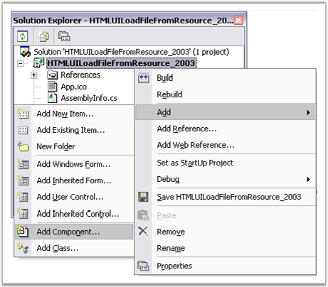
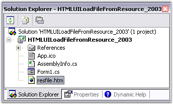
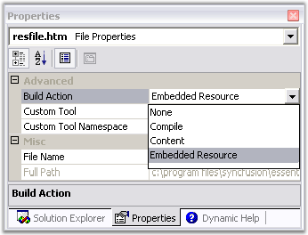
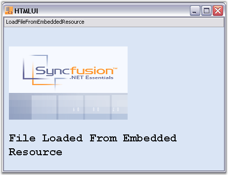

::: {style="DISPLAY: none"}
{#d2h_url_template}{#d2h_package_url style="WIDTH: 0px; DISPLAY: none; HEIGHT: 0px"}
:::

:::: {.d2h_secondary_topic style="PADDING-BOTTOM: 10pt; MARGIN: 0pt; PADDING-LEFT: 0pt; PADDING-RIGHT: 0pt; PADDING-TOP: 0pt"}
#### Load the File from Resource[]{style="FONT-SIZE: 10pt"} {#load-the-file-from-resource style="tab-stops: 0pt"}

 

[]{#p28}The HTML file can be loaded as an Embedded Resource in the HTMLUI control. The procedure to be followed for making an HTML file as an embedded resource is discussed below.

[]{style="FONT-FAMILY: 'Trebuchet MS','sans-serif'; COLOR: #15428b; FONT-SIZE: 9pt"} 

1.   Open the **Solution Explorer** from the **View** menu of the Menu Bar.

 

2.   Right-click on the **C#** file name in the **Solution Explorer**. A menu opens.

 

3.   Click the **Add** tab; a sub-menu is displayed.

[]{style="FONT-FAMILY: 'Trebuchet MS','sans-serif'; COLOR: #15428b; FONT-SIZE: 9pt"} 

                    {border="0"}

***[]{style="FONT-FAMILY: 'Trebuchet MS','sans-serif'; COLOR: #15428b; FONT-SIZE: 9pt"}*** 

Figure 19: Menu options in adding a new HTML File

[]{style="FONT-FAMILY: 'Trebuchet MS','sans-serif'; COLOR: #15428b; FONT-SIZE: 9pt"} 

4.   In the sub-menu, click **AddNewItem** ; a template wizard is displayed.

 

5.   In the wizard, select HTML Page. The default name for the page is \'HTMLPage1.htm\'.

 

6.   You can change the name by using the **Name** tab given at the bottom of the wizard.

[]{style="FONT-FAMILY: 'Trebuchet MS','sans-serif'; COLOR: #15428b; FONT-SIZE: 9pt"} 

                     {border="0"}

***[]{style="FONT-FAMILY: 'Trebuchet MS','sans-serif'; COLOR: #15428b; FONT-SIZE: 9pt"}*** 

Figure 20: Tree view of the Solution Explorer

[]{style="FONT-FAMILY: 'Trebuchet MS','sans-serif'; COLOR: #15428b; FONT-SIZE: 9pt"} 

7.   The HTML file will be shown in the **Solution Explorer** as shown in the figure above.

 

8.   In the properties grid of the resource HTML file, specify its **BuildAction** as the Embedded Resource.

[]{style="FONT-FAMILY: 'Trebuchet MS','sans-serif'; COLOR: #15428b; FONT-SIZE: 9pt"} 

[                            ]{style="FONT-FAMILY: 'Trebuchet MS','sans-serif'; COLOR: #15428b; FONT-SIZE: 9pt"}

                        {border="0"}

***[]{style="FONT-FAMILY: 'Trebuchet MS','sans-serif'; COLOR: #15428b; FONT-SIZE: 9pt"}*** 

***[]{style="FONT-FAMILY: 'Trebuchet MS','sans-serif'; COLOR: #15428b; FONT-SIZE: 9pt"}*** 

Figure 21: Properties Window of the Resource HTML File

***[]{style="FONT-FAMILY: 'Trebuchet MS','sans-serif'; COLOR: #15428b; FONT-SIZE: 9pt"}*** 

The file can be retrieved from the resource by using the following C# code.

[]{style="FONT-FAMILY: 'Trebuchet MS','sans-serif'; COLOR: #15428b; FONT-SIZE: 9pt"} 

+---------------------------------------------------------------------------------------------------------------------------------------------------------------------+
| **[\[C#\]]{style="FONT-FAMILY: 'Courier New'; COLOR: black; FONT-SIZE: 9pt"}**                                                                                      |
|                                                                                                                                                                     |
| **[]{style="FONT-FAMILY: 'Courier New'; COLOR: black; FONT-SIZE: 9pt"}**                                                                                            |
|                                                                                                                                                                     |
| [// Load the specified HTML file which is marked as the project\'s embedded resource.]{style="FONT-FAMILY: 'Courier New'; COLOR: green; FONT-SIZE: 9pt"}            |
|                                                                                                                                                                     |
| [htmlStream = (Stream)[Assembly]{style="COLOR: #2b91af"}.GetExecutingAssembly().GetManifestResourceStream]{style="FONT-FAMILY: 'Courier New'; FONT-SIZE: 9pt"}      |
|                                                                                                                                                                     |
| [([\"LoadingFileFromResource.resfile.htm\"]{style="COLOR: #a31515"});]{style="FONT-FAMILY: 'Courier New'; FONT-SIZE: 9pt"}                                          |
|                                                                                                                                                                     |
| []{style="FONT-FAMILY: 'Courier New'; FONT-SIZE: 9pt"}                                                                                                              |
|                                                                                                                                                                     |
| [this]{style="FONT-FAMILY: 'Courier New'; COLOR: blue; FONT-SIZE: 9pt"}[.htmluiControl1.LoadHTML(htmlStream); ]{style="FONT-FAMILY: 'Courier New'; FONT-SIZE: 9pt"} |
+---------------------------------------------------------------------------------------------------------------------------------------------------------------------+

[]{style="FONT-FAMILY: 'Trebuchet MS','sans-serif'; COLOR: #15428b; FONT-SIZE: 9pt"} 

+-------------------------------------------------------------------------------------------------------------------------------------------------------------------------------------------------------------------------------+
| **[\[VB.NET\]]{style="FONT-FAMILY: 'Courier New'; COLOR: black; FONT-SIZE: 9pt"}**                                                                                                                                            |
|                                                                                                                                                                                                                               |
| **[]{style="FONT-FAMILY: 'Courier New'; COLOR: black; FONT-SIZE: 9pt"}**                                                                                                                                                      |
|                                                                                                                                                                                                                               |
| [\'  Load the specified HTML file which is marked as the project\'s embedded resource.]{style="FONT-FAMILY: 'Courier New'; COLOR: green; FONT-SIZE: 9pt"}                                                                     |
|                                                                                                                                                                                                                               |
| [Private]{style="FONT-FAMILY: 'Courier New'; COLOR: blue; FONT-SIZE: 9pt"}[ htmlStream = [Ctype]{style="COLOR: blue"}(System.Reflection.Assembly.GetExecutingAssembly().]{style="FONT-FAMILY: 'Courier New'; FONT-SIZE: 9pt"} |
|                                                                                                                                                                                                                               |
| [GetManifestResourceStream ([\"LoadingFileFromResource.resfile.htm\"]{style="COLOR: #a31515"}), Stream)]{style="FONT-FAMILY: 'Courier New'; FONT-SIZE: 9pt"}                                                                  |
|                                                                                                                                                                                                                               |
| []{style="FONT-FAMILY: 'Courier New'; FONT-SIZE: 9pt"}                                                                                                                                                                        |
|                                                                                                                                                                                                                               |
| [Me]{style="FONT-FAMILY: 'Courier New'; COLOR: blue; FONT-SIZE: 9pt"}[.HtmluiControl1.LoadHTML(htmlStream)]{style="FONT-FAMILY: 'Courier New'; FONT-SIZE: 9pt"}                                                               |
+-------------------------------------------------------------------------------------------------------------------------------------------------------------------------------------------------------------------------------+

[]{style="FONT-FAMILY: 'Trebuchet MS','sans-serif'; COLOR: #15428b; FONT-SIZE: 9pt"} 

It is necessary to invoke the **System.IO** and **System.Reflection** namespaces to use the classes and their methods used in the code above.

The **System.Reflection.Assembly.GetExecutingAssembly** method gets the assembly from which the code is currently running from and the **GetManifestResourceStream** method of the same class loads the specified manifest resource from the assembly.

The **System.IO.Stream** is used to provide a generic view of sequence of bytes when the IO in the assembly is referred.

::: {style="BORDER-BOTTOM: windowtext 1pt solid; BORDER-LEFT: medium none; PADDING-BOTTOM: 1pt; MARGIN-TOP: 9pt; PADDING-LEFT: 0pt; PADDING-RIGHT: 0pt; MARGIN-BOTTOM: 9pt; BORDER-TOP: windowtext 1pt solid; BORDER-RIGHT: medium none; PADDING-TOP: 1pt"}
Note: The string entered inside the GetManifestResourceStream method is in reference to the Default namespace found in the Properties window of the C# file in the Solution Explorer. This may vary for the users.
:::

The following image shows file loaded from an embedded resource.

[]{style="FONT-FAMILY: 'Trebuchet MS','sans-serif'; COLOR: #15428b; FONT-SIZE: 9pt"} 

{border="0"}

***[]{style="FONT-FAMILY: 'Trebuchet MS','sans-serif'; COLOR: #15428b; FONT-SIZE: 9pt"}*** 

Figure 22: Loading HTML File from an Embedded Resource into the HTMLUI Control

 

More:

[ ]{#related-topics}

[{border="0" align="absMiddle"}Load Resource File Sample](ms-xhelp:///?Id=1446f260-b771-4a94-91e9-d43b159c9f9f){style="TEXT-DECORATION: none"}
::::
