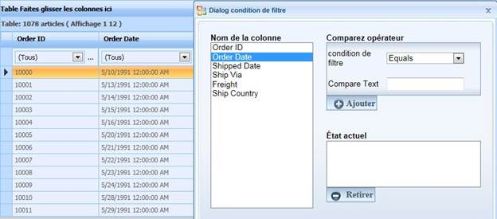

::: {style="DISPLAY: none"}
{#d2h_url_template}{#d2h_package_url style="WIDTH: 0px; DISPLAY: none; HEIGHT: 0px"}
:::

::::: {#nsbanner .d2h_main_nsbanner style="BORDER-BOTTOM: #999999 1px solid; POSITION: relative; PADDING-BOTTOM: 0px; BACKGROUND-COLOR: transparent; PADDING-LEFT: 0px; PADDING-RIGHT: 0px; DISPLAY: none; BORDER-TOP: #999999 1px solid; PADDING-TOP: 0px; LEFT: 0px"}
:::: {#TitleRow .d2h_main_titlerow style="PADDING-BOTTOM: 4px; BACKGROUND-COLOR: transparent; PADDING-LEFT: 22px; WIDTH: 100%; PADDING-RIGHT: 10px; DISPLAY: none; PADDING-TOP: 4px"}
::: {#ienav .d2h_main_ienav style="DISPLAY: none"}
{#D2HPrevious .D2HPreviousEnabled}  {#D2HNext .D2HNextEnabled}
:::
::::
:::::

:::: {#nstext .d2h_main_nstext style="PADDING-BOTTOM: 10px; BACKGROUND-COLOR: transparent; PADDING-LEFT: 22px; PADDING-RIGHT: 10px; HEIGHT: 100%; OVERFLOW: auto; PADDING-TOP: 5px" hasuserbackground="true" valign="bottom"}
::: {#d2h_breadcrumbs .d2h_breadcrumbs}
[Essential Studio User Guide Documentation](ms-xhelp:///?Id=12457748-09e3-4d74-a240-8e049cedf030){.d2h_breadcrumbsNormal}[ \> ]{.d2h_breadcrumbsLinkSeparator}[User Interface Edition](ms-xhelp:///?Id=c29296b7-531c-413b-a0ec-488ca1f7f669){.d2h_breadcrumbsNormal}[ \> ]{.d2h_breadcrumbsLinkSeparator}[Essential ASP.NET](ms-xhelp:///?Id=25c35330-c127-4dad-9a92-ed79dc7261a6){.d2h_breadcrumbsNormal}[ \> ]{.d2h_breadcrumbsLinkSeparator}[Essential Grid]{.d2h_breadcrumbsContentsOnly}[ \> ]{.d2h_breadcrumbsLinkSeparator}[Concepts and Features](ms-xhelp:///?Id=9e489974-524d-457c-9881-e458b1321685){.d2h_breadcrumbsNormal}
:::

## Localization {#localization style="tab-stops: 0pt"}

**Introduction**

Localization of GridGroupingControl allows you to localize the all the static strings.

Since this only uses the resource file (.resx), localization is made easier.

**Use Case Scenario**

The User can localize any part of the GridGroupingControl that has static strings in it.

{border="0"}

Figure 140: Localization of Grid in French

Feature Summary

The GridGroupingControl allowed the localization of the Page, PagingCaptionText, FilterBarAll, FilterBareEmpty, or FilterBarCustom. However, this feature allows static strings in the GridGroupingControl to be localized.

Also, since the feature uses a resource file (.resx) without a satellite assembly, you can localize the control with more ease than before.

More:

[ ]{#related-topics}

[{border="0" align="absMiddle"}Adding Localization to an application](ms-xhelp:///?Id=ef267c62-c6e5-4046-bb9c-2e7ac573aa55){style="TEXT-DECORATION: none"}

[{border="0" align="absMiddle"}Where do I find Installed samples?](ms-xhelp:///?Id=9fef5c82-f7d8-49dc-bb76-302337e709d3){style="TEXT-DECORATION: none"}

[{border="0" align="absMiddle"}Properties](ms-xhelp:///?Id=702aba3f-783d-4f9e-b654-b0ecccd81b0d){style="TEXT-DECORATION: none"}

[{border="0" align="absMiddle"}Events](ms-xhelp:///?Id=3719f5b6-3094-4831-8be6-787e0b4f128e){style="TEXT-DECORATION: none"}
::::
