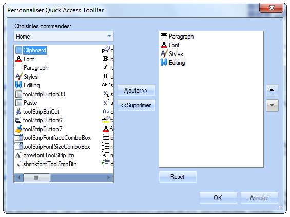

::: {style="DISPLAY: none"}
{#d2h_url_template}{#d2h_package_url style="WIDTH: 0px; DISPLAY: none; HEIGHT: 0px"}
:::

::::: {#nsbanner .d2h_main_nsbanner style="BORDER-BOTTOM: #999999 1px solid; POSITION: relative; PADDING-BOTTOM: 0px; BACKGROUND-COLOR: transparent; PADDING-LEFT: 0px; PADDING-RIGHT: 0px; DISPLAY: none; BORDER-TOP: #999999 1px solid; PADDING-TOP: 0px; LEFT: 0px"}
:::: {#TitleRow .d2h_main_titlerow style="PADDING-BOTTOM: 4px; BACKGROUND-COLOR: transparent; PADDING-LEFT: 22px; WIDTH: 100%; PADDING-RIGHT: 10px; DISPLAY: none; PADDING-TOP: 4px"}
::: {#ienav .d2h_main_ienav style="DISPLAY: none"}
{#D2HPrevious .D2HPreviousEnabled}  {#D2HNext .D2HNextEnabled}
:::
::::
:::::

:::: {#nstext .d2h_main_nstext style="PADDING-BOTTOM: 10px; BACKGROUND-COLOR: transparent; PADDING-LEFT: 22px; PADDING-RIGHT: 10px; HEIGHT: 100%; OVERFLOW: auto; PADDING-TOP: 5px" hasuserbackground="true" valign="bottom"}
::: {#d2h_breadcrumbs .d2h_breadcrumbs}
[Essential Studio User Guide Documentation](ms-xhelp:///?Id=12457748-09e3-4d74-a240-8e049cedf030){.d2h_breadcrumbsNormal}[ \> ]{.d2h_breadcrumbsLinkSeparator}[User Interface Edition](ms-xhelp:///?Id=c29296b7-531c-413b-a0ec-488ca1f7f669){.d2h_breadcrumbsNormal}[ \> ]{.d2h_breadcrumbsLinkSeparator}[Essential Windows](ms-xhelp:///?Id=e60759d8-47a4-4570-9d7a-16a68d63f2ea){.d2h_breadcrumbsNormal}[ \> ]{.d2h_breadcrumbsLinkSeparator}[Essential Tools]{.d2h_breadcrumbsContentsOnly}[ \> ]{.d2h_breadcrumbsLinkSeparator}[Tools Controls](ms-xhelp:///?Id=13c3c4f4-9d16-4b69-93f2-7e98eec67452){.d2h_breadcrumbsNormal}
:::

## Localization {#localization style="tab-stops: 0pt"}

Localization is the process of customizing the application to culture-specific resources such as language translation and information formatting for date, time and currency.

 

Syncfusion components support localizing and have our own neutral resources. These resources can be localized as per the customer requirement.

 

Localization is made easy with the latest version of Essential Studio (Volume - 2 2011). Earlier versions of the products have a different localization procedure (for the documentation refer [**[v8.4.0.10]{style="COLOR: blue"}**](http://help.syncfusion.com/ug_84/User%20Interface/Windows%20Forms/Tools/default.htm?turl=Documents/localizationoftools.htm)**)**. Syncfusion components will continue to support both the procedures.

 

Use Case Scenarios

Localization helps in transforming the application to be culture-specific. This enables you to customize the application according to the requirements of global customers.

 

Adding Localization to an Application

 

Follow the below procedure to localize Quick Access ToolBar Customization dialog of RibbonControlAdv:

 

1.   Include the required namespaces at the beginning of the source file.

 

+--------------------------------------------------------------------------------------------------------------------------------+
| **[\[C#\]]{style="FONT-FAMILY: 'Courier New'"}**                                                                               |
|                                                                                                                                |
| [using]{style="FONT-FAMILY: 'Courier New'; COLOR: blue"}[ Syncfusion.Windows.Forms;]{style="FONT-FAMILY: 'Courier New'"}       |
|                                                                                                                                |
| [using]{style="FONT-FAMILY: 'Courier New'; COLOR: blue"}[ Syncfusion.Windows.Forms.Tools;]{style="FONT-FAMILY: 'Courier New'"} |
+--------------------------------------------------------------------------------------------------------------------------------+

 

+---------------------------------------------------------------------------------------------------------------------------------------------------------------------------+
| **[\[VB\]]{style="FONT-FAMILY: 'Courier New'"}**                                                                                                                          |
|                                                                                                                                                                           |
| [Imports]{style="FONT-FAMILY: 'Courier New'; COLOR: blue"}[ Syncfusion.Windows.Forms]{style="FONT-FAMILY: 'Courier New'"}                                                 |
|                                                                                                                                                                           |
| [Imports]{style="FONT-FAMILY: 'Courier New'; COLOR: blue"}[ Syncfusion.Windows.Forms.Tools]{style="FONT-FAMILY: 'Courier New'"}**[]{style="FONT-FAMILY: 'Courier New'"}** |
+---------------------------------------------------------------------------------------------------------------------------------------------------------------------------+

 

2.   Create a class that implements **ILocalizationProvider** interface defined in the Syncfusion.Windows.Forms namespace in the Syncfusion.Shared.Base.dll.[]{style="FONT-FAMILY: 'Calibri','sans-serif'; FONT-SIZE: 11pt"}

 

+-----------------------------------------------------------------------------------------------------------------------------------------------------------------------------------------------------------------+
| **[\[C#\]]{style="FONT-FAMILY: 'Courier New'"}**                                                                                                                                                                |
|                                                                                                                                                                                                                 |
| [    [class]{style="COLOR: blue"} [Localizer]{style="COLOR: #2b91af"} : [ILocalizationProvider]{style="COLOR: #2b91af"}]{style="FONT-FAMILY: 'Courier New'"}                                                    |
|                                                                                                                                                                                                                 |
| [    {]{style="FONT-FAMILY: 'Courier New'"}                                                                                                                                                                     |
|                                                                                                                                                                                                                 |
| [        #region]{style="FONT-FAMILY: 'Courier New'; COLOR: blue"}[ ILocalizationProvider Members]{style="FONT-FAMILY: 'Courier New'"}                                                                          |
|                                                                                                                                                                                                                 |
| []{style="FONT-FAMILY: 'Courier New'"}                                                                                                                                                                          |
|                                                                                                                                                                                                                 |
| [        [public]{style="COLOR: blue"} [string]{style="COLOR: blue"} GetLocalizedString([CultureInfo]{style="COLOR: #2b91af"} culture, [string]{style="COLOR: blue"} name)]{style="FONT-FAMILY: 'Courier New'"} |
|                                                                                                                                                                                                                 |
| [        {]{style="FONT-FAMILY: 'Courier New'"}                                                                                                                                                                 |
|                                                                                                                                                                                                                 |
| [            [return]{style="COLOR: blue"} [string]{style="COLOR: blue"}.Empty;]{style="FONT-FAMILY: 'Courier New'"}                                                                                            |
|                                                                                                                                                                                                                 |
| [        }]{style="FONT-FAMILY: 'Courier New'"}                                                                                                                                                                 |
|                                                                                                                                                                                                                 |
| []{style="FONT-FAMILY: 'Courier New'"}                                                                                                                                                                          |
|                                                                                                                                                                                                                 |
| [        #endregion]{style="FONT-FAMILY: 'Courier New'; COLOR: blue"}                                                                                                                                           |
|                                                                                                                                                                                                                 |
| [    }]{style="FONT-FAMILY: 'Courier New'"}                                                                                                                                                                     |
+-----------------------------------------------------------------------------------------------------------------------------------------------------------------------------------------------------------------+

 

+-------------------------------------------------------------------------------------------------------------------------------------------------------------------------------------------------------------------------------------------------------------------------------------------------------------------------------------------------------------------+
| **[\[VB\]]{style="FONT-FAMILY: 'Courier New'"}**                                                                                                                                                                                                                                                                                                                  |
|                                                                                                                                                                                                                                                                                                                                                                   |
| [      [Friend]{style="COLOR: blue"} [Class]{style="COLOR: blue"} Localizer]{style="FONT-FAMILY: 'Courier New'"}                                                                                                                                                                                                                                                  |
|                                                                                                                                                                                                                                                                                                                                                                   |
| [            [Implements]{style="COLOR: blue"} ILocalizationProvider]{style="FONT-FAMILY: 'Courier New'"}                                                                                                                                                                                                                                                         |
|                                                                                                                                                                                                                                                                                                                                                                   |
| [            [#Region]{style="COLOR: blue"} [\"ILocalizationProvider Members\"]{style="COLOR: darkred"}]{style="FONT-FAMILY: 'Courier New'"}                                                                                                                                                                                                                      |
|                                                                                                                                                                                                                                                                                                                                                                   |
| []{style="FONT-FAMILY: 'Courier New'"}                                                                                                                                                                                                                                                                                                                            |
|                                                                                                                                                                                                                                                                                                                                                                   |
| [            [Public]{style="COLOR: blue"} [Function]{style="COLOR: blue"} GetLocalizedString([ByVal]{style="COLOR: blue"} culture [As]{style="COLOR: blue"} CultureInfo, [ByVal]{style="COLOR: blue"} name [As]{style="COLOR: blue"} [String]{style="COLOR: blue"}) [As]{style="COLOR: blue"} [String]{style="COLOR: blue"}]{style="FONT-FAMILY: 'Courier New'"} |
|                                                                                                                                                                                                                                                                                                                                                                   |
| [                  [Return]{style="COLOR: blue"} [String]{style="COLOR: blue"}.Empty]{style="FONT-FAMILY: 'Courier New'"}                                                                                                                                                                                                                                         |
|                                                                                                                                                                                                                                                                                                                                                                   |
| [            [End]{style="COLOR: blue"} [Function]{style="COLOR: blue"}]{style="FONT-FAMILY: 'Courier New'"}                                                                                                                                                                                                                                                      |
|                                                                                                                                                                                                                                                                                                                                                                   |
| []{style="FONT-FAMILY: 'Courier New'"}                                                                                                                                                                                                                                                                                                                            |
|                                                                                                                                                                                                                                                                                                                                                                   |
| [            [#End Region]{style="COLOR: blue"}]{style="FONT-FAMILY: 'Courier New'"}                                                                                                                                                                                                                                                                              |
|                                                                                                                                                                                                                                                                                                                                                                   |
| [      [End]{style="COLOR: blue"} [Class]{style="COLOR: blue"}]{style="FONT-FAMILY: 'Courier New'"}                                                                                                                                                                                                                                                               |
+-------------------------------------------------------------------------------------------------------------------------------------------------------------------------------------------------------------------------------------------------------------------------------------------------------------------------------------------------------------------+

 

 

3.   Return the localized versions of the strings corresponding to  the string identifiers.

 

 

+--------------------------------------------------------------------------------------------------------------------------------------------------------------+
| **[\[C#\]]{style="FONT-FAMILY: 'Courier New'"}**                                                                                                             |
|                                                                                                                                                              |
| [      switch]{style="FONT-FAMILY: 'Courier New'; COLOR: blue"}[ (name)]{style="FONT-FAMILY: 'Courier New'"}                                                 |
|                                                                                                                                                              |
| [      {]{style="FONT-FAMILY: 'Courier New'"}                                                                                                                |
|                                                                                                                                                              |
| [           [case]{style="COLOR: blue"} [ToolsResourceIdentifiers]{style="COLOR: #2b91af"}.QuickAccessCustomizeCaption:]{style="FONT-FAMILY: 'Courier New'"} |
|                                                                                                                                                              |
| [                [return]{style="COLOR: blue"} [\"Personnaliser Quick Access ToolBar\"]{style="COLOR: #a31515"};]{style="FONT-FAMILY: 'Courier New'"}        |
|                                                                                                                                                              |
| [           [default]{style="COLOR: blue"}:]{style="FONT-FAMILY: 'Courier New'"}                                                                             |
|                                                                                                                                                              |
| [                [return]{style="COLOR: blue"} [string]{style="COLOR: blue"}.Empty;]{style="FONT-FAMILY: 'Courier New'"}                                     |
|                                                                                                                                                              |
| [      }]{style="FONT-FAMILY: 'Courier New'"}                                                                                                                |
+--------------------------------------------------------------------------------------------------------------------------------------------------------------+

 

+--------------------------------------------------------------------------------------------------------------------------------------------------------------+
| **[\[VB\]]{style="FONT-FAMILY: 'Courier New'"}**                                                                                                             |
|                                                                                                                                                              |
| [        [Select]{style="COLOR: blue"} [Case]{style="COLOR: blue"} name]{style="FONT-FAMILY: 'Courier New'"}                                                 |
|                                                                                                                                                              |
| [               [Case]{style="COLOR: blue"} ToolsResourceIdentifiers.QuickAccessCustomizeCaption]{style="FONT-FAMILY: 'Courier New'"}                        |
|                                                                                                                                                              |
| [                        [Return]{style="COLOR: blue"} [\"Personnaliser Quick Access ToolBar\"]{style="COLOR: darkred"}]{style="FONT-FAMILY: 'Courier New'"} |
|                                                                                                                                                              |
| [               [Case]{style="COLOR: blue"} [Else]{style="COLOR: blue"}]{style="FONT-FAMILY: 'Courier New'"}                                                 |
|                                                                                                                                                              |
| [                        [Return]{style="COLOR: blue"} [String]{style="COLOR: blue"}.Empty]{style="FONT-FAMILY: 'Courier New'"}                              |
|                                                                                                                                                              |
| [        [End]{style="COLOR: blue"} [Select]{style="COLOR: blue"}]{style="FONT-FAMILY: 'Courier New'"}                                                       |
+--------------------------------------------------------------------------------------------------------------------------------------------------------------+

[]{style="LINE-HEIGHT: 115%; FONT-FAMILY: 'Calibri','sans-serif'; FONT-SIZE: 11pt"} 

4.   String identfiers are defined in the **ResourceIdentifiers** and the **ToolsResourceIdentifiers** classes in Syncfusion.Shared.Base and Syncfusion.Tools.Windows assemblies respectively.

 

+-------------------------------------------------------------------------------------------------------------------------+
| **[\[C#/VB\]]{style="FONT-FAMILY: 'Courier New'"}**                                                                     |
|                                                                                                                         |
| [Syncfusion.Windows.Forms.Tools.[ToolsResourceIdentifiers]{style="COLOR: #2b91af"}]{style="FONT-FAMILY: 'Courier New'"} |
|                                                                                                                         |
| [Syncfusion.Windows.Forms.[ResourceIdentifiers]{style="COLOR: #2b91af"}]{style="FONT-FAMILY: 'Courier New'"}            |
+-------------------------------------------------------------------------------------------------------------------------+

 

 

5.   Leave empty string for the rest of the identifiers that arenot involed in the localization. These identifiers will be loaded with default value.

6.   Assign this instance to the Provider property of the **LocalizationProvider** class, before the InitializeComponent call in the constructor of the Application.

[]{style="FONT-FAMILY: 'Courier New'"} 

 

+-----------------------------------------------------------------------------------------------------------------------------------------------------------------------------------------------+
| **[\[C#\]]{style="FONT-FAMILY: 'Courier New'"}**                                                                                                                                              |
|                                                                                                                                                                                               |
| [LocalizationProvider]{style="FONT-FAMILY: 'Courier New'; COLOR: #2b91af"}[.Provider = [new]{style="COLOR: blue"} [Localizer]{style="COLOR: #2b91af"}();]{style="FONT-FAMILY: 'Courier New'"} |
+-----------------------------------------------------------------------------------------------------------------------------------------------------------------------------------------------+

 

+----------------------------------------------------------------------------------------------------------------------------------------------------------------------------------------------+
| **[\[VB\]]{style="FONT-FAMILY: 'Courier New'"}**                                                                                                                                             |
|                                                                                                                                                                                              |
| [LocalizationProvider]{style="FONT-FAMILY: 'Courier New'; COLOR: #2b91af"}[.Provider = [New]{style="COLOR: blue"} [Localizer]{style="COLOR: #2b91af"}()]{style="FONT-FAMILY: 'Courier New'"} |
+----------------------------------------------------------------------------------------------------------------------------------------------------------------------------------------------+

 

7.   You will get the following code snippet as the result.

+-------------------------------------------------------------------------------------------------------------------------------------------------------------------------------------------------------------------------------------+
| **[\[C#\]]{style="FONT-FAMILY: 'Courier New'"}**                                                                                                                                                                                    |
|                                                                                                                                                                                                                                     |
| [  ]{style="FONT-FAMILY: 'Courier New'"}[class]{style="FONT-FAMILY: 'Courier New'; COLOR: blue"}[ [Localizer]{style="COLOR: #2b91af"} : [ILocalizationProvider]{style="COLOR: #2b91af"}]{style="FONT-FAMILY: 'Courier New'"}        |
|                                                                                                                                                                                                                                     |
| [    {]{style="FONT-FAMILY: 'Courier New'"}                                                                                                                                                                                         |
|                                                                                                                                                                                                                                     |
| [        #region]{style="FONT-FAMILY: 'Courier New'; COLOR: blue"}[ ILocalizationProvider Members]{style="FONT-FAMILY: 'Courier New'"}                                                                                              |
|                                                                                                                                                                                                                                     |
| [        [public]{style="COLOR: blue"} [string]{style="COLOR: blue"} GetLocalizedString([CultureInfo]{style="COLOR: #2b91af"} culture, [string]{style="COLOR: blue"} name)]{style="FONT-FAMILY: 'Courier New'"}                     |
|                                                                                                                                                                                                                                     |
| [        {]{style="FONT-FAMILY: 'Courier New'"}                                                                                                                                                                                     |
|                                                                                                                                                                                                                                     |
| [            [switch]{style="COLOR: blue"} (name)]{style="FONT-FAMILY: 'Courier New'"}                                                                                                                                              |
|                                                                                                                                                                                                                                     |
| [            {]{style="FONT-FAMILY: 'Courier New'"}                                                                                                                                                                                 |
|                                                                                                                                                                                                                                     |
| [                [case]{style="COLOR: blue"} [ToolsResourceIdentifiers]{style="COLOR: #2b91af"}.QuickAccessCustomizeCaption:]{style="FONT-FAMILY: 'Courier New'"}                                                                   |
|                                                                                                                                                                                                                                     |
| [                    [return]{style="COLOR: blue"} [\"Personnaliser Quick Access ToolBar\"]{style="COLOR: #a31515"};]{style="FONT-FAMILY: 'Courier New'"}                                                                           |
|                                                                                                                                                                                                                                     |
| [                ]{style="FONT-FAMILY: 'Courier New'"}[case]{style="FONT-FAMILY: 'Courier New'; COLOR: blue"}[ [ToolsResourceIdentifiers]{style="COLOR: #2b91af"}.QuickAccessDialogCommands:]{style="FONT-FAMILY: 'Courier New'"}   |
|                                                                                                                                                                                                                                     |
| [                    [return]{style="COLOR: blue"} [\"Choisir les commandes:\"]{style="COLOR: #a31515"};]{style="FONT-FAMILY: 'Courier New'"}                                                                                       |
|                                                                                                                                                                                                                                     |
| [                ]{style="FONT-FAMILY: 'Courier New'"}[case]{style="FONT-FAMILY: 'Courier New'; COLOR: blue"}[ [ToolsResourceIdentifiers]{style="COLOR: #2b91af"}.QuickAccessDialogButtonAdd:]{style="FONT-FAMILY: 'Courier New'"}  |
|                                                                                                                                                                                                                                     |
| [                    [return]{style="COLOR: blue"} [\"Ajouter\>\>\"]{style="COLOR: #a31515"};]{style="FONT-FAMILY: 'Courier New'"}                                                                                                  |
|                                                                                                                                                                                                                                     |
| [                [case]{style="COLOR: blue"} [ToolsResourceIdentifiers]{style="COLOR: #2b91af"}.QuickAccessDialogButtonRemove:]{style="FONT-FAMILY: 'Courier New'"}                                                                 |
|                                                                                                                                                                                                                                     |
| [                    [return]{style="COLOR: blue"} [\"\<\<Supprimer\"]{style="COLOR: #a31515"};]{style="FONT-FAMILY: 'Courier New'"}                                                                                                |
|                                                                                                                                                                                                                                     |
| [                [case]{style="COLOR: blue"} [ToolsResourceIdentifiers]{style="COLOR: #2b91af"}.QuickAccessDialogButtonReset:]{style="FONT-FAMILY: 'Courier New'"}                                                                  |
|                                                                                                                                                                                                                                     |
| [                    [return]{style="COLOR: blue"} [\"Reset\"]{style="COLOR: #a31515"};]{style="FONT-FAMILY: 'Courier New'"}                                                                                                        |
|                                                                                                                                                                                                                                     |
| [                [case]{style="COLOR: blue"} [ToolsResourceIdentifiers]{style="COLOR: #2b91af"}.QuickAccessDialogButtonOk:]{style="FONT-FAMILY: 'Courier New'"}                                                                     |
|                                                                                                                                                                                                                                     |
| [                    [return]{style="COLOR: blue"} [\"OK\"]{style="COLOR: #a31515"};]{style="FONT-FAMILY: 'Courier New'"}                                                                                                           |
|                                                                                                                                                                                                                                     |
| [                [case]{style="COLOR: blue"} [ToolsResourceIdentifiers]{style="COLOR: #2b91af"}.QuickAccessDialogButtonCancel:]{style="FONT-FAMILY: 'Courier New'"}                                                                 |
|                                                                                                                                                                                                                                     |
| [                    [return]{style="COLOR: blue"} [\"Annuler\"]{style="COLOR: #a31515"};]{style="FONT-FAMILY: 'Courier New'"}                                                                                                      |
|                                                                                                                                                                                                                                     |
| [                [default]{style="COLOR: blue"}:]{style="FONT-FAMILY: 'Courier New'"}                                                                                                                                               |
|                                                                                                                                                                                                                                     |
| [                    [return]{style="COLOR: blue"} [string]{style="COLOR: blue"}.Empty;]{style="FONT-FAMILY: 'Courier New'"}                                                                                                        |
|                                                                                                                                                                                                                                     |
| [            }]{style="FONT-FAMILY: 'Courier New'"}                                                                                                                                                                                 |
|                                                                                                                                                                                                                                     |
| [        }]{style="FONT-FAMILY: 'Courier New'"}                                                                                                                                                                                     |
|                                                                                                                                                                                                                                     |
| [        #endregion]{style="FONT-FAMILY: 'Courier New'; COLOR: blue"}                                                                                                                                                               |
|                                                                                                                                                                                                                                     |
| [    }]{style="FONT-FAMILY: 'Courier New'"}                                                                                                                                                                                         |
|                                                                                                                                                                                                                                     |
| [// Place this line before the InitalizeComponent call in constructor.]{style="FONT-FAMILY: 'Courier New'; COLOR: green"}[]{style="FONT-FAMILY: 'Courier New'"}                                                                     |
|                                                                                                                                                                                                                                     |
| [LocalizationProvider]{style="FONT-FAMILY: 'Courier New'; COLOR: #2b91af"}[.Provider = [new]{style="COLOR: blue"} [Localizer]{style="COLOR: #2b91af"}();]{style="FONT-FAMILY: 'Courier New'"}[]{style="FONT-FAMILY: 'Courier New'"} |
|                                                                                                                                                                                                                                     |
|                                                                                                                                                                                                                                     |
+-------------------------------------------------------------------------------------------------------------------------------------------------------------------------------------------------------------------------------------+

**** 

 

+-------------------------------------------------------------------------------------------------------------------------------------------------------------------------------------------------------------------------------------------------------------------------------------------------------------------------------------------------------------------+
| **[\[VB\]]{style="FONT-FAMILY: 'Courier New'"}**                                                                                                                                                                                                                                                                                                                  |
|                                                                                                                                                                                                                                                                                                                                                                   |
| [Friend]{style="FONT-FAMILY: 'Courier New'; COLOR: blue"}[ [Class]{style="COLOR: blue"} Localizer]{style="FONT-FAMILY: 'Courier New'"}                                                                                                                                                                                                                            |
|                                                                                                                                                                                                                                                                                                                                                                   |
| [      [Implements]{style="COLOR: blue"} ILocalizationProvider]{style="FONT-FAMILY: 'Courier New'"}                                                                                                                                                                                                                                                               |
|                                                                                                                                                                                                                                                                                                                                                                   |
| [            [#Region]{style="COLOR: blue"} [\"ILocalizationProvider Members\"]{style="COLOR: darkred"}]{style="FONT-FAMILY: 'Courier New'"}                                                                                                                                                                                                                      |
|                                                                                                                                                                                                                                                                                                                                                                   |
| [            [Public]{style="COLOR: blue"} [Function]{style="COLOR: blue"} GetLocalizedString([ByVal]{style="COLOR: blue"} culture [As]{style="COLOR: blue"} CultureInfo, [ByVal]{style="COLOR: blue"} name [As]{style="COLOR: blue"} [String]{style="COLOR: blue"}) [As]{style="COLOR: blue"} [String]{style="COLOR: blue"}]{style="FONT-FAMILY: 'Courier New'"} |
|                                                                                                                                                                                                                                                                                                                                                                   |
| [                  [Select]{style="COLOR: blue"} [Case]{style="COLOR: blue"} name]{style="FONT-FAMILY: 'Courier New'"}                                                                                                                                                                                                                                            |
|                                                                                                                                                                                                                                                                                                                                                                   |
| [                        [Case]{style="COLOR: blue"} ToolsResourceIdentifiers.QuickAccessCustomizeCaption]{style="FONT-FAMILY: 'Courier New'"}                                                                                                                                                                                                                    |
|                                                                                                                                                                                                                                                                                                                                                                   |
| [                              [Return]{style="COLOR: blue"} [\"Personnaliser Quick Access ToolBar\"]{style="COLOR: darkred"}]{style="FONT-FAMILY: 'Courier New'"}                                                                                                                                                                                                |
|                                                                                                                                                                                                                                                                                                                                                                   |
| [                        ]{style="FONT-FAMILY: 'Courier New'"}[Case]{style="FONT-FAMILY: 'Courier New'; COLOR: blue"}[ ToolsResourceIdentifiers.QuickAccessDialogCommands]{style="FONT-FAMILY: 'Courier New'"}                                                                                                                                                    |
|                                                                                                                                                                                                                                                                                                                                                                   |
| [                              [Return]{style="COLOR: blue"} [\"Choisir les commandes:\"]{style="COLOR: darkred"}]{style="FONT-FAMILY: 'Courier New'"}                                                                                                                                                                                                            |
|                                                                                                                                                                                                                                                                                                                                                                   |
| [                        ]{style="FONT-FAMILY: 'Courier New'"}[Case]{style="FONT-FAMILY: 'Courier New'; COLOR: blue"}[ ToolsResourceIdentifiers.QuickAccessDialogButtonAdd]{style="FONT-FAMILY: 'Courier New'"}                                                                                                                                                   |
|                                                                                                                                                                                                                                                                                                                                                                   |
| [                              [Return]{style="COLOR: blue"} [\"Ajouter\>\>\"]{style="COLOR: darkred"}]{style="FONT-FAMILY: 'Courier New'"}                                                                                                                                                                                                                       |
|                                                                                                                                                                                                                                                                                                                                                                   |
| [                        [Case]{style="COLOR: blue"} ToolsResourceIdentifiers.QuickAccessDialogButtonRemove]{style="FONT-FAMILY: 'Courier New'"}                                                                                                                                                                                                                  |
|                                                                                                                                                                                                                                                                                                                                                                   |
| [                              [Return]{style="COLOR: blue"} [\"\<\<Supprimer\"]{style="COLOR: darkred"}]{style="FONT-FAMILY: 'Courier New'"}                                                                                                                                                                                                                     |
|                                                                                                                                                                                                                                                                                                                                                                   |
| [                        [Case]{style="COLOR: blue"} ToolsResourceIdentifiers.QuickAccessDialogButtonReset]{style="FONT-FAMILY: 'Courier New'"}                                                                                                                                                                                                                   |
|                                                                                                                                                                                                                                                                                                                                                                   |
| [                              [Return]{style="COLOR: blue"} [\"Reset\"]{style="COLOR: darkred"}]{style="FONT-FAMILY: 'Courier New'"}                                                                                                                                                                                                                             |
|                                                                                                                                                                                                                                                                                                                                                                   |
| [                        [Case]{style="COLOR: blue"} ToolsResourceIdentifiers.QuickAccessDialogButtonOk]{style="FONT-FAMILY: 'Courier New'"}                                                                                                                                                                                                                      |
|                                                                                                                                                                                                                                                                                                                                                                   |
| [                              [Return]{style="COLOR: blue"} [\"OK\"]{style="COLOR: darkred"}]{style="FONT-FAMILY: 'Courier New'"}                                                                                                                                                                                                                                |
|                                                                                                                                                                                                                                                                                                                                                                   |
| [                        [Case]{style="COLOR: blue"} ToolsResourceIdentifiers.QuickAccessDialogButtonCancel]{style="FONT-FAMILY: 'Courier New'"}                                                                                                                                                                                                                  |
|                                                                                                                                                                                                                                                                                                                                                                   |
| [                              [Return]{style="COLOR: blue"} [\"Annuler\"]{style="COLOR: darkred"}]{style="FONT-FAMILY: 'Courier New'"}                                                                                                                                                                                                                           |
|                                                                                                                                                                                                                                                                                                                                                                   |
| [                        [Case]{style="COLOR: blue"} [Else]{style="COLOR: blue"}]{style="FONT-FAMILY: 'Courier New'"}                                                                                                                                                                                                                                             |
|                                                                                                                                                                                                                                                                                                                                                                   |
| [                              [Return]{style="COLOR: blue"} [String]{style="COLOR: blue"}.Empty]{style="FONT-FAMILY: 'Courier New'"}                                                                                                                                                                                                                             |
|                                                                                                                                                                                                                                                                                                                                                                   |
| [                  [End]{style="COLOR: blue"} [Select]{style="COLOR: blue"}]{style="FONT-FAMILY: 'Courier New'"}                                                                                                                                                                                                                                                  |
|                                                                                                                                                                                                                                                                                                                                                                   |
| [            [End]{style="COLOR: blue"} [Function]{style="COLOR: blue"}]{style="FONT-FAMILY: 'Courier New'"}                                                                                                                                                                                                                                                      |
|                                                                                                                                                                                                                                                                                                                                                                   |
| [            [#End Region]{style="COLOR: blue"}]{style="FONT-FAMILY: 'Courier New'"}                                                                                                                                                                                                                                                                              |
|                                                                                                                                                                                                                                                                                                                                                                   |
| [End]{style="FONT-FAMILY: 'Courier New'; COLOR: blue"}[ [Class]{style="COLOR: blue"}]{style="FONT-FAMILY: 'Courier New'"}                                                                                                                                                                                                                                         |
|                                                                                                                                                                                                                                                                                                                                                                   |
| [      \' Place this line before the InitalizeComponent call in constructor.]{style="FONT-FAMILY: 'Courier New'; COLOR: green"}[]{style="FONT-FAMILY: 'Courier New'"}                                                                                                                                                                                             |
|                                                                                                                                                                                                                                                                                                                                                                   |
| [      LocalizationProvider.Provider = [New]{style="COLOR: blue"} Localizer()]{style="FONT-FAMILY: 'Courier New'"}**[]{style="FONT-FAMILY: 'Courier New'"}**                                                                                                                                                                                                      |
|                                                                                                                                                                                                                                                                                                                                                                   |
| [  ]{style="FONT-FAMILY: 'Courier New'"}                                                                                                                                                                                                                                                                                                                          |
+-------------------------------------------------------------------------------------------------------------------------------------------------------------------------------------------------------------------------------------------------------------------------------------------------------------------------------------------------------------------+

**** 

 

{border="0"}

Figure 1493: Localized Quick Access ToolBar Customization Dialog\*

.

 

***[Note: This localization procedure is applicable only for the UI's specific to the Syncfusion.Tools.Windows and Syncfusion.Shared.Base assemblies. ]{style="LAYOUT-GRID-MODE: line; FONT-SIZE: 9pt"}***

***[\*The German translation in the illustration was done with the help of Google translate.]{style="LAYOUT-GRID-MODE: line; FONT-SIZE: 9pt"}***

***[]{style="LAYOUT-GRID-MODE: line; FONT-SIZE: 9pt"}*** 

Sample Link

To view samples:

1.   Open the Windows Sample Browser

2.   Navigate to Tools Samples \> Localization Samples \> New Localization Procedure

 

 

[]{#related-topics}
::::
