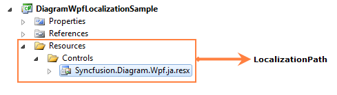

::: {style="DISPLAY: none"}
{#d2h_url_template}{#d2h_package_url style="WIDTH: 0px; DISPLAY: none; HEIGHT: 0px"}
:::

::::: {#nsbanner .d2h_main_nsbanner style="BORDER-BOTTOM: #999999 1px solid; POSITION: relative; PADDING-BOTTOM: 0px; BACKGROUND-COLOR: transparent; PADDING-LEFT: 0px; PADDING-RIGHT: 0px; DISPLAY: none; BORDER-TOP: #999999 1px solid; PADDING-TOP: 0px; LEFT: 0px"}
:::: {#TitleRow .d2h_main_titlerow style="PADDING-BOTTOM: 4px; BACKGROUND-COLOR: transparent; PADDING-LEFT: 22px; WIDTH: 100%; PADDING-RIGHT: 10px; DISPLAY: none; PADDING-TOP: 4px"}
::: {#ienav .d2h_main_ienav style="DISPLAY: none"}
{#D2HPrevious .D2HPreviousEnabled}  {#D2HNext .D2HNextEnabled}
:::
::::
:::::

::::: {#nstext .d2h_main_nstext style="PADDING-BOTTOM: 10px; BACKGROUND-COLOR: transparent; PADDING-LEFT: 22px; PADDING-RIGHT: 10px; HEIGHT: 100%; OVERFLOW: auto; PADDING-TOP: 5px" hasuserbackground="true" valign="bottom"}
::: {#d2h_breadcrumbs .d2h_breadcrumbs}
[Essential Studio User Guide Documentation](ms-xhelp:///?Id=12457748-09e3-4d74-a240-8e049cedf030){.d2h_breadcrumbsNormal}[ \> ]{.d2h_breadcrumbsLinkSeparator}[User Interface Edition](ms-xhelp:///?Id=c29296b7-531c-413b-a0ec-488ca1f7f669){.d2h_breadcrumbsNormal}[ \> ]{.d2h_breadcrumbsLinkSeparator}[Essential WPF](ms-xhelp:///?Id=7f4f82c5-151c-4262-94d0-75c4626c77bc){.d2h_breadcrumbsNormal}[ \> ]{.d2h_breadcrumbsLinkSeparator}[Essential Diagram]{.d2h_breadcrumbsContentsOnly}[ \> ]{.d2h_breadcrumbsLinkSeparator}[Concepts and Features](ms-xhelp:///?Id=8625d466-6e21-495a-b811-4ecee754da81){.d2h_breadcrumbsNormal}
:::

## Localization {#localization style="tab-stops: 0pt"}

Localization is the process of providing controls in different cultures to help users to easily set their own culture.

 

Use Case Scenarios

Localization is the process of customizing the User Interface (UI) in a language and culture specific to a particular country or region to display regional data . Localization is the key feature that provides solutions to global customers with the help of localized resource files provided by controls.

 

{border="0"}

Figure 203: Localization Sample in Japanese Language[]{style="FONT-SIZE: 11pt"}

**[]{style="FONT-FAMILY: 'Trebuchet MS','sans-serif'; COLOR: #1f497d"}** 

Localizing the Application

Adding Resource Files

 

To localize the Syncfusion Diagram WPF control, you need to create a resource file for each culture. The following steps should be performed when localizing strings for your culture:

1.   Add the resource (.resx) files in the **Resources** folder for different cultures. The **.resx** files for the different cultures or invariant cultures should be placed in the **Resources** folder of your project.

2.   Name the resource files according to the formats specified, namely **AssemblyName.CultureName.resx** and **AssemblyName.resx** for the invariant cultures. Here, AssemblyName is the Syncfusion WPF control assembly name and CultureName is the culture code of the resource file that you want to show in the UI. If your conversion is only for the invariant culture, then the **.resx** file does not require a culture suffix.

 

Examples:

Syncfusion.Diagram.Wpf.ja.resx - A Japanese resource file for the Syncfusion.Diagram.Wpf assembly.

Syncfusion.Diagram.Wpf.resx - An invariant culture resource file for the Syncfusion.Diagram.Wpf assembly.

Assigning the Current UI Culture to the Application

By default, the current culture is set to "en-US". You can check the current culture from "System.Threading.Thread.CurrentThread.CurrentUICulture". CurrentUICulture can be changed, as shown in the following code snippets.

In the following example, CurrentUICulture is set before IntializeComponent in the StartUp page (MainPage.xaml.cs).

[]{style="FONT-FAMILY: 'Trebuchet MS','sans-serif'; COLOR: #15428b; FONT-SIZE: 9pt"} 

+-------------------------------------------------------------------------------------------------------------------------------------------------------------------------------------------------------------------------------------------------------+
| **[\[C#\]]{style="FONT-FAMILY: 'Courier New'; COLOR: black"}**                                                                                                                                                                                        |
|                                                                                                                                                                                                                                                       |
| [public]{style="FONT-FAMILY: 'Courier New'; COLOR: blue"}[ MainPage()]{style="FONT-FAMILY: 'Courier New'"}                                                                                                                                            |
|                                                                                                                                                                                                                                                       |
| [{]{style="FONT-FAMILY: 'Courier New'"}                                                                                                                                                                                                               |
|                                                                                                                                                                                                                                                       |
| [    System.Threading.[Thread]{style="COLOR: #2b91af"}.CurrentThread.CurrentUICulture = [new]{style="COLOR: blue"} System.Globalization.[CultureInfo]{style="COLOR: #2b91af"}([\"ja\"]{style="COLOR: #a31515"});]{style="FONT-FAMILY: 'Courier New'"} |
|                                                                                                                                                                                                                                                       |
| [    InitializeComponent();]{style="FONT-FAMILY: 'Courier New'"}                                                                                                                                                                                      |
|                                                                                                                                                                                                                                                       |
| [}]{style="FONT-FAMILY: 'Courier New'"}[]{style="FONT-FAMILY: 'Courier New'"}                                                                                                                                                                         |
+-------------------------------------------------------------------------------------------------------------------------------------------------------------------------------------------------------------------------------------------------------+

[]{style="FONT-FAMILY: 'Courier New'; COLOR: #15428b"} 

+---------------------------------------------------------------------------------------------------------------------------------------------------------------------------------------------------------------------------------------------------------------------------+
| **[\[VB\]]{style="FONT-FAMILY: 'Courier New'; COLOR: black"}**                                                                                                                                                                                                            |
|                                                                                                                                                                                                                                                                           |
| [\'INSTANT VB WARNING: The following constructor is declared outside of its associated class:]{style="FONT-FAMILY: 'Courier New'; COLOR: green"}[]{style="FONT-FAMILY: 'Courier New'"}                                                                                    |
|                                                                                                                                                                                                                                                                           |
| [\'ORIGINAL LINE: public MainPage()]{style="FONT-FAMILY: 'Courier New'; COLOR: green"}[]{style="FONT-FAMILY: 'Courier New'"}                                                                                                                                              |
|                                                                                                                                                                                                                                                                           |
| [ [Public]{style="COLOR: blue"} [Sub]{style="COLOR: blue"} [New]{style="COLOR: blue"}()]{style="FONT-FAMILY: 'Courier New'"}                                                                                                                                              |
|                                                                                                                                                                                                                                                                           |
| [   System.Threading.[Thread]{style="COLOR: #2b91af"}.CurrentThread.CurrentUICulture = [New]{style="COLOR: blue"}                       System.Globalization.[CultureInfo]{style="COLOR: #2b91af"}([\"ja\"]{style="COLOR: #a31515"})]{style="FONT-FAMILY: 'Courier New'"} |
|                                                                                                                                                                                                                                                                           |
| [   InitializeComponent()]{style="FONT-FAMILY: 'Courier New'"}                                                                                                                                                                                                            |
|                                                                                                                                                                                                                                                                           |
| [End]{style="FONT-FAMILY: 'Courier New'; COLOR: blue"}[ [Sub]{style="COLOR: blue"}]{style="FONT-FAMILY: 'Courier New'"}[]{style="FONT-FAMILY: 'Courier New'"}                                                                                                             |
+---------------------------------------------------------------------------------------------------------------------------------------------------------------------------------------------------------------------------------------------------------------------------+

[]{style="FONT-FAMILY: 'Trebuchet MS','sans-serif'; COLOR: #15428b; FONT-SIZE: 9pt"} 

Else, CurrentUICulture is set in the Application_Startup event in the App.xaml.cs file, as shown in the following example.

 

+-------------------------------------------------------------------------------------------------------------------------------------------------------------------------------------------------------------------------------------------------------+
| **[\[C#\]]{style="FONT-FAMILY: 'Courier New'; COLOR: black"}**                                                                                                                                                                                        |
|                                                                                                                                                                                                                                                       |
| [private]{style="FONT-FAMILY: 'Courier New'; COLOR: blue"}[ [void]{style="COLOR: blue"} Application_Startup([object]{style="COLOR: blue"} sender, [StartupEventArgs]{style="COLOR: #2b91af"} e)]{style="FONT-FAMILY: 'Courier New'"}                  |
|                                                                                                                                                                                                                                                       |
| [{]{style="FONT-FAMILY: 'Courier New'"}                                                                                                                                                                                                               |
|                                                                                                                                                                                                                                                       |
| [    System.Threading.[Thread]{style="COLOR: #2b91af"}.CurrentThread.CurrentUICulture = [new]{style="COLOR: blue"} System.Globalization.[CultureInfo]{style="COLOR: #2b91af"}([\"ja\"]{style="COLOR: #a31515"});]{style="FONT-FAMILY: 'Courier New'"} |
|                                                                                                                                                                                                                                                       |
| [    [this]{style="COLOR: blue"}.RootVisual = [new]{style="COLOR: blue"} [MainPage]{style="COLOR: #2b91af"}();]{style="FONT-FAMILY: 'Courier New'"}                                                                                                   |
|                                                                                                                                                                                                                                                       |
| [}]{style="FONT-FAMILY: 'Courier New'"}[]{style="FONT-FAMILY: 'Courier New'"}                                                                                                                                                                         |
+-------------------------------------------------------------------------------------------------------------------------------------------------------------------------------------------------------------------------------------------------------+

 

+-------------------------------------------------------------------------------------------------------------------------------------------------------------------------------------------------------------------------------------------------------------------------------------------------------------------------+
| **[\[VB\]]{style="FONT-FAMILY: 'Courier New'; COLOR: black"}**                                                                                                                                                                                                                                                          |
|                                                                                                                                                                                                                                                                                                                         |
| [Private]{style="FONT-FAMILY: 'Courier New'; COLOR: blue"}[ [Sub]{style="COLOR: blue"} Application_Startup([ByVal]{style="COLOR: blue"} sender [As]{style="COLOR: blue"} [Object]{style="COLOR: blue"}, [ByVal]{style="COLOR: blue"} e [As]{style="COLOR: blue"} StartupEventArgs)]{style="FONT-FAMILY: 'Courier New'"} |
|                                                                                                                                                                                                                                                                                                                         |
| [      System.Threading.Thread.CurrentThread.CurrentUICulture = [New]{style="COLOR: blue"} System.Globalization.CultureInfo(\"ja\")]{style="FONT-FAMILY: 'Courier New'"}                                                                                                                                                |
|                                                                                                                                                                                                                                                                                                                         |
| [      [Me]{style="COLOR: blue"}.RootVisual = [New]{style="COLOR: blue"} MainPage()]{style="FONT-FAMILY: 'Courier New'"}                                                                                                                                                                                                |
|                                                                                                                                                                                                                                                                                                                         |
| [End]{style="FONT-FAMILY: 'Courier New'; COLOR: blue"}[ [Sub]{style="COLOR: blue"}]{style="FONT-FAMILY: 'Courier New'"}[]{style="FONT-FAMILY: 'Courier New'"}                                                                                                                                                           |
+-------------------------------------------------------------------------------------------------------------------------------------------------------------------------------------------------------------------------------------------------------------------------------------------------------------------------+

 

{border="0"}

Figure 204: Localization Sample in Japanese Language

[]{style="FONT-FAMILY: 'Trebuchet MS','sans-serif'; COLOR: #1f497d"} 

Specifying the Directory Location of the Resource File

By default, the resource file for a specific culture is obtained from the Resources directory. However, the location of the resource file can be changed by using DiagramControl's LocalizationPath property, as shown in the following code snippet.

 

+--------------------------------------------------------------------------------------------------------------------------------------------------------------------------------------------+
| **[\[C#\]]{style="FONT-FAMILY: 'Courier New'; COLOR: black"}**                                                                                                                             |
|                                                                                                                                                                                            |
| [// The location of the localized resource file is stored in the \\Resources\\Controls directory.]{style="FONT-FAMILY: 'Courier New'; COLOR: green"}[]{style="FONT-FAMILY: 'Courier New'"} |
|                                                                                                                                                                                            |
| [diagramControl.LocalizationPath = [\"Resources.Controls\"]{style="COLOR: #a31515"};]{style="FONT-FAMILY: 'Courier New'"}[]{style="FONT-FAMILY: 'Courier New'"}                            |
+--------------------------------------------------------------------------------------------------------------------------------------------------------------------------------------------+

 

+-------------------------------------------------------------------------------------------------------------------------------------------------------------------------------------------+
| **[\[VB\]]{style="FONT-FAMILY: 'Courier New'; COLOR: black"}**                                                                                                                            |
|                                                                                                                                                                                           |
| [\'The location of the localized resource file is stored in the \\Resources\\Controls directory.]{style="FONT-FAMILY: 'Courier New'; COLOR: green"}[]{style="FONT-FAMILY: 'Courier New'"} |
|                                                                                                                                                                                           |
| [diagramControl.LocalizationPath = \"Resources.Controls\"]{style="FONT-FAMILY: 'Courier New'"}                                                                                            |
|                                                                                                                                                                                           |
| []{style="FONT-FAMILY: 'Courier New'"}                                                                                                                                                    |
+-------------------------------------------------------------------------------------------------------------------------------------------------------------------------------------------+

 

{border="0"}

Figure 205: [Customized LocalizationPath]{style="FONT-FAMILY: 'Trebuchet MS','sans-serif'; COLOR: #1f497d"}

Example:

 

+-------------------------------------------------------------------------------------------------------------------------------------------------------------------------------------------+
| **[\[C#\]]{style="FONT-FAMILY: 'Courier New'; COLOR: black"}**                                                                                                                            |
|                                                                                                                                                                                           |
| [// The location of the localized resource file is stored in the \\Resources\\X\\Y\\Z directory.]{style="FONT-FAMILY: 'Courier New'; COLOR: green"}[]{style="FONT-FAMILY: 'Courier New'"} |
|                                                                                                                                                                                           |
| [diagramControl.LocalizationPath = [\"Resources.X.Y.Z\"]{style="COLOR: #a31515"};]{style="FONT-FAMILY: 'Courier New'"}[]{style="FONT-FAMILY: 'Courier New'"}                              |
+-------------------------------------------------------------------------------------------------------------------------------------------------------------------------------------------+

 

+------------------------------------------------------------------------------------------------------------------------------------------------------------------------------------------+
| **[\[VB\]]{style="FONT-FAMILY: 'Courier New'; COLOR: black"}**                                                                                                                           |
|                                                                                                                                                                                          |
| [\'The location of the localized resource file is stored in the \\Resources\\X\\Y\\Z directory.]{style="FONT-FAMILY: 'Courier New'; COLOR: green"}[]{style="FONT-FAMILY: 'Courier New'"} |
|                                                                                                                                                                                          |
| [diagramControl.LocalizationPath = \"Resources.X.Y.Z\"]{style="FONT-FAMILY: 'Courier New'"}[]{style="FONT-FAMILY: 'Courier New'"}                                                        |
+------------------------------------------------------------------------------------------------------------------------------------------------------------------------------------------+

{border="0"}

Figure 206: Customized LocalizationPath

::: {style="BORDER-BOTTOM: windowtext 1pt solid; BORDER-LEFT: medium none; PADDING-BOTTOM: 1pt; MARGIN-TOP: 9pt; PADDING-LEFT: 0pt; PADDING-RIGHT: 0pt; MARGIN-BOTTOM: 9pt; BORDER-TOP: windowtext 1pt solid; BORDER-RIGHT: medium none; PADDING-TOP: 1pt"}
Note: LocalizationPath for the resource file should be specified before DiagramControl's Template is applied.
:::

**[]{style="FONT-FAMILY: 'Trebuchet MS','sans-serif'; COLOR: #1f497d"}** 

Properties

The property of the Localization feature is described in the following tabulation:

 

Table 85: Property Table

  ------------------ ------------------------------------------------------------------ ------ ----------- -----------------
  Property           Description                                                        Type   Data Type   Reference links
  LocalizationPath   Indicates the directory in which the resource files are located.   CLR    string      Not applicable
  ------------------ ------------------------------------------------------------------ ------ ----------- -----------------

[]{style="FONT-FAMILY: 'Calibri','sans-serif'; COLOR: black"} 

Sample Link

To view a sample:

1.   Open the Diagram Sample Browser from the dashboard. (Refer to the [[Samples and Location]{style="COLOR: windowtext"}](ms-xhelp:///?Id=183308e3-3ad9-4f87-a85e-1cd921e7e1b1) chapter.)

2.   Navigate to **Editable Diagram** -\> **Localization Demo**.

[                ]{style="FONT-FAMILY: 'Calibri','sans-serif'; COLOR: black"}

[]{#related-topics}
:::::
