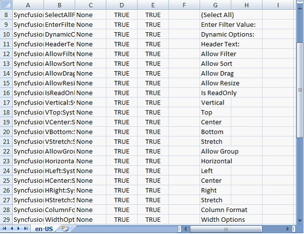
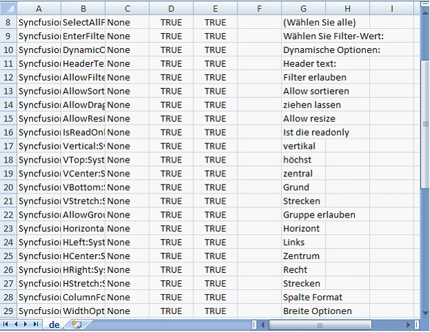
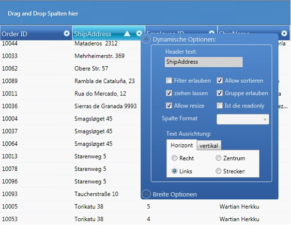

::: {style="DISPLAY: none"}
{#d2h_url_template}{#d2h_package_url style="WIDTH: 0px; DISPLAY: none; HEIGHT: 0px"}
:::

::::::::: {.d2h_secondary_topic style="PADDING-BOTTOM: 10pt; MARGIN: 0pt; PADDING-LEFT: 0pt; PADDING-RIGHT: 0pt; PADDING-TOP: 0pt"}
#### Localization {#localization style="tab-stops: 0pt"}

Localization is the process of customizing the user interface as locale-specific in order to display regional data i.e. in a language and culture specific to a particular country or region. Localization is the key feature for providing solutions to global customers. This is done with the help of localized resources served by the control. GridDataControl provides an inherent XAML based support to localize its user interface.

**[]{style="FONT-FAMILY: 'Calibri','sans-serif'; FONT-SIZE: 12pt"}** 

How to Localize a Grid

The default \"en-US\" culture satellite assembly named as Syncfusion.Grid.Wpf.Resources.dll can be used to utilize the localization support for any culture. Any pre-built text such as Group drop area text, prompt strings, message strings, Column Options UI text and Filter dialog text can be localized.

 

Following are the steps to localize the grid:

 

Extracting the Resource Strings to a .csv File Using the LocBaml.exe File

The following steps will help you to extract the resource strings to a .csv file using the LocBaml.exe file:

**[]{style="COLOR: #15428b"}** 

1.   Download the LocBaml.exe file from the following location if you don\'t have it already.

[]{style="COLOR: black"} 

[[http://files.syncfusion.com/support/Tools.WPF/UG/LocBaml.zip]{.UGHyperlink}](http://files.syncfusion.com/support/Tools.WPF/UG/LocBaml.zip)[]{.UGHyperlink}

[]{style="FONT-FAMILY: 'Calibri','sans-serif'"} 

2.   Copy the LocBaml.exe file and Syncfusion.Grid.Wpf.Resources.dll to the following location.

[]{style="COLOR: #15428b"} 

\<Your Application path\>\\bin\\Debug\\en-US

[]{style="COLOR: #15428b"} 

::: {style="BORDER-BOTTOM: windowtext 1pt solid; BORDER-LEFT: medium none; PADDING-BOTTOM: 1pt; MARGIN-TOP: 9pt; PADDING-LEFT: 0pt; PADDING-RIGHT: 0pt; MARGIN-BOTTOM: 9pt; BORDER-TOP: windowtext 1pt solid; BORDER-RIGHT: medium none; PADDING-TOP: 1pt"}
{border="0"}Note: This Syncfusion.Grid.Wpf.Resources.dll will be available in the following installation location.
:::

[]{style="COLOR: #15428b"} 

\<Installed location\>\\Syncfusion\\Essential Studio\\\<Version Number\>\\Assemblies\\3.5

[]{style="COLOR: #15428b"} 

3.   Open the command prompt and navigate to the same directory.

**[]{style="COLOR: #15428b"}** 

4.   Use the following command to generate the .csv file from the existing Syncfusion.Grid.Wpf.Resources.dll.

[]{style="FONT-FAMILY: 'Calibri','sans-serif'"} 

\<Your Application path\>\\bin\\Debug\\en-US \\LocBaml /parse Syncfusion.Grid.Wpf.Resources.dll /out:resourceStrings.csv

[]{style="FONT-FAMILY: 'Calibri','sans-serif'"} 

::: {style="BORDER-BOTTOM: windowtext 1pt solid; BORDER-LEFT: medium none; PADDING-BOTTOM: 1pt; MARGIN-TOP: 9pt; PADDING-LEFT: 0pt; PADDING-RIGHT: 0pt; MARGIN-BOTTOM: 9pt; BORDER-TOP: windowtext 1pt solid; BORDER-RIGHT: medium none; PADDING-TOP: 1pt"}
[{border="0"}]{style="FONT-FAMILY: 'Calibri','sans-serif'"}Note: The .csv files can be edited in MS Excel (or) Notepad. This file contains our string resources with the default text in English language.
:::

**[]{style="FONT-FAMILY: 'Calibri','sans-serif'"}** 

Creating Localized GridData control

[]{style="FONT-FAMILY: 'Calibri','sans-serif'"} 

1.   Open the .csv file using MS Excel or Notepad, and change the text based on your culture.

**[]{style="COLOR: #15428b"}** 

The following screen shots show change of text from English to German.

[]{style="FONT-FAMILY: 'Times New Roman','serif'; FONT-SIZE: 12pt"} 

{border="0"}

Figure 233: CSV file for US culture- English

[]{style="FONT-FAMILY: 'Cambria','serif'; FONT-SIZE: 12pt"} 

Below is the screen shot of the CSV file for German Culture (de).

[]{style="COLOR: #15428b"} 

{border="0"}

Figure 234: CSV file for German Culture

**[]{style="FONT-FAMILY: 'Cambria','serif'; FONT-SIZE: 12pt"}** 

The next step is to generate localized satellite dll using the modified .csv file and install it in the application.

1.   Open command prompt, and navigate to the en-US directory.

2.   Create another directory[ ]{style="FONT-FAMILY: 'Calibri','sans-serif'"}de[ ]{style="FONT-FAMILY: 'Calibri','sans-serif'"}under Bin\\Debug folder using the[ ]{style="FONT-FAMILY: 'Calibri','sans-serif'"}md de command[.]{style="FONT-FAMILY: 'Calibri','sans-serif'"}

**[]{style="FONT-FAMILY: 'Calibri','sans-serif'"}** 

::: {style="BORDER-BOTTOM: windowtext 1pt solid; BORDER-LEFT: medium none; PADDING-BOTTOM: 1pt; MARGIN-TOP: 9pt; PADDING-LEFT: 0pt; PADDING-RIGHT: 0pt; MARGIN-BOTTOM: 9pt; BORDER-TOP: windowtext 1pt solid; BORDER-RIGHT: medium none; PADDING-TOP: 1pt"}
[{border="0"}]{style="FONT-FAMILY: 'Calibri','sans-serif'"}Note:[ ]{style="FONT-FAMILY: 'Calibri','sans-serif'"}Directory name should follow proper culture name.
:::

**[]{style="FONT-FAMILY: 'Calibri','sans-serif'"}** 

3.   Generate your own culture-specified assembly using the following command from en-US folder.

**[]{style="COLOR: #15428b"}** 

LocBaml/generate/tran: resourceStrings.csv/out:../de/cul:de Syncfusion.Grid.Wpf.Resources.dll

**[]{style="FONT-FAMILY: 'Calibri','sans-serif'"}** 

::: {style="BORDER-BOTTOM: windowtext 1pt solid; BORDER-LEFT: medium none; PADDING-BOTTOM: 1pt; MARGIN-TOP: 9pt; PADDING-LEFT: 0pt; PADDING-RIGHT: 0pt; MARGIN-BOTTOM: 9pt; BORDER-TOP: windowtext 1pt solid; BORDER-RIGHT: medium none; PADDING-TOP: 1pt"}
[{border="0"}]{style="FONT-FAMILY: 'Calibri','sans-serif'"}Note:[ ]{style="FONT-FAMILY: 'Calibri','sans-serif'"}You will be able to view the generated satellite assembly under de folder.
:::

**[]{style="COLOR: #15428b"}** 

4.   Run your application with the CurrentUICulture as \'de\' in App.xaml file as follows.

**[]{style="FONT-FAMILY: 'Calibri','sans-serif'"}** 

+----------------------------------------------------------------------------------------------------------------------------------------------------------------------------------------------------------------------+
| [\[C#\]]{style="FONT-FAMILY: 'Courier New'; COLOR: black"}                                                                                                                                                           |
|                                                                                                                                                                                                                      |
| []{style="FONT-FAMILY: 'Courier New'; COLOR: blue"}                                                                                                                                                                  |
|                                                                                                                                                                                                                      |
| [public]{style="FONT-FAMILY: 'Courier New'; COLOR: blue"}[ App()]{style="FONT-FAMILY: 'Courier New'"}                                                                                                                |
|                                                                                                                                                                                                                      |
| [{]{style="FONT-FAMILY: 'Courier New'"}                                                                                                                                                                              |
|                                                                                                                                                                                                                      |
| [    CultureInfo]{style="FONT-FAMILY: 'Courier New'; COLOR: #2b91af"}[ ci = [new]{style="COLOR: blue"} [CultureInfo]{style="COLOR: #2b91af"}([\"de\"]{style="COLOR: #a31515"});]{style="FONT-FAMILY: 'Courier New'"} |
|                                                                                                                                                                                                                      |
| [    Thread]{style="FONT-FAMILY: 'Courier New'; COLOR: #2b91af"}[.CurrentThread.CurrentUICulture = ci;      ]{style="FONT-FAMILY: 'Courier New'"}                                                                    |
|                                                                                                                                                                                                                      |
| [}]{style="FONT-FAMILY: 'Courier New'"}                                                                                                                                                                              |
+----------------------------------------------------------------------------------------------------------------------------------------------------------------------------------------------------------------------+

::: {style="BORDER-BOTTOM: windowtext 1pt solid; BORDER-LEFT: medium none; PADDING-BOTTOM: 1pt; MARGIN-TOP: 9pt; PADDING-LEFT: 0pt; PADDING-RIGHT: 0pt; MARGIN-BOTTOM: 9pt; BORDER-TOP: windowtext 1pt solid; BORDER-RIGHT: medium none; PADDING-TOP: 1pt"}
 

[{border="0"}]{style="FONT-FAMILY: 'Courier New'"}Note:[ ]{style="FONT-FAMILY: 'Calibri','sans-serif'"}At the end of this process, the application should have the following criteria to achieve localization.
:::

[·      ]{style="FONT-FAMILY: Symbol"}Your Application.exe file.

[·      ]{style="FONT-FAMILY: Symbol"}The en-US directory with Resources.dll.

[·      ]{style="FONT-FAMILY: Symbol"}The de directory with corresponding Resources.dll and Syncfusion Assemblies (if you had set Copy Local=True).

**[]{style="COLOR: #15428b"}** 

The output shows the GridData control in German Culture.

**[]{style="FONT-FAMILY: 'Calibri','sans-serif'"}** 

{border="0"}

Figure 235: Localized GridDataControl

::: {style="BORDER-BOTTOM: windowtext 1pt solid; BORDER-LEFT: medium none; PADDING-BOTTOM: 1pt; MARGIN-TOP: 9pt; PADDING-LEFT: 0pt; PADDING-RIGHT: 0pt; MARGIN-BOTTOM: 9pt; BORDER-TOP: windowtext 1pt solid; BORDER-RIGHT: medium none; PADDING-TOP: 1pt"}
 

[{border="0"}]{style="FONT-FAMILY: 'Cambria','serif'; FONT-SIZE: 12pt"}Note:

1\. Localized strings are not displayed in your application until the created satellite assembly is signed. Send your newly created assemblies to Syncfusion for signing. Your assemblies will be signed and sent immediately.

2\. The satellite assemblies need not be installed in GAC or Assemblies folder.

3\. Ensure your en-US directory contains the default satellite assembly, which is available in the Precompiled Assemblies (or) Assemblies folder.

4\. Application culture change should be included before the InitializeComponent() method calls in the application. It is suggested to include culture change in the App.xaml file.
:::

[]{#related-topics}
:::::::::
