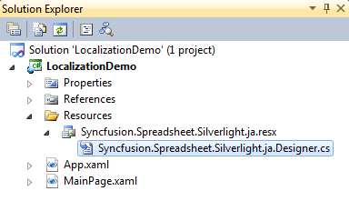
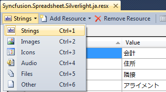
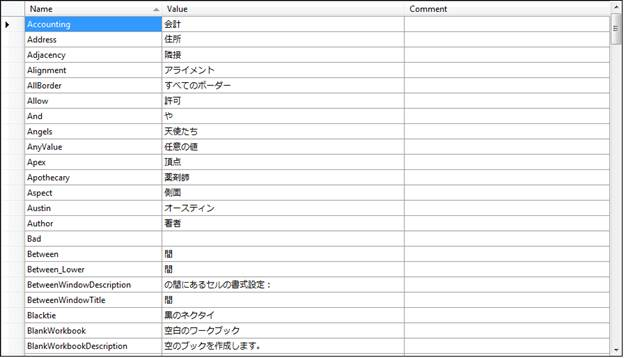
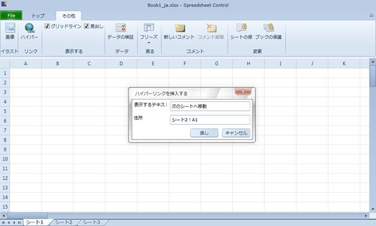

::: {style="DISPLAY: none"}
{#d2h_url_template}{#d2h_package_url style="WIDTH: 0px; DISPLAY: none; HEIGHT: 0px"}
:::

::::: {#nsbanner .d2h_main_nsbanner style="BORDER-BOTTOM: #999999 1px solid; POSITION: relative; PADDING-BOTTOM: 0px; BACKGROUND-COLOR: transparent; PADDING-LEFT: 0px; PADDING-RIGHT: 0px; DISPLAY: none; BORDER-TOP: #999999 1px solid; PADDING-TOP: 0px; LEFT: 0px"}
:::: {#TitleRow .d2h_main_titlerow style="PADDING-BOTTOM: 4px; BACKGROUND-COLOR: transparent; PADDING-LEFT: 22px; WIDTH: 100%; PADDING-RIGHT: 10px; DISPLAY: none; PADDING-TOP: 4px"}
::: {#ienav .d2h_main_ienav style="DISPLAY: none"}
{#D2HPrevious .D2HPreviousEnabled}  {#D2HNext .D2HNextEnabled}
:::
::::
:::::

::::: {#nstext .d2h_main_nstext style="PADDING-BOTTOM: 10px; BACKGROUND-COLOR: transparent; PADDING-LEFT: 22px; PADDING-RIGHT: 10px; HEIGHT: 100%; OVERFLOW: auto; PADDING-TOP: 5px" hasuserbackground="true" valign="bottom"}
::: {#d2h_breadcrumbs .d2h_breadcrumbs}
[Essential Studio User Guide Documentation](ms-xhelp:///?Id=12457748-09e3-4d74-a240-8e049cedf030){.d2h_breadcrumbsNormal}[ \> ]{.d2h_breadcrumbsLinkSeparator}[Reporting Edition](ms-xhelp:///?Id=027aa5b6-6676-4f93-ad23-c20e8c45792e){.d2h_breadcrumbsNormal}[ \> ]{.d2h_breadcrumbsLinkSeparator}[Essential Spreadsheet](ms-xhelp:///?Id=25812fa4-b4ea-4485-bbfb-30849a783142){.d2h_breadcrumbsNormal}[ \> ]{.d2h_breadcrumbsLinkSeparator}[Spreadsheet Silverlight]{.d2h_breadcrumbsContentsOnly}[ \> ]{.d2h_breadcrumbsLinkSeparator}[Concepts and Features](ms-xhelp:///?Id=7bfcfdc3-3540-43e3-b029-ceaea5fe92f5){.d2h_breadcrumbsNormal}
:::

## Localization {#localization style="tab-stops: 0pt"}

Localization is the process of customizing the application to culture-specific. This involves configuring the application for the specific languages. Culture is the combination of Language and the Location (e.g. En-US is the Culture for English spoken at United States; En-GB is the Culture for English spoken at Great Britain).

Syncfusion Spreadsheet allows you to set custom resource through **Resx** file. You can give the string values in resource file for a specific Culture and set the Culture in the application. The given string values will be set to the Grid which does not affect the Code Block of the Grid.

[]{#_Use_Case_Scenarios}[]{#_Adding_<FEATURE_NAME>} 

Adding Localization to an Application

The following are steps to implementation Localization support to an application.

1.   Create a Silverlight application and add spreadsheet control to it.

2.   Create a folder named Resources in the application.

3.   Create a resource file (Resx file) and name it as Syncfusion.Spreadsheet.Silverlight. \<your culture info name\>.resx

Example: Syncfusion.Spreadsheet.Silverlight.ja.resx.

::: {style="BORDER-BOTTOM: windowtext 1pt solid; BORDER-LEFT: medium none; PADDING-BOTTOM: 1pt; MARGIN-TOP: 9pt; PADDING-LEFT: 0pt; PADDING-RIGHT: 0pt; MARGIN-BOTTOM: 9pt; BORDER-TOP: windowtext 1pt solid; BORDER-RIGHT: medium none; PADDING-TOP: 1pt"}
Note: It is mandatory to use this naming convention.
:::

 

{border="0"}

Figure 45: Adding Resource file to the Application

 

4.   Select the String option in the Resource file.

 

{border="0"}

Figure 46: Selecting and adding String Resources to the Resource file of the Application

 

5.   Resource table will open.

6.   Enter the UI name in the Name column and the equivalent term you want in the Value column.

                                                             

{border="0"}

Figure 47: localizing the application to the Japanese Culture

 

7.   Assign the CultureInfo to the application before the **InitializeComponent()** method is being called.

 

The following code illustrates localizing the application to the Japanese CultureInfo.

 

+-------------------------------------------------------------------------------------------------------------------------------------------------------------------------------------------------------------------------------------------------------------------+
| **[\[C#\]]{style="FONT-FAMILY: 'Courier New'"}**                                                                                                                                                                                                                  |
|                                                                                                                                                                                                                                                                   |
| [public]{style="FONT-FAMILY: Consolas; COLOR: blue; FONT-SIZE: 9.5pt"}[ MainPage()]{style="FONT-FAMILY: Consolas; FONT-SIZE: 9.5pt"}                                                                                                                              |
|                                                                                                                                                                                                                                                                   |
| [{]{style="FONT-FAMILY: Consolas; FONT-SIZE: 9.5pt"}                                                                                                                                                                                                              |
|                                                                                                                                                                                                                                                                   |
| [System.Threading.[Thread]{style="COLOR: #2b91af"}.CurrentThread.CurrentUICulture = [new]{style="COLOR: blue"} System.Globalization.[CultureInfo]{style="COLOR: #2b91af"}([\"ja-JP\"]{style="COLOR: #a31515"});]{style="FONT-FAMILY: Consolas; FONT-SIZE: 9.5pt"} |
|                                                                                                                                                                                                                                                                   |
| [InitializeComponent();]{style="FONT-FAMILY: Consolas; FONT-SIZE: 9.5pt"}                                                                                                                                                                                         |
|                                                                                                                                                                                                                                                                   |
| [}]{style="FONT-FAMILY: Consolas; FONT-SIZE: 9.5pt"}                                                                                                                                                                                                              |
+-------------------------------------------------------------------------------------------------------------------------------------------------------------------------------------------------------------------------------------------------------------------+

 

+----------------------------------------------------------------------------------------------------------------------------------------------------------------------------+
| []{style="FONT-FAMILY: Consolas; FONT-SIZE: 9.5pt"}                                                                                                                        |
|                                                                                                                                                                            |
| [\[VB\]]{style="FONT-FAMILY: Consolas; FONT-SIZE: 9.5pt"}                                                                                                                  |
|                                                                                                                                                                            |
| []{style="FONT-FAMILY: Consolas; FONT-SIZE: 9.5pt"}                                                                                                                        |
|                                                                                                                                                                            |
| [Public]{style="FONT-FAMILY: 'Courier New'; COLOR: blue"}[ [Sub]{style="COLOR: blue"} [New]{style="COLOR: blue"}()]{style="FONT-FAMILY: 'Courier New'"}                    |
|                                                                                                                                                                            |
| [System.Threading.Thread.CurrentThread.CurrentUICulture = [New]{style="COLOR: blue"} System.Globalization.CultureInfo(\"ja-JP\")]{style="FONT-FAMILY: 'Courier New'"}      |
|                                                                                                                                                                            |
| [InitializeComponent()]{style="FONT-FAMILY: 'Courier New'"}                                                                                                                |
|                                                                                                                                                                            |
| [End]{style="FONT-FAMILY: 'Courier New'; COLOR: blue"}[ [Sub]{style="COLOR: blue"}]{style="FONT-FAMILY: 'Courier New'"}[]{style="FONT-FAMILY: Consolas; FONT-SIZE: 9.5pt"} |
+----------------------------------------------------------------------------------------------------------------------------------------------------------------------------+

 

8.   Add Supported Cultures to the Application

 

The following are the steps to add Supported Cultures:

1.   In the Solution Explorer, right-click application project and choose **Unload Project** from the Context Menu. The project will be unloaded.

2.   Right click the project again, and select the Edit \<ProjectName\>.csproj option.

**Example:** LocalizationSampleSilverlight.csproj

3.   In the .csproj file, find the \<SupportedCultures\>\</SupportedCultures\> tags. Default the tags will be empty. So, add the required cultures. Use semicolon to separate if you want to add multiple culture.

            **Example:** \<SupportedCultures\>en-GB;de;hi;es;it;Ja\</SupportedCultures\>

4.   Save the project.

5.   Right click the \<ProjectName\>.csproj and choose Reload \<ProjectName\>.csproj.[]{#_Properties} Project will be added with specific culture.

 

{border="0"}

Figure 48: Localized Application

 

Sample Link

A demo of localization is available at the following location: 

Essential Studio Silverlight Sample Browser [à]{style="FONT-FAMILY: Wingdings"} Spreadsheet [à]{style="FONT-FAMILY: Wingdings"} Localization [à]{style="FONT-FAMILY: Wingdings"}Localization Demo[.]{style="COLOR: #0070c0"}

 

[]{#related-topics}
:::::
